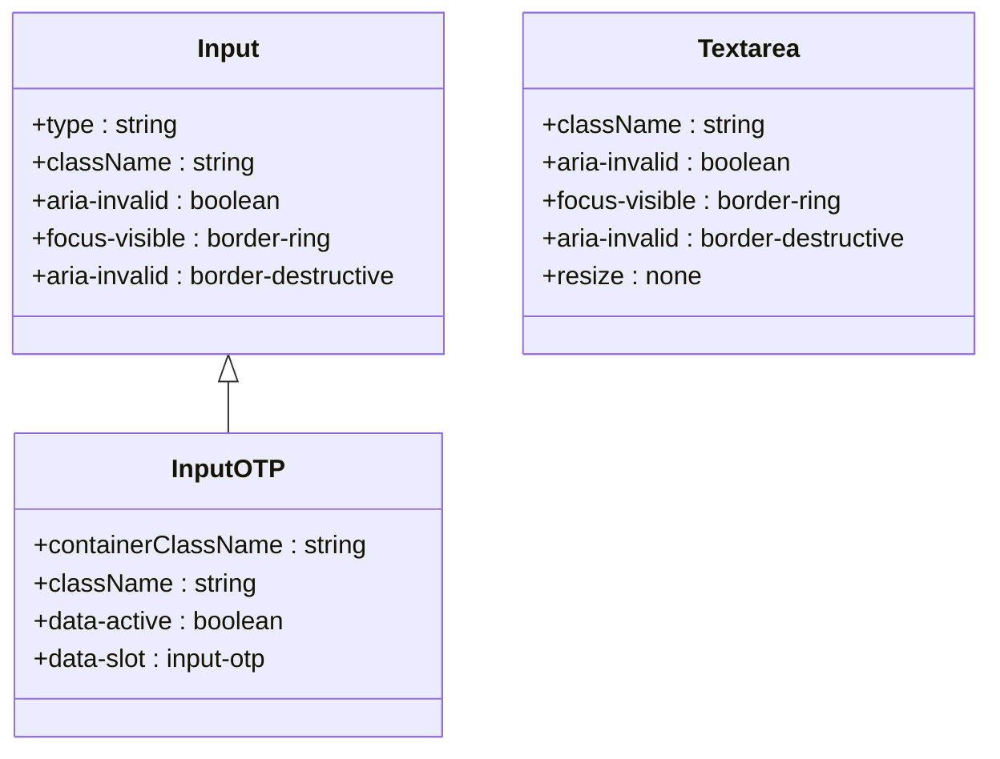
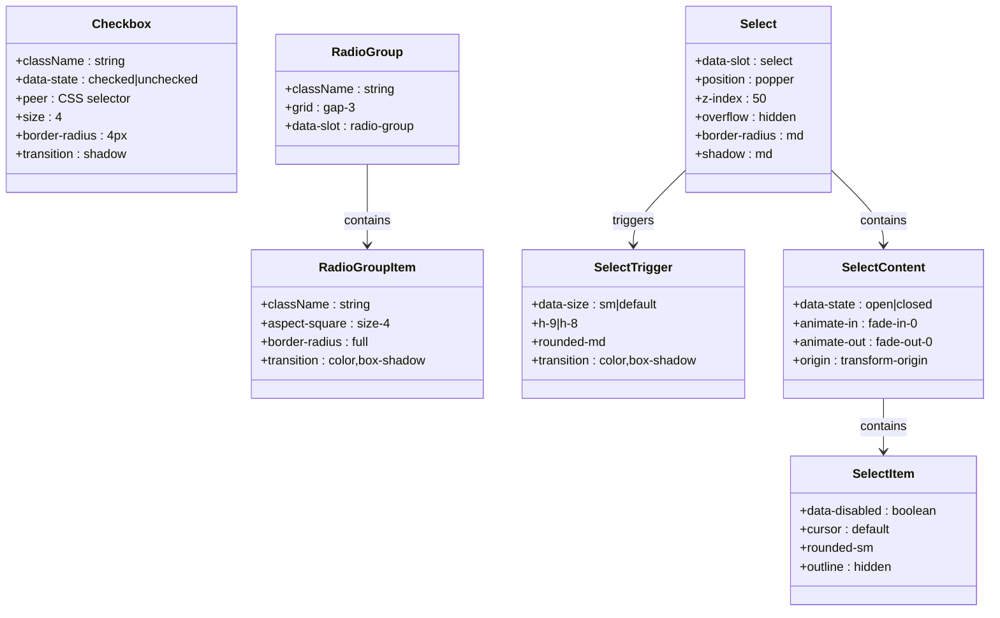
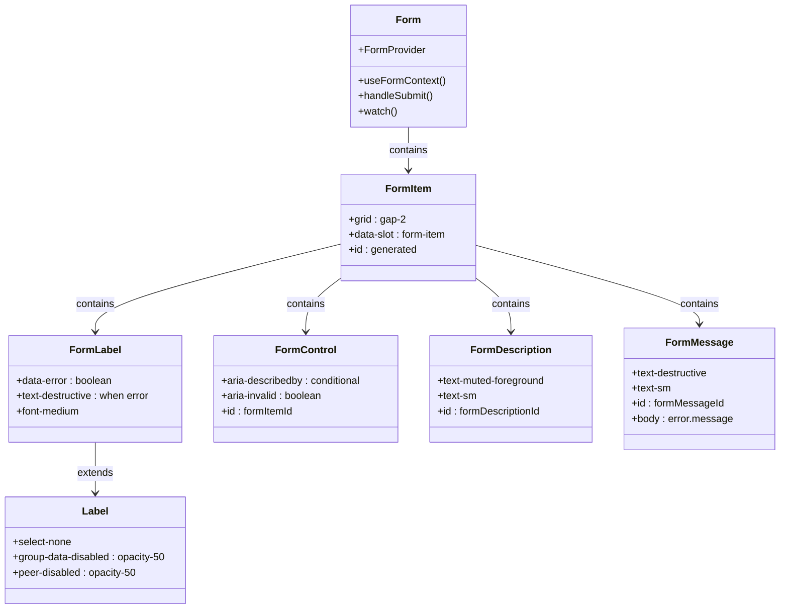
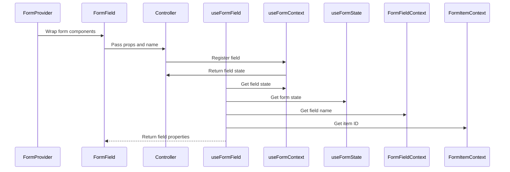
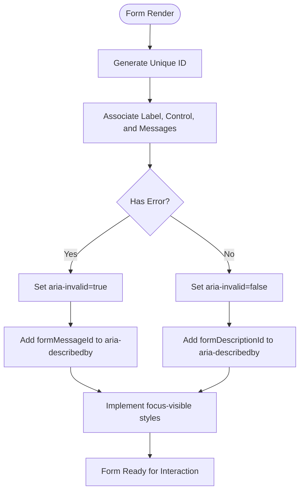
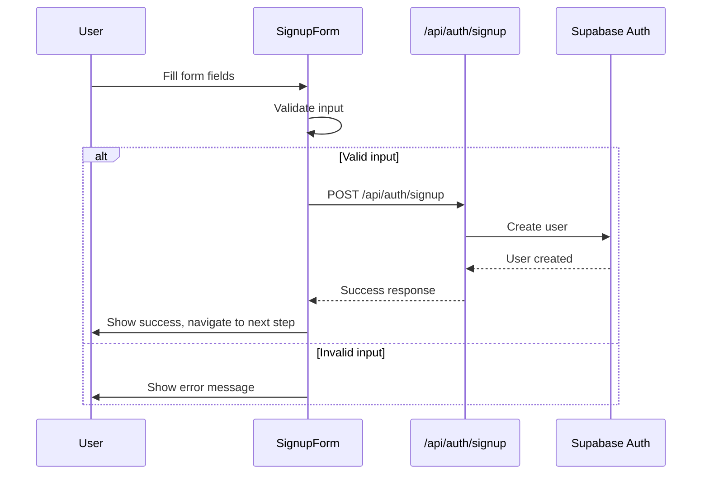
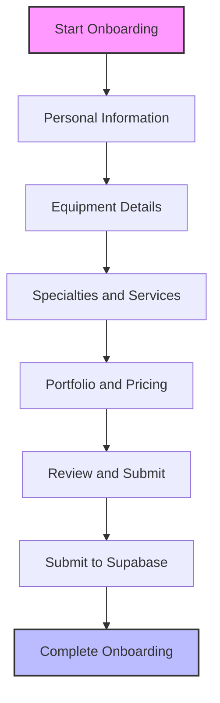
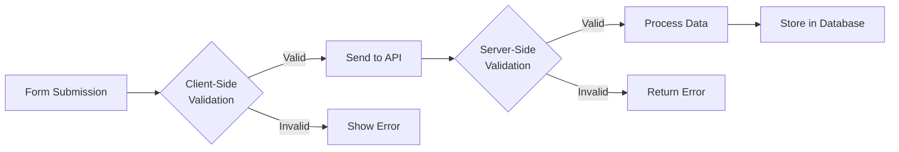
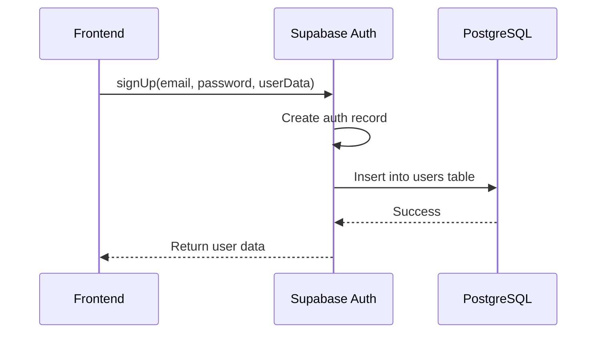

# Form Components

<cite>
**Referenced Files in This Document**   
- [form.tsx](file://src/components/ui/form.tsx)
- [input.tsx](file://src/components/ui/input.tsx)
- [textarea.tsx](file://src/components/ui/textarea.tsx)
- [label.tsx](file://src/components/ui/label.tsx)
- [checkbox.tsx](file://src/components/ui/checkbox.tsx)
- [radio-group.tsx](file://src/components/ui/radio-group.tsx)
- [select.tsx](file://src/components/ui/select.tsx)
- [input-otp.tsx](file://src/components/ui/input-otp.tsx)
- [SignupForm.tsx](file://src/components/SignupForm.tsx)
- [OnboardingForm.tsx](file://src/components/OnboardingForm.tsx)
- [supabase.ts](file://src/lib/supabase.ts)
- [validation.ts](file://src/middleware/validation.ts)
</cite>

## Table of Contents
1. [Introduction](#introduction)
2. [Core Form Components](#core-form-components)
3. [Form State Management with react-hook-form](#form-state-management-with-react-hook-form)
4. [Accessibility Implementation](#accessibility-implementation)
5. [Usage Patterns in SignupForm and OnboardingForm](#usage-patterns-in-signupform-and-onboardingform)
6. [Validation Strategies](#validation-strategies)
7. [Supabase Integration](#supabase-integration)
8. [Extending Form Components](#extending-form-components)
9. [Conclusion](#conclusion)

## Introduction
The form component suite in the SnapEvent application provides a comprehensive set of accessible, reusable form elements that integrate with react-hook-form for state management and validation. These components are designed to create consistent user experiences across the application while maintaining high accessibility standards. The suite includes basic input elements, complex form controls, and specialized components for multi-step user flows such as registration and onboarding.

**Section sources**
- [form.tsx](file://src/components/ui/form.tsx#L1-L168)
- [input.tsx](file://src/components/ui/input.tsx#L1-L21)

## Core Form Components

The form component suite consists of several atomic components that work together to create accessible and validated forms. Each component is designed with accessibility in mind, providing proper labeling, error messaging, and focus management.

### Input Components
The basic input components include `Input`, `Textarea`, and `InputOTP` for different types of text input. These components provide consistent styling and accessibility attributes across the application.

**Diagram sources**
- [input.tsx](file://src/components/ui/input.tsx#L1-L21)
- [input-otp.tsx](file://src/components/ui/input-otp.tsx#L1-L77)

**Section sources**
- [input.tsx](file://src/components/ui/input.tsx#L1-L21)
- [textarea.tsx](file://src/components/ui/textarea.tsx#L1-L18)
- [input-otp.tsx](file://src/components/ui/input-otp.tsx#L1-L77)

### Selection Components
The selection components include `Checkbox`, `RadioGroup`, and `Select` for different types of selection inputs. These components use Radix UI primitives to ensure accessibility and provide consistent visual feedback.

**Diagram sources**
- [checkbox.tsx](file://src/components/ui/checkbox.tsx#L1-L32)
- [radio-group.tsx](file://src/components/ui/radio-group.tsx#L1-L45)
- [select.tsx](file://src/components/ui/select.tsx#L1-L189)

**Section sources**
- [checkbox.tsx](file://src/components/ui/checkbox.tsx#L1-L32)
- [radio-group.tsx](file://src/components/ui/radio-group.tsx#L1-L45)
- [select.tsx](file://src/components/ui/select.tsx#L1-L189)

### Label and Form Structure Components
The `Label` and form structure components provide the foundation for accessible form layouts. The `Form`, `FormItem`, `FormLabel`, `FormControl`, `FormDescription`, and `FormMessage` components work together to create properly structured forms with accessible labels and error messaging.

**Diagram sources**
- [form.tsx](file://src/components/ui/form.tsx#L1-L168)
- [label.tsx](file://src/components/ui/label.tsx#L1-L24)

**Section sources**
- [form.tsx](file://src/components/ui/form.tsx#L1-L168)
- [label.tsx](file://src/components/ui/label.tsx#L1-L24)

## Form State Management with react-hook-form

The form components are designed to work seamlessly with react-hook-form for state management. The `Form`, `FormField`, and `useFormField` components provide the integration layer between the UI components and react-hook-form's state management system.

The `FormField` component acts as a bridge between react-hook-form's `Controller` and the UI components, automatically handling registration, validation, and state management. The `useFormField` hook provides access to the field's state, including error status, touched status, and validation messages.

**Section sources**
- [form.tsx](file://src/components/ui/form.tsx#L1-L168)

## Accessibility Implementation

The form components implement comprehensive accessibility features to ensure they are usable by all users, including those using assistive technologies.

### Labeling and Association
All form controls are properly labeled and associated with their labels using the `htmlFor` attribute. The `FormItem` context provides unique IDs that are used to associate labels, controls, and messages.

### Error Messaging
Error messages are announced by screen readers through the `aria-describedby` attribute, which references the error message element. The `FormMessage` component only renders when there is an error, and the `aria-invalid` attribute is set on the control.

### Focus Management
The components implement proper focus management with visible focus indicators. The `focus-visible` class provides a ring effect that is only visible when navigating with a keyboard.

### Semantic Structure
The components use semantic HTML elements and ARIA attributes to provide proper structure and meaning to assistive technologies. The `data-slot` attributes provide additional context for styling and testing.

**Diagram sources**
- [form.tsx](file://src/components/ui/form.tsx#L1-L168)

**Section sources**
- [form.tsx](file://src/components/ui/form.tsx#L1-L168)

## Usage Patterns in SignupForm and OnboardingForm

The form components are used in two primary user flows: the `SignupForm` for new user registration and the `OnboardingForm` for photographer profile setup.

### SignupForm Implementation
The `SignupForm` component uses the basic form components to collect user information during registration. It implements client-side validation for required fields, email format, phone number format, and password requirements.

**Diagram sources**
- [SignupForm.tsx](file://src/components/SignupForm.tsx#L1-L294)

**Section sources**
- [SignupForm.tsx](file://src/components/SignupForm.tsx#L1-L294)

### OnboardingForm Implementation
The `OnboardingForm` component uses a multi-step approach to collect detailed information from photographers. It includes specialized fields for camera equipment, specialties, services, and pricing information.

**Diagram sources**
- [OnboardingForm.tsx](file://src/components/OnboardingForm.tsx#L1-L933)

**Section sources**
- [OnboardingForm.tsx](file://src/components/OnboardingForm.tsx#L1-L933)

## Validation Strategies

The application implements multiple layers of validation to ensure data quality and security.

### Client-Side Validation
Client-side validation is implemented directly in the form components using regular expressions and length checks. The `SignupForm` validates:
- Required fields are not empty
- Email format using regex pattern
- Phone number format using regex pattern
- Password length (minimum 6 characters)
- Password confirmation match

### Middleware Validation
The `validation.ts` middleware provides additional validation rules that can be applied to form data before processing. This includes:
- Type validation (string, number, boolean, email, date, array)
- String length validation (minLength, maxLength)
- Number range validation (min, max)
- Pattern validation using regex
- Custom validation functions

**Section sources**
- [validation.ts](file://src/middleware/validation.ts#L39-L107)

## Supabase Integration

The form components integrate with Supabase for authentication and data storage. The `supabase.ts` file provides the client configuration and helper functions for common operations.

### Authentication Flow
The authentication flow uses Supabase Auth to handle user registration, sign-in, and role management. When a user signs up, their information is stored in Supabase Auth, and additional user data is stored in the `users` table.

### Data Storage
User and photographer data is stored in PostgreSQL tables managed by Supabase. The `users` table contains basic user information, while the `photographer_profiles` table contains detailed information about photographers.

**Diagram sources**
- [supabase.ts](file://src/lib/supabase.ts#L1-L242)

**Section sources**
- [supabase.ts](file://src/lib/supabase.ts#L1-L242)

## Extending Form Components

The form components can be extended to support custom validation rules and additional functionality.

### Custom Validation Rules
Custom validation rules can be added by creating new validation functions and integrating them with the existing validation middleware. These rules can be applied to specific form fields based on their requirements.

### Component Extension
New form components can be created by extending the existing components or creating new ones that follow the same design patterns. For example, a `FileUpload` component could be created to handle file uploads with validation for file type and size.

### Integration with External Services
The form components can be integrated with external services beyond Supabase, such as payment processors, email services, or third-party APIs. This is typically done by adding new API endpoints and updating the form submission handlers.

**Section sources**
- [form.tsx](file://src/components/ui/form.tsx#L1-L168)
- [supabase.ts](file://src/lib/supabase.ts#L1-L242)

## Conclusion

The form component suite in the SnapEvent application provides a robust foundation for creating accessible, validated forms that integrate with Supabase for authentication and data storage. By leveraging react-hook-form for state management and implementing comprehensive accessibility features, these components ensure a consistent and inclusive user experience across the application. The usage patterns in `SignupForm` and `OnboardingForm` demonstrate how these components can be used to create complex user flows with proper validation and error handling.