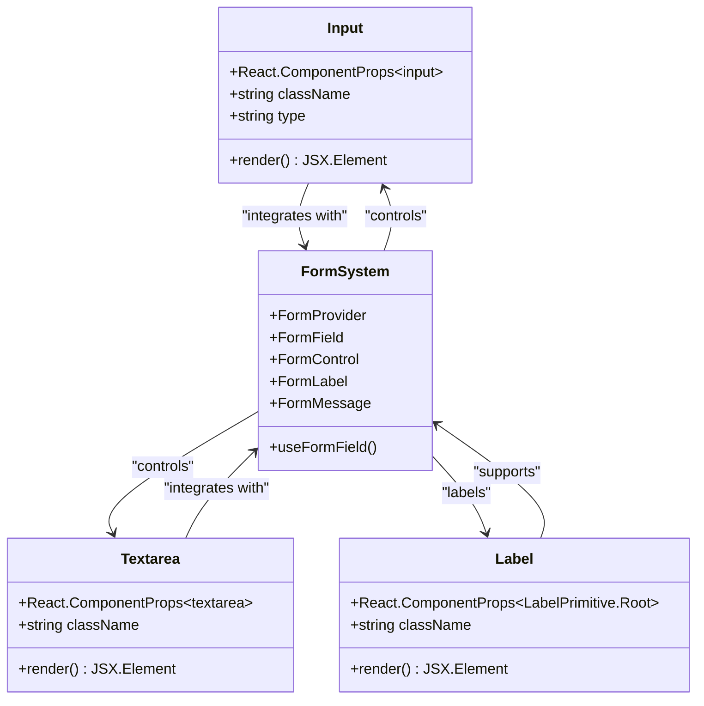
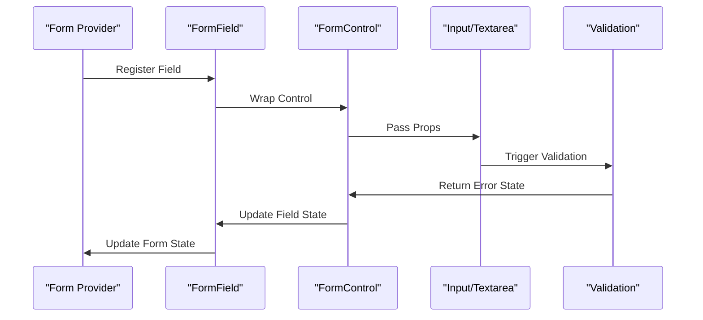

# Input and Textarea Components

<cite>
**Referenced Files in This Document**
- [input.tsx](file://src/components/ui/input.tsx)
- [textarea.tsx](file://src/components/ui/textarea.tsx)
- [label.tsx](file://src/components/ui/label.tsx)
- [form.tsx](file://src/components/ui/form.tsx)
- [utils.ts](file://src/components/ui/utils.ts)
- [SignupForm.tsx](file://src/components/SignupForm.tsx)
- [button.tsx](file://src/components/ui/button.tsx)
- [card.tsx](file://src/components/ui/card.tsx)
- [tailwind.config.js](file://tailwind.config.js)
- [index.css](file://src/index.css)
</cite>

## Table of Contents
1. [Introduction](#introduction)
2. [Component Architecture](#component-architecture)
3. [Input Component](#input-component)
4. [Textarea Component](#textarea-component)
5. [Label Component](#label-component)
6. [Form Integration](#form-integration)
7. [Accessibility Features](#accessibility-features)
8. [Styling System](#styling-system)
9. [Usage Examples](#usage-examples)
10. [Customization Options](#customization-options)
11. [Best Practices](#best-practices)
12. [Troubleshooting](#troubleshooting)

## Introduction

The input and textarea components are fundamental form controls designed for accessibility, modern styling, and seamless integration with React Hook Form. These components provide consistent behavior across different form fields while maintaining proper ARIA attributes and responsive design principles.

The components are built with a focus on:
- **Accessibility**: Proper labeling, ARIA attributes, and keyboard navigation
- **Consistency**: Uniform styling and behavior across all form controls
- **Flexibility**: Extensive customization options and theme integration
- **Performance**: Optimized rendering and minimal bundle size

## Component Architecture

The input and textarea components follow a consistent architectural pattern that integrates with the broader form system:



**Diagram sources**
- [input.tsx](file://src/components/ui/input.tsx#L1-L22)
- [textarea.tsx](file://src/components/ui/textarea.tsx#L1-L19)
- [label.tsx](file://src/components/ui/label.tsx#L1-L25)
- [form.tsx](file://src/components/ui/form.tsx#L1-L169)

## Input Component

The Input component is a highly customizable text input field that supports various input types and integrates seamlessly with the form system.

### Implementation Details

```typescript
function Input({ className, type, ...props }: React.ComponentProps<"input">) {
  return (
    <input
      type={type}
      data-slot="input"
      className={cn(
        "file:text-foreground placeholder:text-muted-foreground selection:bg-primary selection:text-primary-foreground dark:bg-input/30 border-input flex h-9 w-full min-w-0 rounded-md border px-3 py-1 text-base bg-input-background transition-[color,box-shadow] outline-none file:inline-flex file:h-7 file:border-0 file:bg-transparent file:text-sm file:font-medium disabled:pointer-events-none disabled:cursor-not-allowed disabled:opacity-50 md:text-sm",
        "focus-visible:border-ring focus-visible:ring-ring/50 focus-visible:ring-[3px]",
        "aria-invalid:ring-destructive/20 dark:aria-invalid:ring-destructive/40 aria-invalid:border-destructive",
        className,
      )}
      {...props}
    />
  );
}
```

### Key Features

1. **Type Support**: Accepts all standard HTML input types (text, email, password, etc.)
2. **Responsive Sizing**: Automatically adjusts to different screen sizes
3. **Focus Management**: Enhanced focus styles with ring effects
4. **Error States**: Visual feedback for invalid inputs
5. **Disabled State**: Proper handling of disabled inputs

### Styling Classes Breakdown

The component uses a sophisticated class composition system:

- **Base Styles**: `h-9 w-full min-w-0 rounded-md border px-3 py-1`
- **Focus States**: `focus-visible:border-ring focus-visible:ring-ring/50 focus-visible:ring-[3px]`
- **Error States**: `aria-invalid:ring-destructive/20 aria-invalid:border-destructive`
- **Dark Mode**: `dark:bg-input/30 dark:aria-invalid:ring-destructive/40`
- **Responsive**: `md:text-sm`

**Section sources**
- [input.tsx](file://src/components/ui/input.tsx#L1-L22)

## Textarea Component

The Textarea component provides a flexible multiline text input with automatic resizing capabilities and consistent styling.

### Implementation Details

```typescript
function Textarea({ className, ...props }: React.ComponentProps<"textarea">) {
  return (
    <textarea
      data-slot="textarea"
      className={cn(
        "resize-none border-input placeholder:text-muted-foreground focus-visible:border-ring focus-visible:ring-ring/50 aria-invalid:ring-destructive/20 dark:aria-invalid:ring-destructive/40 aria-invalid:border-destructive dark:bg-input/30 flex field-sizing-content min-h-16 w-full rounded-md border bg-input-background px-3 py-2 text-base transition-[color,box-shadow] outline-none focus-visible:ring-[3px] disabled:cursor-not-allowed disabled:opacity-50 md:text-sm",
        className,
      )}
      {...props}
    />
  );
}
```

### Key Features

1. **Automatic Resizing**: Prevents manual resizing with `resize-none`
2. **Minimum Height**: Maintains a minimum height of 16 units
3. **Field Sizing**: Uses `field-sizing-content` for consistent layout
4. **Consistent Styling**: Matches input component styling patterns
5. **Accessibility**: Proper ARIA attributes and focus management

### Special Considerations

The textarea includes `field-sizing-content` which ensures consistent layout behavior across different browsers and prevents layout shifts when content changes.

**Section sources**
- [textarea.tsx](file://src/components/ui/textarea.tsx#L1-L19)

## Label Component

The Label component provides semantic labeling for form controls with enhanced accessibility features.

### Implementation Details

```typescript
function Label({
  className,
  ...props
}: React.ComponentProps<typeof LabelPrimitive.Root>) {
  return (
    <LabelPrimitive.Root
      data-slot="label"
      className={cn(
        "flex items-center gap-2 text-sm leading-none font-medium select-none group-data-[disabled=true]:pointer-events-none group-data-[disabled=true]:opacity-50 peer-disabled:cursor-not-allowed peer-disabled:opacity-50",
        className,
      )}
      {...props}
    />
  );
}
```

### Key Features

1. **Semantic Structure**: Uses Radix UI's LabelPrimitive for accessibility
2. **Visual Enhancement**: Includes gap spacing for icon integration
3. **Disabled State**: Proper handling of disabled parent states
4. **Group Integration**: Works with form groups and disabled states
5. **Peer Relationship**: Integrates with peer selectors for enhanced styling

### Accessibility Features

- **Select None**: Prevents accidental text selection
- **Gap Spacing**: Provides visual separation from adjacent elements
- **Font Medium**: Ensures proper contrast and readability
- **Cursor Handling**: Shows appropriate cursor for disabled states

**Section sources**
- [label.tsx](file://src/components/ui/label.tsx#L1-L25)

## Form Integration

The components integrate seamlessly with React Hook Form through a structured form system that provides field registration, validation, and error handling.

### Form System Architecture



**Diagram sources**
- [form.tsx](file://src/components/ui/form.tsx#L25-L48)

### Field Registration Process

The form system uses several key hooks and contexts:

1. **FormFieldContext**: Manages field-specific context
2. **FormItemContext**: Provides unique identifiers
3. **useFormField**: Extracts field state and metadata
4. **useFormContext**: Accesses global form state

### Error State Management

The components automatically handle error states through:

- **ARIA Attributes**: `aria-invalid` and `aria-describedby`
- **Visual Feedback**: Ring effects and color changes
- **Error Messages**: Integration with FormMessage component
- **Focus Behavior**: Enhanced focus styles for invalid fields

**Section sources**
- [form.tsx](file://src/components/ui/form.tsx#L1-L169)

## Accessibility Features

The components implement comprehensive accessibility features to ensure usability for all users.

### Keyboard Navigation

- **Tab Order**: Natural tab order through proper DOM structure
- **Enter/Space**: Standard form submission behavior
- **Escape**: Modal-like behavior for dropdowns and popovers
- **Arrow Keys**: Navigation within controls (when applicable)

### Screen Reader Support

- **Labels**: Proper association with form controls
- **Descriptions**: ARIA-describedby for additional context
- **States**: Announcements for disabled and invalid states
- **Roles**: Appropriate ARIA roles for each component

### Focus Management

- **Focus Visible**: Enhanced focus indicators
- **Focus Trapping**: Controlled focus movement
- **Focus Restoration**: Return focus to logical positions
- **Skip Links**: Alternative navigation paths

### Color Contrast

The components maintain WCAG AA compliance through:

- **Foreground/Background**: Appropriate contrast ratios
- **Error States**: High contrast for error conditions
- **Focus Rings**: Clear visual indication of focus
- **Disabled States**: Reduced opacity for disabled elements

## Styling System

The components utilize a sophisticated styling system built on Tailwind CSS with custom utilities.

### Design Token Integration

The components integrate with the design system through:

```javascript
// Tailwind configuration extends
colors: {
  border: "hsl(var(--border))",
  input: "hsl(var(--input))",
  ring: "hsl(var(--ring))",
  background: "hsl(var(--background))",
  foreground: "hsl(var(--foreground))",
  primary: {
    DEFAULT: "hsl(var(--primary))",
    foreground: "hsl(var(--primary-foreground))"
  },
  // ... additional tokens
}
```

### Utility Functions

The `cn` function combines clsx and tailwind-merge for optimal class composition:

```typescript
export function cn(...inputs: ClassValue[]) {
  return twMerge(clsx(inputs));
}
```

### Responsive Design

Components adapt to different screen sizes through:

- **Mobile First**: Base styles for mobile devices
- **Breakpoint Specific**: `md:` prefixes for medium screens
- **Flexible Units**: Rem and percentage-based sizing
- **Viewport Awareness**: Responsive font sizes and spacing

**Section sources**
- [utils.ts](file://src/components/ui/utils.ts#L1-L7)
- [tailwind.config.js](file://tailwind.config.js#L1-L78)
- [index.css](file://src/index.css#L1-L60)

## Usage Examples

### Basic Input Usage

```typescript
<Input
  type="email"
  placeholder="Enter your email"
  required
/>
```

### Password Input with Visibility Toggle

```typescript
<div className="relative">
  <Input
    type={showPassword ? "text" : "password"}
    value={password}
    onChange={(e) => setPassword(e.target.value)}
    placeholder="Create a password"
    className="pr-10"
    required
  />
  <button
    type="button"
    onClick={() => setShowPassword(!showPassword)}
    className="absolute right-3 top-1/2 transform -translate-y-1/2 text-muted-foreground"
  >
    {showPassword ? <EyeOff className="h-4 w-4" /> : <Eye className="h-4 w-4" />}
  </button>
</div>
```

### Textarea with Character Count

```typescript
<Textarea
  value={bio}
  onChange={(e) => setBio(e.target.value)}
  placeholder="Tell us about yourself..."
  maxLength={500}
  className="min-h-24"
/>
```

### Form Integration Example

```typescript
<Form {...methods}>
  <FormField
    control={methods.control}
    name="email"
    render={({ field }) => (
      <FormItem>
        <FormLabel>Email Address</FormLabel>
        <FormControl>
          <Input
            type="email"
            placeholder="john@example.com"
            {...field}
          />
        </FormControl>
        <FormMessage />
      </FormItem>
    )}
  />
</Form>
```

**Section sources**
- [SignupForm.tsx](file://src/components/SignupForm.tsx#L1-L294)

## Customization Options

### Type Variations

The Input component supports all standard HTML input types:

```typescript
// Email input
<Input type="email" />

// Password input
<Input type="password" />

// Telephone input
<Input type="tel" />

// URL input
<Input type="url" />

// Number input
<Input type="number" />

// Date input
<Input type="date" />
```

### Disabled State

```typescript
<Input
  disabled
  placeholder="This field is disabled"
/>

<Textarea
  disabled
  placeholder="This field is disabled"
/>
```

### Icon Integration

```typescript
<div className="relative">
  <Mail className="absolute left-3 top-1/2 transform -translate-y-1/2 text-muted-foreground h-4 w-4" />
  <Input
    type="email"
    placeholder="john@example.com"
    className="pl-10"
  />
</div>
```

### Custom Styling

```typescript
<Input
  className="border-primary focus-visible:ring-primary/50"
  type="text"
  placeholder="Custom styled input"
/>
```

### Size Variations

While the components use consistent sizing, you can customize through:

```typescript
// Larger input
<Input className="h-12 text-lg" />

// Smaller input  
<Input className="h-7 text-sm" />

// Full width
<Input className="w-full" />

// Fixed width
<Input className="w-64" />
```

## Best Practices

### Form Field Organization

1. **Logical Grouping**: Group related fields together
2. **Clear Labels**: Use descriptive, concise labels
3. **Proper Hierarchy**: Structure forms with appropriate heading levels
4. **Error Placement**: Place error messages immediately after fields

### Accessibility Guidelines

1. **Label Association**: Always associate labels with their inputs
2. **Keyboard Navigation**: Ensure all interactive elements are keyboard accessible
3. **Screen Reader Compatibility**: Test with popular screen readers
4. **Color Independence**: Don't rely solely on color for conveying information

### Performance Optimization

1. **Lazy Loading**: Load form components only when needed
2. **Memoization**: Use React.memo for expensive form calculations
3. **Debouncing**: Implement debouncing for real-time validation
4. **Bundle Splitting**: Split form-related code into separate chunks

### Security Considerations

1. **Input Sanitization**: Sanitize user input server-side
2. **CSRF Protection**: Implement CSRF tokens for form submissions
3. **Rate Limiting**: Protect against form spam attacks
4. **HTTPS Only**: Ensure secure transmission of sensitive data

## Troubleshooting

### Common Issues

#### Input Not Responding to Changes

**Problem**: Input value doesn't update when typing
**Solution**: Ensure controlled component pattern is followed:
```typescript
// Correct
<Input value={value} onChange={(e) => setValue(e.target.value)} />

// Incorrect - uncontrolled
<Input defaultValue={value} />
```

#### Focus Styles Not Appearing

**Problem**: Focus rings don't show on inputs
**Solution**: Verify Tailwind configuration includes focus-visible plugin and ensure proper class ordering

#### Error States Not Displaying

**Problem**: Error messages don't appear for invalid inputs
**Solution**: Check that FormProvider wraps the form and useFormField hook is used correctly

#### Styling Conflicts

**Problem**: Custom styles override component styles
**Solution**: Use CSS specificity or Tailwind's `!important` modifier carefully

### Debugging Tips

1. **Inspect Elements**: Use browser dev tools to inspect generated markup
2. **Console Logging**: Add logging to track state changes
3. **Network Tab**: Monitor form submission requests
4. **Accessibility Checker**: Use tools like axe-core for accessibility testing

### Performance Issues

1. **Re-render Analysis**: Use React DevTools Profiler
2. **Bundle Analysis**: Check bundle size with webpack-bundle-analyzer
3. **Memory Leaks**: Monitor memory usage during form interactions
4. **Rendering Optimization**: Implement shouldComponentUpdate or React.memo where appropriate