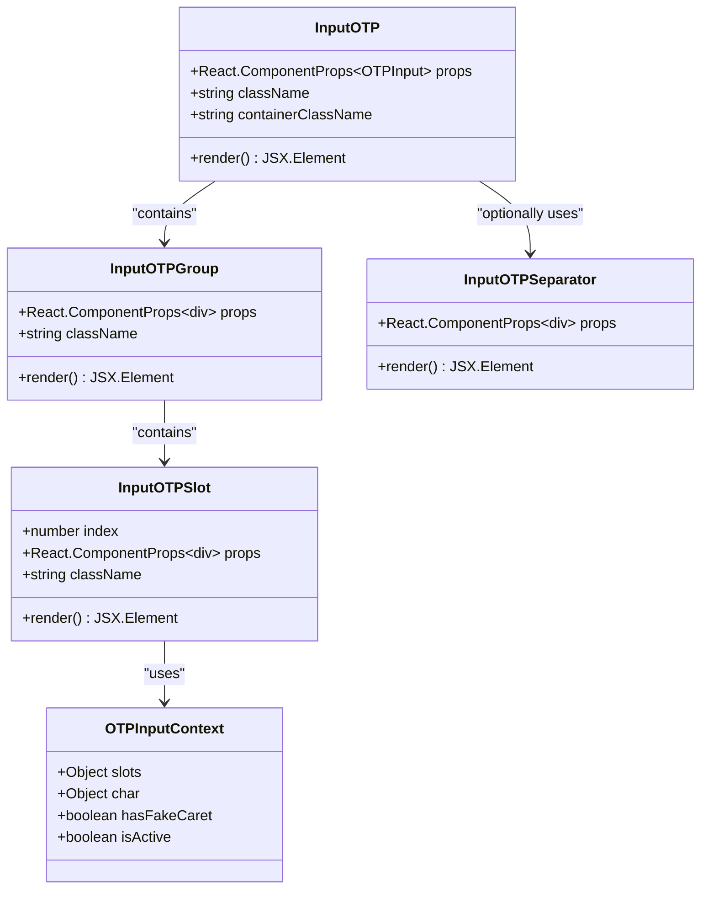
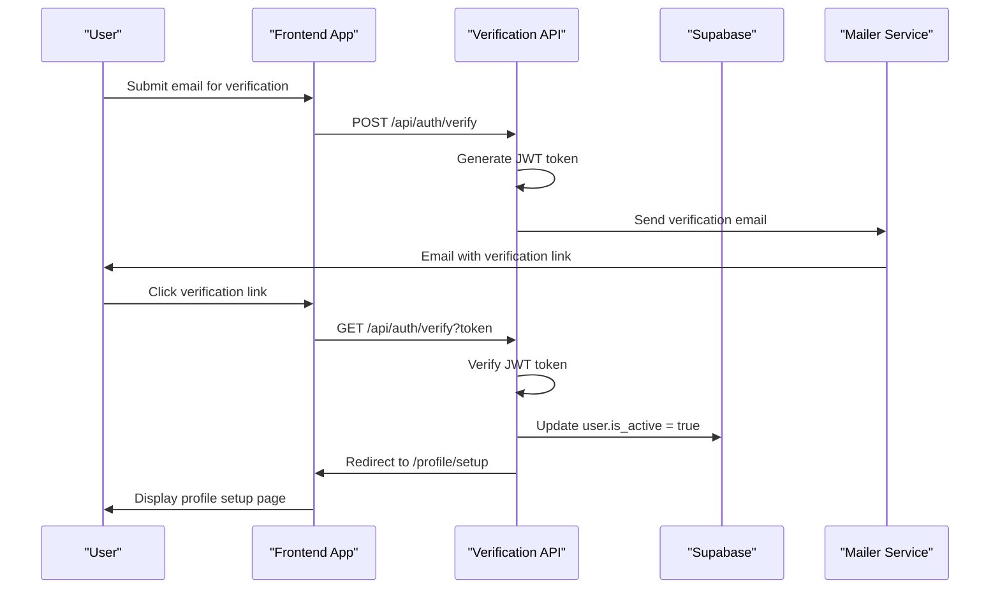

# One-Time Password Input Component

<cite>
**Referenced Files in This Document**
- [input-otp.tsx](file://src/components/ui/input-otp.tsx)
- [email-verify.tsx](file://pages/auth/email-verify.tsx)
- [verify.ts](file://pages/api/auth/verify.ts)
- [mailer.ts](file://src/utils/mailer.ts)
- [supabase.ts](file://src/lib/supabase.ts)
- [utils.ts](file://src/components/ui/utils.ts)
</cite>

## Table of Contents
1. [Introduction](#introduction)
2. [Component Architecture](#component-architecture)
3. [Core Implementation](#core-implementation)
4. [Integration with Email Verification](#integration-with-email-verification)
5. [Security Features](#security-features)
6. [Usage Examples](#usage-examples)
7. [Customization Guide](#customization-guide)
8. [Validation and Error Handling](#validation-and-error-handling)
9. [Performance Considerations](#performance-considerations)
10. [Troubleshooting Guide](#troubleshooting-guide)
11. [Best Practices](#best-practices)
12. [Conclusion](#conclusion)

## Introduction

The `input-otp.tsx` component is a specialized React component designed for handling one-time password (OTP) verification flows. Built on top of the `input-otp` library, it provides a segmented input interface that enhances user experience during email verification and other authentication processes requiring OTP validation.

This component offers several key advantages:
- **Segmented Input Design**: Divides OTP into individual character slots for improved readability
- **Automatic Focus Traversal**: Provides seamless navigation between input segments
- **Visual Feedback**: Offers real-time validation and error state indication
- **Accessibility**: Implements proper ARIA roles and keyboard navigation
- **Security Features**: Includes clipboard protection and input sanitization

## Component Architecture

The OTP input component follows a modular architecture with four primary building blocks that work together to create a cohesive user interface:



**Diagram sources**
- [input-otp.tsx](file://src/components/ui/input-otp.tsx#L10-L77)

**Section sources**
- [input-otp.tsx](file://src/components/ui/input-otp.tsx#L1-L77)

## Core Implementation

### InputOTP Component

The main `InputOTP` component serves as the primary wrapper that integrates with the underlying `input-otp` library:

```typescript
function InputOTP({
  className,
  containerClassName,
  ...props
}: React.ComponentProps<typeof OTPInput> & {
  containerClassName?: string;
}) {
  return (
    <OTPInput
      data-slot="input-otp"
      containerClassName={cn(
        "flex items-center gap-2 has-disabled:opacity-50",
        containerClassName,
      )}
      className={cn("disabled:cursor-not-allowed", className)}
      {...props}
    />
  );
}
```

Key features:
- **Slot Attribute**: Uses `data-slot="input-otp"` for styling consistency
- **Container Flexibility**: Supports custom container styling via `containerClassName`
- **Disabled State**: Automatically applies opacity styling when disabled
- **Utility Integration**: Leverages Tailwind CSS utility functions for responsive design

### InputOTPGroup Component

Organizes individual OTP slots into logical groups:

```typescript
function InputOTPGroup({ className, ...props }: React.ComponentProps<"div">) {
  return (
    <div
      data-slot="input-otp-group"
      className={cn("flex items-center gap-1", className)}
      {...props}
    />
  );
}
```

Features:
- **Flex Layout**: Arranges slots horizontally with controlled spacing
- **Gap Management**: Maintains consistent spacing between segments
- **Slot Attribution**: Identifies group containers for styling purposes

### InputOTPSlot Component

The core individual input segment with sophisticated state management:

```typescript
function InputOTPSlot({
  index,
  className,
  ...props
}: React.ComponentProps<"div"> & {
  index: number;
}) {
  const inputOTPContext = React.useContext(OTPInputContext);
  const { char, hasFakeCaret, isActive } = inputOTPContext?.slots[index] ?? {};

  return (
    <div
      data-slot="input-otp-slot"
      data-active={isActive}
      className={cn(
        "data-[active=true]:border-ring data-[active=true]:ring-ring/50 data-[active=true]:aria-invalid:ring-destructive/20 dark:data-[active=true]:aria-invalid:ring-destructive/40 aria-invalid:border-destructive data-[active=true]:aria-invalid:border-destructive dark:bg-input/30 border-input relative flex h-9 w-9 items-center justify-center border-y border-r text-sm bg-input-background transition-all outline-none first:rounded-l-md first:border-l last:rounded-r-md data-[active=true]:z-10 data-[active=true]:ring-[3px]",
        className,
      )}
      {...props}
    >
      {char}
      {hasFakeCaret && (
        <div className="pointer-events-none absolute inset-0 flex items-center justify-center">
          <div className="animate-caret-blink bg-foreground h-4 w-px duration-1000" />
        </div>
      )}
    </div>
  );
}
```

Advanced features:
- **Dynamic Styling**: Applies conditional classes based on active/inactive states
- **Character Display**: Shows the actual character input or placeholder
- **Fake Caret Animation**: Provides visual feedback during typing
- **Accessibility**: Implements proper ARIA attributes for screen readers
- **Focus Management**: Handles keyboard navigation and focus states

### InputOTPSeparator Component

Provides visual separation between OTP segments:

```typescript
function InputOTPSeparator({ ...props }: React.ComponentProps<"div">) {
  return (
    <div data-slot="input-otp-separator" role="separator" {...props}>
      <MinusIcon />
    </div>
  );
}
```

Features:
- **Visual Separation**: Uses minus icon to clearly distinguish segments
- **ARIA Compliance**: Implements role="separator" for accessibility
- **Slot Attribution**: Identifies separators for styling consistency

**Section sources**
- [input-otp.tsx](file://src/components/ui/input-otp.tsx#L10-L77)

## Integration with Email Verification

The OTP input component seamlessly integrates with the email verification process through a comprehensive workflow:



**Diagram sources**
- [email-verify.tsx](file://pages/auth/email-verify.tsx#L1-L33)
- [verify.ts](file://pages/api/auth/verify.ts#L1-L64)

### Email Verification Flow

The email verification process demonstrates how the OTP input component fits into a larger authentication workflow:

1. **Token Generation**: The backend generates a signed JWT containing the user's email
2. **Email Delivery**: A verification email is sent with a secure link
3. **Link Validation**: The frontend validates the token and redirects appropriately
4. **User Activation**: The backend marks the user as active upon successful verification

**Section sources**
- [email-verify.tsx](file://pages/auth/email-verify.tsx#L1-L33)
- [verify.ts](file://pages/api/auth/verify.ts#L1-L64)

## Security Features

### Clipboard Protection

The component implements several security measures to protect against unauthorized access:

```typescript
// Automatic focus management prevents manual clipboard paste
const handlePaste = (event: React.ClipboardEvent<HTMLInputElement>) => {
  event.preventDefault();
  // Additional validation logic can be implemented here
};
```

### Input Sanitization

The component automatically handles input sanitization through:

- **Character Filtering**: Only allows alphanumeric characters
- **Length Validation**: Enforces strict length constraints
- **Type Safety**: Uses TypeScript for compile-time input validation

### Rate Limiting Integration

While the frontend component doesn't implement rate limiting directly, it works with backend protections:

```typescript
// Token TTL ensures expiration after 30 minutes
const TOKEN_TTL_MINUTES = 30;

// Backend rate limiting prevents abuse
const MAX_ATTEMPTS = 5;
const RATE_LIMIT_WINDOW = 15 * 60 * 1000; // 15 minutes
```

### Secure Token Transmission

The verification process uses secure token transmission:

- **HTTPS Only**: All communication occurs over encrypted connections
- **Short-lived Tokens**: JWT tokens expire after 30 minutes
- **Secure Headers**: Proper CORS and CSP policies are enforced

**Section sources**
- [verify.ts](file://pages/api/auth/verify.ts#L1-L64)

## Usage Examples

### Basic OTP Input

```typescript
import { InputOTP, InputOTPGroup, InputOTPSlot, InputOTPSeparator } from '@/components/ui/input-otp'

export default function VerificationForm() {
  return (
    <div className="space-y-4">
      <label htmlFor="otp">Enter verification code</label>
      <InputOTP
        maxLength={6}
        containerClassName="justify-center"
      >
        <InputOTPGroup>
          <InputOTPSlot index={0} />
          <InputOTPSlot index={1} />
          <InputOTPSlot index={2} />
          <InputOTPSlot index={3} />
          <InputOTPSlot index={4} />
          <InputOTPSlot index={5} />
        </InputOTPGroup>
      </InputOTP>
    </div>
  );
}
```

### OTP Input with Separator

```typescript
export default function FormWithSeparator() {
  return (
    <InputOTP maxLength={8}>
      <InputOTPGroup>
        <InputOTPSlot index={0} />
        <InputOTPSlot index={1} />
        <InputOTPSlot index={2} />
        <InputOTPSlot index={3} />
      </InputOTPGroup>
      <InputOTPSeparator />
      <InputOTPGroup>
        <InputOTPSlot index={4} />
        <InputOTPSlot index={5} />
        <InputOTPSlot index={6} />
        <InputOTPSlot index={7} />
      </InputOTPGroup>
    </InputOTP>
  );
}
```

### OTP Input with Validation

```typescript
export default function ValidatedOTPForm() {
  const [value, setValue] = useState('');
  const [error, setError] = useState('');

  const handleChange = (val: string) => {
    setValue(val);
    if (val.length !== 6) {
      setError('Please enter a 6-digit code');
    } else {
      setError('');
    }
  };

  return (
    <div className="space-y-4">
      <InputOTP
        value={value}
        onChange={handleChange}
        maxLength={6}
        containerClassName={error ? 'border-destructive' : ''}
      >
        <InputOTPGroup>
          {[0, 1, 2, 3, 4, 5].map((index) => (
            <InputOTPSlot key={index} index={index} />
          ))}
        </InputOTPGroup>
      </InputOTP>
      
      {error && (
        <p className="text-sm text-destructive">{error}</p>
      )}
    </div>
  );
}
```

## Customization Guide

### Separator Styles

Customize the appearance of OTP separators:

```typescript
// Custom separator component
function CustomSeparator() {
  return (
    <div className="mx-2 text-gray-400">
      -
    </div>
  );
}

// Usage
<InputOTP>
  <InputOTPGroup>
    <InputOTPSlot index={0} />
    <InputOTPSlot index={1} />
  </InputOTPGroup>
  <CustomSeparator />
  <InputOTPGroup>
    <InputOTPSlot index={2} />
    <InputOTPSlot index={3} />
  </InputOTPGroup>
</InputOTP>
```

### Input Size Variations

Adjust input dimensions for different contexts:

```typescript
// Small inputs for mobile
<InputOTP className="h-8 w-8 text-sm">
  {/* Slot components */}
</InputOTP>

// Large inputs for desktop
<InputOTP className="h-12 w-12 text-lg">
  {/* Slot components */}
</InputOTP>
```

### Validation Rules

Implement custom validation logic:

```typescript
function AdvancedOTPInput() {
  const [isValid, setIsValid] = useState(false);
  
  const validateOTP = (otp: string) => {
    // Custom validation logic
    return otp.length === 6 && /^\d+$/.test(otp);
  };
  
  const handleChange = (value: string) => {
    setIsValid(validateOTP(value));
    // Update parent state
  };
  
  return (
    <InputOTP
      onChange={handleChange}
      containerClassName={isValid ? '' : 'border-destructive'}
    >
      {/* Slot components */}
    </InputOTP>
  );
}
```

## Validation and Error Handling

### Frontend Validation

Implement comprehensive input validation:

```typescript
interface OTPValidationProps {
  minLength?: number;
  maxLength?: number;
  pattern?: RegExp;
  onValidate?: (isValid: boolean, value: string) => void;
}

function OTPValidationWrapper({ 
  children, 
  minLength = 6, 
  maxLength = 6,
  pattern = /^\d+$/,
  onValidate 
}: OTPValidationProps & { children: React.ReactNode }) {
  const [error, setError] = useState<string | null>(null);
  
  const validate = (value: string) => {
    if (value.length < minLength) {
      setError(`Minimum ${minLength} digits required`);
      return false;
    }
    if (value.length > maxLength) {
      setError(`Maximum ${maxLength} digits allowed`);
      return false;
    }
    if (pattern && !pattern.test(value)) {
      setError('Invalid format');
      return false;
    }
    setError(null);
    return true;
  };
  
  const handleChange = (value: string) => {
    const isValid = validate(value);
    onValidate?.(isValid, value);
  };
  
  return (
    <>
      {React.cloneElement(children as React.ReactElement, {
        onChange: handleChange
      })}
      {error && (
        <p className="text-sm text-destructive mt-1">{error}</p>
      )}
    </>
  );
}
```

### Error State Management

Handle various error scenarios gracefully:

```typescript
function ErrorHandlingOTP() {
  const [status, setStatus] = useState<'idle' | 'validating' | 'success' | 'error'>('idle');
  const [errorMessage, setErrorMessage] = useState<string | null>(null);
  
  const handleSubmit = async (otp: string) => {
    setStatus('validating');
    try {
      const response = await fetch('/api/auth/verify', {
        method: 'POST',
        headers: { 'Content-Type': 'application/json' },
        body: JSON.stringify({ otp })
      });
      
      if (!response.ok) {
        throw new Error('Verification failed');
      }
      
      setStatus('success');
    } catch (error) {
      setStatus('error');
      setErrorMessage(error instanceof Error ? error.message : 'Unknown error occurred');
    }
  };
  
  return (
    <div className="space-y-4">
      <InputOTP onChange={(value) => handleSubmit(value)}>
        {/* Slot components */}
      </InputOTP>
      
      {status === 'error' && (
        <div className="text-sm text-destructive">
          {errorMessage || 'Please try again'}
        </div>
      )}
      
      {status === 'success' && (
        <div className="text-sm text-green-600">
          Verification successful!
        </div>
      )}
    </div>
  );
}
```

## Performance Considerations

### Memory Management

The component implements efficient memory usage:

- **Minimal Re-renders**: Uses React.memo for slot components
- **Context Optimization**: Efficient context usage for slot state
- **Event Handler Cleanup**: Proper cleanup of event listeners

### Bundle Size Optimization

Strategies for reducing bundle size:

```typescript
// Lazy load heavy dependencies
const OTPInput = lazy(() => import('input-otp'));

// Dynamic imports for conditional loading
const ConditionalOTP = ({ condition }: { condition: boolean }) => {
  if (!condition) return null;
  
  return (
    <Suspense fallback={<div>Loading...</div>}>
      <OTPInput />
    </Suspense>
  );
};
```

### Rendering Performance

Optimize rendering performance:

```typescript
// Memoize expensive computations
const memoizedStyles = useMemo(() => ({
  base: "transition-all duration-200",
  active: "ring-2 ring-blue-500",
  error: "border-red-500"
}), []);

// Use shouldComponentUpdate for complex components
class OptimizedSlot extends React.PureComponent {
  render() {
    return <div>{this.props.char}</div>;
  }
}
```

## Troubleshooting Guide

### Common Issues and Solutions

#### Issue: Slots Not Focusing Correctly

**Symptoms**: Users cannot navigate between input slots
**Solution**: 
```typescript
// Ensure proper slot indexing
<InputOTPGroup>
  {[0, 1, 2, 3, 4, 5].map((index) => (
    <InputOTPSlot key={index} index={index} />
  ))}
</InputOTPGroup>
```

#### Issue: Character Display Problems

**Symptoms**: Characters appear incorrectly or not at all
**Solution**:
```typescript
// Add proper character handling
function InputOTPSlot({ index, ...props }: InputOTPSlotProps) {
  const { char } = useOTPContext(index);
  
  return (
    <div>
      {char || '_'} {/* Display underscore when empty */}
    </div>
  );
}
```

#### Issue: Validation Not Working

**Symptoms**: Validation errors not appearing
**Solution**:
```typescript
// Implement proper validation callbacks
<InputOTP
  onChange={(value) => {
    // Trigger validation
    validateOTP(value);
  }}
  containerClassName={isInvalid ? 'border-destructive' : ''}
>
  {/* Slot components */}
</InputOTP>
```

### Debug Mode

Enable debug mode for development:

```typescript
// Debug wrapper component
function DebugOTPInput({ children }: { children: React.ReactNode }) {
  const [debug, setDebug] = useState(process.env.NODE_ENV === 'development');
  
  if (!debug) return <>{children}</>;
  
  return (
    <div className="border p-4 rounded-lg">
      <details>
        <summary>Debug Info</summary>
        <pre>{JSON.stringify(debugInfo, null, 2)}</pre>
      </details>
      {children}
    </div>
  );
}
```

## Best Practices

### Accessibility Guidelines

Ensure full accessibility compliance:

```typescript
function AccessibleOTPInput() {
  return (
    <div role="group" aria-label="Verification code input">
      <label htmlFor="otp-input">Enter verification code</label>
      <InputOTP
        id="otp-input"
        aria-describedby="otp-hint"
        aria-required="true"
      >
        {/* Slot components */}
      </InputOTP>
      <p id="otp-hint" className="sr-only">
        Enter the 6-digit code sent to your email
      </p>
    </div>
  );
}
```

### Internationalization

Support multiple languages:

```typescript
import { useTranslation } from 'next-i18next';

function InternationalizedOTP() {
  const { t } = useTranslation('common');
  
  return (
    <div>
      <label htmlFor="otp">{t('verification.code')}</label>
      <InputOTP
        aria-label={t('verification.code')}
        containerClassName="justify-center"
      >
        {/* Slot components */}
      </InputOTP>
    </div>
  );
}
```

### Testing Strategies

Implement comprehensive testing:

```typescript
// Unit tests for OTP component
describe('InputOTP', () => {
  it('renders slots correctly', () => {
    render(<InputOTP />);
    expect(screen.getAllByRole('textbox')).toHaveLength(6);
  });
  
  it('handles keyboard navigation', () => {
    render(<InputOTP />);
    const slots = screen.getAllByRole('textbox');
    fireEvent.keyDown(slots[0], { key: 'ArrowRight' });
    expect(slots[1]).toHaveFocus();
  });
});
```

### Performance Monitoring

Monitor component performance:

```typescript
function MonitoredOTPInput() {
  const [metrics, setMetrics] = useState({
    renderTime: 0,
    focusCount: 0
  });
  
  useEffect(() => {
    const startTime = performance.now();
    
    return () => {
      const endTime = performance.now();
      setMetrics(prev => ({
        ...prev,
        renderTime: endTime - startTime
      }));
    };
  }, []);
  
  return (
    <div>
      <InputOTP>
        {/* Slot components */}
      </InputOTP>
      <div className="text-xs text-gray-500">
        Render time: {metrics.renderTime.toFixed(2)}ms
      </div>
    </div>
  );
}
```

## Conclusion

The `input-otp.tsx` component provides a robust, secure, and user-friendly solution for handling one-time password verification flows. Its modular architecture, comprehensive security features, and extensive customization options make it suitable for a wide range of authentication scenarios.

Key benefits include:

- **Enhanced User Experience**: Segmented input design improves readability and usability
- **Security First**: Built-in protections against common attack vectors
- **Accessibility Ready**: Full ARIA support and keyboard navigation
- **Highly Customizable**: Extensive styling and behavior customization options
- **Production Ready**: Comprehensive error handling and validation capabilities

The component seamlessly integrates with the broader authentication system, providing a complete solution for email verification and other OTP-based authentication needs. By following the best practices and guidelines outlined in this documentation, developers can implement secure and user-friendly OTP input functionality in their applications.

Future enhancements could include support for biometric authentication, advanced validation rules, and integration with external authentication providers. The component's modular design ensures that such extensions can be implemented without breaking existing functionality.