# Selection and Choice Controls

<cite>
**Referenced Files in This Document**   
- [checkbox.tsx](file://src/components/ui/checkbox.tsx)
- [radio-group.tsx](file://src/components/ui/radio-group.tsx)
- [select.tsx](file://src/components/ui/select.tsx)
- [OnboardingForm.tsx](file://src/components/OnboardingForm.tsx)
- [onboarding.tsx](file://pages/onboarding.tsx)
</cite>

## Table of Contents
1. [Introduction](#introduction)
2. [Core Components Overview](#core-components-overview)
3. [Form Integration with react-hook-form](#form-integration-with-react-hook-form)
4. [Real-World Usage in OnboardingForm](#real-world-usage-in-onboardingform)
5. [Accessibility Features](#accessibility-features)
6. [Controlled vs Uncontrolled Usage](#controlled-vs-uncontrolled-usage)
7. [Custom Styling and Supabase Integration](#custom-styling-and-supabase-integration)
8. [Common Pitfalls and Solutions](#common-pitfalls-and-solutions)
9. [Conclusion](#conclusion)

## Introduction
This document provides comprehensive documentation for the selection and choice controls implemented in the SnapEvent application. It covers the implementation and usage of `checkbox.tsx`, `radio-group.tsx`, and `select.tsx` components, focusing on their integration with react-hook-form, accessibility features, and real-world application in the onboarding process. The documentation details how these components handle value changes, display validation errors, and interact with Supabase data models, while also addressing common implementation pitfalls.

## Core Components Overview

The selection controls are built using Radix UI primitives, providing accessible, unstyled components that are enhanced with Tailwind CSS for visual styling. Each component follows a consistent pattern of composition with Radix UI's accessible primitives while adding project-specific styling and behavior.

### Checkbox Component
The `Checkbox` component provides a controlled checkbox input with visual feedback for checked, unchecked, and indeterminate states. It uses Radix UI's `Checkbox.Root` as its base, with a check icon displayed in the indicator when checked.

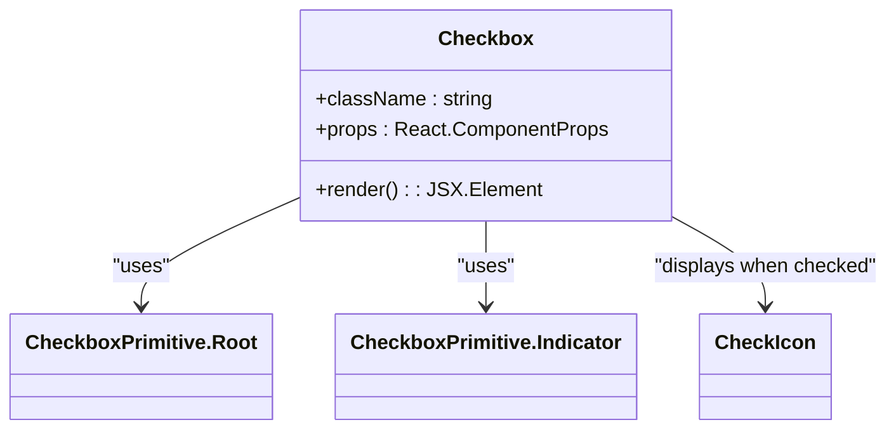

**Diagram sources**
- [checkbox.tsx](file://src/components/ui/checkbox.tsx#L1-L33)

**Section sources**
- [checkbox.tsx](file://src/components/ui/checkbox.tsx#L1-L33)

### Radio Group Component
The `RadioGroup` component creates a group of mutually exclusive radio buttons. It uses Radix UI's `RadioGroup.Root` to manage the group state and `RadioGroup.Item` for individual radio buttons, with a circular indicator that displays a filled circle when selected.

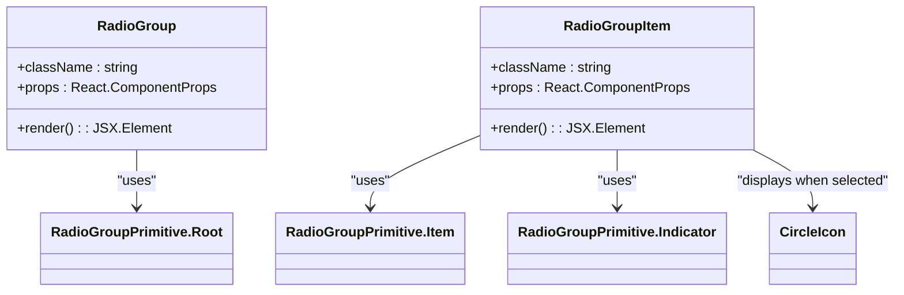

**Diagram sources**
- [radio-group.tsx](file://src/components/ui/radio-group.tsx#L1-L46)

**Section sources**
- [radio-group.tsx](file://src/components/ui/radio-group.tsx#L1-L46)

### Select Component
The `Select` component provides a dropdown selection interface with support for groups, labels, and scrollable content. It implements a complete select interface with trigger, content, items, and navigation controls.

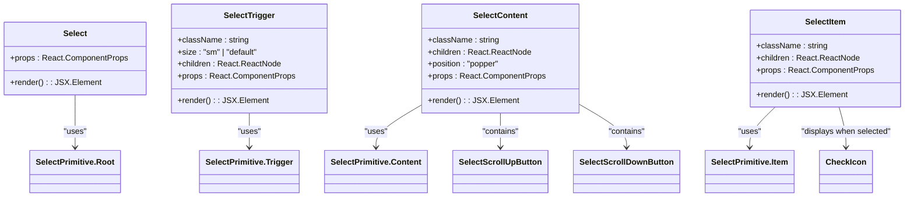

**Diagram sources**
- [select.tsx](file://src/components/ui/select.tsx#L1-L190)

**Section sources**
- [select.tsx](file://src/components/ui/select.tsx#L1-L190)

## Form Integration with react-hook-form

The selection components are designed to work seamlessly with react-hook-form, providing proper registration, value handling, and validation error display. The components use the `data-slot` attribute to identify themselves for styling and the `aria-invalid` attribute to indicate validation errors.

### Value Change Handling
The components handle value changes through their underlying Radix UI primitives, which manage the checked/selected state internally. When used with react-hook-form, the form context provides the current value and change handlers.

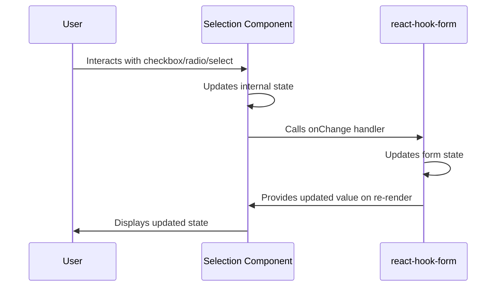

**Diagram sources**
- [checkbox.tsx](file://src/components/ui/checkbox.tsx#L1-L33)
- [radio-group.tsx](file://src/components/ui/radio-group.tsx#L1-L46)
- [select.tsx](file://src/components/ui/select.tsx#L1-L190)

**Section sources**
- [checkbox.tsx](file://src/components/ui/checkbox.tsx#L1-L33)
- [radio-group.tsx](file://src/components/ui/radio-group.tsx#L1-L46)
- [select.tsx](file://src/components/ui/select.tsx#L1-L190)

### Validation Error Display
The components display validation errors by responding to the `aria-invalid` attribute, which is set by react-hook-form when validation fails. The styling includes visual indicators for invalid states.

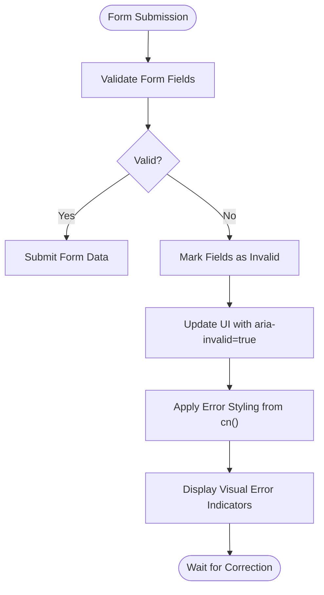

**Diagram sources**
- [checkbox.tsx](file://src/components/ui/checkbox.tsx#L1-L33)
- [radio-group.tsx](file://src/components/ui/radio-group.tsx#L1-L46)
- [select.tsx](file://src/components/ui/select.tsx#L1-L190)

**Section sources**
- [checkbox.tsx](file://src/components/ui/checkbox.tsx#L1-L33)
- [radio-group.tsx](file://src/components/ui/radio-group.tsx#L1-L46)
- [select.tsx](file://src/components/ui/select.tsx#L1-L190)

## Real-World Usage in OnboardingForm

The `OnboardingForm` component demonstrates the practical application of selection controls in a multi-step user onboarding process. It uses checkboxes for multi-select options, radio groups for single selections, and selects for dropdown choices.

### Role Selection
The form uses checkboxes to allow photographers to select multiple specialties and services they offer. This implementation includes a limit of two selections and handles the "Other" option with conditional text input display.

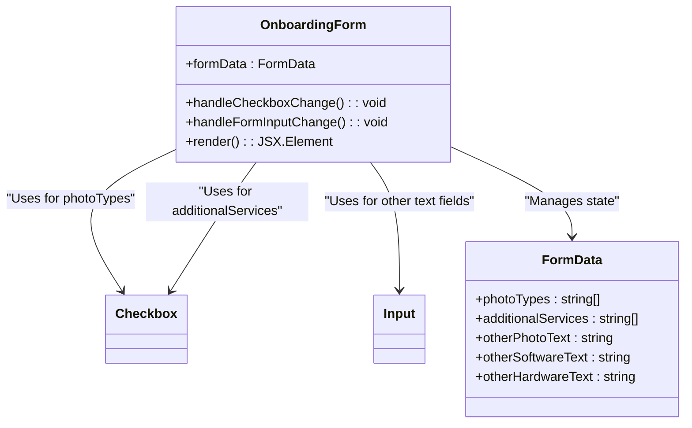

**Diagram sources**
- [OnboardingForm.tsx](file://src/components/OnboardingForm.tsx#L1-L933)

**Section sources**
- [OnboardingForm.tsx](file://src/components/OnboardingForm.tsx#L1-L933)

### Service Type and Availability Preferences
The form uses radio groups for single-selection options like photographer type and experience level, and selects for dropdown selections like camera manufacturer and language preference.

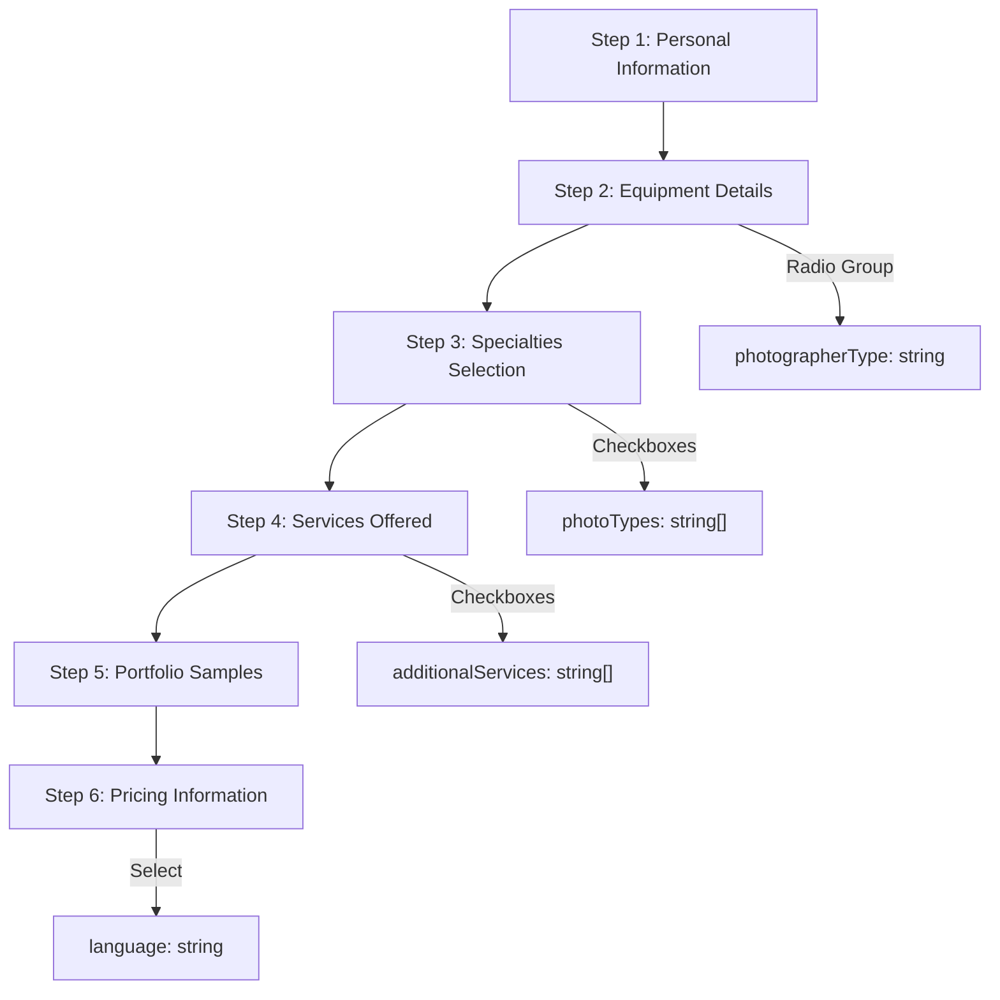

**Diagram sources**
- [OnboardingForm.tsx](file://src/components/OnboardingForm.tsx#L1-L933)

**Section sources**
- [OnboardingForm.tsx](file://src/components/OnboardingForm.tsx#L1-L933)

## Accessibility Features

The selection components implement comprehensive accessibility features to ensure they are usable by all users, including those using assistive technologies.

### Keyboard Navigation
All components support full keyboard navigation, allowing users to interact with them using only the keyboard. The implementation follows WAI-ARIA best practices for each component type.

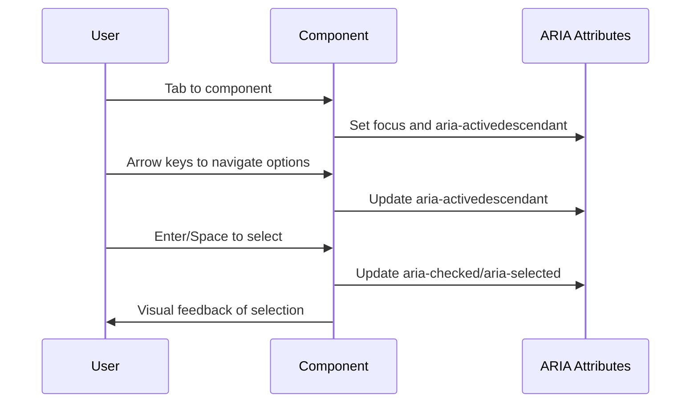

**Diagram sources**
- [checkbox.tsx](file://src/components/ui/checkbox.tsx#L1-L33)
- [radio-group.tsx](file://src/components/ui/radio-group.tsx#L1-L46)
- [select.tsx](file://src/components/ui/select.tsx#L1-L190)

**Section sources**
- [checkbox.tsx](file://src/components/ui/checkbox.tsx#L1-L33)
- [radio-group.tsx](file://src/components/ui/radio-group.tsx#L1-L46)
- [select.tsx](file://src/components/ui/select.tsx#L1-L190)

### ARIA Roles and Label Association
The components use appropriate ARIA roles and ensure proper label association through implicit or explicit labeling mechanisms.

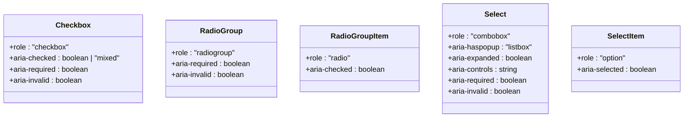

**Diagram sources**
- [checkbox.tsx](file://src/components/ui/checkbox.tsx#L1-L33)
- [radio-group.tsx](file://src/components/ui/radio-group.tsx#L1-L46)
- [select.tsx](file://src/components/ui/select.tsx#L1-L190)

**Section sources**
- [checkbox.tsx](file://src/components/ui/checkbox.tsx#L1-L33)
- [radio-group.tsx](file://src/components/ui/radio-group.tsx#L1-L46)
- [select.tsx](file://src/components/ui/select.tsx#L1-L190)

## Controlled vs Uncontrolled Usage

The components support both controlled and uncontrolled usage patterns, allowing flexibility in how state is managed.

### Controlled Components
In controlled mode, the parent component manages the state and passes it down as props. This is the recommended approach when using with form libraries like react-hook-form.

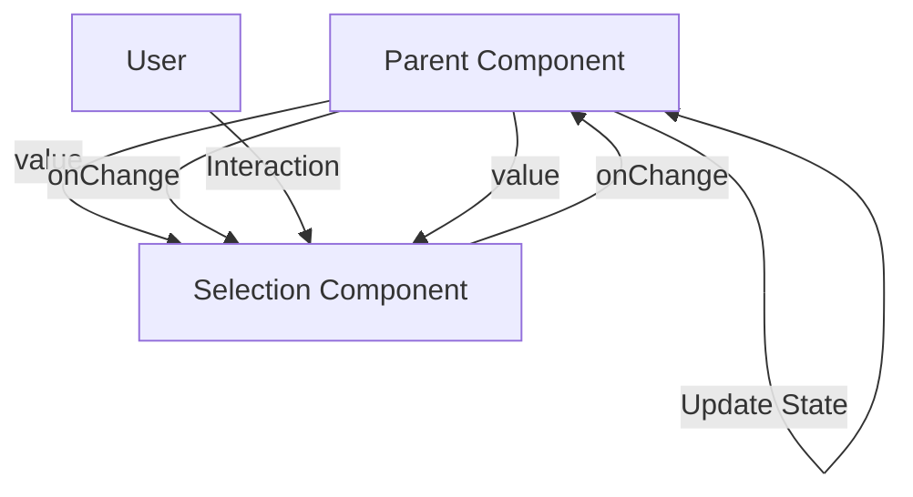

**Section sources**
- [OnboardingForm.tsx](file://src/components/OnboardingForm.tsx#L1-L933)

### Uncontrolled Components
In uncontrolled mode, the component manages its own state internally. This can be useful for simple use cases where form integration is not required.

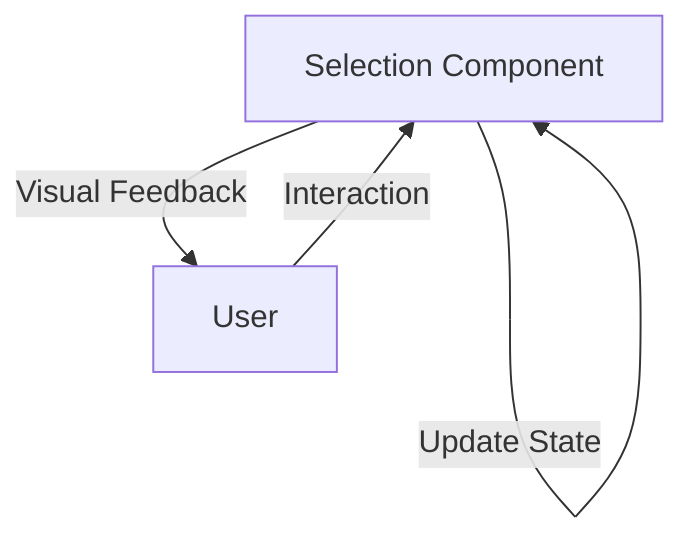

**Section sources**
- [checkbox.tsx](file://src/components/ui/checkbox.tsx#L1-L33)
- [radio-group.tsx](file://src/components/ui/radio-group.tsx#L1-L46)
- [select.tsx](file://src/components/ui/select.tsx#L1-L190)

## Custom Styling and Supabase Integration

The components are styled using Tailwind CSS utility classes and are designed to integrate with Supabase for data persistence.

### Custom Styling with Tailwind CSS
The components use the `cn()` utility function to combine default styles with custom class names, allowing for easy customization while maintaining consistent base styling.

```mermaid
flowchart TD
Base[Base Component] --> |Radix UI Primitives| Base
Base --> |Tailwind CSS| Styling
Styling --> |cn() utility| Customization
Customization --> |className prop| External
External --> |Custom Styles| Application
```

**Section sources**
- [checkbox.tsx](file://src/components/ui/checkbox.tsx#L1-L33)
- [radio-group.tsx](file://src/components/ui/radio-group.tsx#L1-L46)
- [select.tsx](file://src/components/ui/select.tsx#L1-L190)

### Supabase Data Model Integration
The form data collected through these components is structured to align with Supabase database models, enabling seamless data persistence.

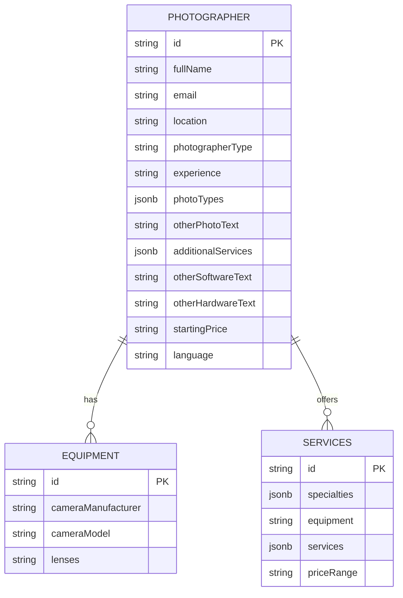

**Section sources**
- [OnboardingForm.tsx](file://src/components/OnboardingForm.tsx#L1-L933)

## Common Pitfalls and Solutions

### Unchecked State Persistence
A common issue is the persistence of "unchecked" state when using controlled components. This occurs when the component's internal state becomes out of sync with the parent's state.

**Solution**: Ensure that the `checked` or `value` prop is always updated in the parent component's state management.

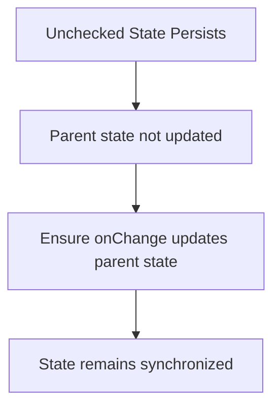

**Section sources**
- [OnboardingForm.tsx](file://src/components/OnboardingForm.tsx#L1-L933)

### Group Value Binding Issues
When using radio groups or checkbox groups, improper value binding can lead to multiple selections in radio groups or incorrect state management in checkbox groups.

**Solution**: Use unique `value` attributes for each option and ensure the group component properly manages the selection state.

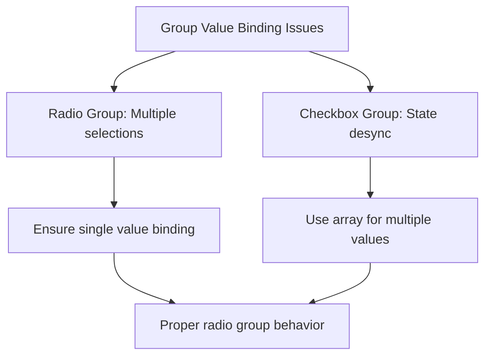

**Section sources**
- [OnboardingForm.tsx](file://src/components/OnboardingForm.tsx#L1-L933)

## Conclusion
The selection and choice controls in the SnapEvent application provide robust, accessible, and flexible components for user input. By leveraging Radix UI primitives and enhancing them with Tailwind CSS styling, the components offer a consistent user experience across the application. Their integration with react-hook-form enables seamless form management, while their accessibility features ensure compliance with web standards. The real-world usage in the `OnboardingForm` demonstrates effective patterns for handling complex user inputs, and the solutions to common pitfalls provide guidance for reliable implementation.