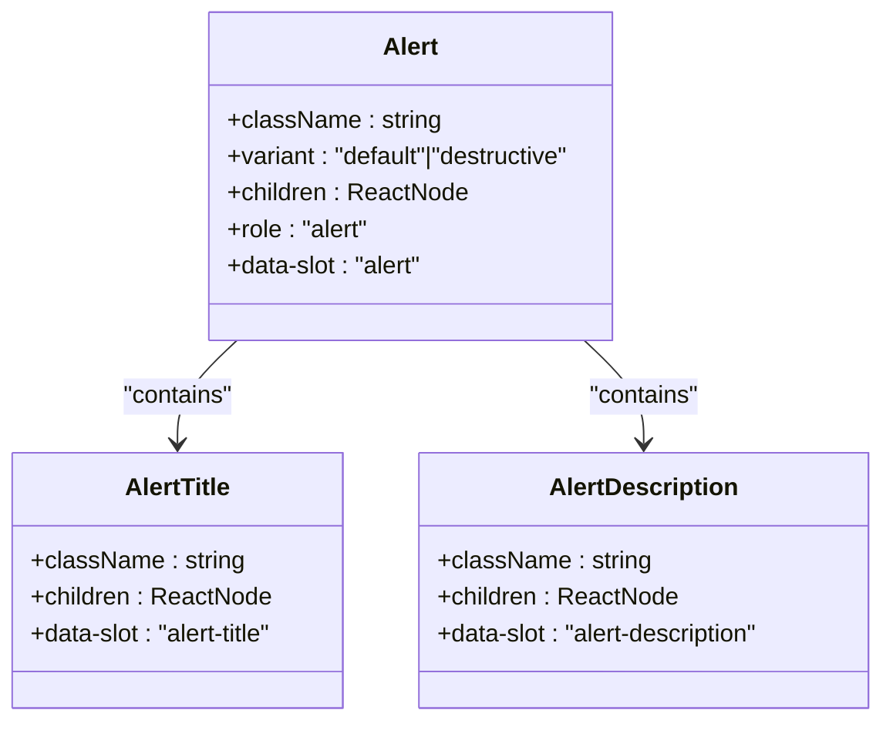
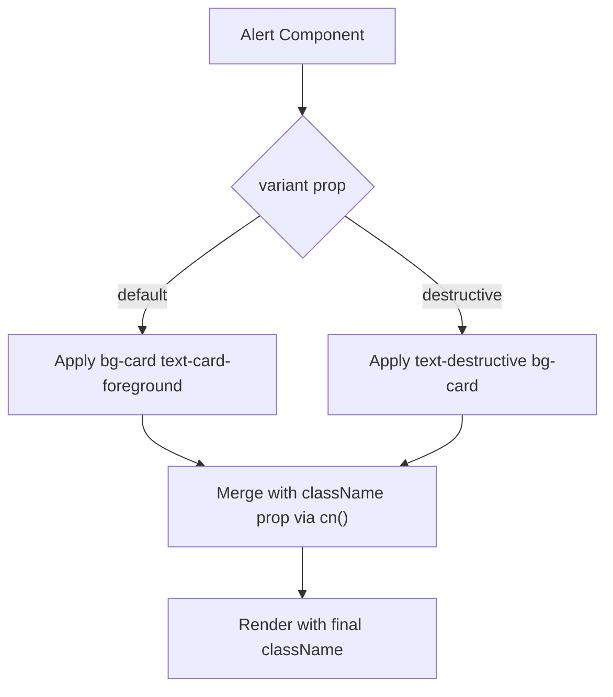
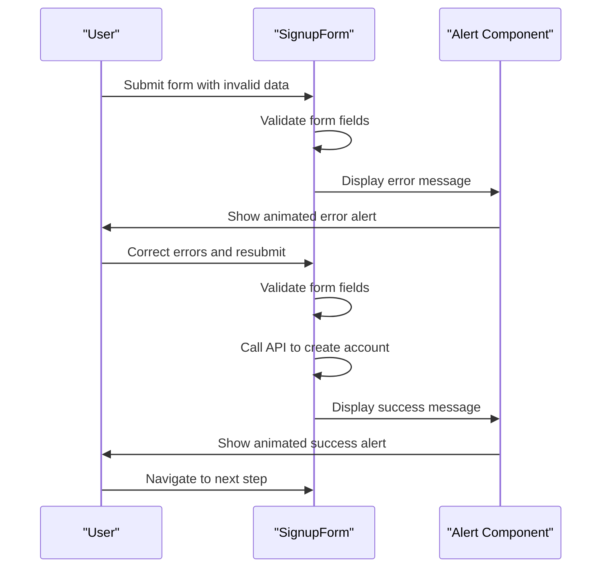

# Alert Component

<cite>
**Referenced Files in This Document**   
- [alert.tsx](file://src/components/ui/alert.tsx)
- [utils.ts](file://src/components/ui/utils.ts)
- [index.css](file://src/index.css)
- [tailwind.config.js](file://tailwind.config.js)
- [SignupForm.tsx](file://src/components/SignupForm.tsx)
</cite>

## Table of Contents
1. [Introduction](#introduction)
2. [Core Components](#core-components)
3. [Variant Support and Styling](#variant-support-and-styling)
4. [Accessibility Implementation](#accessibility-implementation)
5. [Usage Patterns](#usage-patterns)
6. [Integration Examples](#integration-examples)
7. [Positioning Strategies](#positioning-strategies)
8. [Animation and Transitions](#animation-and-transitions)
9. [Form Validation Integration](#form-validation-integration)
10. [Customization and Extensibility](#customization-and-extensibility)

## Introduction
The Alert component is a reusable UI element designed to display important messages with visual prominence across the application. It serves as a critical communication tool for conveying success, error, warning, or informational messages within various contexts such as forms, authentication flows, and booking confirmations. The component follows accessibility best practices and leverages Tailwind CSS for styling with support for multiple variants.

**Section sources**
- [alert.tsx](file://src/components/ui/alert.tsx)

## Core Components
The Alert component consists of three main parts: the container (`Alert`), the title (`AlertTitle`), and the description (`AlertDescription`). These components work together to create a structured and accessible alert message. The container uses semantic markup with `role='alert'` to ensure screen readers properly announce dynamic content. The component supports icon integration through SVG elements that are automatically sized and positioned.

**Diagram sources**
- [alert.tsx](file://src/components/ui/alert.tsx#L44-L65)

**Section sources**
- [alert.tsx](file://src/components/ui/alert.tsx#L1-L65)

## Variant Support and Styling
The Alert component supports two variants: default and destructive. These variants are implemented using the `class-variance-authority` (CVA) library, which enables conditional class application based on props. The styling leverages Tailwind's utility classes combined with CSS variables defined in the theme configuration. The `cn` utility function from `utils.ts` handles className merging, combining the base styles, variant-specific styles, and any custom className passed as a prop.

The default variant uses card background and foreground colors, while the destructive variant applies text and background colors appropriate for error messages. The component uses a grid layout that automatically adjusts to accommodate icons, with specific column sizing and spacing controlled by CSS variables.

**Diagram sources**
- [alert.tsx](file://src/components/ui/alert.tsx#L10-L30)
- [utils.ts](file://src/components/ui/utils.ts#L0-L6)

**Section sources**
- [alert.tsx](file://src/components/ui/alert.tsx#L10-L30)
- [utils.ts](file://src/components/ui/utils.ts#L0-L6)
- [tailwind.config.js](file://tailwind.config.js#L15-L50)
- [index.css](file://src/index.css#L2-L59)

## Accessibility Implementation
The Alert component implements accessibility best practices through semantic HTML and ARIA attributes. The container element uses `role='alert'`, which automatically makes screen readers announce the content as an important message. The component structure follows a logical hierarchy with proper data attributes (`data-slot`) that enhance accessibility and styling capabilities.

The component's design ensures that visual information is also conveyed to assistive technologies. For example, the destructive variant not only changes the visual appearance but also uses appropriate color contrast ratios that meet WCAG guidelines. The component's layout is responsive and maintains readability across different screen sizes and zoom levels.

**Section sources**
- [alert.tsx](file://src/components/ui/alert.tsx#L44-L65)

## Usage Patterns
The Alert component can be used in various patterns including inline messages, toast notifications, and banners. For inline usage within forms, the component can be placed directly below the relevant input field or at the top of the form. Toast notifications typically appear in a fixed position on the screen, often in the top-right corner, and may include a dismiss button for user control.

The component supports icon integration by automatically detecting and styling SVG elements within the alert container. Icons are sized consistently and positioned appropriately based on the presence of other content. The grid layout system ensures proper alignment and spacing regardless of content complexity.

**Section sources**
- [alert.tsx](file://src/components/ui/alert.tsx#L1-L65)

## Integration Examples
The Alert component is integrated throughout the application for various use cases. In the SignupForm component, it is used to display both success and error messages during the account creation process. The success message appears after successful form submission, providing feedback that the account was created and redirecting to the next step. Error messages are displayed when form validation fails or API calls return errors, providing specific feedback about what went wrong.

The component is animated using Framer Motion, with entrance animations that fade in and slide up for improved user experience. This animation provides visual feedback that a new message has appeared without being too distracting.

**Diagram sources**
- [SignupForm.tsx](file://src/components/SignupForm.tsx#L200-L399)

**Section sources**
- [SignupForm.tsx](file://src/components/SignupForm.tsx#L200-L399)

## Positioning Strategies
The Alert component can be positioned in various ways depending on the context. Inline positioning places the alert directly within the content flow, making it ideal for form validation messages. Toast positioning uses fixed positioning to display alerts in a consistent location on the screen, typically the top-right corner, allowing them to appear over other content.

Banner positioning places the alert at the top or bottom of the viewport, spanning the full width of the container. This approach is useful for important system-wide messages that require immediate attention. The positioning is controlled through parent container styling rather than built into the Alert component itself, providing flexibility for different use cases.

**Section sources**
- [SignupForm.tsx](file://src/components/SignupForm.tsx#L200-L399)

## Animation and Transitions
The Alert component supports smooth animations on mount and unmount through integration with Framer Motion. When an alert appears, it fades in and slides up from below, providing a subtle but noticeable transition that draws user attention. When dismissed, the alert fades out and slides up, creating a smooth disappearance.

These animations are implemented in the consuming components rather than within the Alert component itself, allowing for consistent animation patterns across different alert implementations. The animation duration and easing are carefully chosen to provide feedback without causing distraction or delay in the user experience.

**Section sources**
- [SignupForm.tsx](file://src/components/SignupForm.tsx#L200-L399)

## Form Validation Integration
The Alert component is tightly integrated with form validation systems throughout the application. In the SignupForm component, it serves as the primary feedback mechanism for both real-time validation and submission errors. Real-time validation provides immediate feedback as users fill out form fields, while submission errors provide comprehensive feedback after form submission attempts.

The component works in conjunction with client-side validation logic that checks field requirements such as minimum length, format requirements, and confirmation matches. It also handles server-side validation errors returned from API calls, presenting them in a user-friendly format. This dual-layer validation approach provides immediate feedback while ensuring data integrity.

**Section sources**
- [SignupForm.tsx](file://src/components/SignupForm.tsx#L35-L72)

## Customization and Extensibility
The Alert component is designed to be highly customizable while maintaining a consistent design system. The `className` prop allows for additional styling to be applied, which is safely merged with the component's base styles using the `cn` utility. This enables customization of spacing, colors, and other visual properties without breaking the component's core functionality.

The component's structure supports extensibility through its composition pattern. Additional elements can be added within the Alert, AlertTitle, or AlertDescription components as needed. The use of data attributes (`data-slot`) enables targeted styling and behavior modification without requiring changes to the component's API.

**Section sources**
- [alert.tsx](file://src/components/ui/alert.tsx#L1-L65)
- [utils.ts](file://src/components/ui/utils.ts#L0-L6)