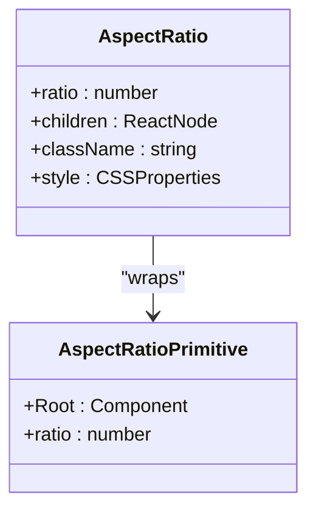
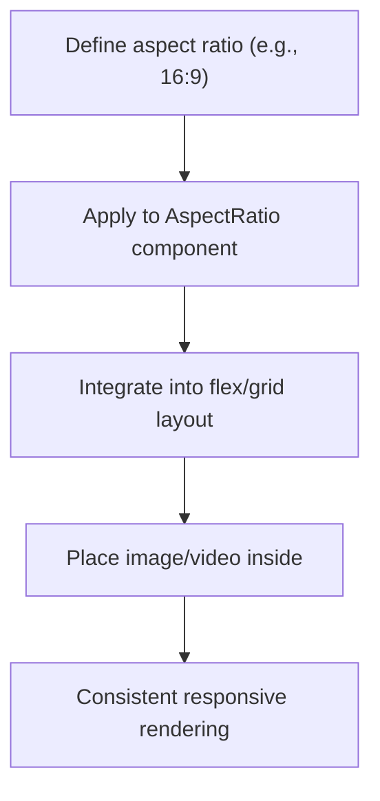
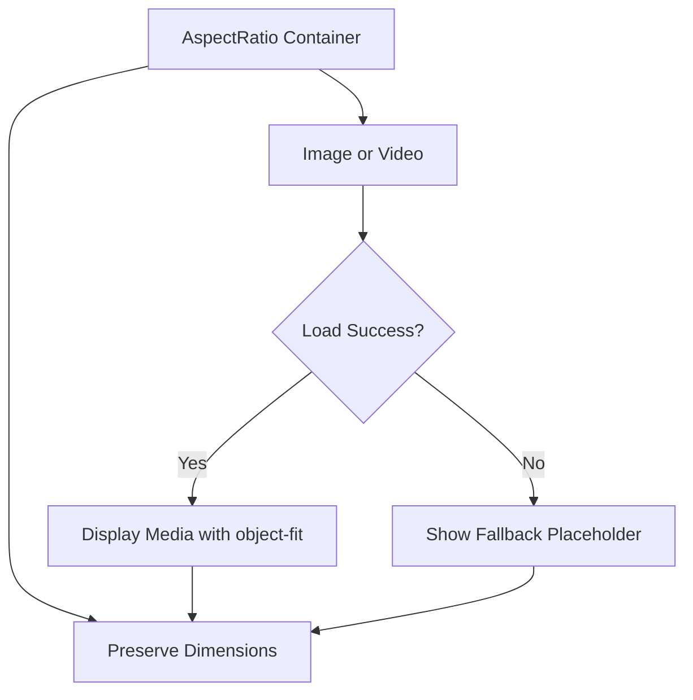

# Aspect Ratio Container

<cite>
**Referenced Files in This Document**   
- [aspect-ratio.tsx](file://src/components/ui/aspect-ratio.tsx)
- [utils.ts](file://src/components/ui/utils.ts)
- [ImageWithFallback.tsx](file://src/components/figma/ImageWithFallback.tsx)
- [package.json](file://package.json)
</cite>

## Table of Contents
1. [Introduction](#introduction)
2. [Core Implementation](#core-implementation)
3. [Common Aspect Ratios and Use Cases](#common-aspect-ratios-and-use-cases)
4. [Integration with Media Loading and Layouts](#integration-with-media-loading-and-layouts)
5. [Browser Compatibility and Performance](#browser-compatibility-and-performance)
6. [Conclusion](#conclusion)

## Introduction
The AspectRatio component is a utility wrapper designed to maintain consistent width-to-height ratios for media elements such as images, videos, and embedded content. It ensures responsive behavior across different viewport sizes by leveraging `@radix-ui/react-aspect-ratio`, a robust and accessible primitive for enforcing aspect ratios in web applications. This document details its implementation, usage patterns, integration strategies, and performance considerations within the context of the SnapEvent-Landing-Page project.

**Section sources**
- [aspect-ratio.tsx](file://src/components/ui/aspect-ratio.tsx#L1-L10)

## Core Implementation
The AspectRatio component is implemented as a thin wrapper around `AspectRatioPrimitive.Root` from `@radix-ui/react-aspect-ratio`. It accepts all standard props supported by the Radix UI primitive, allowing developers to define a specific ratio (e.g., 16/9) that will be preserved regardless of container size. The component uses the `data-slot="aspect-ratio"` attribute for styling consistency and integrates seamlessly with Tailwind CSS via the `cn` utility function for class merging.

The implementation is minimal and focused, delegating all layout logic to the underlying Radix UI primitive, which uses a padding-based technique to enforce the aspect ratio. This approach ensures compatibility with flexbox and CSS grid layouts while maintaining accessibility standards.

**Diagram sources**
- [aspect-ratio.tsx](file://src/components/ui/aspect-ratio.tsx#L4-L7)

**Section sources**
- [aspect-ratio.tsx](file://src/components/ui/aspect-ratio.tsx#L1-L10)
- [utils.ts](file://src/components/ui/utils.ts#L1-L6)

## Common Aspect Ratios and Use Cases
The AspectRatio component is commonly used with standard media ratios such as:
- **16:9** – Ideal for video containers and widescreen media displays
- **4:3** – Suitable for traditional photography and legacy video formats
- **1:1** – Perfect for profile pictures, portfolio thumbnails, and social media previews

In the SnapEvent application, these ratios are applied in contexts like photographer portfolio grids, event preview cards, and video embeds. For example, a 16:9 ratio ensures that promotional videos maintain consistent framing on both desktop and mobile views, while a 1:1 ratio standardizes thumbnail dimensions in responsive grids.

**Section sources**
- [aspect-ratio.tsx](file://src/components/ui/aspect-ratio.tsx#L4-L7)

## Integration with Media Loading and Layouts
The AspectRatio component works effectively with image loading strategies and fallback mechanisms. When paired with the `ImageWithFallback` component, it ensures that even if an image fails to load, the container maintains its intended dimensions, preventing layout shifts. This combination is particularly useful in dynamic content feeds where media assets may be slow to load or unavailable.

In flex and grid layouts, the AspectRatio container respects parent constraints while enforcing its internal ratio. It can be styled with Tailwind classes for spacing, borders, and shadows without interfering with the aspect preservation. Additionally, it supports CSS `object-fit` properties on child media elements, enabling behaviors like `cover` or `contain` for optimal visual presentation.

**Diagram sources**
- [aspect-ratio.tsx](file://src/components/ui/aspect-ratio.tsx#L7)
- [ImageWithFallback.tsx](file://src/components/figma/ImageWithFallback.tsx#L1-L27)

**Section sources**
- [aspect-ratio.tsx](file://src/components/ui/aspect-ratio.tsx#L1-L10)
- [ImageWithFallback.tsx](file://src/components/figma/ImageWithFallback.tsx#L1-L27)

## Browser Compatibility and Performance
The `@radix-ui/react-aspect-ratio` primitive ensures broad browser compatibility by using a well-established CSS technique involving zero-height containers with percentage-based padding. This method is supported across all modern browsers and does not rely on newer CSS features like aspect-ratio (though it can coexist with them).

Performance is optimized through minimal re-renders and efficient DOM structure. Since the component is a simple wrapper, it adds negligible overhead. The use of `React.ComponentProps` ensures type safety and prevents unnecessary prop spreading. Combined with Next.js and React 18's concurrent rendering, the AspectRatio component contributes to smooth layout performance even in complex, media-rich interfaces.

**Section sources**
- [aspect-ratio.tsx](file://src/components/ui/aspect-ratio.tsx#L1-L10)
- [package.json](file://package.json#L10-L15)

## Conclusion
The AspectRatio component provides a reliable, accessible, and performant solution for maintaining consistent media dimensions across responsive layouts. By building on Radix UI's primitives and integrating with Tailwind CSS and fallback strategies, it ensures visual consistency and prevents layout instability. Its simplicity and flexibility make it ideal for use cases ranging from portfolio grids to video containers, supporting the overall design integrity of the SnapEvent-Landing-Page application.