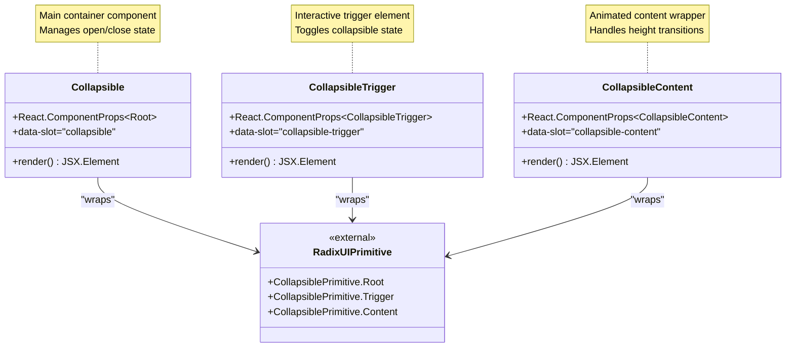
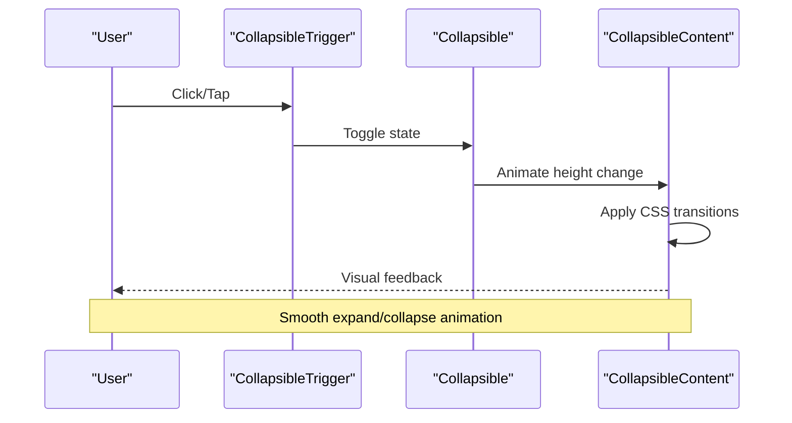
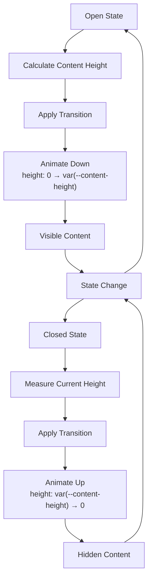
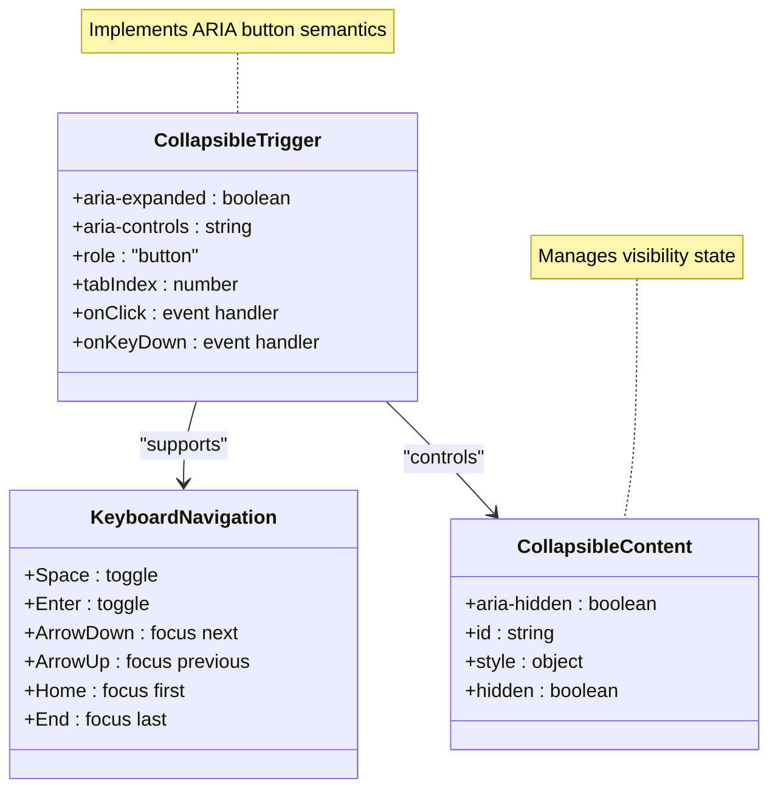

# Collapsible Container Documentation

<cite>
**Referenced Files in This Document**
- [collapsible.tsx](file://src/components/ui/collapsible.tsx)
- [accordion.tsx](file://src/components/ui/accordion.tsx)
- [utils.ts](file://src/components/ui/utils.ts)
- [tailwind.config.js](file://tailwind.config.js)
- [index.css](file://src/index.css)
- [package.json](file://package.json)
</cite>

## Table of Contents
1. [Introduction](#introduction)
2. [Component Architecture](#component-architecture)
3. [Core Implementation](#core-implementation)
4. [Integration Patterns](#integration-patterns)
5. [Animation System](#animation-system)
6. [Accessibility Features](#accessibility-features)
7. [Performance Considerations](#performance-considerations)
8. [Usage Examples](#usage-examples)
9. [Best Practices](#best-practices)
10. [Troubleshooting](#troubleshooting)

## Introduction

The Collapsible component is a fundamental UI element that enables expandable/collapsible content sections in modern web applications. Built on top of Radix UI's `CollapsiblePrimitive.Root`, this component provides smooth animations and seamless integration with various trigger mechanisms while maintaining excellent accessibility standards.

This component serves as the foundation for complex interactive patterns such as accordions, settings panels, mobile navigation menus, and dynamic content revealers. Its implementation emphasizes performance, accessibility, and developer experience through thoughtful abstraction and integration with Tailwind CSS animation utilities.

## Component Architecture

The Collapsible system consists of three primary components that work together to create a cohesive expandable interface:



**Diagram sources**
- [collapsible.tsx](file://src/components/ui/collapsible.tsx#L1-L34)

**Section sources**
- [collapsible.tsx](file://src/components/ui/collapsible.tsx#L1-L34)

## Core Implementation

The Collapsible component is implemented as a thin wrapper around Radix UI's primitives, providing consistent styling and accessibility attributes while maintaining full customization capabilities.

### Component Structure

Each component follows a consistent pattern of wrapping the Radix UI primitive with additional attributes for identification and styling:

```typescript
// Core Collapsible component
function Collapsible({ ...props }: React.ComponentProps<typeof CollapsiblePrimitive.Root>) {
  return <CollapsiblePrimitive.Root data-slot="collapsible" {...props} />;
}

// Trigger component for user interaction
function CollapsibleTrigger({ ...props }: React.ComponentProps<typeof CollapsiblePrimitive.CollapsibleTrigger>) {
  return (
    <CollapsiblePrimitive.CollapsibleTrigger
      data-slot="collapsible-trigger"
      {...props}
    />
  );
}

// Content wrapper with animation support
function CollapsibleContent({ ...props }: React.ComponentProps<typeof CollapsiblePrimitive.CollapsibleContent>) {
  return (
    <CollapsiblePrimitive.CollapsibleContent
      data-slot="collapsible-content"
      {...props}
    />
  );
}
```

### Key Implementation Features

1. **Type Safety**: Full TypeScript integration with Radix UI's type definitions
2. **Data Attributes**: Consistent `data-slot` attributes for testing and styling
3. **Prop Spread**: Flexible prop forwarding for complete customization
4. **Client-Side Rendering**: Explicit `"use client"` directive for Next.js compatibility

**Section sources**
- [collapsible.tsx](file://src/components/ui/collapsible.tsx#L1-L34)

## Integration Patterns

The Collapsible component excels in various integration scenarios, particularly when combined with other UI elements to create sophisticated interactive experiences.

### Basic Integration Example



**Diagram sources**
- [collapsible.tsx](file://src/components/ui/collapsible.tsx#L1-L34)

### Common Integration Scenarios

#### 1. Button Triggers
```typescript
<Collapsible>
  <CollapsibleTrigger asChild>
    <Button variant="outline">
      <ChevronDownIcon className="transition-transform duration-200" />
      Toggle Details
    </Button>
  </CollapsibleTrigger>
  <CollapsibleContent>
    <div className="p-4">Hidden content goes here...</div>
  </CollapsibleContent>
</Collapsible>
```

#### 2. Icon-Based Triggers
```typescript
<Collapsible>
  <CollapsibleTrigger className="flex items-center gap-2 p-2 hover:bg-gray-100 rounded">
    <ChevronDownIcon className="transition-transform duration-200" />
    <span>Expand Section</span>
  </CollapsibleTrigger>
  <CollapsibleContent>
    {/* Content here */}
  </CollapsibleContent>
</Collapsible>
```

#### 3. Card Integration
```typescript
<Card>
  <Collapsible>
    <CardHeader>
      <CollapsibleTrigger className="w-full flex justify-between items-center">
        <CardTitle>Settings Panel</CardTitle>
        <ChevronDownIcon className="transition-transform duration-200" />
      </CollapsibleTrigger>
    </CardHeader>
    <CollapsibleContent>
      <CardContent>
        {/* Settings content */}
      </CardContent>
    </CollapsibleContent>
  </Collapsible>
</Card>
```

**Section sources**
- [accordion.tsx](file://src/components/ui/accordion.tsx#L30-L65)

## Animation System

The Collapsible component leverages Tailwind CSS's animation utilities and Radix UI's state-aware attributes to create smooth, performant transitions.

### Animation Architecture



**Diagram sources**
- [tailwind.config.js](file://tailwind.config.js#L45-L55)

### CSS Animation Implementation

The animation system is built on Tailwind's keyframe definitions:

```javascript
// Tailwind configuration for accordion animations
keyframes: {
  "accordion-down": {
    from: { height: "0" },
    to: { height: "var(--radix-accordion-content-height)" },
  },
  "accordion-up": {
    from: { height: "var(--radix-accordion-content-height)" },
    to: { height: "0" },
  },
},
animation: {
  "accordion-down": "accordion-down 0.2s ease-out",
  "accordion-up": "accordion-up 0.2s ease-out",
}
```

### Performance Optimizations

1. **CSS Variables**: Uses `--radix-accordion-content-height` for dynamic sizing
2. **Hardware Acceleration**: Leverages GPU-accelerated transforms
3. **Efficient Transitions**: 0.2s duration for optimal user experience
4. **Overflow Management**: `overflow-hidden` prevents layout shifts

**Section sources**
- [tailwind.config.js](file://tailwind.config.js#L45-L55)

## Accessibility Features

The Collapsible component implements comprehensive accessibility features through Radix UI's built-in ARIA attributes and keyboard navigation support.

### ARIA Implementation



### Accessibility Attributes

1. **aria-expanded**: Indicates whether the content is currently visible
2. **aria-controls**: Links the trigger to its controlled content
3. **Keyboard Support**: Full keyboard navigation compatibility
4. **Focus Management**: Automatic focus restoration and management
5. **Screen Reader Support**: Proper announcement of state changes

### Keyboard Interaction Support

- **Space/Enter**: Toggle collapsible state
- **Tab Navigation**: Seamless integration with tab order
- **Arrow Keys**: Navigate between interactive elements
- **Escape**: Close expanded content (when applicable)

**Section sources**
- [collapsible.tsx](file://src/components/ui/collapsible.tsx#L1-L34)

## Performance Considerations

The Collapsible component is designed with performance in mind, implementing several strategies to ensure smooth user interactions and efficient resource utilization.

### Rendering Optimization

1. **Conditional Rendering**: Content is only rendered when visible
2. **CSS Transitions**: Hardware-accelerated animations
3. **Minimal Re-renders**: Efficient state management
4. **Memory Efficiency**: Proper cleanup of event listeners

### SEO Implications

When using collapsible content, consider the following SEO implications:

1. **Content Visibility**: Hidden content may not be indexed by search engines
2. **Alternative Solutions**: Consider using `details`/`summary` for SEO-friendly collapsibles
3. **Progressive Enhancement**: Ensure functionality works without JavaScript
4. **Structured Data**: Use appropriate schema markup for collapsible FAQ sections

### Best Practices for Performance

```typescript
// Efficient implementation example
<Collapsible>
  <CollapsibleTrigger>
    <Button variant="ghost">
      <ChevronDownIcon className="transition-transform duration-200" />
      Expand Content
    </Button>
  </CollapsibleTrigger>
  <CollapsibleContent>
    {/* Lazy load heavy content */}
    <Suspense fallback={<LoadingSpinner />}>
      <HeavyContent />
    </Suspense>
  </CollapsibleContent>
</Collapsible>
```

## Usage Examples

### Basic Collapsible Panel

```typescript
import { Collapsible, CollapsibleTrigger, CollapsibleContent } from '@/components/ui/collapsible'

export default function BasicCollapsible() {
  return (
    <Collapsible>
      <CollapsibleTrigger className="w-full p-4 bg-gray-100 rounded-lg hover:bg-gray-200">
        <div className="flex justify-between items-center">
          <span>Click to expand</span>
          <ChevronDownIcon className="transition-transform duration-200" />
        </div>
      </CollapsibleTrigger>
      <CollapsibleContent className="mt-2 p-4 bg-white rounded-lg shadow">
        <p>This content appears when expanded.</p>
      </CollapsibleContent>
    </Collapsible>
  )
}
```

### Accordion Integration

```typescript
import { 
  Collapsible, 
  CollapsibleTrigger, 
  CollapsibleContent 
} from '@/components/ui/collapsible'

interface FAQItemProps {
  question: string;
  answer: string;
}

export function FAQItem({ question, answer }: FAQItemProps) {
  return (
    <Collapsible className="border-b last:border-b-0">
      <CollapsibleTrigger className="w-full p-4 flex justify-between items-center hover:bg-gray-50">
        <span>{question}</span>
        <ChevronDownIcon className="transition-transform duration-200" />
      </CollapsibleTrigger>
      <CollapsibleContent className="p-4">
        <p className="text-gray-600">{answer}</p>
      </CollapsibleContent>
    </Collapsible>
  )
}
```

### Settings Panel

```typescript
export function SettingsPanel() {
  const [settings, setSettings] = useState({
    notifications: true,
    darkMode: false,
    autoSave: true
  })

  return (
    <Collapsible>
      <CollapsibleTrigger className="w-full p-4 flex justify-between items-center">
        <div className="flex items-center gap-2">
          <SettingsIcon />
          <span>Advanced Settings</span>
        </div>
        <ChevronDownIcon className="transition-transform duration-200" />
      </CollapsibleTrigger>
      <CollapsibleContent className="p-4 space-y-4">
        <div className="flex items-center justify-between">
          <label>Enable Notifications</label>
          <Switch 
            checked={settings.notifications} 
            onCheckedChange={(checked) => 
              setSettings(prev => ({ ...prev, notifications: checked }))
            }
          />
        </div>
        {/* Additional settings */}
      </CollapsibleContent>
    </Collapsible>
  )
}
```

## Best Practices

### Component Design Guidelines

1. **Consistent Styling**: Use consistent spacing and typography
2. **Visual Feedback**: Provide clear indication of expandable areas
3. **State Management**: Use controlled/uncontrolled patterns appropriately
4. **Accessibility First**: Always prioritize accessibility features
5. **Performance Focus**: Optimize for smooth animations and interactions

### Integration Recommendations

1. **Combine with Icons**: Use rotation indicators for visual feedback
2. **Group Related Content**: Place related items in collapsible sections
3. **Mobile Optimization**: Test touch interactions on mobile devices
4. **Keyboard Navigation**: Ensure full keyboard accessibility
5. **Responsive Design**: Adapt to different screen sizes

### Testing Strategies

```typescript
// Testing example with React Testing Library
describe('Collapsible Component', () => {
  it('should toggle visibility when trigger is clicked', async () => {
    render(<BasicCollapsible />)
    
    const trigger = screen.getByText('Click to expand')
    const content = screen.queryByText('This content appears when expanded')
    
    expect(content).not.toBeInTheDocument()
    
    fireEvent.click(trigger)
    
    await waitFor(() => {
      expect(screen.getByText('This content appears when expanded')).toBeInTheDocument()
    })
  })
})
```

## Troubleshooting

### Common Issues and Solutions

#### Issue: Content Not Animating
**Cause**: Missing Tailwind CSS animation classes or incorrect CSS variables
**Solution**: Ensure `data-[state=open]:animate-accordion-down` and `data-[state=closed]:animate-accordion-up` classes are present

#### Issue: Layout Shifts During Animation
**Cause**: Incorrect height calculation or missing overflow handling
**Solution**: Add `overflow-hidden` to the content wrapper and ensure proper CSS variable definitions

#### Issue: Keyboard Navigation Not Working
**Cause**: Missing ARIA attributes or improper event handling
**Solution**: Verify `aria-expanded` and `aria-controls` attributes are correctly set

#### Issue: Performance Problems
**Cause**: Heavy content rendering during animation
**Solution**: Implement lazy loading or virtualization for large content blocks

### Debugging Tips

1. **Inspect Data Attributes**: Check `data-slot` attributes for proper component identification
2. **Verify ARIA States**: Use browser developer tools to inspect ARIA attributes
3. **Test Animations**: Disable animations temporarily to isolate issues
4. **Check CSS Variables**: Ensure `--radix-accordion-content-height` is properly calculated

**Section sources**
- [collapsible.tsx](file://src/components/ui/collapsible.tsx#L1-L34)
- [accordion.tsx](file://src/components/ui/accordion.tsx#L1-L67)