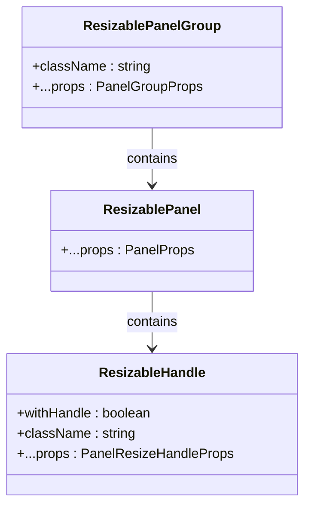
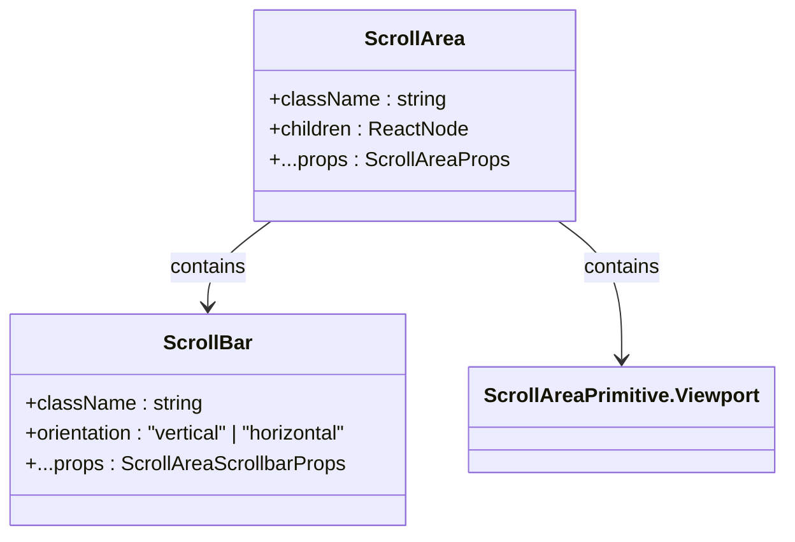
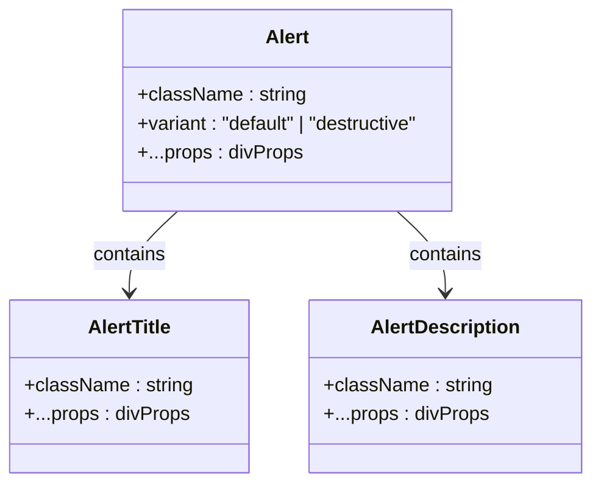
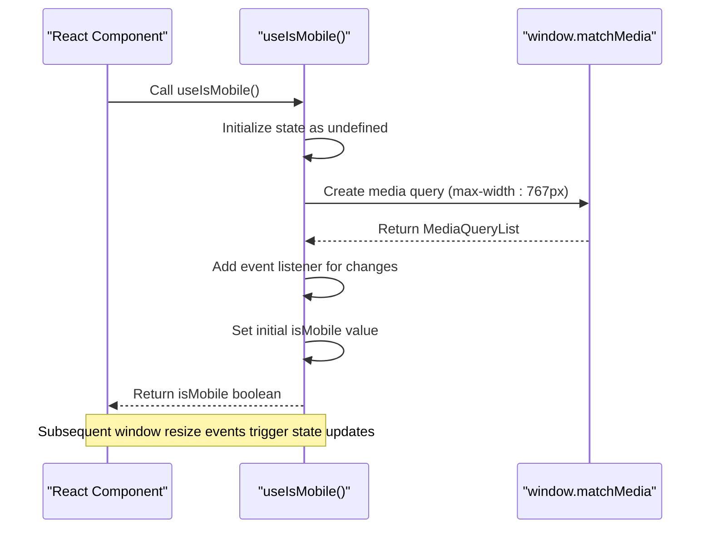
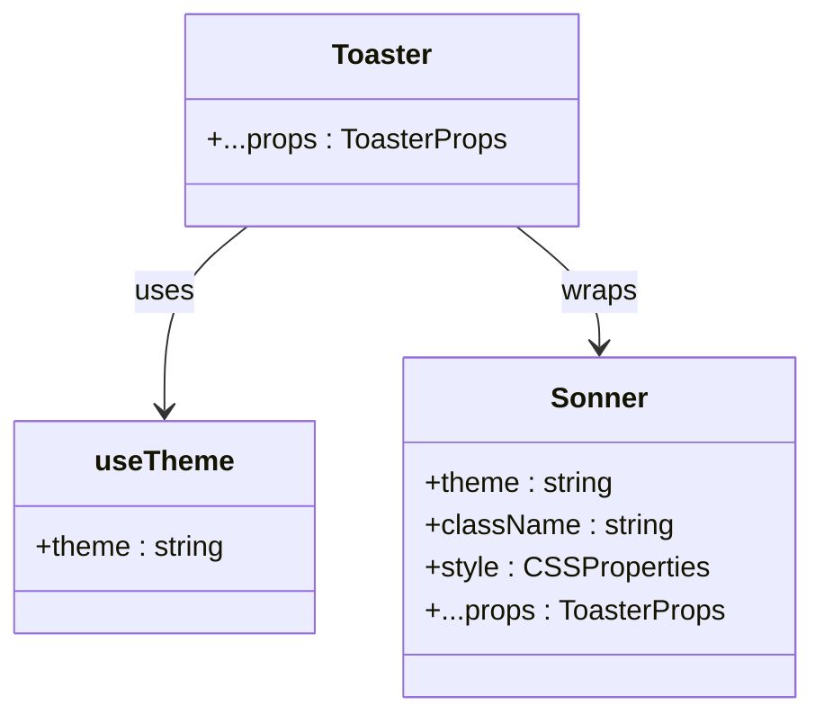

# Layout and Utility Components

<cite>
**Referenced Files in This Document**   
- [resizable.tsx](file://src/components/ui/resizable.tsx)
- [scroll-area.tsx](file://src/components/ui/scroll-area.tsx)
- [aspect-ratio.tsx](file://src/components/ui/aspect-ratio.tsx)
- [separator.tsx](file://src/components/ui/separator.tsx)
- [collapsible.tsx](file://src/components/ui/collapsible.tsx)
- [alert.tsx](file://src/components/ui/alert.tsx)
- [sonner.tsx](file://src/components/ui/sonner.tsx)
- [utils.ts](file://src/components/ui/utils.ts)
- [use-mobile.ts](file://src/components/ui/use-mobile.ts)
- [LandingPage.tsx](file://src/components/LandingPage.tsx)
</cite>

## Table of Contents
1. [Introduction](#introduction)
2. [Core Layout Components](#core-layout-components)
3. [Utility Components](#utility-components)
4. [Responsive Design Implementation](#responsive-design-implementation)
5. [Toast Notification System](#toast-notification-system)
6. [Performance Considerations](#performance-considerations)
7. [Component Extension Guidelines](#component-extension-guidelines)
8. [Conclusion](#conclusion)

## Introduction
This document provides comprehensive documentation for the layout and utility components used in the SnapEvent landing page application. The components enable the creation of responsive, accessible user interfaces across various device sizes. The documentation covers the implementation of key layout components like resizable panels and scroll areas, utility functions for styling and responsiveness, and specialized components for notifications and mobile detection. The components are designed to work together seamlessly, providing a consistent user experience while maintaining high performance and accessibility standards.

## Core Layout Components

### Resizable Component
The Resizable component provides a flexible panel system that allows users to dynamically adjust the size of UI sections. Built on top of react-resizable-panels, it consists of three main parts: ResizablePanelGroup, ResizablePanel, and ResizableHandle. The component supports both horizontal and vertical orientations through data attributes that modify the flex direction. The ResizableHandle includes an optional grip icon (GripVerticalIcon) that provides visual feedback for resize functionality. This component is particularly useful for creating dashboard layouts or split views where users need to customize the space allocation between different content areas.

**Diagram sources**
- [resizable.tsx](file://src/components/ui/resizable.tsx#L10-L55)

**Section sources**
- [resizable.tsx](file://src/components/ui/resizable.tsx#L1-L57)

### Scroll Area Component
The ScrollArea component implements a customizable scrollable container using @radix-ui/react-scroll-area. It provides a clean, styled scrollbar that replaces the browser's default scrollbar for a more consistent cross-browser experience. The component consists of a ScrollArea root element, a Viewport for the scrollable content, and a ScrollBar with a ScrollAreaThumb for user interaction. The scrollbar automatically adjusts its orientation (vertical or horizontal) based on the specified orientation prop. The component includes proper focus management and accessibility attributes, making it suitable for use in accessible applications.

**Diagram sources**
- [scroll-area.tsx](file://src/components/ui/scroll-area.tsx#L10-L58)

**Section sources**
- [scroll-area.tsx](file://src/components/ui/scroll-area.tsx#L1-L59)

### Aspect Ratio Component
The AspectRatio component maintains a specific width-to-height ratio for its content using @radix-ui/react-aspect-ratio. This is particularly useful for ensuring images, videos, or other media elements maintain their intended proportions across different screen sizes and container dimensions. The component acts as a wrapper that constrains its children to the specified aspect ratio, preventing layout shifts when content loads. It's commonly used in gallery layouts, video players, and responsive card components where consistent proportions are essential for visual harmony.

**Section sources**
- [aspect-ratio.tsx](file://src/components/ui/aspect-ratio.tsx#L1-L11)

### Separator Component
The Separator component creates a visual divider between content sections using @radix-ui/react-separator. It supports both horizontal and vertical orientations and automatically adjusts its dimensions accordingly (1px height for horizontal, 1px width for vertical). The component includes accessibility features like the decorative prop, which indicates whether the separator is purely visual or conveys meaningful content separation. This component is commonly used in navigation menus, form sections, and list items to create clear visual hierarchy and improve content organization.

**Section sources**
- [separator.tsx](file://src/components/ui/separator.tsx#L1-L28)

### Collapsible Component
The Collapsible component implements an expandable/collapsible content area using @radix-ui/react-collapsible. It consists of three parts: Collapsible (the root component), CollapsibleTrigger (the toggle button), and CollapsibleContent (the expandable content). The component manages the open/closed state internally and provides smooth transitions between states. This is particularly useful for creating accordions, dropdown menus, or any interface element where content needs to be hidden and revealed based on user interaction, helping to reduce visual clutter and improve information hierarchy.

**Section sources**
- [collapsible.tsx](file://src/components/ui/collapsible.tsx#L1-L33)

## Utility Components

### Alert Component
The Alert component provides a styled notification container with support for different variants (default and destructive). It uses class-variance-authority (cva) to manage conditional styling based on the variant prop. The component includes dedicated slots for AlertTitle and AlertDescription, creating a structured content hierarchy. The destructive variant is styled with colors that indicate errors or warnings, while the default variant is suitable for general information. The component's grid layout automatically adjusts to accommodate optional icons, making it flexible for various use cases including form validation messages, system notifications, and status updates.

**Diagram sources**
- [alert.tsx](file://src/components/ui/alert.tsx#L30-L66)

**Section sources**
- [alert.tsx](file://src/components/ui/alert.tsx#L1-L67)

### Utility Functions
The utils.ts file exports a cn function that combines clsx and tailwind-merge to provide a robust utility for conditional class name composition. This function resolves Tailwind CSS class conflicts by ensuring that classes appearing later in the input take precedence over conflicting classes that appear earlier. This is particularly important in component libraries where multiple sources might contribute conflicting styles. The cn function is used throughout the component library to combine base styles, variant styles, and user-provided className props in a predictable and reliable manner.

**Section sources**
- [utils.ts](file://src/components/ui/utils.ts#L1-L6)

## Responsive Design Implementation

### Mobile Detection Hook
The use-mobile.ts file implements a custom hook useIsMobile that detects whether the current device is a mobile device based on screen width. The hook uses window.matchMedia to create a media query for screens narrower than 768px (the MOBILE_BREAKPOINT constant). It returns a boolean value indicating whether the current viewport is considered mobile. The hook properly handles server-side rendering by initializing with undefined and updating the value during the useEffect lifecycle. This approach ensures consistent behavior across server and client rendering while minimizing layout shifts.

**Diagram sources**
- [use-mobile.ts](file://src/components/ui/use-mobile.ts#L1-L21)

**Section sources**
- [use-mobile.ts](file://src/components/ui/use-mobile.ts#L1-L21)

### Responsive Breakpoints
The mobile detection hook implements a standard mobile breakpoint at 768px, which aligns with common responsive design practices. This breakpoint distinguishes between mobile devices (typically smartphones) and larger devices (tablets and desktops). The hook's implementation uses the window.innerWidth property to determine the current device type, providing a reliable method for components to adapt their behavior based on screen size. This approach enables mobile-first design patterns where components can start with mobile-optimized layouts and enhance the experience for larger screens.

## Toast Notification System

### Sonner Integration
The sonner.tsx component wraps the Sonner toast notification library with theme-aware styling. It integrates with Next.js themes through the useTheme hook, automatically adapting to the current theme (light, dark, or system). The component applies custom CSS variables to style the toast notifications, ensuring they match the application's visual design system. The --normal-bg, --normal-text, and --normal-border variables are mapped to the application's design tokens (popover, popover-foreground, and border), creating a cohesive look and feel. This implementation provides a consistent notification experience across different themes while maintaining accessibility and usability.

**Diagram sources**
- [sonner.tsx](file://src/components/ui/sonner.tsx#L1-L25)

**Section sources**
- [sonner.tsx](file://src/components/ui/sonner.tsx#L1-L25)

## Performance Considerations

### Scroll Optimization
The ScrollArea component implements several performance optimizations to ensure smooth scrolling experiences. By using @radix-ui/react-scroll-area, it leverages optimized scroll handling that minimizes re-renders and layout thrashing. The component's CSS includes transition properties for color and box-shadow changes, enabling hardware-accelerated animations. The focus-visible ring is implemented with a transparent border that expands on focus, reducing the need for layout recalculations. These optimizations ensure that scroll interactions remain responsive even with complex content, providing a fluid user experience across devices.

### Dynamic Resizing Performance
The Resizable component is designed with performance in mind, using efficient event handling for resize operations. The underlying react-resizable-panels library implements throttling and debouncing for resize events to prevent excessive re-renders during drag operations. The component's CSS uses flexbox with data attributes to control layout direction, avoiding expensive JavaScript-based layout calculations. The optional grip handle is rendered conditionally, reducing the DOM complexity when not needed. These optimizations ensure that resize interactions remain smooth and responsive, even on lower-powered devices.

## Component Extension Guidelines

### Extending Utility Functions
To extend the utility functions for custom component development, developers should leverage the existing cn function for class name composition. When creating new components, import the cn function and use it to combine base styles, variant styles, and user-provided className props. For new styling requirements, consider extending the cva pattern used in components like Alert, which provides a clean way to manage variant-based styling. When adding new utility functions, place them in the utils.ts file or create a new utilities file in the same directory, maintaining consistency with the existing codebase structure.

### Creating Custom Layout Components
When developing custom layout components, follow the patterns established by the existing components. Use Radix UI primitives as the foundation for accessible, well-behaved components. Implement clear separation between the component's logic and presentation, with the main component handling state and the visual elements handling rendering. Use data-slot attributes to provide styling hooks without exposing implementation details. For responsive behavior, leverage the useIsMobile hook rather than implementing duplicate media query logic. This ensures consistency across the application and reduces the maintenance burden.

## Conclusion
The layout and utility components in the SnapEvent application provide a robust foundation for building responsive, accessible user interfaces. The components are designed with performance, accessibility, and developer experience in mind, leveraging established libraries like Radix UI and Sonner while providing a consistent API and styling system. The mobile-first approach, enabled by the useIsMobile hook, ensures that the application provides an optimal experience across all device sizes. The toast notification system offers a reliable way to communicate with users, while the layout components provide the flexibility needed for complex UI requirements. By following the extension guidelines, developers can create new components that integrate seamlessly with the existing system, maintaining consistency and quality throughout the application.