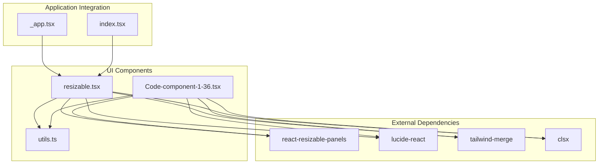
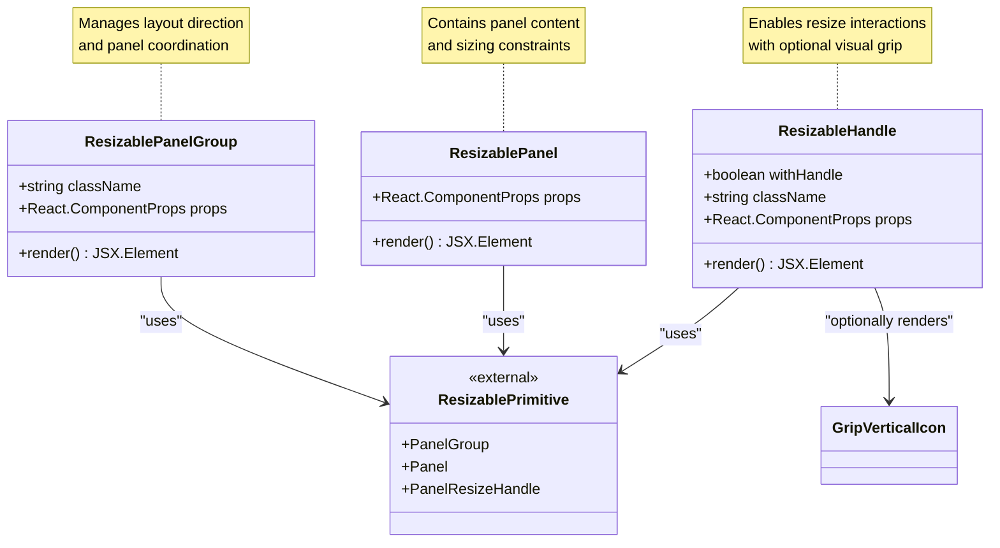
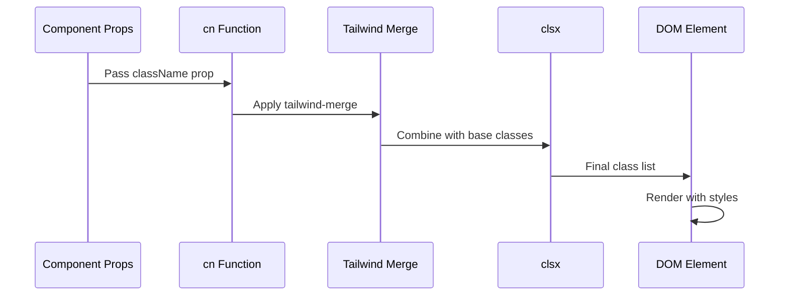
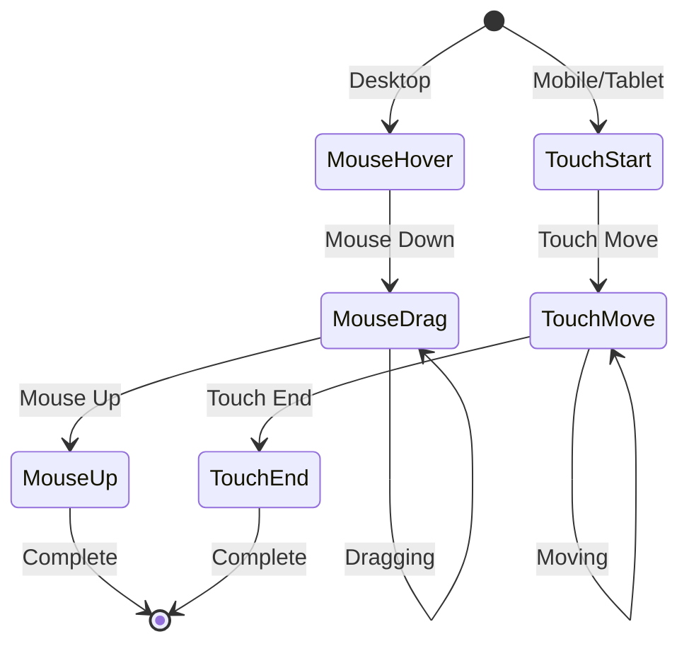

# Resizable Layout Components

<cite>
**Referenced Files in This Document**
- [resizable.tsx](file://src/components/ui/resizable.tsx)
- [Code-component-1-36.tsx](file://src/components/ui/Code-component-1-36.tsx)
- [utils.ts](file://src/components/ui/utils.ts)
- [package.json](file://package.json)
- [index.css](file://src/index.css)
</cite>

## Table of Contents
1. [Introduction](#introduction)
2. [Project Structure](#project-structure)
3. [Core Components](#core-components)
4. [Architecture Overview](#architecture-overview)
5. [Detailed Component Analysis](#detailed-component-analysis)
6. [Implementation Details](#implementation-details)
7. [Usage Examples](#usage-examples)
8. [Accessibility and Performance](#accessibility-and-performance)
9. [Styling and Customization](#styling-and-customization)
10. [Troubleshooting Guide](#troubleshooting-guide)
11. [Conclusion](#conclusion)

## Introduction

The Resizable Layout Components provide a flexible foundation for creating draggable layouts with adjustable panel dimensions in React applications. These components are built on top of the `react-resizable-panels` library and offer enhanced functionality with Tailwind CSS styling, accessibility features, and customizable resize handles.

The implementation consists of three primary components:
- **ResizablePanelGroup**: The container that manages multiple panels and their arrangement
- **ResizablePanel**: Individual panels that can be resized within the group
- **ResizableHandle**: Interactive handles that enable drag-to-resize functionality

These components are designed to work seamlessly with modern web applications requiring dynamic layout adjustments, particularly in dashboard interfaces, split-view editors, and responsive design systems.

## Project Structure

The resizable components are organized within the UI component system of the SnapEvent Landing Page project:



**Diagram sources**
- [resizable.tsx](file://src/components/ui/resizable.tsx#L1-L57)
- [package.json](file://package.json#L5-L40)

**Section sources**
- [resizable.tsx](file://src/components/ui/resizable.tsx#L1-L57)
- [Code-component-1-36.tsx](file://src/components/ui/Code-component-1-36.tsx#L1-L57)

## Core Components

The resizable system consists of three fundamental components that work together to create flexible, draggable layouts:

### ResizablePanelGroup
The container component that orchestrates the layout of multiple panels. It manages the overall direction (horizontal or vertical) and coordinates resize operations across all child panels.

### ResizablePanel
Individual panel containers that can be resized within the group. Each panel maintains its own content and sizing constraints while participating in the overall layout system.

### ResizableHandle
Interactive resize handles that enable users to adjust panel dimensions through drag-and-drop interactions. These handles can optionally display visual indicators for improved user experience.

**Section sources**
- [resizable.tsx](file://src/components/ui/resizable.tsx#L8-L30)
- [Code-component-1-36.tsx](file://src/components/ui/Code-component-1-36.tsx#L8-L30)

## Architecture Overview

The resizable components follow a hierarchical architecture pattern where the PanelGroup serves as the root container, managing multiple Panels and their ResizeHandles:



**Diagram sources**
- [resizable.tsx](file://src/components/ui/resizable.tsx#L8-L55)
- [utils.ts](file://src/components/ui/utils.ts#L1-L7)

## Detailed Component Analysis

### ResizablePanelGroup Implementation

The ResizablePanelGroup component serves as the primary container for organizing panels in either horizontal or vertical arrangements:

```typescript
function ResizablePanelGroup({
  className,
  ...props
}: React.ComponentProps<typeof ResizablePrimitive.PanelGroup>) {
  return (
    <ResizablePrimitive.PanelGroup
      data-slot="resizable-panel-group"
      className={cn(
        "flex h-full w-full data-[panel-group-direction=vertical]:flex-col",
        className,
      )}
      {...props}
    />
  );
}
```

Key features:
- **Directional Control**: Uses the `data-[panel-group-direction]` attribute to switch between horizontal (`flex`) and vertical (`flex-col`) layouts
- **Full-Screen Sizing**: Sets explicit height and width to ensure proper rendering
- **Custom Class Integration**: Extends the base styling with Tailwind CSS utilities

### ResizablePanel Implementation

The ResizablePanel component provides individual panel containers with minimal customization:

```typescript
function ResizablePanel({
  ...props
}: React.ComponentProps<typeof ResizablePrimitive.Panel>) {
  return <ResizablePrimitive.Panel data-slot="resizable-panel" {...props} />;
}
```

Features:
- **Content Container**: Acts as a wrapper for panel content
- **Flexible Sizing**: Inherits sizing behavior from the parent PanelGroup
- **Slot Attribute**: Uses `data-slot="resizable-panel"` for DOM inspection and testing

### ResizableHandle Implementation

The ResizableHandle component combines functionality with visual feedback:

```typescript
function ResizableHandle({
  withHandle,
  className,
  ...props
}: React.ComponentProps<typeof ResizablePrimitive.PanelResizeHandle> & {
  withHandle?: boolean;
}) {
  return (
    <ResizablePrimitive.PanelResizeHandle
      data-slot="resizable-handle"
      className={cn(
        "bg-border focus-visible:ring-ring relative flex w-px items-center justify-center after:absolute after:inset-y-0 after:left-1/2 after:w-1 after:-translate-x-1/2 focus-visible:ring-1 focus-visible:ring-offset-1 focus-visible:outline-hidden data-[panel-group-direction=vertical]:h-px data-[panel-group-direction=vertical]:w-full data-[panel-group-direction=vertical]:after:left-0 data-[panel-group-direction=vertical]:after:h-1 data-[panel-group-direction=vertical]:after:w-full data-[panel-group-direction=vertical]:after:-translate-y-1/2 data-[panel-group-direction=vertical]:after:translate-x-0 [&[data-panel-group-direction=vertical]>div]:rotate-90",
        className,
      )}
      {...props}
    >
      {withHandle && (
        <div className="bg-border z-10 flex h-4 w-3 items-center justify-center rounded-xs border">
          <GripVerticalIcon className="size-2.5" />
        </div>
      )}
    </ResizablePrimitive.PanelResizeHandle>
  );
}
```

Advanced Features:
- **Conditional Rendering**: The `withHandle` prop controls whether visual grip indicators are displayed
- **Responsive Styling**: Automatically adjusts dimensions based on the parent group's direction
- **Focus Management**: Implements proper keyboard navigation with ring effects
- **Visual Grip**: Integrates Lucide React's GripVerticalIcon for enhanced user experience

**Section sources**
- [resizable.tsx](file://src/components/ui/resizable.tsx#L8-L55)
- [Code-component-1-36.tsx](file://src/components/ui/Code-component-1-36.tsx#L8-L55)

## Implementation Details

### Data Attributes and Directional Control

The components utilize sophisticated data attributes for runtime behavior modification:

```mermaid
flowchart TD
A[PanelGroup Direction] --> B{Direction Value?}
B --> |horizontal| C[Horizontal Layout<br/>data-[panel-group-direction=horizontal]]
B --> |vertical| D[Vertical Layout<br/>data-[panel-group-direction=vertical]]
C --> E[Panels arranged left-to-right]
D --> F[Panels arranged top-to-bottom]
E --> G[Handles positioned vertically]
F --> H[Handles positioned horizontally]
G --> I[Resize operations affect width]
H --> J[Resize operations affect height]
```

**Diagram sources**
- [resizable.tsx](file://src/components/ui/resizable.tsx#L12-L16)

### Styling Architecture

The components leverage a sophisticated styling system combining Tailwind CSS utilities with custom class composition:



**Diagram sources**
- [utils.ts](file://src/components/ui/utils.ts#L4-L6)
- [resizable.tsx](file://src/components/ui/resizable.tsx#L17-L22)

**Section sources**
- [resizable.tsx](file://src/components/ui/resizable.tsx#L17-L22)
- [utils.ts](file://src/components/ui/utils.ts#L4-L6)

## Usage Examples

### Basic Horizontal Split Layout

```typescript
import { ResizablePanelGroup, ResizablePanel, ResizableHandle } from '@/components/ui/resizable'

export default function DashboardLayout() {
  return (
    <ResizablePanelGroup direction="horizontal">
      <ResizablePanel>
        <div className="p-4">Navigation Panel</div>
      </ResizablePanel>
      <ResizableHandle withHandle />
      <ResizablePanel>
        <div className="p-4">Main Content Area</div>
      </ResizablePanel>
    </ResizablePanelGroup>
  )
}
```

### Vertical Split with Multiple Panels

```typescript
export default function EditorLayout() {
  return (
    <ResizablePanelGroup direction="vertical" className="h-screen">
      <ResizablePanel minSize={20}>
        <div className="p-4">Header Panel</div>
      </ResizablePanel>
      <ResizableHandle withHandle />
      <ResizablePanel defaultSize={50}>
        <ResizablePanelGroup direction="horizontal">
          <ResizablePanel>
            <div className="p-4">Left Sidebar</div>
          </ResizablePanel>
          <ResizableHandle withHandle />
          <ResizablePanel>
            <div className="p-4">Editor Area</div>
          </ResizablePanel>
        </ResizablePanelGroup>
      </ResizablePanel>
      <ResizableHandle withHandle />
      <ResizablePanel minSize={10}>
        <div className="p-4">Footer Panel</div>
      </ResizablePanel>
    </ResizablePanelGroup>
  )
}
```

### Dashboard with Dynamic Panel Sizes

```typescript
export default function AdaptiveDashboard() {
  const [panelSizes, setPanelSizes] = useState([30, 40, 30])
  
  return (
    <ResizablePanelGroup 
      direction="horizontal" 
      className="h-screen"
      onLayout={(sizes) => setPanelSizes(sizes)}
    >
      <ResizablePanel defaultSize={panelSizes[0]}>
        <div className="p-4">Analytics Panel</div>
      </ResizablePanel>
      <ResizableHandle withHandle />
      <ResizablePanel defaultSize={panelSizes[1]}>
        <div className="p-4">Chart Panel</div>
      </ResizablePanel>
      <ResizableHandle withHandle />
      <ResizablePanel defaultSize={panelSizes[2]}>
        <div className="p-4">Details Panel</div>
      </ResizablePanel>
    </ResizablePanelGroup>
  )
}
```

## Accessibility and Performance

### Accessibility Features

The resizable components implement comprehensive accessibility support:

- **Keyboard Navigation**: Focus rings and keyboard event handling for screen reader compatibility
- **ARIA Attributes**: Semantic markup with appropriate roles and labels
- **Focus Management**: Proper tab order and focus restoration during resize operations
- **Touch Support**: Optimized touch interactions for mobile devices

### Performance Considerations

- **Debounced Events**: Resize events are debounced to prevent excessive re-renders
- **Memory Management**: Proper cleanup of event listeners and resize handlers
- **CSS Transitions**: Smooth animations using CSS transforms instead of layout-triggering properties
- **Lazy Loading**: Components are marked as `"use client"` to optimize server-side rendering

### Touch Interaction Support

The components automatically adapt to touch devices:



## Styling and Customization

### Class Override Patterns

The components support extensive customization through class name overrides:

```typescript
// Custom handle styling
<ResizableHandle 
  className="custom-handle-class" 
  withHandle
/>

// Custom panel styling
<ResizablePanel 
  className="custom-panel-class bg-gray-100"
/>
```

### Color Scheme Integration

The components integrate seamlessly with the project's dark theme:

```css
/* From index.css */
.dark {
  --background: 222.2 84% 4.9%;
  --foreground: 210 40% 98%;
  --border: 217.2 32.6% 17.5%;
  --ring: 212.7 26.8% 83.9%;
}
```

### Responsive Behavior

Components automatically adapt to different screen sizes and orientations:

- **Mobile Optimization**: Touch-friendly handles with larger interaction areas
- **Desktop Enhancement**: Visual grips for precise resizing
- **Orientation Changes**: Automatic layout recalculation on device rotation

**Section sources**
- [index.css](file://src/index.css#L15-L35)
- [resizable.tsx](file://src/components/ui/resizable.tsx#L36-L50)

## Troubleshooting Guide

### Common Issues and Solutions

#### Handle Not Visible
**Problem**: ResizableHandle appears invisible despite `withHandle` prop
**Solution**: Ensure proper CSS imports and verify Tailwind configuration

```typescript
// Verify handle visibility
<ResizableHandle withHandle className="opacity-100" />
```

#### Panels Not Resizing
**Problem**: Panels remain fixed size regardless of user interaction
**Solution**: Check for conflicting CSS properties and ensure proper parent sizing

```typescript
// Ensure proper parent sizing
<ResizablePanelGroup className="h-screen w-full">
  {/* Child panels */}
</ResizablePanelGroup>
```

#### Performance Issues
**Problem**: Slow response during resize operations
**Solution**: Implement debouncing and optimize render cycles

```typescript
// Debounce resize callbacks
const debouncedCallback = useCallback(debounce(onResize, 100), [])
```

### Debug Mode

Enable debug mode for development:

```typescript
// Add debug attributes
<ResizablePanelGroup 
  data-debug="true"
  data-testid="resizable-container"
>
  <ResizablePanel data-testid="resizable-panel">
    {/* Content */}
  </ResizablePanel>
</ResizablePanelGroup>
```

**Section sources**
- [resizable.tsx](file://src/components/ui/resizable.tsx#L36-L55)

## Conclusion

The Resizable Layout Components provide a robust foundation for creating flexible, user-friendly layouts in modern React applications. Built on proven libraries and enhanced with thoughtful design decisions, these components offer:

- **Flexibility**: Support for both horizontal and vertical layouts
- **Accessibility**: Comprehensive keyboard and screen reader support
- **Performance**: Optimized for smooth interactions across devices
- **Customization**: Extensive styling and behavioral customization options
- **Integration**: Seamless compatibility with existing design systems

The implementation demonstrates best practices in component architecture, accessibility, and performance optimization, making it suitable for production applications requiring dynamic layout capabilities.

Future enhancements could include additional animation presets, advanced constraint systems, and integration with popular state management solutions for complex layout scenarios.