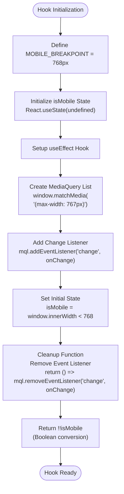
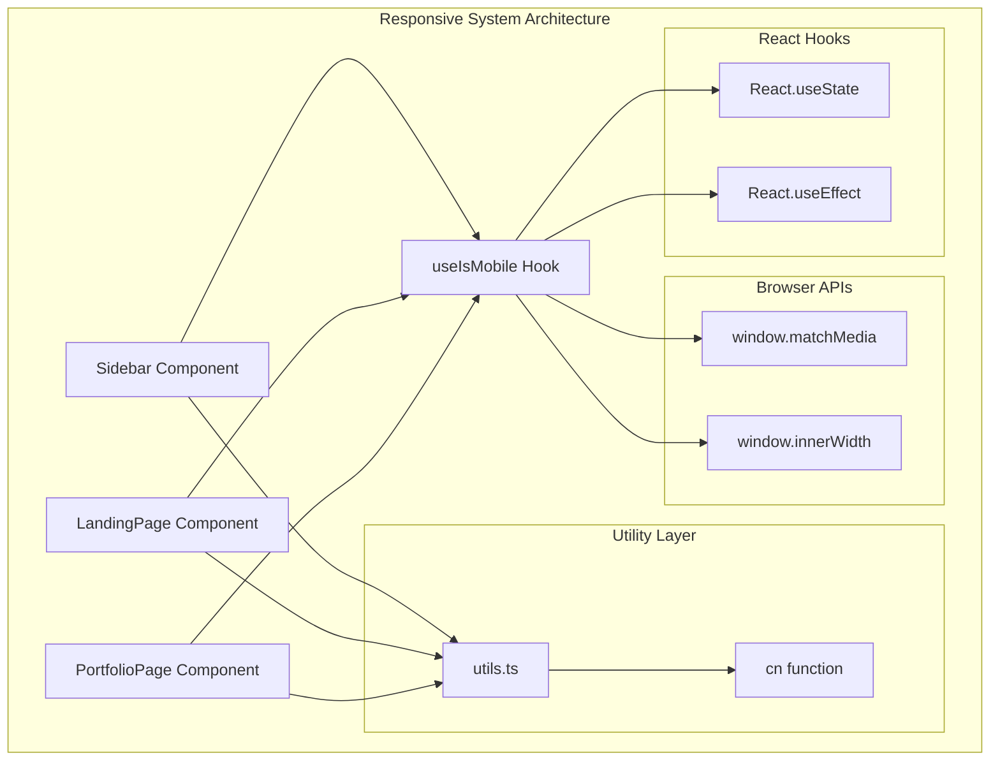
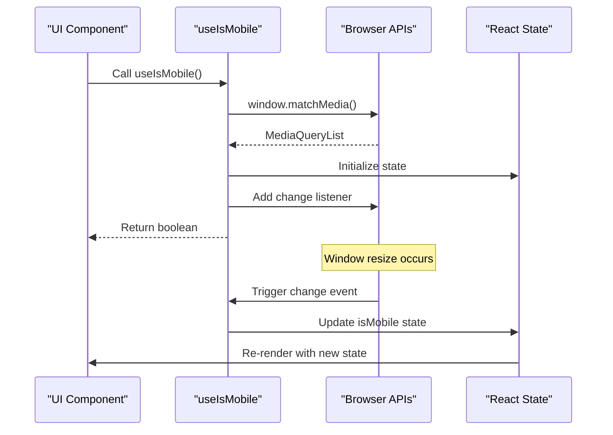

# Responsive Utility Hooks

<cite>
**Referenced Files in This Document**
- [src/components/ui/use-mobile.ts](file://src/components/ui/use-mobile.ts)
- [src/components/ui/sidebar.tsx](file://src/components/ui/sidebar.tsx)
- [src/components/ui/Code-component-1-41.tsx](file://src/components/ui/Code-component-1-41.tsx)
- [src/components/ui/Code-component-1-52.tsx](file://src/components/ui/Code-component-1-52.tsx)
- [src/components/ui/utils.ts](file://src/components/ui/utils.ts)
- [src/components/LandingPage.tsx](file://src/components/LandingPage.tsx)
- [src/components/PortfolioPage.tsx](file://src/components/PortfolioPage.tsx)
- [pages/index.tsx](file://pages/index.tsx)
- [package.json](file://package.json)
</cite>

## Table of Contents
1. [Introduction](#introduction)
2. [Core Implementation](#core-implementation)
3. [Architecture Overview](#architecture-overview)
4. [Detailed Hook Analysis](#detailed-hook-analysis)
5. [Usage Patterns](#usage-patterns)
6. [Performance Considerations](#performance-considerations)
7. [Server-Side Rendering Compatibility](#server-side-rendering-compatibility)
8. [Integration Examples](#integration-examples)
9. [Best Practices](#best-practices)
10. [Troubleshooting Guide](#troubleshooting-guide)

## Introduction

The `useIsMobile` hook is a fundamental responsive utility that detects mobile device viewport sizes using `window.matchMedia`. This hook provides a clean, reusable solution for detecting whether the current device is a mobile device based on predefined breakpoints, enabling developers to create adaptive user interfaces that respond appropriately to different screen sizes.

The hook serves as a cornerstone for responsive design patterns throughout the SnapEvent application, particularly in components like navigation menus, layout structures, and touch-optimized interfaces. By leveraging modern browser APIs and React's state management capabilities, it offers both simplicity and reliability for responsive web development.

## Core Implementation

The `useIsMobile` hook is implemented as a lightweight, efficient solution that combines React's `useState` and `useEffect` hooks with the native `window.matchMedia` API to detect mobile viewport sizes.



**Diagram sources**
- [src/components/ui/use-mobile.ts](file://src/components/ui/use-mobile.ts#L1-L22)

**Section sources**
- [src/components/ui/use-mobile.ts](file://src/components/ui/use-mobile.ts#L1-L22)

## Architecture Overview

The responsive utility system follows a modular architecture where the `useIsMobile` hook serves as a foundational building block for larger responsive components and patterns.



**Diagram sources**
- [src/components/ui/use-mobile.ts](file://src/components/ui/use-mobile.ts#L1-L22)
- [src/components/ui/sidebar.tsx](file://src/components/ui/sidebar.tsx#L1-L727)
- [src/components/ui/utils.ts](file://src/components/ui/utils.ts#L1-L7)

## Detailed Hook Analysis

### Hook Implementation Details

The `useIsMobile` hook demonstrates several key patterns in modern React development:

```typescript
import * as React from "react";

const MOBILE_BREAKPOINT = 768;

export function useIsMobile() {
  const [isMobile, setIsMobile] = React.useState<boolean | undefined>(
    undefined,
  );

  React.useEffect(() => {
    const mql = window.matchMedia(`(max-width: ${MOBILE_BREAKPOINT - 1}px)`);
    const onChange = () => {
      setIsMobile(window.innerWidth < MOBILE_BREAKPOINT);
    };
    mql.addEventListener("change", onChange);
    setIsMobile(window.innerWidth < MOBILE_BREAKPOINT);
    return () => mql.removeEventListener("change", onChange);
  }, []);

  return !!isMobile;
}
```

**Section sources**
- [src/components/ui/use-mobile.ts](file://src/components/ui/use-mobile.ts#L1-L22)

### Breakpoint Strategy

The hook uses a 768px breakpoint, which aligns with common mobile-first design principles. This breakpoint effectively distinguishes between tablet and mobile devices, allowing for appropriate UI adaptations:

- **Desktop**: Width ≥ 768px
- **Mobile/Tablet**: Width < 768px

### State Management Pattern

The hook employs a sophisticated state initialization pattern:

1. **Initial State**: `undefined` to indicate uncalculated state
2. **Immediate Update**: Sets state based on current window width
3. **Dynamic Updates**: Responds to media query changes
4. **Cleanup**: Properly removes event listeners to prevent memory leaks

### Boolean Conversion

The hook returns a boolean value (`!!isMobile`) rather than the raw state, ensuring consistent boolean behavior throughout the application and preventing potential issues with falsy values.

**Section sources**
- [src/components/ui/use-mobile.ts](file://src/components/ui/use-mobile.ts#L4-L21)

## Usage Patterns

### Basic Conditional Rendering

The most common usage pattern involves conditional rendering based on mobile detection:

```typescript
// In a component
const isMobile = useIsMobile();

if (isMobile) {
  return <MobileNavigation />;
} else {
  return <DesktopNavigation />;
}
```

### Adaptive Layout Components

Components like the Sidebar demonstrate advanced usage patterns:

```typescript
function Sidebar({ /* props */ }) {
  const { isMobile, state, openMobile, setOpenMobile } = useSidebar();

  if (isMobile) {
    return (
      <Sheet open={openMobile} onOpenChange={setOpenMobile}>
        <SheetContent className="bg-sidebar">
          {/* Mobile-specific sidebar content */}
        </SheetContent>
      </Sheet>
    );
  }

  return (
    <div className="hidden md:block">
      {/* Desktop sidebar content */}
    </div>
  );
}
```

**Section sources**
- [src/components/ui/sidebar.tsx](file://src/components/ui/sidebar.tsx#L60-L85)

### Multi-Component Integration

The hook integrates seamlessly across multiple components, demonstrating its versatility:



**Diagram sources**
- [src/components/ui/use-mobile.ts](file://src/components/ui/use-mobile.ts#L8-L17)

## Performance Considerations

### Efficient Event Handling

The hook implements efficient event handling by:

1. **Single Event Listener**: Uses one media query listener per hook instance
2. **Cleanup on Unmount**: Removes listeners to prevent memory leaks
3. **Minimal Re-renders**: Only updates state when viewport crosses breakpoint

### Memory Management

Proper cleanup ensures optimal memory usage:

```typescript
return () => mql.removeEventListener("change", onChange);
```

This cleanup function prevents memory leaks that could occur if event listeners persisted after the component unmounted.

### Browser API Optimization

The hook leverages native browser APIs efficiently:

- **matchMedia**: Provides hardware-accelerated viewport detection
- **window.innerWidth**: Offers immediate viewport width information
- **Debounced Updates**: Browser automatically handles debouncing of resize events

**Section sources**
- [src/components/ui/use-mobile.ts](file://src/components/ui/use-mobile.ts#L15-L17)

## Server-Side Rendering Compatibility

### Hydration Considerations

The hook includes built-in hydration safety through its initial state pattern:

```typescript
const [isMobile, setIsMobile] = React.useState<boolean | undefined>(undefined);
```

By initializing with `undefined`, the hook avoids hydration mismatches that can occur when SSR environments calculate different viewport states than client-side rendering.

### Safe Initial State

The hook's approach to initial state ensures compatibility with Next.js and other SSR frameworks:

1. **Undefined Initial State**: Prevents mismatch between server and client calculations
2. **Immediate Client Update**: Sets correct state on first client render
3. **Consistent Behavior**: Returns reliable boolean values regardless of rendering context

**Section sources**
- [src/components/ui/use-mobile.ts](file://src/components/ui/use-mobile.ts#L5-L6)

## Integration Examples

### Navigation Adaptation

The LandingPage component demonstrates responsive navigation patterns:

```typescript
// Mobile menu toggle
<Button 
  variant="ghost" 
  size="sm" 
  onClick={() => setIsMenuOpen(!isMenuOpen)}
>
  <AnimatePresence mode="wait">
    {isMenuOpen ? (
      <motion.div
        key="close"
        initial={{ rotate: -90, opacity: 0 }}
        animate={{ rotate: 0, opacity: 1 }}
        exit={{ rotate: 90, opacity: 0 }}
        transition={{ duration: 0.2 }}
      >
        <X className="h-5 w-5" />
      </motion.div>
    ) : (
      <motion.div
        key="menu"
        initial={{ rotate: 90, opacity: 0 }}
        animate={{ rotate: 0, opacity: 1 }}
        exit={{ rotate: -90, opacity: 0 }}
        transition={{ duration: 0.2 }}
      >
        <Menu className="h-5 w-5" />
      </motion.div>
    )}
  </AnimatePresence>
</Button>
```

### Portfolio Layout Responsiveness

The PortfolioPage component adapts its layout based on mobile detection:

```typescript
// Responsive portfolio grid
<div className="grid grid-cols-1 md:grid-cols-2 lg:grid-cols-3 gap-6">
  {filteredPortfolio.map((item) => (
    <Card key={item.id} className="group cursor-pointer">
      <CardContent className="p-0">
        <div className="relative overflow-hidden">
          <ImageWithFallback
            src={item.image}
            alt={item.title}
            className="w-full h-64 object-cover group-hover:scale-105"
          />
          <div className="absolute inset-0 bg-black/40 opacity-0 group-hover:opacity-100">
            <p className="text-white font-medium">{item.title}</p>
          </div>
        </div>
      </CardContent>
    </Card>
  ))}
</div>
```

**Section sources**
- [src/components/LandingPage.tsx](file://src/components/LandingPage.tsx#L180-L220)
- [src/components/PortfolioPage.tsx](file://src/components/PortfolioPage.tsx#L400-L450)

## Best Practices

### Hook Usage Guidelines

1. **Single Instance**: Use one instance per component to avoid conflicts
2. **Consistent Breakpoints**: Maintain consistent breakpoint values across the application
3. **Cleanup Responsibility**: Ensure proper cleanup in custom hooks that wrap useIsMobile
4. **Boolean Conversion**: Always use `!!isMobile` to ensure boolean return type

### Performance Optimization

1. **Minimize Re-renders**: Use the hook result directly rather than wrapping in additional components
2. **Efficient Media Queries**: Leverage browser-native media queries instead of JavaScript calculations
3. **Memory Management**: Always clean up event listeners in custom implementations

### Accessibility Considerations

1. **Touch-Friendly Interfaces**: Adapt touch targets for mobile devices
2. **Keyboard Navigation**: Ensure keyboard accessibility remains intact
3. **Screen Reader Compatibility**: Test responsive layouts with assistive technologies

## Troubleshooting Guide

### Common Issues and Solutions

#### Hydration Mismatch
**Problem**: React hydration errors when using viewport detection
**Solution**: Ensure the hook initializes with `undefined` and updates on client-side

#### Memory Leaks
**Problem**: Event listeners persist after component unmount
**Solution**: Verify proper cleanup in useEffect return function

#### Inconsistent Behavior
**Problem**: Hook returns inconsistent values during rapid resizing
**Solution**: Browser automatically handles debouncing; no additional measures needed

#### SSR Compatibility
**Problem**: Different viewport calculations between server and client
**Solution**: Use the hook's built-in hydration-safe pattern with undefined initial state

### Debugging Techniques

1. **Console Logging**: Add logging to track state changes
2. **Browser DevTools**: Use responsive design mode to test breakpoints
3. **Network Tab**: Monitor for memory leaks in event listeners
4. **Performance Tab**: Check for unnecessary re-renders

**Section sources**
- [src/components/ui/use-mobile.ts](file://src/components/ui/use-mobile.ts#L1-L22)

## Conclusion

The `useIsMobile` hook exemplifies modern React development practices by combining native browser APIs with React's state management capabilities. Its implementation demonstrates several key principles:

- **Simplicity**: Clean, readable code that's easy to understand and maintain
- **Performance**: Efficient use of browser APIs with minimal overhead
- **Reliability**: Robust handling of edge cases and browser inconsistencies
- **Compatibility**: Seamless integration with SSR frameworks and modern React patterns

The hook serves as a foundation for responsive design patterns throughout the SnapEvent application, enabling developers to create adaptive interfaces that provide optimal user experiences across all device types. Its widespread adoption across components like the Sidebar, LandingPage, and PortfolioPage demonstrates its effectiveness and versatility in real-world applications.

Through careful consideration of hydration, performance, and accessibility, the `useIsMobile` hook provides a solid foundation for building responsive web applications that meet modern user expectations across diverse devices and platforms.