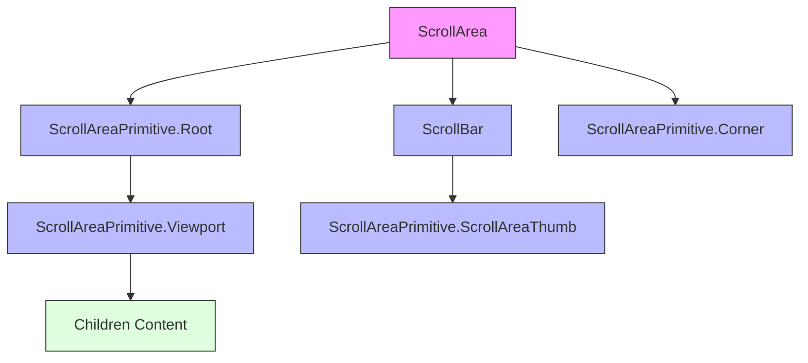
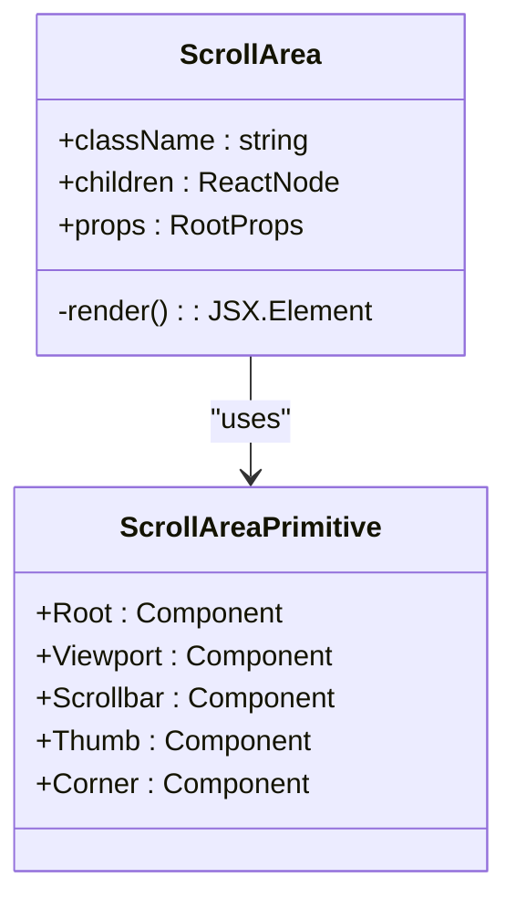
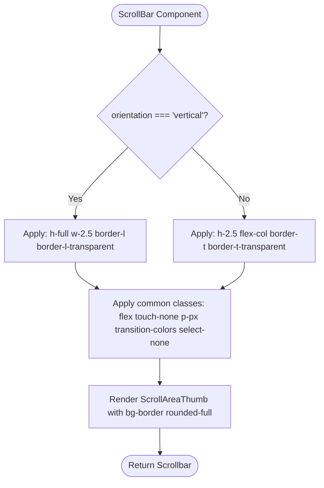
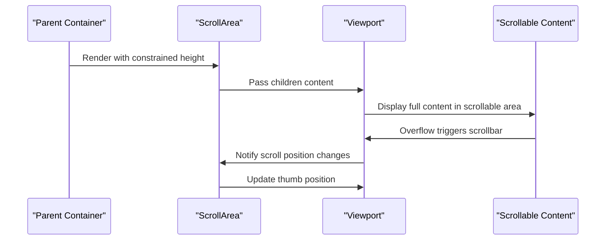
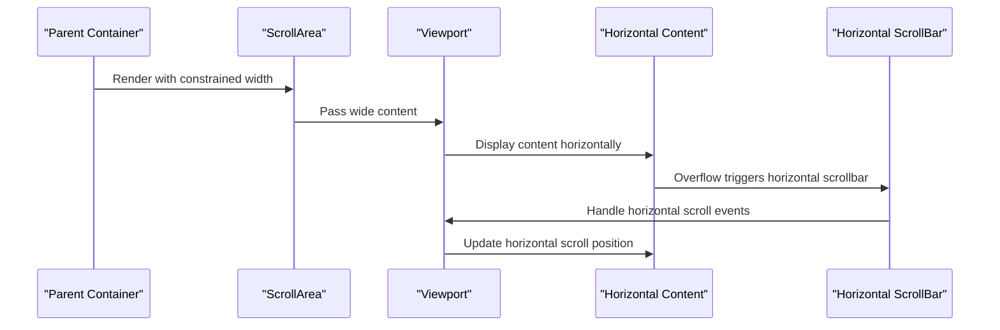
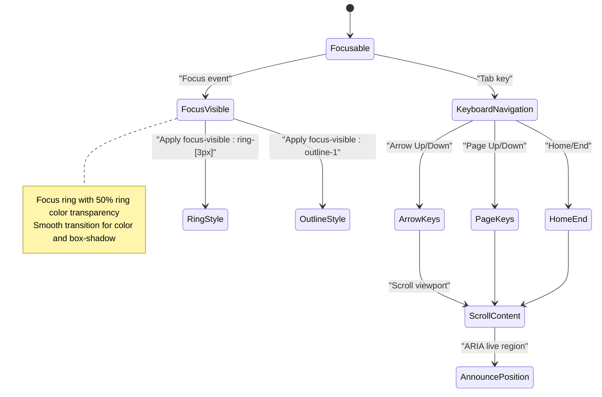
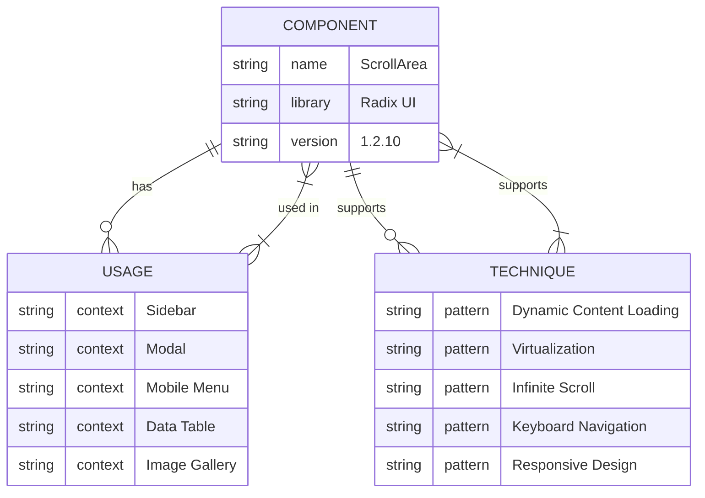

# Scroll Area Component

<cite>
**Referenced Files in This Document**   
- [scroll-area.tsx](file://src/components/ui/scroll-area.tsx)
- [utils.ts](file://src/components/ui/utils.ts)
- [package.json](file://package.json)
- [tailwind.config.js](file://tailwind.config.js)
- [index.css](file://src/index.css)
</cite>

## Table of Contents
1. [Introduction](#introduction)
2. [Core Components](#core-components)
3. [Architecture Overview](#architecture-overview)
4. [Detailed Component Analysis](#detailed-component-analysis)
5. [Usage Examples](#usage-examples)
6. [Styling and Theming](#styling-and-theming)
7. [Accessibility Features](#accessibility-features)
8. [Performance Optimization](#performance-optimization)
9. [Integration Patterns](#integration-patterns)
10. [Conclusion](#conclusion)

## Introduction
The ScrollArea component provides a customizable, cross-platform solution for overflow scrolling while maintaining native scroll behavior. Built on Radix UI's ScrollAreaPrimitive, it enables developers to create styled scrollable containers for constrained UI elements such as sidebars, modals, and mobile menus. The component preserves accessibility features and supports both vertical and horizontal scrolling implementations.

**Section sources**
- [scroll-area.tsx](file://src/components/ui/scroll-area.tsx#L1-L57)

## Core Components
The ScrollArea component is composed of several subcomponents that work together to create a seamless scrolling experience:
- **ScrollAreaPrimitive.Root**: The container that establishes the scrollable context
- **Viewport**: The scrollable content area with focus management
- **ScrollBar**: Customizable scrollbar with vertical and horizontal orientation support
- **Corner**: Handles the intersection between horizontal and vertical scrollbars

These components are wrapped in a relative container with invisible focus rings and smooth transitions, ensuring a polished user experience across platforms.

**Section sources**
- [scroll-area.tsx](file://src/components/ui/scroll-area.tsx#L7-L57)

## Architecture Overview


**Diagram sources**
- [scroll-area.tsx](file://src/components/ui/scroll-area.tsx#L7-L26)

**Section sources**
- [scroll-area.tsx](file://src/components/ui/scroll-area.tsx#L7-L57)

## Detailed Component Analysis

### ScrollArea Root Component
The main ScrollArea component serves as a wrapper that composes the primitive components into a cohesive unit. It applies a relative positioning context and accepts standard className and children props for customization.



**Diagram sources**
- [scroll-area.tsx](file://src/components/ui/scroll-area.tsx#L7-L26)

**Section sources**
- [scroll-area.tsx](file://src/components/ui/scroll-area.tsx#L7-L26)

### ScrollBar Component
The ScrollBar component provides customizable scrollbar styling with support for both vertical and horizontal orientations. It uses conditional class names to apply appropriate dimensions and border styles based on orientation.



**Diagram sources**
- [scroll-area.tsx](file://src/components/ui/scroll-area.tsx#L34-L53)

**Section sources**
- [scroll-area.tsx](file://src/components/ui/scroll-area.tsx#L34-L57)

## Usage Examples

### Vertical Scrolling Implementation
For vertical scrolling in constrained containers like sidebars or modals, the ScrollArea component can be used with default orientation:



**Diagram sources**
- [scroll-area.tsx](file://src/components/ui/scroll-area.tsx#L7-L57)

### Horizontal Scrolling Implementation
For horizontal scrolling scenarios such as image galleries or data tables, the ScrollBar component can be configured with horizontal orientation:



**Diagram sources**
- [scroll-area.tsx](file://src/components/ui/scroll-area.tsx#L34-L57)

## Styling and Theming
The ScrollArea component leverages Tailwind CSS and theme variables for consistent styling across light and dark modes. The component uses the cn utility function for className merging and inherits border radius from the parent context.

```mermaid
graph TD
A[Tailwind CSS] --> B[tailwind.config.js]
B --> C[Theme Configuration]
C --> D[Color Variables]
D --> E[border: hsl(var(--border))]
D --> F[ring: hsl(var(--ring))]
A --> G[index.css]
G --> H[CSS Variables]
H --> I[--radius: 0.5rem]
H --> J[Dark Mode Variables]
A --> K[utils.ts]
K --> L[cn function]
L --> M[twMerge + clsx]
M --> N[Class Name Composition]
N --> O[ScrollArea Styling]
style A fill:#f96,stroke:#333
style B fill:#69f,stroke:#333
style C fill:#69f,stroke:#333
style D fill:#69f,stroke:#333
style E fill:#69f,stroke:#333
style F fill:#69f,stroke:#333
style G fill:#69f,stroke:#333
style H fill:#69f,stroke:#333
style I fill:#69f,stroke:#333
style J fill:#69f,stroke:#333
style K fill:#69f,stroke:#333
style L fill:#69f,stroke:#333
style M fill:#69f,stroke:#333
style N fill:#69f,stroke:#333
style O fill:#f96,stroke:#333
```

**Diagram sources**
- [tailwind.config.js](file://tailwind.config.js#L1-L77)
- [index.css](file://src/index.css#L1-L59)
- [utils.ts](file://src/components/ui/utils.ts#L1-L6)

**Section sources**
- [tailwind.config.js](file://tailwind.config.js#L1-L77)
- [index.css](file://src/index.css#L1-L59)
- [utils.ts](file://src/components/ui/utils.ts#L1-L6)

## Accessibility Features
The ScrollArea component includes several accessibility features to ensure keyboard navigation and screen reader compatibility:



**Diagram sources**
- [scroll-area.tsx](file://src/components/ui/scroll-area.tsx#L18-L20)

**Section sources**
- [scroll-area.tsx](file://src/components/ui/scroll-area.tsx#L18-L20)

## Performance Optimization
The ScrollArea component implements several performance optimizations to ensure smooth scrolling experiences:

```mermaid
flowchart TD
A[Performance Optimizations] --> B[Hardware Acceleration]
B --> C[transform: translateZ(0)]
B --> D[will-change: transform]
A --> E[Smooth Transitions]
E --> F[transition-[color,box-shadow]]
A --> F[Efficient Rendering]
F --> G[React.memo for ScrollBar]
F --> H[Virtualization Ready]
A --> I[Touch Optimization]
I --> J[touch-none for scrollbar]
I --> K[select-none to prevent text selection]
style A fill:#6f9,stroke:#333
style B fill:#6f9,stroke:#333
style C fill:#6f9,stroke:#333
style D fill:#6f9,stroke:#333
style E fill:#6f9,stroke:#333
style F fill:#6f9,stroke:#333
style G fill:#6f9,stroke:#333
style H fill:#6f9,stroke:#333
style I fill:#6f9,stroke:#333
style J fill:#6f9,stroke:#333
style K fill:#6f9,stroke:#333
```

**Diagram sources**
- [scroll-area.tsx](file://src/components/ui/scroll-area.tsx#L18-L19)

## Integration Patterns
The ScrollArea component is designed for integration with various UI patterns and dynamic content loading scenarios:



**Diagram sources**
- [package.json](file://package.json#L20-L21)

**Section sources**
- [package.json](file://package.json#L20-L21)

## Conclusion
The ScrollArea component provides a robust solution for creating custom-styled scrollable containers while preserving native scrolling behavior and accessibility features. By leveraging Radix UI primitives and Tailwind CSS utilities, it offers a flexible foundation for implementing scrollable content in various UI contexts. The component's architecture supports both vertical and horizontal scrolling, with performance optimizations for smooth interactions and compatibility with dynamic content loading and virtualization techniques.