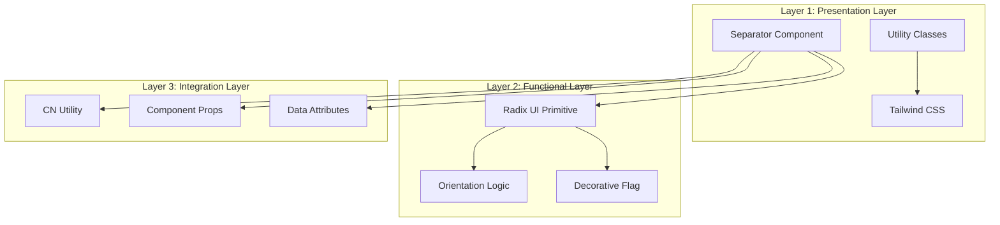
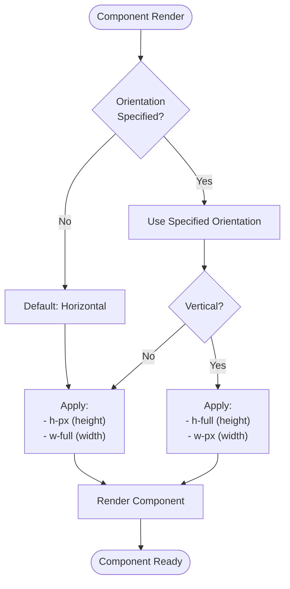
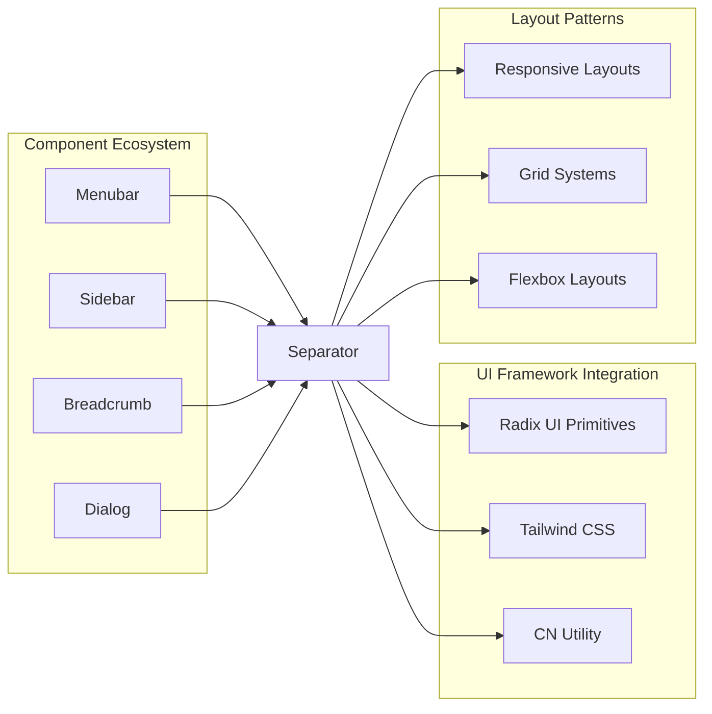

# Separator Component

<cite>
**Referenced Files in This Document**
- [src/components/ui/separator.tsx](file://src/components/ui/separator.tsx)
- [src/components/ui/utils.ts](file://src/components/ui/utils.ts)
- [src/components/ui/breadcrumb.tsx](file://src/components/ui/breadcrumb.tsx)
- [src/components/ui/menubar.tsx](file://src/components/ui/menubar.tsx)
- [src/components/ui/sidebar.tsx](file://src/components/ui/sidebar.tsx)
- [tailwind.config.js](file://tailwind.config.js)
- [src/index.css](file://src/index.css)
- [package.json](file://package.json)
</cite>

## Table of Contents
1. [Introduction](#introduction)
2. [Component Architecture](#component-architecture)
3. [Core Implementation](#core-implementation)
4. [Orientation Support](#orientation-support)
5. [Accessibility Features](#accessibility-features)
6. [Usage Examples](#usage-examples)
7. [Integration Patterns](#integration-patterns)
8. [Customization and Styling](#customization-and-styling)
9. [Performance Considerations](#performance-considerations)
10. [Best Practices](#best-practices)

## Introduction

The Separator component is a fundamental UI element designed to render thin visual dividers between UI sections. It serves as a lightweight, accessible solution for creating visual separation in various interface contexts. Built on top of Radix UI's primitive separator, it provides consistent styling and accessibility compliance while maintaining flexibility for custom implementations.

This component is particularly valuable in creating structured layouts, organizing content sections, and establishing visual hierarchy in complex user interfaces. Its implementation emphasizes simplicity, performance, and adherence to accessibility standards.

## Component Architecture

The Separator component follows a layered architecture that separates concerns between presentation, functionality, and accessibility:



**Diagram sources**
- [src/components/ui/separator.tsx](file://src/components/ui/separator.tsx#L1-L29)
- [src/components/ui/utils.ts](file://src/components/ui/utils.ts#L1-L7)

**Section sources**
- [src/components/ui/separator.tsx](file://src/components/ui/separator.tsx#L1-L29)
- [src/components/ui/utils.ts](file://src/components/ui/utils.ts#L1-L7)

## Core Implementation

The Separator component is implemented as a wrapper around Radix UI's `SeparatorPrimitive.Root` component, enhanced with Tailwind CSS utility classes and custom styling logic:

```typescript
function Separator({
  className,
  orientation = "horizontal",
  decorative = true,
  ...props
}: React.ComponentProps<typeof SeparatorPrimitive.Root>) {
  return (
    <SeparatorPrimitive.Root
      data-slot="separator-root"
      decorative={decorative}
      orientation={orientation}
      className={cn(
        "bg-border shrink-0 data-[orientation=horizontal]:h-px data-[orientation=horizontal]:w-full data-[orientation=vertical]:h-full data-[orientation=vertical]:w-px",
        className,
      )}
      {...props}
    />
  );
}
```

### Key Implementation Details

1. **Default Orientation**: The component defaults to horizontal orientation when no orientation is specified
2. **Decorative Flag**: By default, the separator is marked as decorative for accessibility compliance
3. **Utility Class Integration**: Uses the `cn` utility function for className merging
4. **Data Attributes**: Includes `data-slot` attributes for testing and debugging

**Section sources**
- [src/components/ui/separator.tsx](file://src/components/ui/separator.tsx#L7-L22)

## Orientation Support

The Separator component provides comprehensive support for both horizontal and vertical orientations through Radix UI's built-in orientation system:



**Diagram sources**
- [src/components/ui/separator.tsx](file://src/components/ui/separator.tsx#L15-L18)

### Horizontal Orientation

When oriented horizontally, the separator establishes a thin horizontal divider:

- **Height**: 1 pixel (`h-px`)
- **Width**: Full width of parent container (`w-full`)
- **Purpose**: Separates content vertically within containers

### Vertical Orientation

For vertical separators, the component adapts to create side-by-side dividers:

- **Height**: Full height of parent container (`h-full`)
- **Width**: 1 pixel (`w-px`)
- **Purpose**: Creates side panels or column dividers

**Section sources**
- [src/components/ui/separator.tsx](file://src/components/ui/separator.tsx#L15-L18)

## Accessibility Features

The Separator component incorporates several accessibility features to ensure compliance with web standards:

### Decorative Flag

The component automatically applies the `decorative` flag to Radix UI's primitive, indicating that the separator serves purely visual purposes:

```typescript
decorative={decorative}
```

This flag ensures that screen readers will skip the separator during navigation, preventing unnecessary auditory interruptions.

### Screen Reader Treatment

The component's accessibility features include:

1. **Role Management**: Inherits appropriate ARIA roles from Radix UI primitives
2. **Hidden Content**: Uses `aria-hidden="true"` for decorative separators
3. **Focus Management**: Properly handles focus states in interactive contexts
4. **Keyboard Navigation**: Supports keyboard navigation when part of interactive elements

### Interaction with Surrounding Whitespace

The component integrates seamlessly with surrounding whitespace through:

- **Margin Utilities**: Compatible with Tailwind's spacing utilities
- **Container Padding**: Respects parent container padding and margins
- **Responsive Behavior**: Adapts to different screen sizes and layouts

**Section sources**
- [src/components/ui/separator.tsx](file://src/components/ui/separator.tsx#L13-L14)

## Usage Examples

The Separator component demonstrates versatility across various UI contexts:

### Menu-Based Separators

```typescript
// Menubar Separator Example
function MenubarSeparator({
  className,
  ...props
}: React.ComponentProps<typeof MenubarPrimitive.Separator>) {
  return (
    <MenubarPrimitive.Separator
      data-slot="menubar-separator"
      className={cn("bg-border -mx-1 my-1 h-px", className)}
      {...props}
    />
  );
}
```

### Sidebar Integration

```typescript
// Sidebar Separator Example
function SidebarSeparator({
  className,
  ...props
}: React.ComponentProps<typeof Separator>) {
  return (
    <Separator
      data-slot="sidebar-separator"
      data-sidebar="separator"
      className={cn("bg-sidebar-border mx-2 w-auto", className)}
      {...props}
    />
  );
}
```

### Basic Usage Pattern

```typescript
// Simple horizontal separator
<Separator />

// Vertical separator
<Separator orientation="vertical" />

// Decorative separator with custom styling
<Separator 
  decorative={false} 
  className="my-4 bg-gray-200" 
/>
```

**Section sources**
- [src/components/ui/menubar.tsx](file://src/components/ui/menubar.tsx#L183-L188)
- [src/components/ui/sidebar.tsx](file://src/components/ui/sidebar.tsx#L356-L363)

## Integration Patterns

The Separator component integrates with various UI patterns and frameworks:



**Diagram sources**
- [src/components/ui/separator.tsx](file://src/components/ui/separator.tsx#L1-L29)
- [src/components/ui/menubar.tsx](file://src/components/ui/menubar.tsx#L183-L188)
- [src/components/ui/sidebar.tsx](file://src/components/ui/sidebar.tsx#L356-L363)

### Component-Specific Implementations

1. **Menubar Integration**: Uses custom styling with `-mx-1 my-1` margins
2. **Sidebar Integration**: Applies `bg-sidebar-border` color scheme
3. **Breadcrumb Integration**: Inherits default horizontal behavior
4. **Dialog Integration**: Supports both orientations for modal layouts

**Section sources**
- [src/components/ui/menubar.tsx](file://src/components/ui/menubar.tsx#L183-L188)
- [src/components/ui/sidebar.tsx](file://src/components/ui/sidebar.tsx#L356-L363)

## Customization and Styling

The Separator component provides extensive customization capabilities through its props system and utility class integration:

### Color Scheme Integration

The component leverages Tailwind's color system through the `bg-border` class, which dynamically adapts to light and dark themes:

```css
/* Light Theme */
--border: 214.3 31.8% 91.4%;
/* Dark Theme */
--border: 217.2 32.6% 17.5%;
```

### ClassName Merging

The component uses the `cn` utility function for intelligent className merging:

```typescript
className={cn(
  "bg-border shrink-0 data-[orientation=horizontal]:h-px data-[orientation=horizontal]:w-full data-[orientation=vertical]:h-full data-[orientation=vertical]:w-px",
  className,
)}
```

This approach ensures that custom styles are properly merged with the component's default styling.

### Responsive Design

The component naturally adapts to responsive designs through:

- **Flexible Width/Height**: Uses percentage-based sizing when appropriate
- **Container Adaptation**: Respects parent container constraints
- **Orientation Awareness**: Changes behavior based on orientation prop

**Section sources**
- [src/components/ui/separator.tsx](file://src/components/ui/separator.tsx#L15-L18)
- [src/components/ui/utils.ts](file://src/components/ui/utils.ts#L4-L6)
- [src/index.css](file://src/index.css#L1-L59)

## Performance Considerations

The Separator component is designed with performance optimization in mind:

### Lightweight Implementation

- **Minimal DOM Nodes**: Uses a single div element with minimal attributes
- **Efficient CSS**: Leverages Tailwind's atomic CSS approach
- **Lazy Evaluation**: Conditional styling only applies when necessary

### Memory Efficiency

- **No State Management**: Stateless component with no internal state
- **Pure Rendering**: Predictable rendering based on props
- **Optimized Re-renders**: Minimal re-rendering when props change

### Bundle Size Impact

The component contributes minimally to bundle size due to:

- **External Dependencies**: Relies on established libraries (Radix UI, Tailwind)
- **Tree Shaking**: Compatible with modern bundling strategies
- **Atomic CSS**: Eliminates unused styles

**Section sources**
- [src/components/ui/separator.tsx](file://src/components/ui/separator.tsx#L1-L29)
- [package.json](file://package.json#L4-L40)

## Best Practices

### When to Use Separator

1. **Content Organization**: Separate distinct content sections
2. **Navigation Elements**: Divide menu items or navigation groups
3. **Form Layouts**: Separate form sections or field groups
4. **Card Collections**: Divide card grids or lists
5. **Modal Dialogs**: Separate dialog sections

### Recommended Usage Patterns

```typescript
// ✅ Good: Clear semantic separation
<Separator decorative={true} />

// ✅ Good: Custom styling for specific contexts
<Separator 
  orientation="vertical" 
  className="bg-gray-200" 
/>

// ❌ Avoid: Using for layout purposes
<Separator className="h-8" /> // Use margin/padding instead

// ❌ Avoid: Overusing decorative flags
<Separator decorative={false} /> // Only when separator has meaning
```

### Accessibility Guidelines

1. **Always Use Decorative Flag**: Mark visual-only separators as decorative
2. **Contextual Meaning**: Ensure separators add meaningful visual separation
3. **Screen Reader Compatibility**: Verify proper screen reader behavior
4. **Keyboard Navigation**: Test interaction with keyboard-only users

### Performance Optimization

1. **Minimize Custom Styles**: Prefer utility classes over custom CSS
2. **Avoid Inline Styles**: Use className prop for all styling needs
3. **Consistent Usage**: Maintain consistent patterns across the application
4. **Testing**: Verify performance impact in production environments

**Section sources**
- [src/components/ui/separator.tsx](file://src/components/ui/separator.tsx#L13-L14)
- [src/components/ui/separator.tsx](file://src/components/ui/separator.tsx#L15-L18)