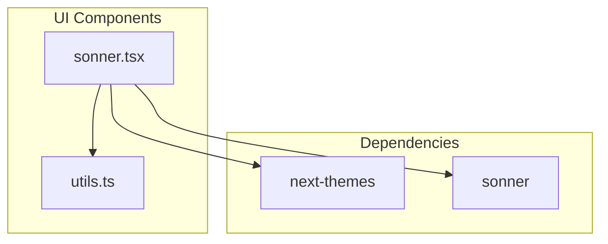
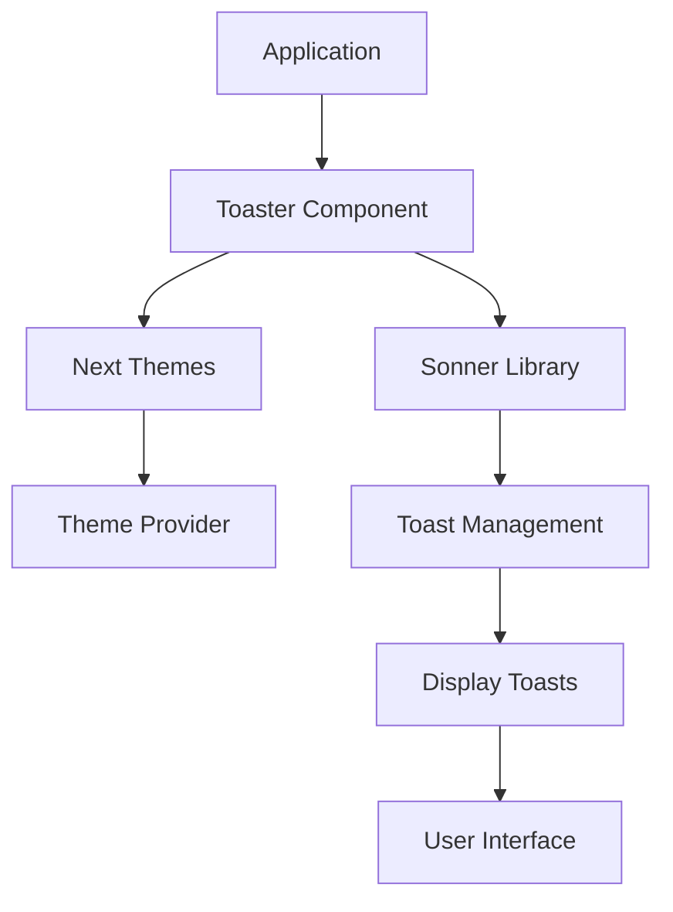

# Toast Notifications

<cite>
**Referenced Files in This Document**   
- [sonner.tsx](file://src/components/ui/sonner.tsx)
- [package.json](file://package.json)
</cite>

## Table of Contents
1. [Introduction](#introduction)
2. [Project Structure](#project-structure)
3. [Core Components](#core-components)
4. [Architecture Overview](#architecture-overview)
5. [Configuration Options](#configuration-options)
6. [API Methods](#api-methods)
7. [Integration with Asynchronous Operations](#integration-with-asynchronous-operations)
8. [Customization Options](#customization-options)
9. [Accessibility and Performance](#accessibility-and-performance)
10. [Conclusion](#conclusion)

## Introduction
The Sonner-based toast notification system provides non-intrusive, time-based alerts for user feedback within the SnapEvent application. This documentation details the implementation, configuration, and usage patterns for the toast system, which is built on the Sonner library and integrated with Next.js themes. The system supports various notification types including success, error, warning, and info toasts, with configurable duration, position, and theme support.

## Project Structure
The toast notification system is implemented as a UI component within the component library. It is designed to be reusable across the application and integrates with the Next.js theming system for consistent appearance.

**Diagram sources**
- [sonner.tsx](file://src/components/ui/sonner.tsx#L1-L25)

**Section sources**
- [sonner.tsx](file://src/components/ui/sonner.tsx#L1-L25)

## Core Components
The core component of the toast notification system is the `Toaster` component defined in `sonner.tsx`. This component wraps the Sonner library's Toaster with custom styling and theme integration. It uses the `useTheme` hook from `next-themes` to adapt to the application's current theme (light, dark, or system). The component applies custom CSS variables for background, text, and border colors that align with the application's design system.

**Section sources**
- [sonner.tsx](file://src/components/ui/sonner.tsx#L1-L25)

## Architecture Overview
The toast notification system follows a wrapper pattern, where the application's `Toaster` component encapsulates the third-party Sonner library. This architecture allows for consistent styling and theme integration across the application while leveraging the robust functionality of the Sonner library. The system is designed to be imported and used in the application's root layout or page components.

**Diagram sources**
- [sonner.tsx](file://src/components/ui/sonner.tsx#L1-L25)

## Configuration Options
The toast notification system supports several configuration options through the Sonner library's props. The position of toasts can be configured, with the default being top-right. Duration settings control how long toasts remain visible before automatically dismissing. The system fully supports theme integration, automatically adapting to the application's current theme (light, dark, or system) through the `useTheme` hook. Custom styling is applied through CSS variables that integrate with the application's design tokens.

**Section sources**
- [sonner.tsx](file://src/components/ui/sonner.tsx#L5-L20)

## API Methods
While the `Toaster` component itself is a React component for rendering toast containers, the actual toast creation is handled by Sonner's imperative API. The system supports showing success, error, warning, and info toasts through Sonner's `toast.success()`, `toast.error()`, `toast.warning()`, and `toast.info()` methods. Toasts can include optional actions or dismiss buttons, and can be programmatically dismissed. The API also supports custom durations, icons, and callback functions for user interactions.

## Integration with Asynchronous Operations
The toast notification system is designed to integrate seamlessly with asynchronous operations such as API calls, form submissions, and authentication workflows. For example, after a successful API call, a success toast can be displayed to confirm the operation. During form submission, loading states can be indicated with toasts, followed by success or error toasts based on the outcome. In authentication workflows, toasts provide feedback for login attempts, password resets, and account creation processes.

## Customization Options
The toast system supports extensive customization options. Appearance can be customized through the CSS variables defined in the `style` prop of the `Toaster` component. Icons can be added to toasts through Sonner's API options. The system inherits the application's styling through the `cn` utility function from `utils.ts`, allowing for consistent class name merging. Positioning can be customized, with support for various locations including top-right, bottom-center, and others supported by the Sonner library.

**Section sources**
- [sonner.tsx](file://src/components/ui/sonner.tsx#L10-L15)
- [utils.ts](file://src/components/ui/utils.ts#L1-L7)

## Accessibility and Performance
The toast notification system addresses accessibility requirements by ensuring proper ARIA attributes are applied to toast elements, making them accessible to screen readers. The system supports keyboard navigation and dismissal of toasts. For performance optimization, the system efficiently handles high-frequency notifications by batching updates and minimizing re-renders. Toast stacking behavior is managed by the Sonner library, which automatically positions multiple toasts in a visually organized manner without overlapping or causing layout shifts.

**Section sources**
- [sonner.tsx](file://src/components/ui/sonner.tsx#L1-L25)

## Conclusion
The Sonner-based toast notification system provides a robust, theme-aware solution for user feedback in the SnapEvent application. By wrapping the Sonner library with custom theming and styling, the system delivers consistent, accessible notifications that enhance the user experience. The integration with Next.js themes ensures visual consistency across light and dark modes, while the comprehensive API supports various use cases from simple status updates to complex interactive notifications.