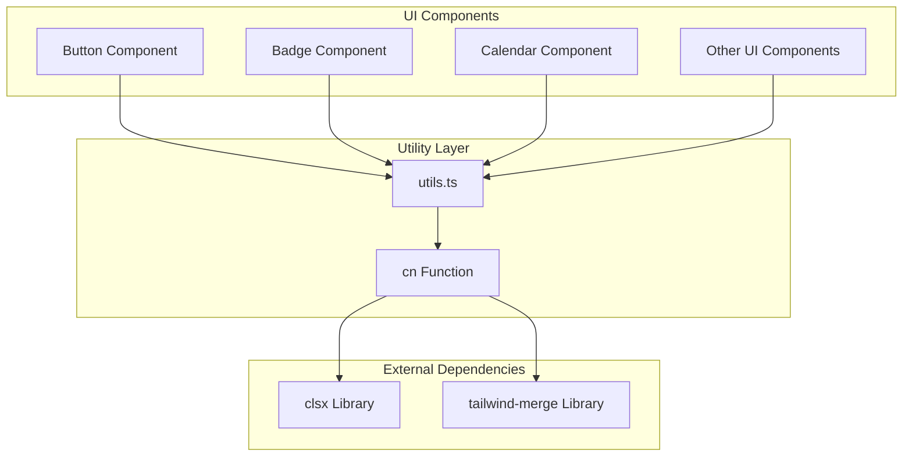
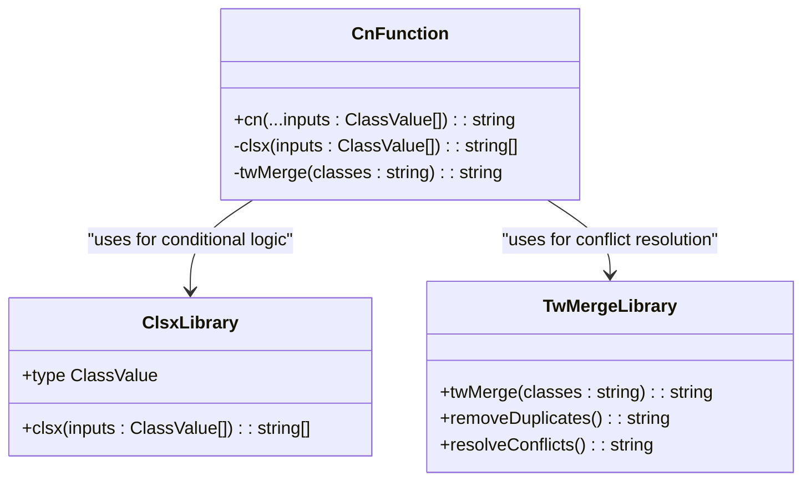
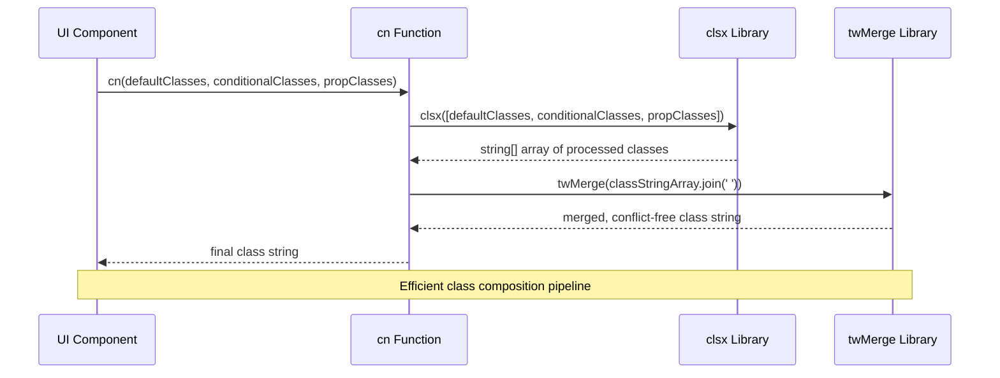
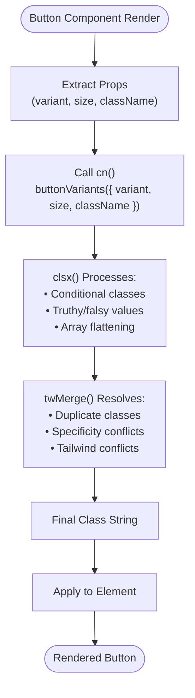
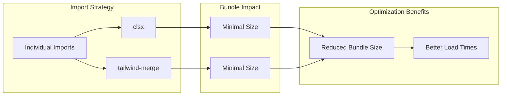

# Utility Functions

<cite>
**Referenced Files in This Document**
- [src/components/ui/utils.ts](file://src/components/ui/utils.ts)
- [src/components/ui/Code-component-1-53.tsx](file://src/components/ui/Code-component-1-53.tsx)
- [src/components/ui/button.tsx](file://src/components/ui/button.tsx)
- [src/components/ui/badge.tsx](file://src/components/ui/badge.tsx)
- [src/components/ui/calendar.tsx](file://src/components/ui/calendar.tsx)
- [package.json](file://package.json)
- [tailwind.config.js](file://tailwind.config.js)
- [src/index.css](file://src/index.css)
</cite>

## Table of Contents
1. [Introduction](#introduction)
2. [Project Structure](#project-structure)
3. [Core Utility Function](#core-utility-function)
4. [Architecture Overview](#architecture-overview)
5. [Detailed Component Analysis](#detailed-component-analysis)
6. [Usage Patterns](#usage-patterns)
7. [Performance Considerations](#performance-considerations)
8. [Best Practices](#best-practices)
9. [Troubleshooting Guide](#troubleshooting-guide)
10. [Conclusion](#conclusion)

## Introduction

The SnapEvent Landing Page utilizes a sophisticated utility function named `cn` that serves as the foundation for composing and merging Tailwind CSS classes in a clean, efficient, and conflict-free manner. This utility function combines two powerful libraries: `clsx` for conditional class composition and `twMerge` for intelligent Tailwind class merging, providing developers with a robust solution for managing dynamic class names throughout the application.

The `cn` utility function addresses several critical challenges in modern web development:
- **Class Conflicts**: Preventing conflicting Tailwind utility classes from overriding each other
- **Duplicate Classes**: Eliminating redundant class declarations
- **Conditional Logic**: Seamlessly handling conditional class additions based on component props
- **Tree Shaking**: Optimizing bundle sizes through efficient module imports
- **Type Safety**: Providing TypeScript support for class composition

## Project Structure

The utility functions are strategically organized within the UI component architecture, ensuring consistent usage patterns across the entire application.



**Diagram sources**
- [src/components/ui/utils.ts](file://src/components/ui/utils.ts#L1-L7)
- [src/components/ui/button.tsx](file://src/components/ui/button.tsx#L1-L59)
- [src/components/ui/badge.tsx](file://src/components/ui/badge.tsx#L1-L47)

**Section sources**
- [src/components/ui/utils.ts](file://src/components/ui/utils.ts#L1-L7)
- [src/components/ui/Code-component-1-53.tsx](file://src/components/ui/Code-component-1-53.tsx#L1-L7)

## Core Utility Function

The `cn` function serves as the central utility for class composition throughout the SnapEvent application. It provides a unified interface for combining Tailwind CSS classes while maintaining optimal performance and preventing class conflicts.

### Implementation Details

```typescript
import { clsx, type ClassValue } from "clsx";
import { twMerge } from "tailwind-merge";

export function cn(...inputs: ClassValue[]) {
  return twMerge(clsx(inputs));
}
```

The function signature demonstrates its simplicity and power:
- **Spread Parameter**: Accepts any number of arguments using rest parameters
- **ClassValue Type**: Utilizes the `ClassValue` type from `clsx` for flexible input handling
- **Composition Pattern**: Combines `clsx` and `twMerge` for optimal results

### Dependency Analysis

The utility function relies on two carefully chosen external libraries:



**Diagram sources**
- [src/components/ui/utils.ts](file://src/components/ui/utils.ts#L1-L7)

**Section sources**
- [src/components/ui/utils.ts](file://src/components/ui/utils.ts#L1-L7)

## Architecture Overview

The utility function architecture follows a layered approach that maximizes performance, maintainability, and developer experience.



**Diagram sources**
- [src/components/ui/utils.ts](file://src/components/ui/utils.ts#L1-L7)
- [src/components/ui/button.tsx](file://src/components/ui/button.tsx#L51-L51)

## Detailed Component Analysis

### Button Component Integration

The Button component exemplifies the most common usage pattern of the `cn` utility function, demonstrating how it integrates with the `buttonVariants` system from `class-variance-authority`.



**Diagram sources**
- [src/components/ui/button.tsx](file://src/components/ui/button.tsx#L51-L51)

### Badge Component Usage

The Badge component showcases another common pattern where the utility function handles variant-based styling alongside custom class overrides.

```typescript
// Badge component usage pattern
className={cn(badgeVariants({ variant }), className)}
```

This pattern demonstrates:
- **Variant Composition**: Combining predefined variants with custom classes
- **Fallback Behavior**: Preserving custom classes when provided
- **Consistency**: Maintaining uniform styling patterns across components

### Calendar Component Advanced Usage

The Calendar component illustrates advanced usage scenarios, including nested utility function calls and complex conditional logic.

```typescript
// Calendar component advanced usage
nav_button: cn(
  buttonVariants({ variant: "outline" }),
  "size-7 bg-transparent p-0 opacity-50 hover:opacity-100",
),
cell: cn(
  "relative p-0 text-center text-sm focus-within:relative focus-within:z-20 [&:has([aria-selected])]:bg-accent",
  props.mode === "range"
    ? "[&:has(>.day-range-end)]:rounded-r-md [&:has(>.day-range-start)]:rounded-l-md first:[&:has([aria-selected])]:rounded-l-md last:[&:has([aria-selected])]:rounded-r-md"
    : "[&:has([aria-selected])]:rounded-md",
),
```

**Section sources**
- [src/components/ui/button.tsx](file://src/components/ui/button.tsx#L51-L51)
- [src/components/ui/badge.tsx](file://src/components/ui/badge.tsx#L41-L41)
- [src/components/ui/calendar.tsx](file://src/components/ui/calendar.tsx#L30-L45)

## Usage Patterns

### Basic Conditional Class Composition

The most fundamental usage involves combining static classes with conditional logic:

```typescript
// Basic conditional usage
className={cn(
  "base-class",
  condition && "conditional-class",
  propClass,
  anotherCondition && "another-class"
)}
```

### Variant-Based Component Styling

Components utilize the `cn` function in conjunction with variant systems:

```typescript
// Variant-based styling
className={cn(buttonVariants({ variant, size, className }))}
```

### Nested Utility Function Calls

Advanced patterns involve nesting utility function calls for complex scenarios:

```typescript
// Nested utility calls
className={cn(
  buttonVariants({ variant: "outline" }),
  "custom-classes",
  conditionalProp && "conditional-classes"
)}
```

### Tree-Shaking Benefits

The modular import structure enables optimal tree shaking:

```typescript
// Individual imports for tree shaking
import { clsx, type ClassValue } from "clsx";
import { twMerge } from "tailwind-merge";
```

**Section sources**
- [src/components/ui/button.tsx](file://src/components/ui/button.tsx#L51-L51)
- [src/components/ui/calendar.tsx](file://src/components/ui/calendar.tsx#L30-L45)

## Performance Considerations

### Build Performance Implications

The utility function design optimizes build performance through several mechanisms:

1. **Minimal Bundle Impact**: Each component imports only what it needs
2. **Efficient Merging**: `twMerge` operates in linear time O(n)
3. **Conditional Evaluation**: `clsx` avoids unnecessary computations

### Runtime Performance

Runtime performance characteristics include:

- **Lazy Evaluation**: Conditional classes are only evaluated when needed
- **Memory Efficiency**: String concatenation minimizes memory allocation
- **Cache-Friendly**: Consistent class composition patterns enable browser caching

### Tree Shaking Optimization

The dual-library approach enables excellent tree shaking benefits:



**Section sources**
- [package.json](file://package.json#L10-L11)

## Best Practices

### Import Organization

Always use individual imports for optimal tree shaking:

```typescript
// Recommended: Individual imports
import { clsx, type ClassValue } from "clsx";
import { twMerge } from "tailwind-merge";

// Avoid: Namespace imports
import * as clsx from "clsx";
import * as twMerge from "tailwind-merge";
```

### Type Safety

Leverage TypeScript's type system effectively:

```typescript
// Proper type usage
export function cn(...inputs: ClassValue[]): string {
  return twMerge(clsx(inputs));
}
```

### Component Integration

Follow established patterns for component integration:

1. **Prefer Variants**: Use variant systems when available
2. **Custom Overrides**: Allow custom classes through the `className` prop
3. **Consistent Patterns**: Maintain uniform usage across components

### Testing Strategies

Implement comprehensive testing for class composition:

```typescript
// Example test pattern
expect(cn("base", condition && "conditional")).toBe("base conditional");
expect(cn("base", false && "never")).toBe("base");
```

## Troubleshooting Guide

### Common Issues and Solutions

#### Issue: Unexpected Class Conflicts
**Symptoms**: Tailwind classes not applying as expected
**Solution**: Verify `twMerge` is properly wrapping `clsx` output

#### Issue: Bundle Size Growth
**Symptoms**: Increasing bundle sizes despite minimal usage
**Solution**: Ensure individual imports are used instead of namespace imports

#### Issue: TypeScript Errors
**Symptoms**: Type errors with `ClassValue` or `twMerge`
**Solution**: Verify proper import statements and TypeScript configuration

### Debugging Techniques

1. **Console Logging**: Temporarily log intermediate class values
2. **React DevTools**: Inspect rendered class attributes
3. **CSS Inspection**: Use browser dev tools to verify applied styles

### Performance Monitoring

Monitor performance impact through:
- Bundle analyzer reports
- Runtime performance metrics
- Memory usage patterns

**Section sources**
- [src/components/ui/utils.ts](file://src/components/ui/utils.ts#L1-L7)

## Conclusion

The `cn` utility function represents a sophisticated solution for class composition in the SnapEvent Landing Page application. By combining `clsx` and `twMerge`, it provides developers with a powerful, efficient, and type-safe way to manage Tailwind CSS classes throughout the application.

Key benefits include:
- **Conflict Resolution**: Automatic handling of class conflicts and specificity issues
- **Performance Optimization**: Excellent tree shaking and runtime performance
- **Developer Experience**: Clean, intuitive API with strong TypeScript support
- **Maintainability**: Consistent patterns across all UI components

The utility function's design demonstrates best practices in modern web development, providing a solid foundation for scalable and maintainable component styling. Its widespread adoption across UI components ensures consistency and reliability throughout the application's user interface.

Future enhancements could include additional utility functions for specific use cases, expanded TypeScript type definitions, or integration with emerging Tailwind CSS features. However, the current implementation provides a robust and future-proof solution for class composition needs.