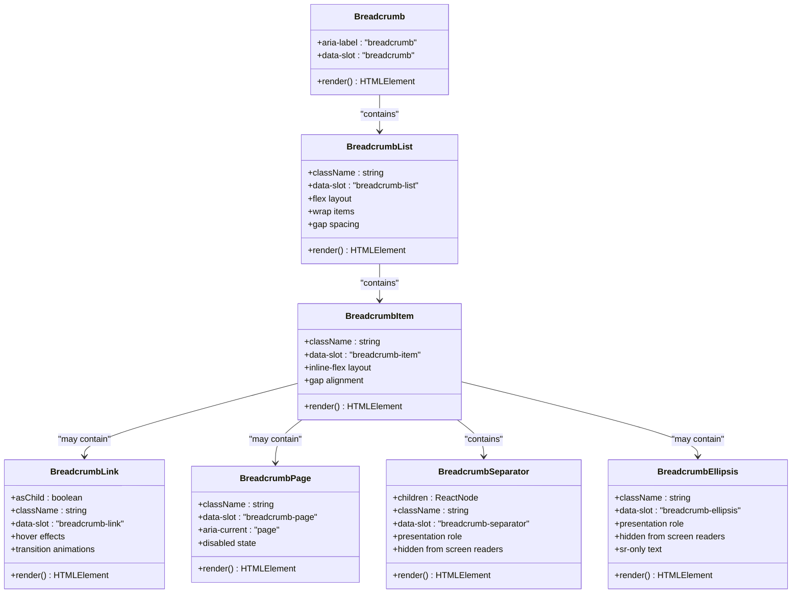
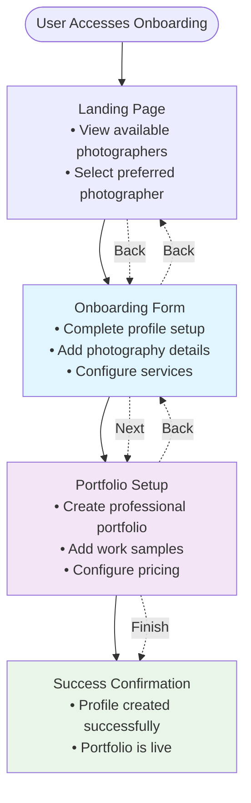

# Breadcrumb Component Documentation

<cite>
**Referenced Files in This Document**
- [breadcrumb.tsx](file://src/components/ui/breadcrumb.tsx)
- [onboarding.tsx](file://pages/onboarding.tsx)
- [setup.tsx](file://pages/profile/setup.tsx)
- [index.tsx](file://pages/index.tsx)
- [App.tsx](file://src/App.tsx)
- [utils.ts](file://src/components/ui/utils.ts)
- [tailwind.config.js](file://tailwind.config.js)
</cite>

## Table of Contents
1. [Introduction](#introduction)
2. [Component Architecture](#component-architecture)
3. [Core Implementation](#core-implementation)
4. [Usage Patterns](#usage-patterns)
5. [Multi-Step Workflow Integration](#multi-step-workflow-integration)
6. [Accessibility Features](#accessibility-features)
7. [Styling and Customization](#styling-and-customization)
8. [Integration Examples](#integration-examples)
9. [Best Practices](#best-practices)
10. [Troubleshooting](#troubleshooting)

## Introduction

The Breadcrumb component is a semantic navigation element designed to provide hierarchical navigation context within the SnapEvent application. Built with accessibility as a primary concern, it follows WCAG guidelines and provides proper ARIA labeling for screen reader support. The component serves as a crucial navigation aid in multi-step workflows such as onboarding and portfolio setup, helping users understand their current position within the application hierarchy.

The component is implemented as a collection of specialized sub-components that work together to create a complete breadcrumb trail. Each sub-component handles specific aspects of the breadcrumb functionality, from basic navigation structure to advanced interactive elements.

## Component Architecture

The Breadcrumb system consists of seven interconnected components, each serving a specific purpose in the overall navigation structure:



**Diagram sources**
- [breadcrumb.tsx](file://src/components/ui/breadcrumb.tsx#L6-L109)

**Section sources**
- [breadcrumb.tsx](file://src/components/ui/breadcrumb.tsx#L1-L110)

## Core Implementation

### Base Breadcrumb Component

The foundation of the breadcrumb system is the `Breadcrumb` component, which serves as a semantic `<nav>` element with essential accessibility attributes:

```typescript
function Breadcrumb({ ...props }: React.ComponentProps<"nav">) {
  return <nav aria-label="breadcrumb" data-slot="breadcrumb" {...props} />;
}
```

This component establishes the fundamental structure with:
- **Semantic HTML**: Uses `<nav>` element for proper semantic meaning
- **ARIA Label**: Provides `aria-label="breadcrumb"` for screen reader identification
- **Data Attributes**: Includes `data-slot="breadcrumb"` for styling and testing
- **Props Spread**: Inherits all native `<nav>` element properties

### BreadcrumbList Component

The `BreadcrumbList` component creates the ordered list structure that contains individual breadcrumb items:

```typescript
function BreadcrumbList({ className, ...props }: React.ComponentProps<"ol">) {
  return (
    <ol
      data-slot="breadcrumb-list"
      className={cn(
        "text-muted-foreground flex flex-wrap items-center gap-1.5 text-sm break-words sm:gap-2.5",
        className,
      )}
      {...props}
    />
  );
}
```

Key features include:
- **Flex Layout**: Uses flexbox for responsive wrapping
- **Spacing Control**: Configurable gaps for different screen sizes
- **Typography**: Small text size with muted color scheme
- **Responsive Behavior**: Breaks to new lines on smaller screens

### BreadcrumbItem Component

The `BreadcrumbItem` component wraps individual breadcrumb entries:

```typescript
function BreadcrumbItem({ className, ...props }: React.ComponentProps<"li">) {
  return (
    <li
      data-slot="breadcrumb-item"
      className={cn("inline-flex items-center gap-1.5", className)}
      {...props}
    />
  );
}
```

Features:
- **Inline Flex**: Maintains horizontal alignment
- **Gap Control**: Consistent spacing between elements
- **Data Attribute**: Identifies breadcrumb items for styling

**Section sources**
- [breadcrumb.tsx](file://src/components/ui/breadcrumb.tsx#L6-L35)

## Usage Patterns

### Basic Implementation

The simplest breadcrumb implementation involves nesting the components in the correct order:

```typescript
<Breadcrumb>
  <BreadcrumbList>
    <BreadcrumbItem>
      <BreadcrumbLink href="/">Home</BreadcrumbLink>
    </BreadcrumbItem>
    <BreadcrumbSeparator />
    <BreadcrumbItem>
      <BreadcrumbLink href="/category">Category</BreadcrumbLink>
    </BreadcrumbItem>
    <BreadcrumbSeparator />
    <BreadcrumbItem>
      <BreadcrumbPage>Current Page</BreadcrumbPage>
    </BreadcrumbItem>
  </BreadcrumbList>
</Breadcrumb>
```

### Multi-Level Navigation

For complex applications with multiple hierarchy levels:

```typescript
<Breadcrumb>
  <BreadcrumbList>
    <BreadcrumbItem>
      <BreadcrumbLink href="/">Dashboard</BreadcrumbLink>
    </BreadcrumbItem>
    <BreadcrumbSeparator />
    <BreadcrumbItem>
      <BreadcrumbLink href="/settings">Settings</BreadcrumbLink>
    </BreadcrumbItem>
    <BreadcrumbSeparator />
    <BreadcrumbItem>
      <BreadcrumbLink href="/settings/account">Account</BreadcrumbLink>
    </BreadcrumbItem>
    <BreadcrumbSeparator />
    <BreadcrumbItem>
      <BreadcrumbPage>Security</BreadcrumbPage>
    </BreadcrumbItem>
  </BreadcrumbList>
</Breadcrumb>
```

### Dynamic Content Generation

The component supports dynamic content generation based on route hierarchy:

```typescript
const generateBreadcrumbTrail = (pathname: string) => {
  const segments = pathname.split('/').filter(Boolean);
  const trail = [];
  
  let path = '';
  segments.forEach((segment, index) => {
    path += `/${segment}`;
    trail.push({
      label: segment.charAt(0).toUpperCase() + segment.slice(1),
      href: path,
      isCurrent: index === segments.length - 1
    });
  });
  
  return trail;
};
```

**Section sources**
- [breadcrumb.tsx](file://src/components/ui/breadcrumb.tsx#L37-L50)

## Multi-Step Workflow Integration

### Onboarding Workflow

The Breadcrumb component integrates seamlessly with the onboarding workflow in the SnapEvent application. The onboarding process follows a clear progression that benefits from breadcrumb navigation:



**Diagram sources**
- [onboarding.tsx](file://pages/onboarding.tsx#L1-L25)
- [setup.tsx](file://pages/profile/setup.tsx#L1-L21)

### Portfolio Setup Integration

The portfolio setup process demonstrates how breadcrumbs help users understand their current position in the multi-step workflow:

```typescript
// Example breadcrumb for portfolio setup
<Breadcrumb>
  <BreadcrumbList>
    <BreadcrumbItem>
      <BreadcrumbLink href="/dashboard">Dashboard</BreadcrumbLink>
    </BreadcrumbItem>
    <BreadcrumbSeparator />
    <BreadcrumbItem>
      <BreadcrumbPage>Portfolio Setup</BreadcrumbPage>
    </BreadcrumbItem>
  </BreadcrumbList>
</Breadcrumb>
```

### State Management Integration

The breadcrumb system works with the application's state management to track user progress:

```typescript
const [currentPage, setCurrentPage] = useState<'landing' | 'onboarding' | 'portfolio'>('onboarding');

const handleNavigate = (page: 'landing' | 'onboarding' | 'portfolio', photographerId?: string) => {
  setCurrentPage(page);
  if (photographerId) {
    setSelectedPhotographerId(photographerId);
  }
};
```

**Section sources**
- [onboarding.tsx](file://pages/onboarding.tsx#L10-L18)
- [setup.tsx](file://pages/profile/setup.tsx#L10-L18)

## Accessibility Features

### Screen Reader Support

The Breadcrumb component provides comprehensive screen reader support through several mechanisms:

#### Semantic Structure
- **Nav Element**: Uses `<nav>` for proper semantic grouping
- **Ordered List**: Implements `<ol>` for logical ordering
- **List Items**: Individual `<li>` elements for each breadcrumb item

#### ARIA Attributes
- **aria-label="breadcrumb"**: Explicitly identifies the navigation region
- **aria-current="page"**: Marks the current page in the breadcrumb trail
- **aria-disabled="true"**: Indicates non-interactive elements
- **role="presentation"**: Hides decorative separators from assistive technologies
- **aria-hidden="true"**: Removes decorative elements from screen readers

#### Keyboard Navigation
The component supports standard keyboard navigation patterns:
- **Tab Navigation**: Moves focus between interactive elements
- **Enter/Space**: Activates breadcrumb links
- **Arrow Keys**: Not applicable for static breadcrumb elements

### Visual Accessibility

#### Color Contrast
The component maintains proper color contrast ratios:
- **Foreground Text**: Uses `text-foreground` for optimal readability
- **Background**: Inherits from `background` with appropriate transparency
- **Hover States**: Provides sufficient contrast for interactive elements

#### Responsive Design
- **Flexible Layout**: Adapts to different screen sizes
- **Break Words**: Prevents text overflow with `break-words`
- **Gap Spacing**: Adjusts spacing for touch devices

### Alternative Text and Descriptions

```typescript
function BreadcrumbEllipsis({
  className,
  ...props
}: React.ComponentProps<"span">) {
  return (
    <span
      data-slot="breadcrumb-ellipsis"
      role="presentation"
      aria-hidden="true"
      className={cn("flex size-9 items-center justify-center", className)}
      {...props}
    >
      <MoreHorizontal className="size-4" />
      <span className="sr-only">More</span>
    </span>
  );
}
```

**Section sources**
- [breadcrumb.tsx](file://src/components/ui/breadcrumb.tsx#L75-L89)

## Styling and Customization

### Tailwind CSS Integration

The component leverages Tailwind CSS for consistent styling and theming:

```typescript
import { cn } from "./utils";

function BreadcrumbList({ className, ...props }: React.ComponentProps<"ol">) {
  return (
    <ol
      data-slot="breadcrumb-list"
      className={cn(
        "text-muted-foreground flex flex-wrap items-center gap-1.5 text-sm break-words sm:gap-2.5",
        className,
      )}
      {...props}
    />
  );
}
```

### Utility Functions

The `cn` utility function combines Tailwind classes with conditional logic:

```typescript
import { clsx, type ClassValue } from "clsx";
import { twMerge } from "tailwind-merge";

export function cn(...inputs: ClassValue[]) {
  return twMerge(clsx(inputs));
}
```

### Customization Options

#### Color Variations
```typescript
// Light theme variation
<BreadcrumbList className="text-gray-500">

// Dark theme variation  
<BreadcrumbList className="text-gray-400">

// Custom color scheme
<BreadcrumbList className="text-primary-500">
```

#### Size Adjustments
```typescript
// Large breadcrumb trail
<BreadcrumbList className="text-base gap-2.5">

// Compact breadcrumb trail
<BreadcrumbList className="text-xs gap-1">
```

#### Separator Customization
```typescript
// Custom separator
<BreadcrumbSeparator>
  <SlashIcon className="size-3.5" />
</BreadcrumbSeparator>

// Hidden separators
<BreadcrumbSeparator className="hidden">
```

**Section sources**
- [breadcrumb.tsx](file://src/components/ui/breadcrumb.tsx#L10-L22)
- [utils.ts](file://src/components/ui/utils.ts#L1-L7)

## Integration Examples

### Next.js Router Integration

The breadcrumb component integrates with Next.js router to dynamically generate trails based on route hierarchy:

```typescript
import { useRouter } from 'next/router';

const DynamicBreadcrumb = () => {
  const router = useRouter();
  const pathSegments = router.asPath.split('/').filter(Boolean);

  return (
    <Breadcrumb>
      <BreadcrumbList>
        {pathSegments.map((segment, index) => {
          const href = '/' + pathSegments.slice(0, index + 1).join('/');
          const isCurrent = index === pathSegments.length - 1;
          
          return (
            <React.Fragment key={href}>
              <BreadcrumbItem>
                {isCurrent ? (
                  <BreadcrumbPage>{segment}</BreadcrumbPage>
                ) : (
                  <BreadcrumbLink href={href}>{segment}</BreadcrumbLink>
                )}
              </BreadcrumbItem>
              {index < pathSegments.length - 1 && (
                <BreadcrumbSeparator />
              )}
            </React.Fragment>
          );
        })}
      </BreadcrumbList>
    </Breadcrumb>
  );
};
```

### Component Composition Example

Here's a complete example showing how breadcrumbs integrate with the application's navigation system:

```typescript
// Application-level breadcrumb provider
const AppBreadcrumb = () => {
  const router = useRouter();
  
  const getBreadcrumbItems = () => {
    const routes = [
      { path: '/', label: 'Home' },
      { path: '/dashboard', label: 'Dashboard' },
      { path: '/profile', label: 'Profile' },
      { path: '/settings', label: 'Settings' },
    ];
    
    return routes.filter(route => 
      router.pathname.startsWith(route.path)
    ).map(route => ({
      ...route,
      isActive: router.pathname === route.path
    }));
  };
  
  return (
    <Breadcrumb>
      <BreadcrumbList>
        {getBreadcrumbItems().map((item, index, array) => (
          <React.Fragment key={item.path}>
            <BreadcrumbItem>
              {item.isActive ? (
                <BreadcrumbPage>{item.label}</BreadcrumbPage>
              ) : (
                <BreadcrumbLink href={item.path}>{item.label}</BreadcrumbLink>
              )}
            </BreadcrumbItem>
            {index < array.length - 1 && (
              <BreadcrumbSeparator />
            )}
          </React.Fragment>
        ))}
      </BreadcrumbList>
    </Breadcrumb>
  );
};
```

**Section sources**
- [index.tsx](file://pages/index.tsx#L1-L116)
- [App.tsx](file://src/App.tsx#L1-L55)

## Best Practices

### Semantic HTML Usage

Always use the breadcrumb component with proper semantic HTML structure:

```typescript
// ✅ Correct usage
<Breadcrumb>
  <BreadcrumbList>
    <BreadcrumbItem>
      <BreadcrumbLink href="/">Home</BreadcrumbLink>
    </BreadcrumbItem>
    {/* ... */}
  </BreadcrumbList>
</Breadcrumb>

// ❌ Incorrect - missing semantic structure
<div>
  <a href="/">Home</a>
  <span>/</span>
  <a href="/category">Category</a>
</div>
```

### Accessibility Compliance

Ensure all interactive elements are accessible:

```typescript
// ✅ Proper link implementation
<BreadcrumbLink href="/products" asChild>
  <a>Products</a>
</BreadcrumbLink>

// ✅ Current page indication
<BreadcrumbPage>Current Page</BreadcrumbPage>

// ✅ Decorative separators
<BreadcrumbSeparator aria-hidden="true">
  <ChevronRight />
</BreadcrumbSeparator>
```

### Performance Optimization

Minimize unnecessary re-renders in breadcrumb components:

```typescript
// ✅ Memoized breadcrumb items
const BreadcrumbItem = React.memo(({ label, href, isCurrent }) => {
  return (
    <BreadcrumbItem>
      {isCurrent ? (
        <BreadcrumbPage>{label}</BreadcrumbPage>
      ) : (
        <BreadcrumbLink href={href}>{label}</BreadcrumbLink>
      )}
    </BreadcrumbItem>
  );
});
```

### Responsive Design

Consider mobile-first design principles:

```typescript
// ✅ Mobile-friendly breadcrumb
<BreadcrumbList className="flex-wrap gap-1.5 sm:gap-2.5">
  <BreadcrumbItem className="inline-flex items-center gap-1.5">
    {/* Content */}
  </BreadcrumbItem>
</BreadcrumbList>
```

## Troubleshooting

### Common Issues and Solutions

#### Issue: Breadcrumbs Not Appearing
**Cause**: Missing semantic HTML structure
**Solution**: Ensure proper nesting of components

```typescript
// ❌ Missing wrapper
<BreadcrumbList>
  <BreadcrumbItem>...</BreadcrumbItem>
</BreadcrumbList>

// ✅ Correct structure
<Breadcrumb>
  <BreadcrumbList>
    <BreadcrumbItem>...</BreadcrumbItem>
  </BreadcrumbList>
</Breadcrumb>
```

#### Issue: Screen Reader Problems
**Cause**: Missing ARIA attributes
**Solution**: Verify all accessibility attributes are present

```typescript
// ❌ Missing aria-current
<BreadcrumbPage>Current Page</BreadcrumbPage>

// ✅ Proper current page indication
<BreadcrumbPage aria-current="page">Current Page</BreadcrumbPage>
```

#### Issue: Styling Conflicts
**Cause**: Tailwind CSS class conflicts
**Solution**: Use specific class combinations

```typescript
// ❌ Potential conflicts
<BreadcrumbList className="text-sm text-gray-500">

// ✅ Specific styling
<BreadcrumbList className="text-muted-foreground text-sm">
```

### Debugging Tools

#### Browser Developer Tools
- **Elements Panel**: Inspect DOM structure and data attributes
- **Accessibility Tree**: Verify ARIA attributes and roles
- **Console**: Check for JavaScript errors affecting breadcrumb rendering

#### Testing Strategies
- **Screen Reader Testing**: Use NVDA, JAWS, or VoiceOver
- **Keyboard Navigation**: Test full keyboard accessibility
- **Color Contrast**: Verify WCAG compliance using browser extensions

### Performance Monitoring

Monitor breadcrumb performance in production:

```typescript
// Track breadcrumb render performance
const useBreadcrumbMetrics = () => {
  useEffect(() => {
    const observer = new PerformanceObserver((list) => {
      list.getEntries().forEach(entry => {
        if (entry.name.includes('breadcrumb')) {
          console.log('Breadcrumb render time:', entry.duration);
        }
      });
    });
    
    observer.observe({ entryTypes: ['measure'] });
    return () => observer.disconnect();
  }, []);
};
```

**Section sources**
- [breadcrumb.tsx](file://src/components/ui/breadcrumb.tsx#L1-L110)