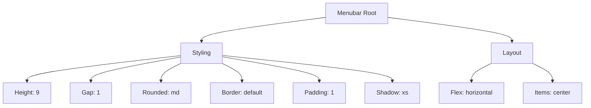
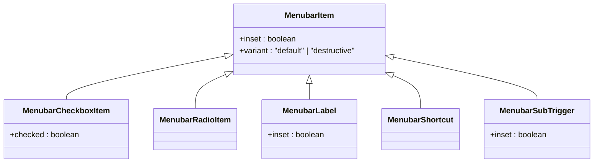

# Menubar

<cite>
**Referenced Files in This Document**   
- [menubar.tsx](file://src/components/ui/menubar.tsx)
</cite>

## Table of Contents
1. [Introduction](#introduction)
2. [Core Components](#core-components)
3. [Styling and Layout](#styling-and-layout)
4. [Accessibility Features](#accessibility-features)
5. [Menu Item Composition](#menu-item-composition)
6. [Event Handling](#event-handling)
7. [Integration with Authentication State](#integration-with-authentication-state)
8. [Responsive Behavior](#responsive-behavior)
9. [Usage in Photographer Dashboard](#usage-in-photographer-dashboard)

## Introduction
The Menubar component is a horizontal navigation menu designed for desktop interfaces, providing a structured way to organize application-level commands and navigation options. Built using Radix UI's MenubarPrimitive, it offers a robust foundation for creating accessible and visually consistent menu systems. This documentation details its implementation, usage patterns, accessibility features, styling options, and integration capabilities.

## Core Components
The Menubar component is composed of several subcomponents that work together to create a complete menu system:

- **Menubar**: The root component that wraps all menu items and provides the horizontal layout with border, shadow, and gap styling.
- **MenubarMenu**: Contains a menu's trigger and content.
- **MenubarTrigger**: The button that toggles the menu content.
- **MenubarContent**: The floating content that appears when the menu is open.
- **MenubarItem**: Individual menu items that can be selected.
- **MenubarCheckboxItem**: Menu items with checkbox functionality.
- **MenubarRadioItem**: Menu items with radio button functionality.
- **MenubarSub**: For creating nested submenus.
- **MenubarSeparator**: Visual divider between menu items.

These components work together to create a hierarchical menu structure that supports complex navigation patterns while maintaining accessibility.

**Section sources**
- [menubar.tsx](file://src/components/ui/menubar.tsx#L1-L277)

## Styling and Layout
The Menubar implements a horizontal layout with specific styling characteristics:

- **Container**: The root Menubar has a height of 9 units, with flex layout, gap of 1 unit, rounded corners, border, padding of 1 unit, and subtle shadow (shadow-xs).
- **Trigger**: Menu triggers have padding of 2 units horizontally and 1 unit vertically, with rounded corners and font medium styling.
- **Content**: Menu content has a minimum width of 12rem, rounded corners, border, padding of 1 unit, and medium shadow (shadow-md).
- **Items**: Menu items have padding of 2 units horizontally and 1.5 units vertically, with gap of 2 units between icon and text.
- **Submenus**: Submenu content has a minimum width of 8rem and larger shadow (shadow-lg).

The styling uses Tailwind CSS classes and the `cn` utility function for conditional class composition, ensuring consistency with the application's design system.

**Diagram sources**
- [menubar.tsx](file://src/components/ui/menubar.tsx#L1-L277)

## Accessibility Features
The Menubar component includes comprehensive accessibility features:

- **Keyboard Navigation**: Full keyboard support with arrow keys for navigation, Enter/Space for activation, and Escape to close menus.
- **Screen Reader Support**: Proper ARIA roles and attributes are automatically applied by Radix UI components.
- **Focus Management**: Visual focus indicators and proper focus trapping within open menus.
- **Semantic HTML**: Uses appropriate HTML elements and ARIA attributes for screen readers.
- **High Contrast**: Styling respects system preferences for contrast.

The implementation leverages Radix UI's built-in accessibility features, ensuring that the menu is usable for all users regardless of their interaction method.

**Section sources**
- [menubar.tsx](file://src/components/ui/menubar.tsx#L1-L277)

## Menu Item Composition
The Menubar supports various types of menu items with different compositions:

- **Standard Items**: Basic menu items with optional inset positioning and destructive variants.
- **Checkbox Items**: Items with checkbox indicators for boolean state selection.
- **Radio Items**: Items with radio indicators for single selection from a group.
- **Label Items**: Section headers or labels, optionally inset.
- **Shortcut Items**: Keyboard shortcut indicators that align to the right.
- **Nested Items**: Submenu triggers with right chevron indicators.

Each item type has specific styling and behavior, allowing for rich menu compositions that can accommodate complex application commands and navigation structures.

**Diagram sources**
- [menubar.tsx](file://src/components/ui/menubar.tsx#L1-L277)

## Event Handling
The Menubar component handles various user interactions through its subcomponents:

- **Click Events**: Triggered when menu items are clicked, handled by the underlying Radix UI components.
- **Keyboard Events**: Arrow keys navigate between items, Enter/Space activates items, Escape closes menus.
- **Hover States**: Visual feedback when hovering over menu triggers and items.
- **Focus States**: Visual indication of keyboard navigation and focus.
- **State Changes**: Events for menu open/close states, handled internally by Radix UI.

The event handling is primarily managed by the Radix UI primitives, with styling changes applied through data attributes like `data-state="open"` and `data-disabled`.

**Section sources**
- [menubar.tsx](file://src/components/ui/menubar.tsx#L1-L277)

## Integration with Authentication State
While the Menubar component itself doesn't directly handle authentication, it can be integrated with authentication state to show role-specific menu items:

- **Conditional Rendering**: Menu items can be conditionally rendered based on user role or authentication status.
- **Dynamic Content**: The menu structure can change based on whether a user is logged in and their role.
- **Protected Routes**: Menu items can link to routes that require specific authentication levels.

This integration would be handled at the application level, with the Menubar receiving props or context that determine which items to display.

**Section sources**
- [menubar.tsx](file://src/components/ui/menubar.tsx#L1-L277)

## Responsive Behavior
The Menubar is designed primarily for desktop interfaces, but considerations for responsive behavior include:

- **Desktop Focus**: Optimized for mouse and keyboard interaction on larger screens.
- **Mobile Adaptation**: On smaller screens, the menubar pattern may be replaced with alternative navigation patterns like hamburger menus or bottom navigation bars.
- **Viewport Awareness**: The component respects viewport boundaries when positioning menus.
- **Touch Support**: While designed for desktop, it maintains basic touch functionality.

For mobile interfaces, a different navigation component would typically be used, as the traditional menubar pattern is less suitable for touch-based interactions.

**Section sources**
- [menubar.tsx](file://src/components/ui/menubar.tsx#L1-L277)

## Usage in Photographer Dashboard
The Menubar component can be effectively used in photographer dashboard interfaces for:

- **Application Commands**: Organizing editing tools, export options, and sharing functions.
- **Navigation**: Providing quick access to different sections like portfolio, bookings, and settings.
- **Role-Specific Menus**: Showing different options for photographers vs. clients.
- **Workflow Organization**: Grouping related functions together in logical menu structures.

In a photographer dashboard, the menubar could include menus for File (New, Open, Save), Edit (Undo, Redo, Copy, Paste), View (Zoom, Layout), and Share (Export, Publish) operations, providing a familiar desktop application experience.

**Section sources**
- [menubar.tsx](file://src/components/ui/menubar.tsx#L1-L277)