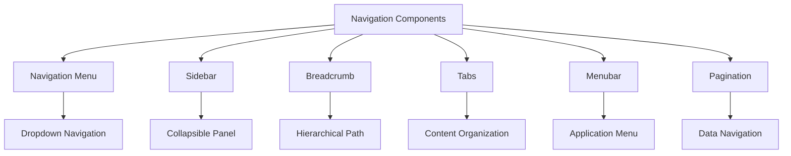
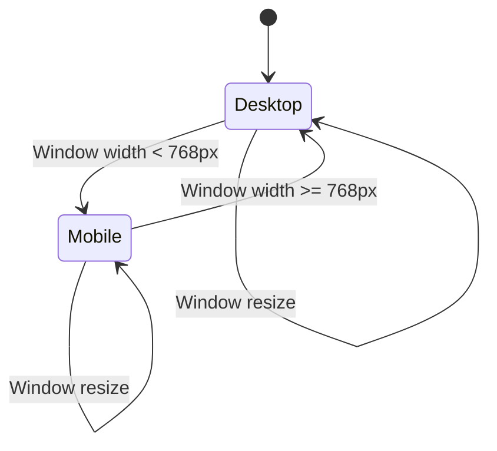
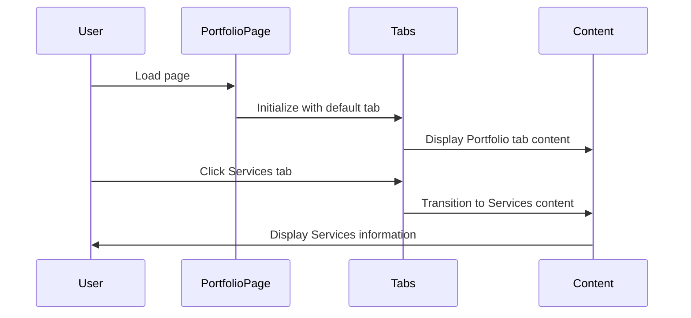
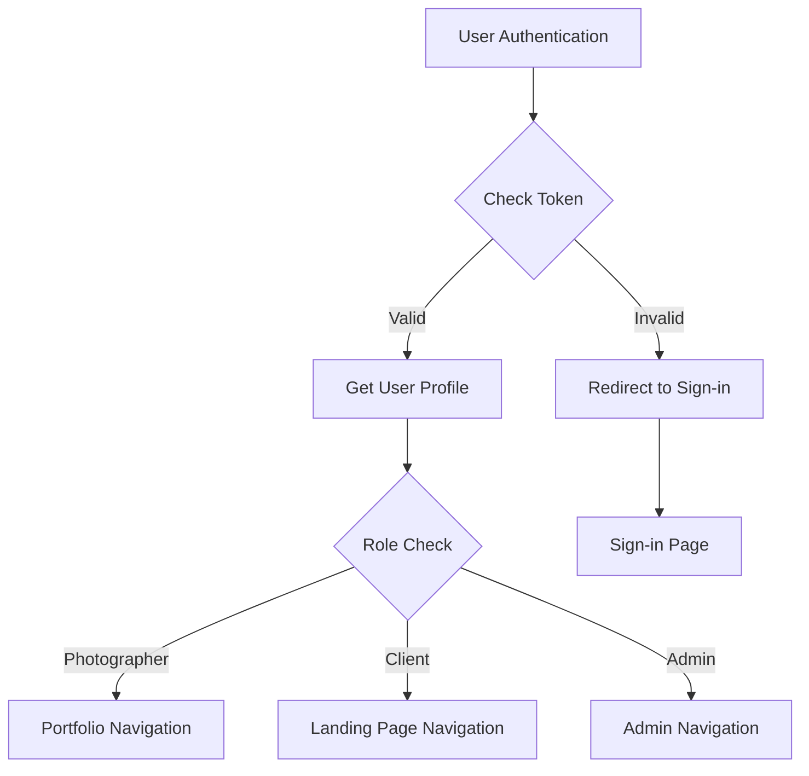

# Navigation Components

<cite>
**Referenced Files in This Document**   
- [navigation-menu.tsx](file://src/components/ui/navigation-menu.tsx)
- [sidebar.tsx](file://src/components/ui/sidebar.tsx)
- [breadcrumb.tsx](file://src/components/ui/breadcrumb.tsx)
- [tabs.tsx](file://src/components/ui/tabs.tsx)
- [menubar.tsx](file://src/components/ui/menubar.tsx)
- [pagination.tsx](file://src/components/ui/pagination.tsx)
- [use-mobile.ts](file://src/components/ui/use-mobile.ts)
- [PortfolioPage.tsx](file://src/components/PortfolioPage.tsx)
- [OnboardingForm.tsx](file://src/components/OnboardingForm.tsx)
- [auth.ts](file://src/middleware/auth.ts)
- [index.tsx](file://pages/index.tsx)
</cite>

## Table of Contents
1. [Introduction](#introduction)
2. [Core Navigation Components](#core-navigation-components)
3. [Responsive Behavior and Mobile Integration](#responsive-behavior-and-mobile-integration)
4. [Implementation in Key Pages](#implementation-in-key-pages)
5. [Accessibility Patterns](#accessibility-patterns)
6. [Navigation State Customization](#navigation-state-customization)
7. [Authentication Context Integration](#authentication-context-integration)
8. [Conclusion](#conclusion)

## Introduction
The navigation component suite in the SnapEvent application provides a comprehensive system for structuring application layout and enabling intuitive user navigation. This documentation covers the implementation and integration of navigation-menu.tsx, sidebar.tsx, breadcrumb.tsx, tabs.tsx, menubar.tsx, and pagination.tsx components, detailing their roles in the application architecture. The components are designed with responsive behavior using the use-mobile.ts hook and are integrated with Next.js routing patterns. Special attention is given to accessibility implementation, state customization, and role-based navigation through authentication context.

**Section sources**
- [navigation-menu.tsx](file://src/components/ui/navigation-menu.tsx#L1-L168)
- [sidebar.tsx](file://src/components/ui/sidebar.tsx#L1-L199)

## Core Navigation Components

### Navigation Menu
The NavigationMenu component provides a hierarchical navigation system with dropdown capabilities. It uses Radix UI's NavigationMenuPrimitive to create accessible, keyboard-navigable menus with smooth animations for content transitions. The component supports viewport positioning and includes trigger elements with visual indicators for open states.

### Sidebar
The Sidebar component implements a collapsible navigation panel that persists across application states. It maintains its open/collapsed state through cookies (SIDEBAR_COOKIE_NAME) and responds to keyboard shortcuts (Ctrl+B or Cmd+B). The sidebar uses a context provider pattern to share state across components and supports multiple variants including offcanvas, icon-only, and non-collapsible layouts.

### Breadcrumb
The Breadcrumb component creates hierarchical navigation trails that help users understand their location within the application. It implements proper ARIA labeling with landmark roles and supports separators and ellipsis indicators for truncated paths. Each breadcrumb item can be either a clickable link or a static page indicator.

### Tabs
The Tabs component provides content organization through tabbed interfaces. It uses Radix UI's TabsPrimitive to ensure proper keyboard navigation and screen reader accessibility. The implementation includes visual indicators for active tabs and supports both horizontal and vertical layouts with smooth transition animations.

### Menubar
The Menubar component creates application-wide menu systems with nested submenu support. It implements standard desktop application menu patterns with keyboard shortcuts, checkbox items, radio groups, and cascading submenus. The component supports both horizontal and vertical orientations with proper focus management.

### Pagination
The Pagination component handles data set navigation with previous/next controls and page indicators. It includes visual ellipsis elements for large page ranges and supports both numbered links and directional navigation. The component is designed to be screen reader friendly with proper ARIA current page indicators.

**Diagram sources**
- [navigation-menu.tsx](file://src/components/ui/navigation-menu.tsx#L1-L168)
- [sidebar.tsx](file://src/components/ui/sidebar.tsx#L1-L199)
- [breadcrumb.tsx](file://src/components/ui/breadcrumb.tsx#L1-L109)
- [tabs.tsx](file://src/components/ui/tabs.tsx#L1-L66)
- [menubar.tsx](file://src/components/ui/menubar.tsx#L1-L276)
- [pagination.tsx](file://src/components/ui/pagination.tsx#L1-L127)

**Section sources**
- [navigation-menu.tsx](file://src/components/ui/navigation-menu.tsx#L1-L168)
- [sidebar.tsx](file://src/components/ui/sidebar.tsx#L1-L199)
- [breadcrumb.tsx](file://src/components/ui/breadcrumb.tsx#L1-L109)
- [tabs.tsx](file://src/components/ui/tabs.tsx#L1-L66)
- [menubar.tsx](file://src/components/ui/menubar.tsx#L1-L276)
- [pagination.tsx](file://src/components/ui/pagination.tsx#L1-L127)

## Responsive Behavior and Mobile Integration

### Mobile Detection Hook
The use-mobile.ts hook provides responsive behavior by detecting screen size changes and determining mobile context. It uses a breakpoint of 768px to distinguish between mobile and desktop views and maintains state through useEffect to ensure consistent detection across component renders.

**Diagram sources**
- [use-mobile.ts](file://src/components/ui/use-mobile.ts#L1-L21)

### Responsive Navigation Patterns
The navigation components adapt their behavior based on the mobile detection:
- Sidebar collapses to an icon-only view on mobile
- Navigation menus convert to hamburger-style toggles
- Tabs may convert to scrollable carousels
- Pagination controls optimize for touch targets
- Menubars may convert to action sheets

The components use CSS custom properties (--sidebar-width, --sidebar-width-icon) to maintain consistent spacing across breakpoints and leverage Tailwind's responsive prefixes for layout adjustments.

**Section sources**
- [use-mobile.ts](file://src/components/ui/use-mobile.ts#L1-L21)
- [sidebar.tsx](file://src/components/ui/sidebar.tsx#L45-L91)

## Implementation in Key Pages

### PortfolioPage Implementation
The PortfolioPage component utilizes multiple navigation components to create a comprehensive photographer portfolio interface:
- Tabs organize content into Portfolio, About, Services, and Reviews sections
- Breadcrumb navigation provides context within the application hierarchy
- Pagination controls enable navigation through multiple portfolio pages
- Sidebar provides persistent navigation to key actions (Book Now, Contact)

The page implements smooth transitions between tab states using Framer Motion and maintains navigation state across user interactions.

### OnboardingForm Implementation
The OnboardingForm component uses navigation patterns to guide users through a multi-step registration process:
- Progress indicators show completion status across steps
- Tab-like navigation enables movement between form sections
- Breadcrumb elements provide context within the onboarding flow
- Keyboard navigation supports accessibility requirements

The form implements step-based navigation with validation and state persistence between steps.

**Diagram sources**
- [PortfolioPage.tsx](file://src/components/PortfolioPage.tsx#L1-L799)
- [OnboardingForm.tsx](file://src/components/OnboardingForm.tsx#L1-L799)

**Section sources**
- [PortfolioPage.tsx](file://src/components/PortfolioPage.tsx#L1-L799)
- [OnboardingForm.tsx](file://src/components/OnboardingForm.tsx#L1-L799)

## Accessibility Patterns

### Landmark Roles and ARIA Implementation
The navigation components implement comprehensive accessibility features:
- Navigation menus use aria-label and aria-current attributes
- Breadcrumbs include proper landmark roles and aria-hidden separators
- Tabs implement roving tabindex and aria-selected states
- Menubars support keyboard navigation with arrow keys
- Pagination includes aria-label and aria-current for screen readers

All interactive elements maintain visible focus indicators and support keyboard navigation without requiring mouse input.

### Keyboard Navigation
The components support standard keyboard interaction patterns:
- Tab/Shift+Tab for focus navigation
- Arrow keys for menu and tab selection
- Enter/Space for activation
- Escape to close dropdowns
- Ctrl+B/Cmd+B to toggle sidebar

The implementation follows WAI-ARIA authoring practices for menu, tablist, and breadcrumb patterns.

**Section sources**
- [navigation-menu.tsx](file://src/components/ui/navigation-menu.tsx#L1-L168)
- [breadcrumb.tsx](file://src/components/ui/breadcrumb.tsx#L1-L109)
- [tabs.tsx](file://src/components/ui/tabs.tsx#L1-L66)
- [menubar.tsx](file://src/components/ui/menubar.tsx#L1-L276)

## Navigation State Customization

### Theme and Style Customization
The navigation components support customization through:
- CSS variables for width and spacing
- Class variance authority (cva) for styling variants
- Props-based configuration for visual states
- Context-based state management

Developers can customize the appearance and behavior through component props and CSS overrides while maintaining accessibility standards.

### State Management
The components implement state management patterns:
- Sidebar uses React context for state sharing
- Navigation menus maintain open/closed states
- Tabs preserve selected tab across renders
- Pagination tracks current page state

State persistence is implemented through cookies (sidebar state) and URL parameters where appropriate.

**Section sources**
- [sidebar.tsx](file://src/components/ui/sidebar.tsx#L45-L131)
- [tabs.tsx](file://src/components/ui/tabs.tsx#L1-L66)

## Authentication Context Integration

### Role-Based Navigation
The authentication system enables role-specific navigation options through the auth.ts middleware. The withRole and withRoles higher-order functions restrict access based on user roles (ADMIN, PHOTOGRAPHER, CLIENT), allowing for conditional rendering of navigation elements based on authentication state.

### Protected Routes
The application implements protected routes that verify authentication status before rendering navigation elements. The middleware checks JWT tokens and user profiles to ensure only authorized users can access specific navigation paths, with appropriate redirect behavior for unauthorized access attempts.

### Navigation Based on Authentication State
The index.tsx file implements navigation flow based on authentication state:
- Unauthenticated users are directed to sign-in flows
- Photographers are routed to portfolio and onboarding pages
- Clients return to the landing page after registration
- Edit mode is activated when navigating from portfolio to onboarding

This pattern ensures appropriate navigation options are presented based on user authentication and role.

**Diagram sources**
- [auth.ts](file://src/middleware/auth.ts#L1-L95)
- [index.tsx](file://pages/index.tsx#L1-L115)

**Section sources**
- [auth.ts](file://src/middleware/auth.ts#L1-L95)
- [index.tsx](file://pages/index.tsx#L1-L115)

## Conclusion
The navigation component suite in the SnapEvent application provides a robust, accessible, and responsive system for user navigation. By leveraging Radix UI primitives and implementing consistent patterns across components, the system ensures a cohesive user experience across devices and screen sizes. The integration with authentication context enables role-based navigation, while the responsive design patterns ensure usability on both desktop and mobile devices. The components are designed with accessibility as a core principle, implementing proper ARIA roles, keyboard navigation, and screen reader support. This comprehensive navigation system forms the foundation of the application's user interface, enabling intuitive movement through the various features and functionality.