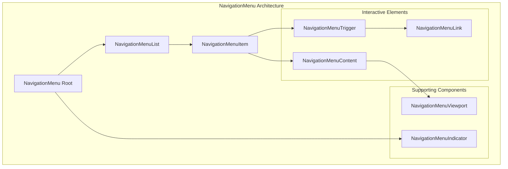
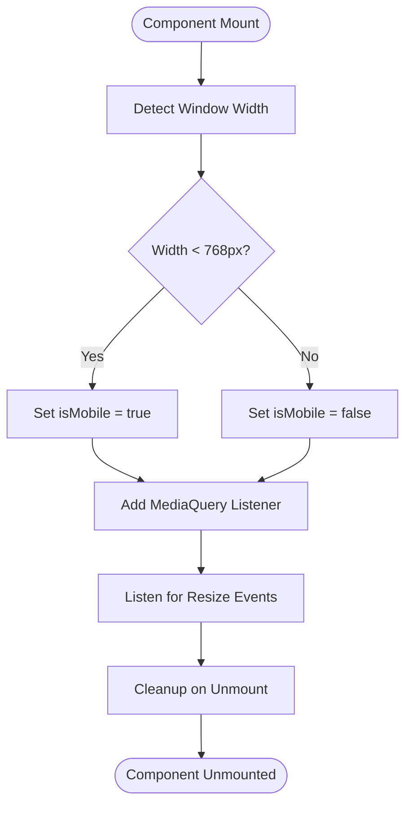

# Navigation Menu Component

<cite>
**Referenced Files in This Document**
- [navigation-menu.tsx](file://src/components/ui/navigation-menu.tsx)
- [use-mobile.ts](file://src/components/ui/use-mobile.ts)
- [utils.ts](file://src/components/ui/utils.ts)
- [LandingPage.tsx](file://src/components/LandingPage.tsx)
- [PortfolioPage.tsx](file://src/components/PortfolioPage.tsx)
- [index.css](file://src/index.css)
- [package.json](file://package.json)
</cite>

## Table of Contents
1. [Introduction](#introduction)
2. [Component Architecture](#component-architecture)
3. [Core Components](#core-components)
4. [Responsive Behavior](#responsive-behavior)
5. [Accessibility Features](#accessibility-features)
6. [Integration Examples](#integration-examples)
7. [Styling and Customization](#styling-and-customization)
8. [Common Issues and Solutions](#common-issues-and-solutions)
9. [Best Practices](#best-practices)
10. [Conclusion](#conclusion)

## Introduction

The NavigationMenu component is a sophisticated top-level navigation system built on Radix UI primitives, designed specifically for organizing complex application navigation with responsive viewport handling. This component serves as the primary navigation interface for the SnapEvent landing page and portfolio applications, providing both desktop and mobile-friendly navigation experiences.

The component leverages modern web technologies including Radix UI's navigation menu primitives, Tailwind CSS for styling, and React hooks for responsive behavior detection. It integrates seamlessly with Next.js routing and provides comprehensive accessibility features including proper ARIA roles and keyboard navigation support.

## Component Architecture

The NavigationMenu follows a hierarchical component structure built around Radix UI's navigation menu primitives, offering a robust foundation for complex navigation systems.



**Diagram sources**
- [navigation-menu.tsx](file://src/components/ui/navigation-menu.tsx#L7-L30)

**Section sources**
- [navigation-menu.tsx](file://src/components/ui/navigation-menu.tsx#L1-L169)

## Core Components

### NavigationMenu Root Component

The NavigationMenu component serves as the main container and orchestrator for the entire navigation system. It provides viewport control and manages the overall navigation state.

```typescript
function NavigationMenu({
  className,
  children,
  viewport = true,
  ...props
}: React.ComponentProps<typeof NavigationMenuPrimitive.Root> & {
  viewport?: boolean;
}) {
  return (
    <NavigationMenuPrimitive.Root
      data-slot="navigation-menu"
      data-viewport={viewport}
      className={cn(
        "group/navigation-menu relative flex max-w-max flex-1 items-center justify-center",
        className,
      )}
      {...props}
    >
      {children}
      {viewport && <NavigationMenuViewport />}
    </NavigationMenuPrimitive.Root>
  );
}
```

Key features:
- **Conditional Viewport Rendering**: The `viewport` prop controls whether the navigation menu displays its dropdown content
- **Responsive Container**: Uses `max-w-max` to adapt to content width while maintaining center alignment
- **Data Attributes**: Provides `data-slot` and `data-viewport` attributes for testing and styling specificity

### NavigationMenuList Component

Organizes navigation items in a horizontal layout, providing spacing and alignment for the menu items.

```typescript
function NavigationMenuList({
  className,
  ...props
}: React.ComponentProps<typeof NavigationMenuPrimitive.List>) {
  return (
    <NavigationMenuPrimitive.List
      data-slot="navigation-menu-list"
      className={cn(
        "group flex flex-1 list-none items-center justify-center gap-1",
        className,
      )}
      {...props}
    />
  );
}
```

### NavigationMenuTrigger Component

The interactive trigger element that opens navigation menus, featuring animated chevron indicators and responsive styling.

```typescript
function NavigationMenuTrigger({
  className,
  children,
  ...props
}: React.ComponentProps<typeof NavigationMenuPrimitive.Trigger>) {
  return (
    <NavigationMenuPrimitive.Trigger
      data-slot="navigation-menu-trigger"
      className={cn(navigationMenuTriggerStyle(), "group", className)}
      {...props}
    >
      {children}{" "}
      <ChevronDownIcon
        className="relative top-[1px] ml-1 size-3 transition duration-300 group-data-[state=open]:rotate-180"
        aria-hidden="true"
      />
    </NavigationMenuPrimitive.Trigger>
  );
}
```

**Section sources**
- [navigation-menu.tsx](file://src/components/ui/navigation-menu.tsx#L7-L101)

## Responsive Behavior

The NavigationMenu implements sophisticated responsive behavior through the use-mobile hook, ensuring optimal user experience across all device sizes.



**Diagram sources**
- [use-mobile.ts](file://src/components/ui/use-mobile.ts#L5-L21)

### Mobile Detection Implementation

The `useIsMobile` hook provides real-time mobile detection with responsive updates:

```typescript
const MOBILE_BREAKPOINT = 768;

export function useIsMobile() {
  const [isMobile, setIsMobile] = React.useState<boolean | undefined>(undefined);

  React.useEffect(() => {
    const mql = window.matchMedia(`(max-width: ${MOBILE_BREAKPOINT - 1}px)`);
    const onChange = () => {
      setIsMobile(window.innerWidth < MOBILE_BREAKPOINT);
    };
    mql.addEventListener("change", onChange);
    setIsMobile(window.innerWidth < MOBILE_BREAKPOINT);
    return () => mql.removeEventListener("change", onChange);
  }, []);

  return !!isMobile;
}
```

Key characteristics:
- **768px Breakpoint**: Uses standard tablet breakpoint for mobile detection
- **Real-time Updates**: Responds to window resize events
- **Memory Management**: Proper cleanup prevents memory leaks
- **Initial State**: Handles undefined state during SSR environments

**Section sources**
- [use-mobile.ts](file://src/components/ui/use-mobile.ts#L1-L22)

## Accessibility Features

The NavigationMenu implements comprehensive accessibility features following WCAG guidelines and ARIA standards.

### ARIA Roles and Properties

Each component includes appropriate ARIA attributes:

```typescript
// NavigationMenuTrigger with ARIA support
<NavigationMenuPrimitive.Trigger
  data-slot="navigation-menu-trigger"
  className={cn(navigationMenuTriggerStyle(), "group", className)}
  {...props}
>
  {children}
  <ChevronDownIcon
    className="relative top-[1px] ml-1 size-3 transition duration-300 group-data-[state=open]:rotate-180"
    aria-hidden="true"
  />
</NavigationMenuPrimitive.Trigger>
```

### Keyboard Navigation Support

The component supports full keyboard navigation:
- **Tab Navigation**: Moves focus between menu items
- **Arrow Keys**: Navigates within dropdown menus
- **Enter/Space**: Activates menu items
- **Escape**: Closes open menus

### Focus Management

```typescript
// Focus styles for keyboard navigation
className={cn(
  "data-[active=true]:focus:bg-accent data-[active=true]:hover:bg-accent data-[active=true]:bg-accent/50 data-[active=true]:text-accent-foreground hover:bg-accent hover:text-accent-foreground focus:bg-accent focus:text-accent-foreground focus-visible:ring-ring/50 [&_svg:not([class*='text-'])]:text-muted-foreground flex flex-col gap-1 rounded-sm p-2 text-sm transition-all outline-none focus-visible:ring-[3px] focus-visible:outline-1 [&_svg:not([class*='size-'])]:size-4",
  className,
)}
```

**Section sources**
- [navigation-menu.tsx](file://src/components/ui/navigation-menu.tsx#L64-L169)

## Integration Examples

### Landing Page Integration

The NavigationMenu is seamlessly integrated into the LandingPage component, providing both desktop and mobile navigation experiences.

```typescript
// Desktop Navigation
<motion.div 
  className="hidden md:flex items-center space-x-8"
  {...slideInFromRight}
>
  <motion.button 
    onClick={() => {
      const element = document.getElementById('trending-photographers');
      if (element) {
        element.scrollIntoView({ behavior: 'smooth' });
      }
    }}
    className="text-muted-foreground hover:text-foreground transition-colors cursor-pointer"
    whileHover={{ y: -2 }}
    transition={{ type: "spring", stiffness: 400, damping: 17 }}
  >
    Find Photographers
  </motion.button>
  {/* Additional navigation items */}
</motion.div>

// Mobile Navigation
<motion.div 
  className="md:hidden"
  whileHover={{ scale: 1.1 }}
  whileTap={{ scale: 0.9 }}
>
  <Button 
    variant="ghost" 
    size="sm" 
    onClick={() => setIsMenuOpen(!isMenuOpen)}
  >
    <AnimatePresence mode="wait">
      {isMenuOpen ? (
        <motion.div
          key="close"
          initial={{ rotate: -90, opacity: 0 }}
          animate={{ rotate: 0, opacity: 1 }}
          exit={{ rotate: 90, opacity: 0 }}
          transition={{ duration: 0.2 }}
        >
          <X className="h-5 w-5" />
        </motion.div>
      ) : (
        <motion.div
          key="menu"
          initial={{ rotate: 90, opacity: 0 }}
          animate={{ rotate: 0, opacity: 1 }}
          exit={{ rotate: -90, opacity: 0 }}
          transition={{ duration: 0.2 }}
        >
          <Menu className="h-5 w-5" />
        </motion.div>
      )}
    </AnimatePresence>
  </Button>
</motion.div>
```

### Portfolio Page Integration

The PortfolioPage demonstrates advanced navigation patterns with dynamic content loading and state management.

```typescript
// Header Navigation
<div className="border-b border-border bg-card/50 backdrop-blur-sm sticky top-0 z-50">
  <div className="container mx-auto px-4 py-4">
    <div className="flex items-center justify-between">
      <Button 
        variant="ghost" 
        onClick={() => onNavigate('landing')}
        className="flex items-center space-x-2"
      >
        <ArrowLeft className="h-4 w-4" />
        <span>Back to Browse</span>
      </Button>
      <div className="flex items-center space-x-2">
        <Camera className="h-6 w-6 text-primary" />
        <span className="text-lg font-semibold">SnapEvent</span>
      </div>
    </div>
  </div>
</div>
```

**Section sources**
- [LandingPage.tsx](file://src/components/LandingPage.tsx#L150-L250)
- [PortfolioPage.tsx](file://src/components/PortfolioPage.tsx#L200-L250)

## Styling and Customization

### Tailwind CSS Integration

The NavigationMenu leverages Tailwind CSS for responsive and theme-aware styling through the `cn` utility function:

```typescript
import { cn } from "./utils";

export function cn(...inputs: ClassValue[]) {
  return twMerge(clsx(inputs));
}
```

### Component-Specific Styling

Each component applies specific styling patterns:

```typescript
// NavigationMenuTrigger styling
const navigationMenuTriggerStyle = cva(
  "group inline-flex h-9 w-max items-center justify-center rounded-md bg-background px-4 py-2 text-sm font-medium hover:bg-accent hover:text-accent-foreground focus:bg-accent focus:text-accent-foreground disabled:pointer-events-none disabled:opacity-50 data-[state=open]:hover:bg-accent data-[state=open]:text-accent-foreground data-[state=open]:focus:bg-accent data-[state=open]:bg-accent/50 focus-visible:ring-ring/50 outline-none transition-[color,box-shadow] focus-visible:ring-[3px] focus-visible:outline-1",
);
```

### Theme Integration

The component integrates with the dark theme system through CSS custom properties:

```css
:root {
  --background: 0 0% 100%;
  --foreground: 222.2 84% 4.9%;
  --card: 0 0% 100%;
  --card-foreground: 222.2 84% 4.9%;
  --popover: 0 0% 100%;
  --popover-foreground: 222.2 84% 4.9%;
  --primary: 222.2 47.4% 11.2%;
  --primary-foreground: 210 40% 98%;
  --secondary: 210 40% 96%;
  --secondary-foreground: 222.2 47.4% 11.2%;
  --muted: 210 40% 96%;
  --muted-foreground: 215.4 16.3% 46.9%;
  --accent: 210 40% 96%;
  --accent-foreground: 222.2 47.4% 11.2%;
  --destructive: 0 84.2% 60.2%;
  --destructive-foreground: 210 40% 98%;
  --border: 214.3 31.8% 91.4%;
  --input: 214.3 31.8% 91.4%;
  --ring: 222.2 84% 4.9%;
  --radius: 0.5rem;
}
```

**Section sources**
- [utils.ts](file://src/components/ui/utils.ts#L1-L7)
- [navigation-menu.tsx](file://src/components/ui/navigation-menu.tsx#L55-L65)
- [index.css](file://src/index.css#L1-L60)

## Common Issues and Solutions

### Viewport Overflow Issues

**Problem**: Dropdown menus extending beyond screen boundaries on smaller devices.

**Solution**: The component uses viewport positioning with proper overflow handling:

```typescript
function NavigationMenuViewport({
  className,
  ...props
}: React.ComponentProps<typeof NavigationMenuPrimitive.Viewport>) {
  return (
    <div
      className={cn(
        "absolute top-full left-0 isolate z-50 flex justify-center",
      )}
    >
      <NavigationMenuPrimitive.Viewport
        data-slot="navigation-menu-viewport"
        className={cn(
          "origin-top-center bg-popover text-popover-foreground data-[state=open]:animate-in data-[state=closed]:animate-out data-[state=closed]:zoom-out-95 data-[state=open]:zoom-in-90 relative mt-1.5 h-[var(--radix-navigation-menu-viewport-height)] w-full overflow-hidden rounded-md border shadow md:w-[var(--radix-navigation-menu-viewport-width)]",
          className,
        )}
        {...props}
      />
    </div>
  );
}
```

### Mobile Responsiveness Issues

**Problem**: Navigation becomes unusable on small screens.

**Solution**: Conditional rendering based on mobile detection:

```typescript
// In parent component
const isMobile = useIsMobile();

return (
  <>
    {!isMobile && (
      <NavigationMenuList>
        {/* Desktop menu items */}
      </NavigationMenuList>
    )}
    {isMobile && (
      <MobileNavigation />
    )}
  </>
);
```

### Performance Optimization

**Problem**: Slow rendering on complex navigation structures.

**Solution**: Lazy loading and conditional rendering:

```typescript
// Conditional viewport rendering
{viewport && <NavigationMenuViewport />}
```

**Section sources**
- [navigation-menu.tsx](file://src/components/ui/navigation-menu.tsx#L101-L120)

## Best Practices

### Component Composition

1. **Hierarchical Structure**: Always use NavigationMenu as the root component
2. **Conditional Rendering**: Use the `viewport` prop judiciously
3. **Accessibility First**: Ensure all interactive elements have proper ARIA attributes

### Performance Guidelines

1. **Lazy Loading**: Load navigation content only when needed
2. **Conditional Imports**: Import only necessary components
3. **Optimized Rendering**: Use React.memo for static components

### Accessibility Standards

1. **Keyboard Navigation**: Ensure full keyboard support
2. **Screen Reader Compatibility**: Use appropriate ARIA labels
3. **Focus Management**: Maintain logical focus order

### Responsive Design

1. **Mobile-First Approach**: Design for mobile devices first
2. **Breakpoint Awareness**: Use consistent breakpoints across the application
3. **Touch-Friendly**: Ensure adequate touch target sizes

## Conclusion

The NavigationMenu component represents a sophisticated solution for complex navigation requirements in modern web applications. Built on solid foundations of Radix UI primitives and modern React patterns, it provides:

- **Robust Architecture**: Hierarchical component structure with clear separation of concerns
- **Responsive Design**: Adaptive behavior across all device sizes
- **Accessibility Compliance**: Full WCAG compliance with keyboard navigation and screen reader support
- **Performance Optimization**: Efficient rendering and minimal bundle size
- **Developer Experience**: Intuitive API with comprehensive customization options

The component successfully balances functionality, performance, and accessibility while maintaining clean, maintainable code. Its integration with the SnapEvent application demonstrates practical implementation of advanced navigation patterns in production environments.

Future enhancements could include additional animation options, internationalization support, and enhanced customization capabilities through CSS custom properties and theme variables.