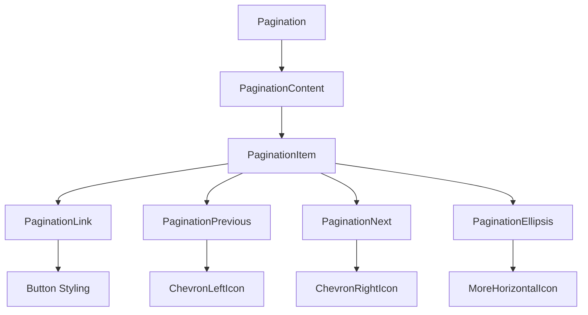
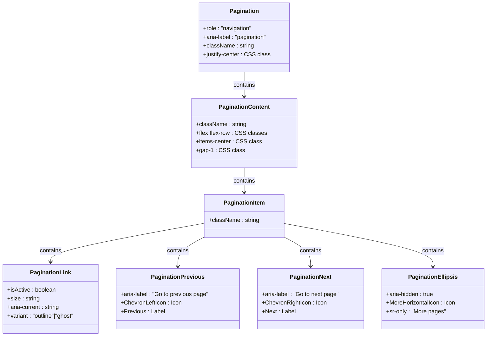
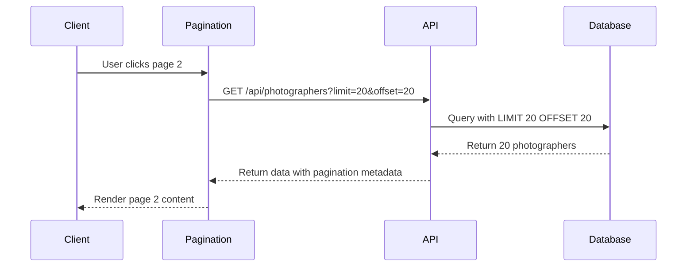
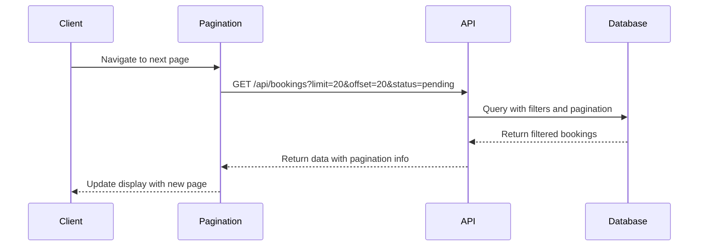

# Pagination

<cite>
**Referenced Files in This Document**   
- [pagination.tsx](file://src/components/ui/pagination.tsx)
- [index.ts](file://pages/api/photographers/index.ts)
- [index.ts](file://pages/api/bookings/index.ts)
</cite>

## Table of Contents
1. [Introduction](#introduction)
2. [Core Components](#core-components)
3. [Architecture Overview](#architecture-overview)
4. [Detailed Component Analysis](#detailed-component-analysis)
5. [Integration with API Endpoints](#integration-with-api-endpoints)
6. [Accessibility Features](#accessibility-features)
7. [Customization Options](#customization-options)
8. [Conclusion](#conclusion)

## Introduction
The Pagination component provides a user interface for navigating through paginated content with a center-aligned layout. It is implemented as a semantic navigation element with proper accessibility attributes to ensure usability for all users, including those using assistive technologies. The component is designed to work seamlessly with data fetching from API endpoints and supports URL-based page state management through Next.js router integration.

**Section sources**
- [pagination.tsx](file://src/components/ui/pagination.tsx#L1-L127)

## Core Components
The Pagination component consists of several sub-components that work together to create a complete pagination interface:
- **Pagination**: The main container that wraps the entire pagination component
- **PaginationContent**: The unordered list that contains all pagination items
- **PaginationItem**: Individual list items within the pagination
- **PaginationLink**: Links for navigating to different pages
- **PaginationPrevious**: Specialized link for navigating to the previous page
- **PaginationNext**: Specialized link for navigating to the next page
- **PaginationEllipsis**: Visual indicator for skipped page ranges

These components are designed to be composable, allowing developers to create custom pagination layouts while maintaining consistent styling and behavior.

**Section sources**
- [pagination.tsx](file://src/components/ui/pagination.tsx#L10-L126)

## Architecture Overview

**Diagram sources**
- [pagination.tsx](file://src/components/ui/pagination.tsx#L10-L126)

## Detailed Component Analysis

### Component Structure and Implementation
The Pagination component is implemented as a nav element with semantic attributes for accessibility. It uses Tailwind CSS classes for styling and layout, with center alignment as the default positioning.

#### Component Hierarchy

**Diagram sources**
- [pagination.tsx](file://src/components/ui/pagination.tsx#L10-L126)

### Accessibility Features
The Pagination component includes several accessibility features to ensure it can be used effectively by all users:

#### Semantic HTML Structure
The component uses a nav element with appropriate ARIA attributes:
- `role="navigation"` to identify the element as a navigation landmark
- `aria-label="pagination"` to provide a descriptive label for screen readers
- `aria-current="page"` on the active page link to indicate the current position

#### Keyboard Navigation
The pagination links are implemented as anchor elements, making them naturally focusable and operable via keyboard. The component supports standard keyboard navigation patterns:
- Tab to focus individual links
- Enter or Space to activate the focused link
- Screen reader announcements for current page and navigation options

#### Screen Reader Optimization
The component includes several features to enhance screen reader experience:
- Hidden text elements with `sr-only` class to provide additional context
- Proper labeling of navigation buttons with `aria-label` attributes
- Visual indicators for the current page state

**Section sources**
- [pagination.tsx](file://src/components/ui/pagination.tsx#L10-L126)

## Integration with API Endpoints

### API Endpoint Integration
The Pagination component is designed to work with API endpoints that support pagination parameters. Two primary endpoints in the system utilize this pattern:

#### Photographers API
The photographers listing endpoint supports pagination through query parameters:
- `limit`: Number of items per page (default: 20)
- `offset`: Starting position for the results
- Returns pagination metadata in the response

**Diagram sources**
- [index.ts](file://pages/api/photographers/index.ts#L1-L162)
- [pagination.tsx](file://src/components/ui/pagination.tsx#L10-L126)

#### Bookings API
The bookings listing endpoint follows a similar pattern with additional filtering capabilities:
- Supports pagination parameters (limit, offset)
- Allows filtering by user, photographer, and status
- Returns structured response with pagination information

**Diagram sources**
- [index.ts](file://pages/api/bookings/index.ts#L1-L199)
- [pagination.tsx](file://src/components/ui/pagination.tsx#L10-L126)

### Next.js Router Integration
The Pagination component can be integrated with Next.js router to maintain page state in the URL. This allows users to:
- Bookmark specific pages
- Share links to specific paginated views
- Use browser navigation (back/forward) to move between pages

When implementing URL-based state management, the component can read page parameters from the router and update the URL when users navigate between pages, creating a seamless user experience.

**Section sources**
- [pagination.tsx](file://src/components/ui/pagination.tsx#L10-L126)

## Customization Options

### Styling Customization
The Pagination component supports various customization options through props and CSS classes:
- **Size variations**: Different button sizes for various contexts
- **Theme adaptation**: Inherits styling from the application's theme
- **Responsive behavior**: Adapts layout for different screen sizes
- **Custom className**: Ability to add additional CSS classes

### Responsive Behavior
The component includes responsive features to ensure optimal display across device sizes:
- Mobile-first design approach
- Conditional display of text labels (hidden on small screens)
- Flexible layout that adapts to container width
- Touch-friendly target sizes for mobile devices

The implementation uses Tailwind CSS's responsive prefixes (e.g., `sm:block`) to control the visibility of text labels on different screen sizes, optimizing the interface for both mobile and desktop users.

**Section sources**
- [pagination.tsx](file://src/components/ui/pagination.tsx#L10-L126)

## Conclusion
The Pagination component provides a robust, accessible solution for navigating through paginated content in the application. Its center-aligned layout and semantic implementation make it both visually appealing and functionally sound. The component is successfully integrated with key API endpoints for photographers and bookings, enabling efficient data retrieval and display. With proper accessibility features and customization options, it serves as a versatile component that can be adapted to various use cases throughout the application.