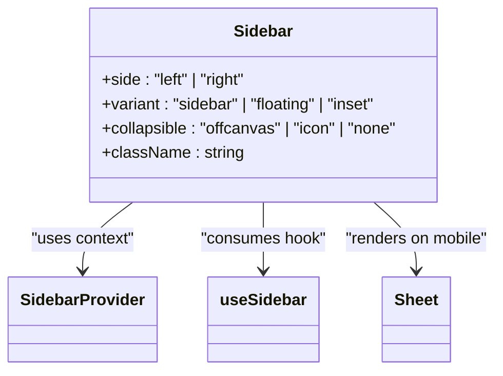
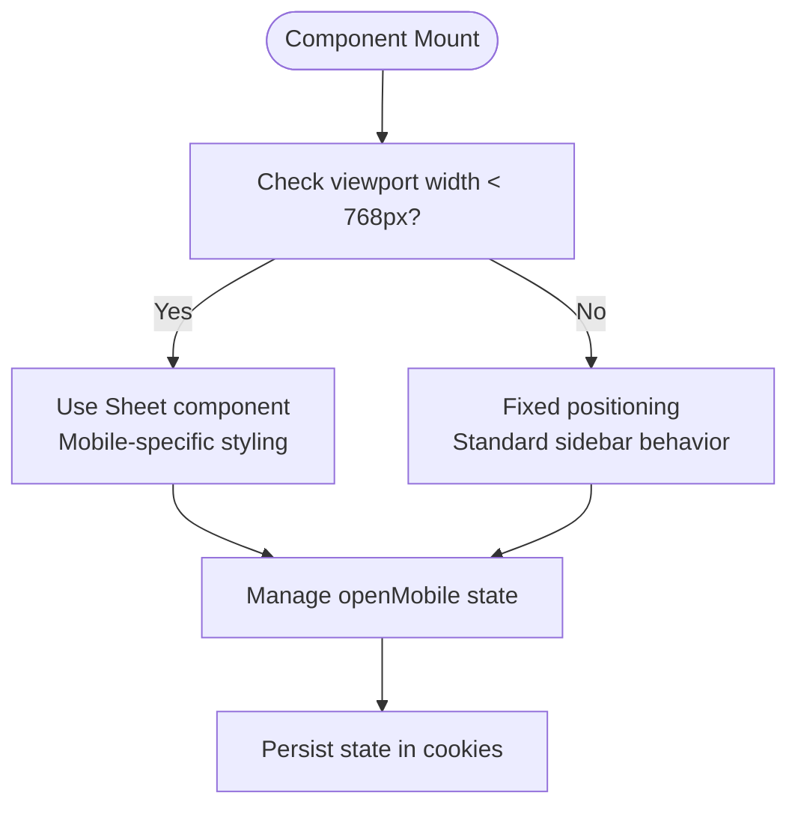
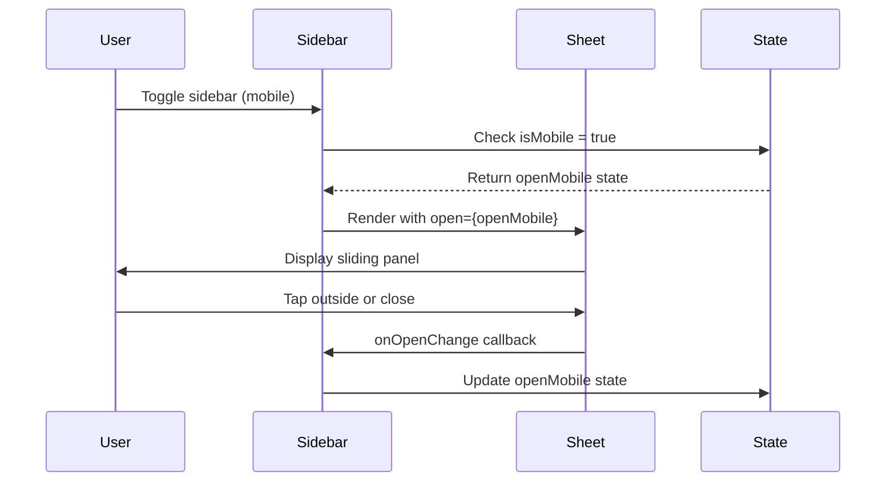
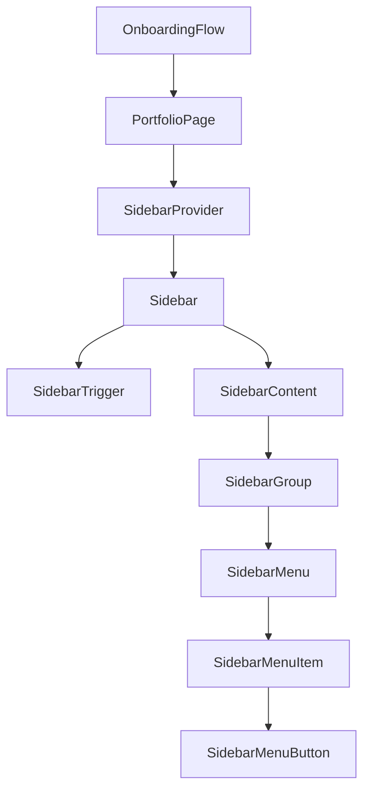

# Sidebar

<cite>
**Referenced Files in This Document**   
- [sidebar.tsx](file://src/components/ui/sidebar.tsx)
- [use-mobile.ts](file://src/components/ui/use-mobile.ts)
- [PortfolioPage.tsx](file://src/components/PortfolioPage.tsx)
- [onboarding.tsx](file://pages/onboarding.tsx)
</cite>

## Table of Contents
1. [Introduction](#introduction)
2. [Sidebar Variants](#sidebar-variants)
3. [Collapsible Modes](#collapsible-modes)
4. [Responsive Behavior and Mobile Detection](#responsive-behavior-and-mobile-detection)
5. [Desktop Layout and State Management](#desktop-layout-and-state-management)
6. [Mobile Implementation with Sheet Component](#mobile-implementation-with-sheet-component)
7. [Authentication Context Integration](#authentication-context-integration)
8. [Usage Examples](#usage-examples)
9. [Accessibility and Keyboard Navigation](#accessibility-and-keyboard-navigation)
10. [Performance Optimization](#performance-optimization)

## Introduction
The Sidebar component is a comprehensive navigation solution designed for the SnapEvent application. It provides three distinct variants (sidebar, floating, inset) with multiple collapsible modes (offcanvas, icon, none) to accommodate various layout requirements. The component features responsive behavior through mobile detection, smooth transitions, and persistent state management via cookies. This documentation details the implementation, integration, and usage patterns of the Sidebar component across the application.

**Section sources**
- [sidebar.tsx](file://src/components/ui/sidebar.tsx#L1-L727)

## Sidebar Variants
The Sidebar component supports three visual and behavioral variants:

1. **Sidebar**: The default variant that displays as a fixed-position navigation panel with standard border styling
2. **Floating**: A card-like variant with rounded corners, border, and shadow effects that appears elevated from the content
3. **Inset**: A variant designed to create inset layouts with appropriate spacing and shadow effects

Each variant adapts its styling and positioning based on the current state (expanded or collapsed) and screen size, providing a consistent user experience across different contexts.

**Diagram sources**
- [sidebar.tsx](file://src/components/ui/sidebar.tsx#L150-L250)

**Section sources**
- [sidebar.tsx](file://src/components/ui/sidebar.tsx#L150-L250)

## Collapsible Modes
The Sidebar component implements three collapsible modes that determine how the sidebar behaves when collapsed:

1. **Offcanvas**: The sidebar slides in from the side on desktop and functions as a modal sheet on mobile, completely hiding when collapsed
2. **Icon**: The sidebar collapses to a narrow icon-only mode while maintaining visibility of navigation icons
3. **None**: The sidebar remains fully expanded with no collapsible behavior

The collapsible mode affects both the visual presentation and interaction patterns, with different CSS transitions and layout calculations for each mode.

**Section sources**
- [sidebar.tsx](file://src/components/ui/sidebar.tsx#L150-L250)

## Responsive Behavior and Mobile Detection
The Sidebar component implements responsive behavior through the `useIsMobile` hook, which detects screen size using CSS media queries. The component automatically switches between desktop and mobile behaviors based on a 768px breakpoint.

On mobile devices, the sidebar transforms into a Sheet component that slides in from the side, providing a mobile-optimized navigation experience. The detection logic uses `window.matchMedia` to monitor viewport changes and update the component state accordingly.

**Diagram sources**
- [sidebar.tsx](file://src/components/ui/sidebar.tsx#L50-L100)
- [use-mobile.ts](file://src/components/ui/use-mobile.ts#L1-L21)

**Section sources**
- [sidebar.tsx](file://src/components/ui/sidebar.tsx#L50-L150)
- [use-mobile.ts](file://src/components/ui/use-mobile.ts#L1-L21)

## Desktop Layout and State Management
On desktop, the Sidebar implements fixed positioning with smooth CSS transitions for expanding and collapsing. The component uses several key features:

- **Fixed Positioning**: The sidebar maintains a fixed position on the screen with z-index management
- **CSS Variables**: Custom properties like `--sidebar-width` and `--sidebar-width-icon` control dimensions
- **Transition Effects**: 200ms ease-linear transitions for width and positioning changes
- **State Persistence**: Cookie-based storage (`sidebar_state`) preserves the collapsed/expanded state across sessions
- **Keyboard Shortcut**: Ctrl/Cmd + B toggles the sidebar state

The layout system includes a "gap" element that maintains proper spacing when the sidebar is collapsed, ensuring content reflows appropriately.

**Section sources**
- [sidebar.tsx](file://src/components/ui/sidebar.tsx#L100-L250)

## Mobile Implementation with Sheet Component
For mobile devices, the Sidebar component leverages the Sheet component to provide an off-canvas navigation experience. When the `isMobile` state is detected, the component renders a Sheet instead of the standard sidebar layout.

Key mobile-specific features include:
- Sheet component with hidden close button
- Mobile-optimized width (18rem vs 16rem on desktop)
- Touch-friendly hit areas with expanded click targets
- Modal behavior that overlays content
- Swipe gestures for opening and closing

The mobile implementation ensures that navigation remains accessible and usable on smaller screens while maintaining consistency with the desktop experience.

**Diagram sources**
- [sidebar.tsx](file://src/components/ui/sidebar.tsx#L180-L200)
- [sidebar.tsx](file://src/components/ui/sidebar.tsx#L20-L30)

**Section sources**
- [sidebar.tsx](file://src/components/ui/sidebar.tsx#L150-L250)

## Authentication Context Integration
The Sidebar component integrates with the application's authentication system to conditionally render photographer-specific navigation items. While the sidebar itself doesn't directly handle authentication, it works in conjunction with authentication state to customize the navigation experience.

Based on user role and authentication status, the sidebar can display different navigation options, such as:
- Photographer-specific management tools
- Booking and availability features
- Profile editing options

This integration is typically handled by parent components that conditionally render sidebar content based on the authenticated user's role and permissions.

**Section sources**
- [PortfolioPage.tsx](file://src/components/PortfolioPage.tsx#L0-L889)

## Usage Examples
### OnboardingForm Integration
In the onboarding flow, the Sidebar provides navigation options for photographers setting up their profiles. The component maintains state across different onboarding steps, allowing users to collapse the sidebar to focus on form completion.

### PortfolioPage Implementation
The PortfolioPage utilizes the Sidebar component to provide photographers with access to management features including:
- Availability management
- Booking management
- Profile editing
- Portfolio customization

The sidebar remains persistent across different tabs (Portfolio, About, Services, Reviews) within the PortfolioPage, maintaining navigation consistency.

**Diagram sources**
- [onboarding.tsx](file://pages/onboarding.tsx#L1-L25)
- [PortfolioPage.tsx](file://src/components/PortfolioPage.tsx#L0-L889)

**Section sources**
- [onboarding.tsx](file://pages/onboarding.tsx#L1-L25)
- [PortfolioPage.tsx](file://src/components/PortfolioPage.tsx#L0-L889)

## Accessibility and Keyboard Navigation
The Sidebar component implements comprehensive accessibility features:

- **Keyboard Navigation**: Full keyboard operability with Tab navigation through all interactive elements
- **Screen Reader Support**: Proper ARIA labels and semantic HTML structure
- **Focus Management**: Logical focus order and visible focus states
- **Keyboard Shortcut**: Ctrl/Cmd + B to toggle sidebar state
- **ARIA Attributes**: Appropriate roles and states for dynamic content
- **Reduced Motion**: Respects user preferences for reduced motion

Interactive elements include proper focus indicators, and the component ensures that all functionality is available through keyboard navigation alone.

**Section sources**
- [sidebar.tsx](file://src/components/ui/sidebar.tsx#L50-L100)

## Performance Optimization
The Sidebar component incorporates several performance optimizations:

- **Memoization**: Use of `React.useMemo` for context value to prevent unnecessary re-renders
- **Callback Optimization**: `React.useCallback` for event handlers to maintain referential equality
- **Efficient State Updates**: Batching of related state changes
- **CSS Transitions**: Hardware-accelerated CSS transforms for smooth animations
- **Conditional Rendering**: Avoids rendering offscreen content on mobile
- **Event Delegation**: Efficient event handling with minimal listeners

The component also implements cookie-based state persistence to avoid re-computing the sidebar state on each render, contributing to overall application performance.

**Section sources**
- [sidebar.tsx](file://src/components/ui/sidebar.tsx#L50-L150)