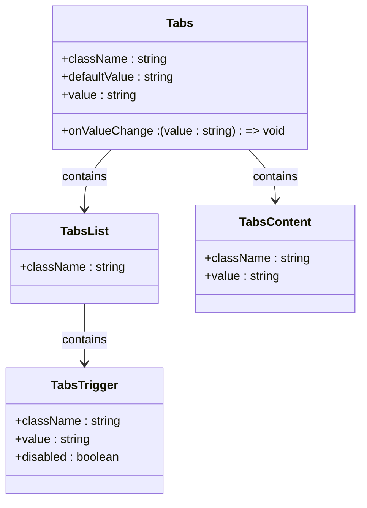
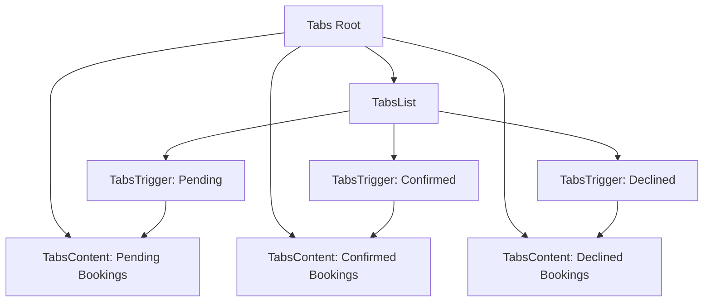

# Tabs

<cite>
**Referenced Files in This Document**   
- [tabs.tsx](file://src/components/ui/tabs.tsx)
- [PortfolioPage.tsx](file://src/components/PortfolioPage.tsx)
- [BookingManager.tsx](file://src/components/BookingManager.tsx)
- [OnboardingForm.tsx](file://src/components/OnboardingForm.tsx)
- [utils.ts](file://src/components/ui/utils.ts)
</cite>

## Table of Contents
1. [Introduction](#introduction)
2. [Core Implementation](#core-implementation)
3. [Layout and Styling](#layout-and-styling)
4. [Usage in Profile and Portfolio Sections](#usage-in-profile-and-portfolio-sections)
5. [Accessibility Features](#accessibility-features)
6. [Integration with React State](#integration-with-react-state)
7. [Customization Options](#customization-options)
8. [Common Issues and Solutions](#common-issues-and-solutions)

## Introduction
The Tabs component provides a structured interface for organizing content into tabbed sections, enabling users to navigate between different views without leaving the current page. Built on Radix UI's TabsPrimitive, it offers accessibility compliance, keyboard navigation, and flexible styling options. This documentation details its implementation, usage patterns, and integration across key application areas such as portfolio management, booking workflows, and onboarding processes.

## Core Implementation

The Tabs component is implemented as a wrapper around `@radix-ui/react-tabs`, providing enhanced styling and layout through Tailwind CSS utilities. It consists of four main parts:

- **Tabs**: The root container that manages the tab state
- **TabsList**: The horizontal or grid layout container for tab triggers
- **TabsTrigger**: Individual tab buttons that activate corresponding content
- **TabsContent**: Panels that display content when their associated tab is active

All components are exported for reuse and follow the headless UI pattern, allowing full control over styling while maintaining accessibility standards.

**Section sources**
- [tabs.tsx](file://src/components/ui/tabs.tsx#L1-L65)

## Layout and Styling

The Tabs component uses a flex layout with gap styling to ensure consistent spacing and alignment. The root container applies `flex flex-col gap-2` by default, creating vertical separation between the tab list and content area.

The **TabsList** is styled as an inline flex container with a subtle background (`bg-muted`) and rounded edges (`rounded-xl`). It includes padding (`p-[3px]`) to create a contained appearance and uses `w-fit` to adapt to the number of tabs.

Each **TabsTrigger** features conditional styling based on its active state using Radix's `data-[state=active]` attribute:
- Active tabs have a card-like background (`data-[state=active]:bg-card`)
- Text color changes to foreground level for better contrast
- Smooth transitions for color and box-shadow properties
- Disabled state with reduced opacity and pointer events disabled

Custom icons can be included within triggers, and the `whitespace-nowrap` class prevents text wrapping.



**Diagram sources**
- [tabs.tsx](file://src/components/ui/tabs.tsx#L1-L65)

**Section sources**
- [tabs.tsx](file://src/components/ui/tabs.tsx#L1-L65)

## Usage in Profile and Portfolio Sections

### PortfolioPage Implementation

The Tabs component is extensively used in the **PortfolioPage** to organize photographer information across four main sections: Portfolio, About, Services, and Reviews. The implementation uses a grid layout for the tab list with `grid-cols-4` to evenly distribute tab items.

```tsx
<Tabs defaultValue="portfolio" className="space-y-8">
  <TabsList className="grid w-full max-w-md mx-auto grid-cols-4">
    <TabsTrigger value="portfolio">Portfolio</TabsTrigger>
    <TabsTrigger value="about">About</TabsTrigger>
    <TabsTrigger value="services">Services</TabsTrigger>
    <TabsTrigger value="reviews">Reviews</TabsTrigger>
  </TabsList>
  
  <TabsContent value="portfolio">...</TabsContent>
  <TabsContent value="about">...</TabsContent>
  <TabsContent value="services">...</TabsContent>
  <TabsContent value="reviews">...</TabsContent>
</Tabs>
```

This structure allows photographers to showcase their work while keeping related information organized and easily accessible.

### Booking Management Workflow

In the **BookingManager** component, tabs are used to filter bookings by status: Pending, Confirmed, and Declined. Each tab displays a count of bookings in that category, providing immediate visual feedback.

The tab triggers include icons (AlertCircle, CheckCircle, XCircle) to enhance recognition and improve user experience. The content areas render lists of booking cards with action buttons, enabling quick management of client requests.



**Diagram sources**
- [PortfolioPage.tsx](file://src/components/PortfolioPage.tsx#L479-L513)
- [BookingManager.tsx](file://src/components/BookingManager.tsx#L320-L334)

**Section sources**
- [PortfolioPage.tsx](file://src/components/PortfolioPage.tsx#L479-L513)
- [BookingManager.tsx](file://src/components/BookingManager.tsx#L320-L334)

## Accessibility Features

The Tabs component implements comprehensive accessibility features in accordance with WAI-ARIA standards:

- **ARIA Roles**: Automatically applied by Radix UI, including `role="tablist"`, `role="tab"`, and `role="tabpanel"`
- **Keyboard Navigation**:
  - Arrow keys navigate between tabs (horizontal and vertical)
  - Home/End keys jump to first/last tab
  - Space or Enter activates the focused tab
- **Focus Management**: Visual focus indicators are enhanced with `focus-visible:ring-[3px]` and `focus-visible:outline-ring`
- **State Indicators**: `data-[state=active]` attributes enable CSS-based styling for active tabs
- **Screen Reader Support**: Proper labeling and semantic structure ensure compatibility with assistive technologies

The implementation respects user preferences through `prefers-reduced-motion` media queries and maintains high contrast ratios for text and interactive elements.

**Section sources**
- [tabs.tsx](file://src/components/ui/tabs.tsx#L1-L65)

## Integration with React State

While the Tabs component manages its internal state via Radix UI's context system, it can be controlled through external React state when needed. The `value` and `onValueChange` props allow parent components to synchronize tab selection with application state.

In the **PortfolioPage**, although the tabs themselves don't directly use React state for active tab management, other UI elements like category filters use `useState` to manage selection:

```tsx
const [selectedCategory, setSelectedCategory] = useState('all');
```

This pattern could be extended to control tabs programmatically, such as when implementing deep linking or restoring state from URL parameters.

The component also integrates with form workflows in **OnboardingForm**, where tab-like navigation guides users through multi-step processes, though this specific implementation uses manual step management rather than the Tabs component.

**Section sources**
- [PortfolioPage.tsx](file://src/components/PortfolioPage.tsx#L20-L25)
- [OnboardingForm.tsx](file://src/components/OnboardingForm.tsx#L30-L35)

## Customization Options

The Tabs component supports extensive customization through:

### Styling Props
- `className` on all components for Tailwind utility overrides
- Default styling via `cn()` utility that merges custom and base classes
- Theme-aware styling using data attributes (`dark:data-[state=active]:bg-input/30`)

### Layout Variations
- **Grid Layout**: Achieved with `grid grid-cols-*` on TabsList
- **Flex Layout**: Default horizontal arrangement
- **Vertical Tabs**: Possible by modifying container direction

### Content Flexibility
- Rich content within TabsContent (forms, lists, media)
- Icon integration in TabsTrigger
- Dynamic tab generation based on data

The `utils.ts` file provides the `cn()` function that intelligently merges Tailwind classes, ensuring that custom styles don't conflict with base styles.

```mermaid
graph TB
A[Customization] --> B[Styling]
A --> C[Layout]
A --> D[Content]
B --> B1[className prop]
B --> B2[cn() utility]
B --> B3[Theme support]
C --> C1[Grid layout]
C --> C2[Flex layout]
C --> C3[Vertical arrangement]
D --> D1[Rich content]
D --> D2[Icon support]
D --> D3[Dynamic generation]
```

**Diagram sources**
- [tabs.tsx](file://src/components/ui/tabs.tsx#L1-L65)
- [utils.ts](file://src/components/ui/utils.ts#L1-L7)

**Section sources**
- [tabs.tsx](file://src/components/ui/tabs.tsx#L1-L65)
- [utils.ts](file://src/components/ui/utils.ts#L1-L7)

## Common Issues and Solutions

### Content Loading
When tabs contain async content (like the photographer data in PortfolioPage), loading states should be managed independently of the tab component. The implementation uses a separate `isLoading` state with skeleton loaders to provide feedback during data fetching.

### Dynamic Tab Generation
While the current implementation uses static tabs, dynamic generation can be achieved by mapping over data arrays:

```tsx
<TabsList>
  {categories.map((category) => (
    <TabsTrigger key={category.value} value={category.value}>
      {category.label}
    </TabsTrigger>
  ))}
</TabsList>
```

### Performance Considerations
- TabsContent remains mounted by default (Radix UI behavior)
- For performance-critical applications, consider unmounting inactive tabs
- Use React.memo for expensive tab content

### Mobile Responsiveness
The tab layout adapts to mobile through:
- `w-full` on TabsList for full-width display
- `flex-wrap` support for overflow handling
- Touch-friendly hit areas with adequate spacing

**Section sources**
- [PortfolioPage.tsx](file://src/components/PortfolioPage.tsx#L20-L219)
- [tabs.tsx](file://src/components/ui/tabs.tsx#L1-L65)