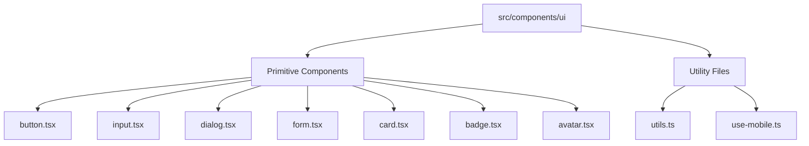
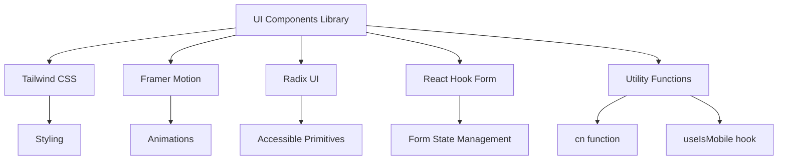
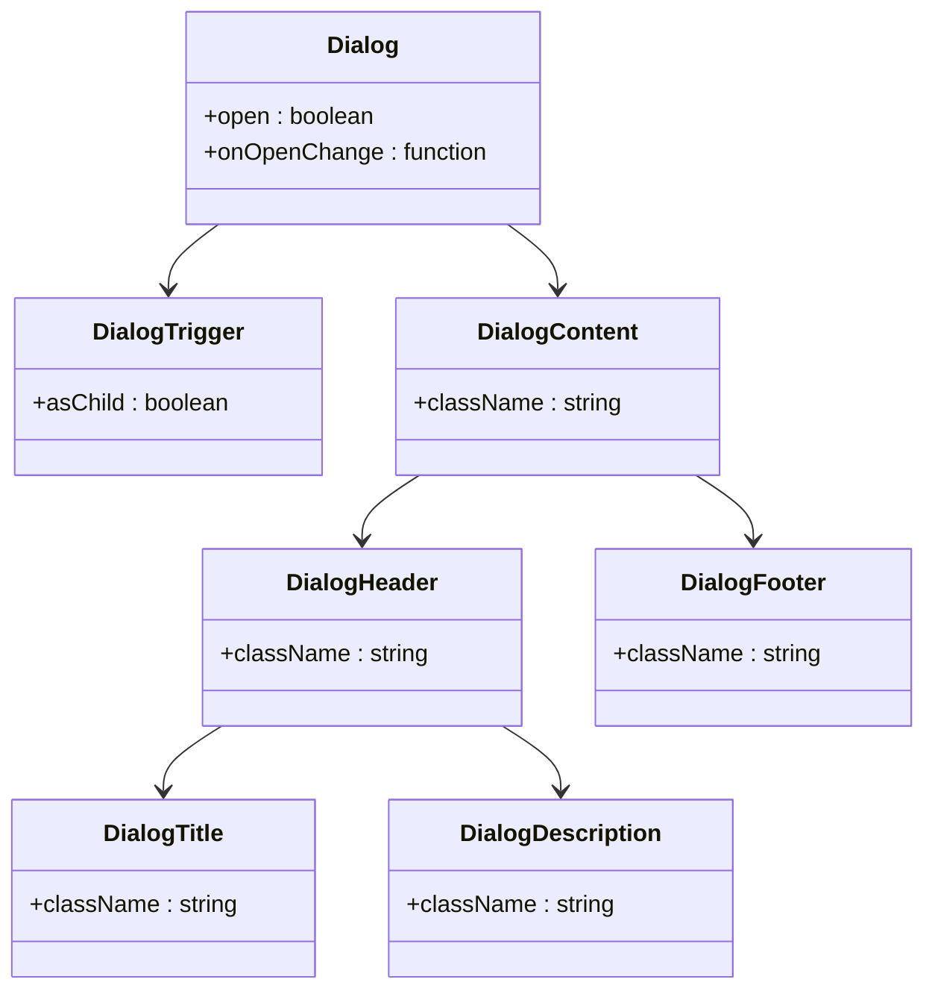
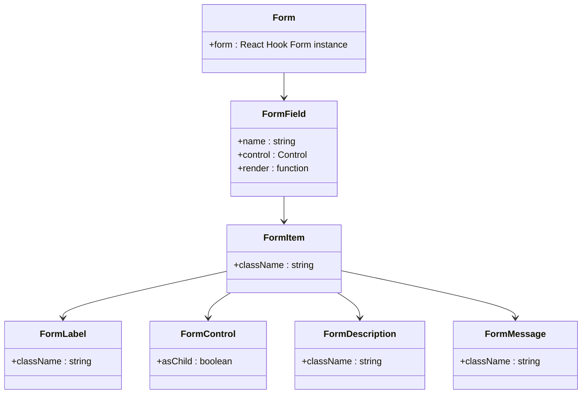
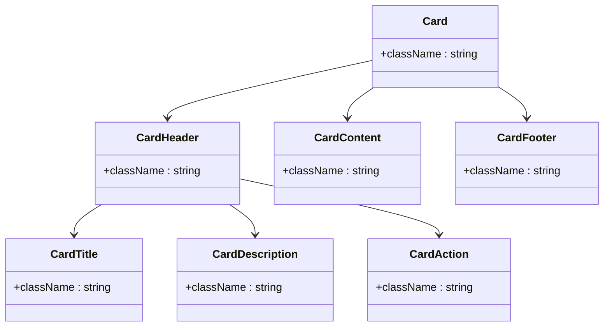
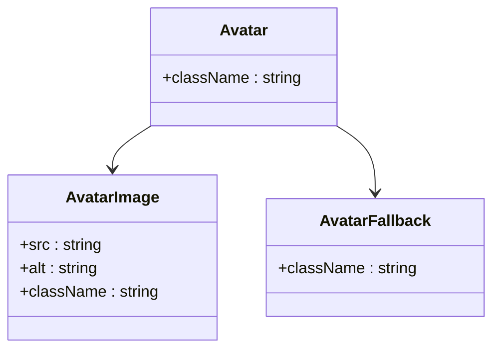
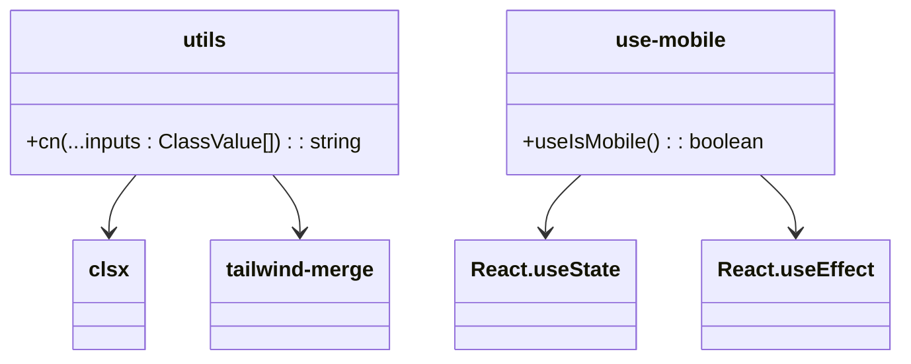
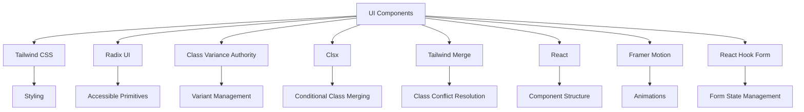

# UI Components Library

<cite>
**Referenced Files in This Document**   
- [button.tsx](file://src/components/ui/button.tsx)
- [input.tsx](file://src/components/ui/input.tsx)
- [dialog.tsx](file://src/components/ui/dialog.tsx)
- [form.tsx](file://src/components/ui/form.tsx)
- [card.tsx](file://src/components/ui/card.tsx)
- [badge.tsx](file://src/components/ui/badge.tsx)
- [avatar.tsx](file://src/components/ui/avatar.tsx)
- [utils.ts](file://src/components/ui/utils.ts)
- [use-mobile.ts](file://src/components/ui/use-mobile.ts)
- [LandingPage.tsx](file://src/components/LandingPage.tsx)
- [OnboardingForm.tsx](file://src/components/OnboardingForm.tsx)
- [tailwind.config.js](file://tailwind.config.js)
</cite>

## Table of Contents
1. [Introduction](#introduction)
2. [Project Structure](#project-structure)
3. [Core Components](#core-components)
4. [Architecture Overview](#architecture-overview)
5. [Detailed Component Analysis](#detailed-component-analysis)
6. [Dependency Analysis](#dependency-analysis)
7. [Performance Considerations](#performance-considerations)
8. [Troubleshooting Guide](#troubleshooting-guide)
9. [Conclusion](#conclusion)

## Introduction
The UI Components Library in the SnapEvent project provides a comprehensive collection of accessible, reusable, and responsive components built with React, Tailwind CSS, and Framer Motion. This documentation details the implementation of primitive components such as buttons, forms, inputs, dialogs, and navigation elements, along with utility functions that support responsive design. The components are designed to be accessible, with proper keyboard navigation and screen reader support, and are integrated with Tailwind CSS for styling and Framer Motion for animations.

## Project Structure



**Diagram sources**
- [button.tsx](file://src/components/ui/button.tsx)
- [input.tsx](file://src/components/ui/input.tsx)
- [dialog.tsx](file://src/components/ui/dialog.tsx)
- [form.tsx](file://src/components/ui/form.tsx)
- [card.tsx](file://src/components/ui/card.tsx)
- [badge.tsx](file://src/components/ui/badge.tsx)
- [avatar.tsx](file://src/components/ui/avatar.tsx)
- [utils.ts](file://src/components/ui/utils.ts)
- [use-mobile.ts](file://src/components/ui/use-mobile.ts)

**Section sources**
- [src/components/ui](file://src/components/ui)

## Core Components

The UI components library consists of primitive components that are designed to be accessible, reusable, and responsive. These components are built using React and styled with Tailwind CSS, with animations powered by Framer Motion. The library includes components for buttons, forms, inputs, dialogs, cards, badges, avatars, and more, each with support for accessibility features such as keyboard navigation and screen reader support.

**Section sources**
- [button.tsx](file://src/components/ui/button.tsx)
- [input.tsx](file://src/components/ui/input.tsx)
- [dialog.tsx](file://src/components/ui/dialog.tsx)
- [form.tsx](file://src/components/ui/form.tsx)
- [card.tsx](file://src/components/ui/card.tsx)
- [badge.tsx](file://src/components/ui/badge.tsx)
- [avatar.tsx](file://src/components/ui/avatar.tsx)

## Architecture Overview



**Diagram sources**
- [tailwind.config.js](file://tailwind.config.js)
- [utils.ts](file://src/components/ui/utils.ts)
- [use-mobile.ts](file://src/components/ui/use-mobile.ts)
- [package.json](file://package.json)

**Section sources**
- [tailwind.config.js](file://tailwind.config.js)
- [utils.ts](file://src/components/ui/utils.ts)
- [use-mobile.ts](file://src/components/ui/use-mobile.ts)
- [package.json](file://package.json)

## Detailed Component Analysis

### Button Component Analysis

```mermaid
classDiagram
class Button {
+variant : default | destructive | outline | secondary | ghost | link
+size : default | sm | lg | icon
+asChild : boolean
+className : string
}
Button -->|uses| utils : cn function
Button -->|uses| class-variance-authority : cva
```

**Diagram sources**
- [button.tsx](file://src/components/ui/button.tsx)
- [utils.ts](file://src/components/ui/utils.ts)

**Section sources**
- [button.tsx](file://src/components/ui/button.tsx)

### Input Component Analysis

```mermaid
classDiagram
class Input {
+type : string
+className : string
}
Input -->|uses| utils : cn function
```

**Diagram sources**
- [input.tsx](file://src/components/ui/input.tsx)
- [utils.ts](file://src/components/ui/utils.ts)

**Section sources**
- [input.tsx](file://src/components/ui/input.tsx)

### Dialog Component Analysis



**Diagram sources**
- [dialog.tsx](file://src/components/ui/dialog.tsx)

**Section sources**
- [dialog.tsx](file://src/components/ui/dialog.tsx)

### Form Component Analysis



**Diagram sources**
- [form.tsx](file://src/components/ui/form.tsx)

**Section sources**
- [form.tsx](file://src/components/ui/form.tsx)

### Card Component Analysis



**Diagram sources**
- [card.tsx](file://src/components/ui/card.tsx)

**Section sources**
- [card.tsx](file://src/components/ui/card.tsx)

### Badge Component Analysis

```mermaid
classDiagram
class Badge {
+variant : default | secondary | destructive | outline
+asChild : boolean
+className : string
}
Badge -->|uses| utils : cn function
Badge -->|uses| class-variance-authority : cva
```

**Diagram sources**
- [badge.tsx](file://src/components/ui/badge.tsx)
- [utils.ts](file://src/components/ui/utils.ts)

**Section sources**
- [badge.tsx](file://src/components/ui/badge.tsx)

### Avatar Component Analysis



**Diagram sources**
- [avatar.tsx](file://src/components/ui/avatar.tsx)

**Section sources**
- [avatar.tsx](file://src/components/ui/avatar.tsx)

### Utility Functions Analysis



**Diagram sources**
- [utils.ts](file://src/components/ui/utils.ts)
- [use-mobile.ts](file://src/components/ui/use-mobile.ts)

**Section sources**
- [utils.ts](file://src/components/ui/utils.ts)
- [use-mobile.ts](file://src/components/ui/use-mobile.ts)

## Dependency Analysis



**Diagram sources**
- [package.json](file://package.json)
- [tailwind.config.js](file://tailwind.config.js)

**Section sources**
- [package.json](file://package.json)
- [tailwind.config.js](file://tailwind.config.js)

## Performance Considerations
The UI components library is designed with performance in mind. Components are built using React's functional components and hooks, ensuring optimal rendering performance. The use of Tailwind CSS for styling eliminates the need for runtime CSS-in-JS solutions, reducing bundle size and improving load times. Framer Motion is used for animations, providing smooth and performant transitions. The library also includes utility functions like `cn` for efficient class name merging and `useIsMobile` for responsive design, ensuring optimal performance across devices.

## Troubleshooting Guide

When encountering issues with the UI components library, consider the following:

1. Ensure all required dependencies are installed and up to date.
2. Verify that Tailwind CSS is properly configured and the `tailwind.config.js` file is correctly set up.
3. Check that the `cn` function is correctly imported and used for class name merging.
4. Ensure that the `useIsMobile` hook is properly implemented for responsive design.
5. Verify that all Radix UI components are correctly imported and used.
6. Check that Framer Motion is properly configured for animations.
7. Ensure that React Hook Form is correctly set up for form state management.

**Section sources**
- [utils.ts](file://src/components/ui/utils.ts)
- [use-mobile.ts](file://src/components/ui/use-mobile.ts)
- [tailwind.config.js](file://tailwind.config.js)
- [package.json](file://package.json)

## Conclusion
The UI Components Library in the SnapEvent project provides a robust and accessible collection of reusable components built with React, Tailwind CSS, and Framer Motion. The library is designed to be responsive, accessible, and performant, with support for keyboard navigation and screen reader support. The components are integrated with Tailwind CSS for styling and Framer Motion for animations, ensuring a consistent and engaging user experience. The library also includes utility functions for responsive design and class name merging, making it easy to build and maintain a consistent design system.