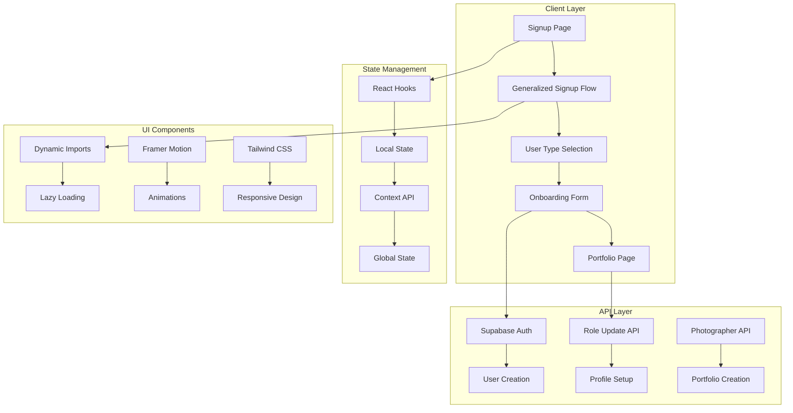
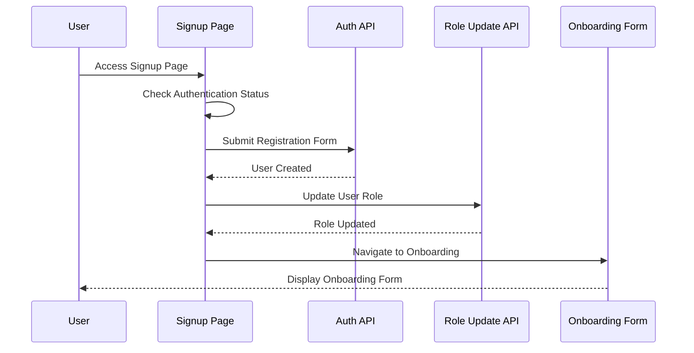
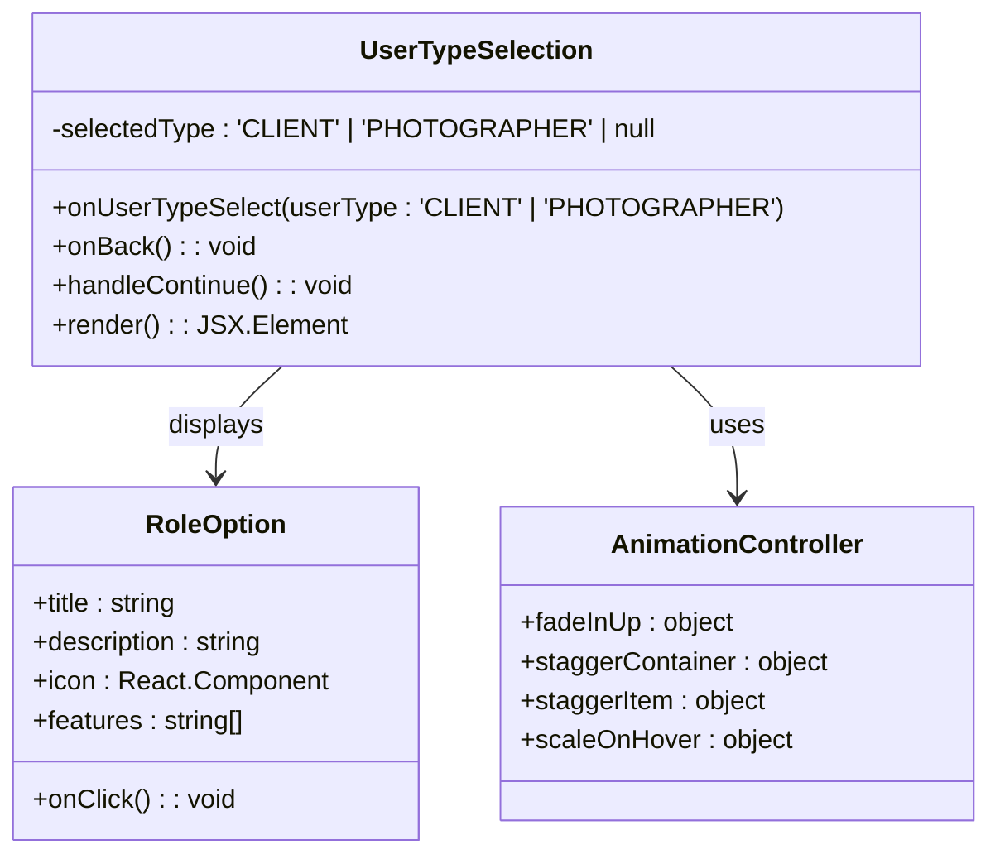
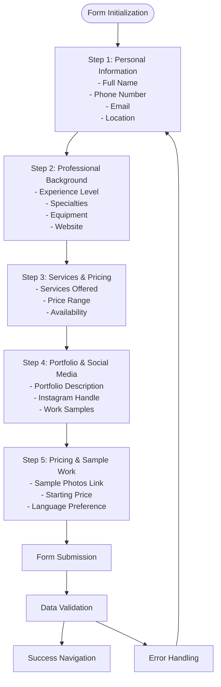
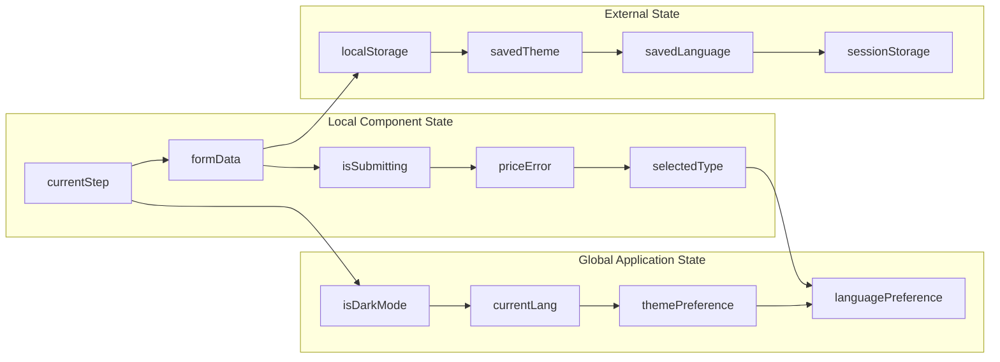
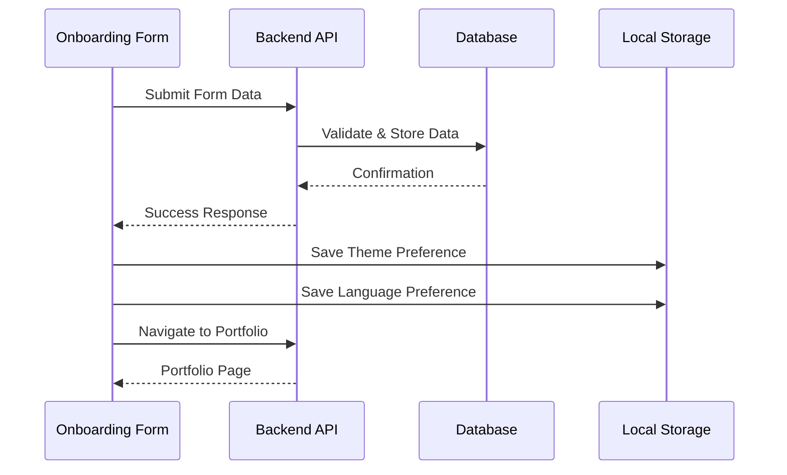
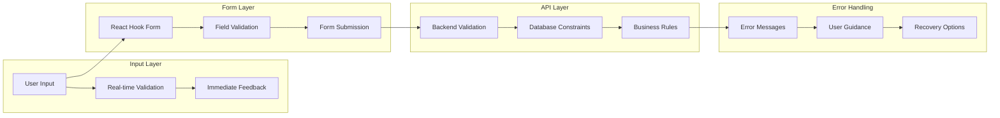
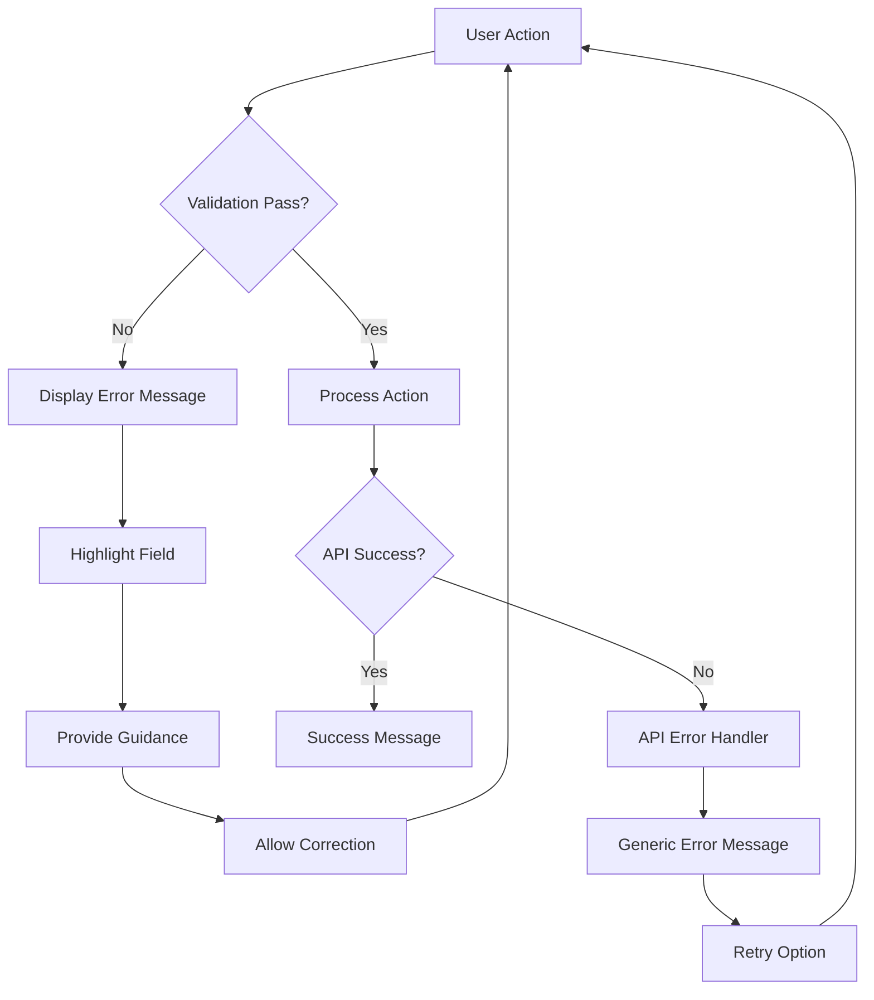

# Onboarding Flow Implementation

<cite>
**Referenced Files in This Document**
- [pages/onboarding.tsx](file://pages/onboarding.tsx)
- [src/components/OnboardingForm.tsx](file://src/components/OnboardingForm.tsx)
- [src/components/UserTypeSelection.tsx](file://src/components/UserTypeSelection.tsx)
- [pages/signup.tsx](file://pages/signup.tsx)
- [src/components/GeneralizedSignupFlow.tsx](file://src/components/GeneralizedSignupFlow.tsx)
- [src/components/SignupForm.tsx](file://src/components/SignupForm.tsx)
- [src/components/PortfolioPage.tsx](file://src/components/PortfolioPage.tsx)
- [src/lib/api.ts](file://src/lib/api.ts)
- [pages/profile/setup.tsx](file://pages/profile/setup.tsx)
- [pages/api/auth/signup.ts](file://pages/api/auth/signup.ts)
- [pages/api/auth/update-role.ts](file://pages/api/auth/update-role.ts)
</cite>

## Table of Contents
1. [Introduction](#introduction)
2. [System Architecture](#system-architecture)
3. [User Registration Flow](#user-registration-flow)
4. [Role Selection Interface](#role-selection-interface)
5. [Onboarding Form Implementation](#onboarding-form-implementation)
6. [State Management](#state-management)
7. [Data Persistence](#data-persistence)
8. [Validation Strategy](#validation-strategy)
9. [Error Handling](#error-handling)
10. [Accessibility and Mobile Responsiveness](#accessibility-and-mobile-responsiveness)
11. [Performance Considerations](#performance-considerations)
12. [Troubleshooting Guide](#troubleshooting-guide)
13. [Conclusion](#conclusion)

## Introduction

The SnapEvent onboarding flow is a comprehensive multi-step process designed to seamlessly guide users through registration, role selection, and profile setup. This implementation supports both client and photographer user types, with specialized onboarding experiences tailored to each role. The system emphasizes accessibility, mobile responsiveness, and user-friendly interfaces while maintaining robust data validation and error handling.

The onboarding process begins with user registration, followed by role selection, and culminates in either basic profile completion for clients or extensive photographer onboarding for professionals. The system leverages React Hook Form for form management, implements progressive disclosure patterns, and provides real-time validation feedback.

## System Architecture

The onboarding system follows a modular architecture with clear separation of concerns across multiple layers:



**Diagram sources**
- [pages/signup.tsx](file://pages/signup.tsx#L1-L110)
- [src/components/GeneralizedSignupFlow.tsx](file://src/components/GeneralizedSignupFlow.tsx#L1-L192)
- [src/components/UserTypeSelection.tsx](file://src/components/UserTypeSelection.tsx#L1-L188)

**Section sources**
- [pages/onboarding.tsx](file://pages/onboarding.tsx#L1-L25)
- [src/components/GeneralizedSignupFlow.tsx](file://src/components/GeneralizedSignupFlow.tsx#L1-L50)

## User Registration Flow

The registration flow implements a progressive onboarding experience with built-in validation and error handling:



**Diagram sources**
- [pages/signup.tsx](file://pages/signup.tsx#L25-L50)
- [src/components/SignupForm.tsx](file://src/components/SignupForm.tsx#L1-L100)
- [pages/api/auth/signup.ts](file://pages/api/auth/signup.ts#L1-L80)

The registration process begins with a dynamic import of the signup components to optimize bundle size and loading performance. The system checks authentication status and conditionally renders either the signup form or redirects to the appropriate onboarding flow.

**Section sources**
- [pages/signup.tsx](file://pages/signup.tsx#L1-L110)
- [src/components/SignupForm.tsx](file://src/components/SignupForm.tsx#L1-L294)

## Role Selection Interface

The role selection interface provides an intuitive way for users to choose between client and photographer roles:



**Diagram sources**
- [src/components/UserTypeSelection.tsx](file://src/components/UserTypeSelection.tsx#L10-L50)

The role selection component implements sophisticated animations using Framer Motion to enhance user experience:

- **Fade In Up**: Initial element appearance with smooth upward motion
- **Stagger Container**: Sequential animation of multiple elements
- **Scale on Hover**: Interactive feedback for user interactions
- **Stagger Item**: Individual element animation timing

Each role option includes:
- Visual icon representation
- Descriptive title and benefits
- Feature highlights
- Interactive hover effects
- Validation for selection requirement

**Section sources**
- [src/components/UserTypeSelection.tsx](file://src/components/UserTypeSelection.tsx#L1-L188)

## Onboarding Form Implementation

The onboarding form represents the core of the photographer onboarding process, featuring a multi-step wizard with comprehensive data collection:



**Diagram sources**
- [src/components/OnboardingForm.tsx](file://src/components/OnboardingForm.tsx#L150-L300)

### Form Architecture

The onboarding form utilizes React Hook Form for optimal performance and scalability:

```typescript
interface FormData {
  fullName: string;
  phoneNumber: string;
  email: string;
  location: string;
  cameraManufacturer: string;
  cameraModel: string;
  lenses: string;
  photographerType: string;
  experience: string;
  photoTypes: string[];
  otherPhotoText: string;
  additionalServices: string[];
  otherSoftwareText: string;
  otherHardwareText: string;
  samplePhotos: string;
  startingPrice: string;
  language: string;
  rankedPhotoTypes: string;
  rankedAdditionalServices: string;
}
```

### Step-by-Step Implementation

**Step 1: Personal Information**
- Collects essential contact information
- Implements real-time validation for phone numbers and emails
- Supports international phone number formats

**Step 2: Professional Background**
- Experience level selection with predefined ranges
- Specialty checkboxes with rank-based ordering
- Equipment description with structured input
- Website URL validation and preview

**Step 3: Services & Pricing**
- Service offerings with capacity limits
- Price range selection with market benchmarks
- Availability scheduling options

**Step 4: Portfolio & Social Media**
- Portfolio description with character limits
- Instagram handle integration
- Work sample upload with file validation

**Step 5: Pricing & Sample Work**
- Minimum price validation (₹20,000)
- Sample photos link collection
- Language preference selection

**Section sources**
- [src/components/OnboardingForm.tsx](file://src/components/OnboardingForm.tsx#L1-L933)

## State Management

The onboarding system employs a hierarchical state management approach:



**Diagram sources**
- [src/components/OnboardingForm.tsx](file://src/components/OnboardingForm.tsx#L40-L80)

### State Variables

- **currentStep**: Tracks the current onboarding step (1-5)
- **formData**: Comprehensive form data object with validation
- **isSubmitting**: Controls form submission state
- **priceError**: Validation error for pricing requirements
- **isDarkMode**: Theme preference persistence
- **currentLang**: Language preference for bilingual support

### State Updates

The system implements efficient state updates with minimal re-renders:

```typescript
const handleInputChange = (field: string, value: any) => {
  setFormData(prev => ({ ...prev, [field]: value }));
};

const updateRankedList = (fieldName: 'photoTypes' | 'additionalServices', checkedValues: string[]) => {
  const rankedList: string[] = [];
  checkedValues.forEach((value, index) => {
    let displayValue = value;
    if (value === 'Other' && fieldName === 'photoTypes' && formData.otherPhotoText.trim() !== '') {
      displayValue = formData.otherPhotoText.trim();
    }
    rankedList.push(`${index + 1}. ${displayValue}`);
  });
  
  const rankedFieldName = fieldName === 'photoTypes' ? 'rankedPhotoTypes' : 'rankedAdditionalServices';
  setFormData((prev: FormData) => ({ ...prev, [rankedFieldName]: rankedList.join(', ') }));
};
```

**Section sources**
- [src/components/OnboardingForm.tsx](file://src/components/OnboardingForm.tsx#L100-L200)

## Data Persistence

The onboarding system implements robust data persistence through multiple mechanisms:



**Diagram sources**
- [src/components/OnboardingForm.tsx](file://src/components/OnboardingForm.tsx#L280-L320)
- [pages/api/auth/update-role.ts](file://pages/api/auth/update-role.ts#L1-L49)

### API Endpoints

The system utilizes several API endpoints for data persistence:

**User Registration Endpoint**
```typescript
// POST /api/auth/signup
{
  email: string;
  password: string;
  firstName: string;
  lastName: string;
  phone: string;
  role: 'CLIENT'
}
```

**Role Update Endpoint**
```typescript
// POST /api/auth/update-role
{
  role: 'CLIENT' | 'PHOTOGRAPHER'
}
```

**Form Submission Endpoint**
```typescript
// POST /api/submit
{
  fullName: string;
  phoneNumber: string;
  email: string;
  location: string;
  // ... additional fields
}
```

### Data Validation

The system implements comprehensive validation at multiple levels:

- **Client-side validation** using React Hook Form
- **Server-side validation** with Supabase
- **Format validation** for phone numbers, emails, and URLs
- **Business logic validation** for pricing requirements

**Section sources**
- [pages/api/auth/signup.ts](file://pages/api/auth/signup.ts#L1-L80)
- [pages/api/auth/update-role.ts](file://pages/api/auth/update-role.ts#L1-L49)
- [src/lib/api.ts](file://src/lib/api.ts#L1-L261)

## Validation Strategy

The onboarding system implements a multi-layered validation strategy:



**Diagram sources**
- [src/components/OnboardingForm.tsx](file://src/components/OnboardingForm.tsx#L250-L300)

### Validation Rules

**Personal Information Validation**
- Full name: Required, minimum length
- Phone number: International format validation
- Email: RFC 5322 compliance
- Location: Required field with format suggestions

**Professional Background Validation**
- Experience level: Predefined options
- Specialties: Maximum 2 selections
- Equipment: Structured description format
- Website: URL format validation

**Pricing Validation**
- Starting price: Minimum ₹20,000
- Format: Numeric with currency symbols
- Business logic: Market-appropriate pricing

### Error Handling Implementation

```typescript
const validateForm = () => {
  if (!formData.phoneNumber.trim()) {
    setError('Phone number is required');
    return false;
  }
  if (!/^\+?[\d\s\-\(\)]+$/.test(formData.phoneNumber)) {
    setError('Please enter a valid phone number');
    return false;
  }
  if (!formData.startingPrice.trim()) {
    setPriceError('Starting price is required');
    return false;
  }
  const priceValue = formData.startingPrice.replace(/[^0-9]/g, '');
  const price = parseInt(priceValue, 10);
  if (isNaN(price) || price < 20000) {
    setPriceError('Minimum starting price must be ₹20,000 or more.');
    return false;
  }
  return true;
};
```

**Section sources**
- [src/components/OnboardingForm.tsx](file://src/components/OnboardingForm.tsx#L250-L350)

## Error Handling

The onboarding system implements comprehensive error handling with user-friendly messaging:



**Diagram sources**
- [src/components/OnboardingForm.tsx](file://src/components/OnboardingForm.tsx#L300-L350)

### Error Categories

**Input Validation Errors**
- Format mismatches (phone, email, dates)
- Required field omissions
- Business rule violations (minimum pricing)
- Character limit exceedances

**Network Errors**
- API connectivity issues
- Timeout errors
- Server-side validation failures
- Database constraint violations

**System Errors**
- Browser compatibility issues
- Storage quota exceeded
- JavaScript runtime errors
- Component lifecycle issues

### Error Recovery Strategies

```typescript
const handleSubmit = async (e?: React.FormEvent) => {
  if (e) e.preventDefault();
  
  if (!validateForm()) return;
  
  setIsSubmitting(true);
  
  try {
    const response = await fetch('/api/submit', {
      method: 'POST',
      headers: { 'Content-Type': 'application/json' },
      body: JSON.stringify(formData),
    });
    
    if (!response.ok) {
      throw new Error('Submission failed');
    }
    
    // Success handling
    alert('Your details have been submitted successfully!');
    onNavigate('portfolio', newPhotographerId);
    
  } catch (error) {
    console.error('Error submitting form:', error);
    alert('Failed to submit form. Please try again.');
  } finally {
    setIsSubmitting(false);
  }
};
```

**Section sources**
- [src/components/OnboardingForm.tsx](file://src/components/OnboardingForm.tsx#L300-L380)

## Accessibility and Mobile Responsiveness

The onboarding system prioritizes accessibility and mobile-first design principles:

### Accessibility Features

**Keyboard Navigation**
- Full keyboard support for all interactive elements
- Logical tab order progression
- Focus indicators for screen readers
- ARIA labels for form elements

**Screen Reader Support**
- Semantic HTML structure
- Proper heading hierarchy
- Descriptive button labels
- Alternative text for images

**Color Contrast**
- High contrast ratios for text and backgrounds
- Color-independent error indication
- Theme switching for visual preferences

**Mobile Responsiveness**
- Touch-friendly input areas (minimum 44px)
- Optimized form field layouts
- Responsive typography scaling
- Gesture support for navigation

### Responsive Design Implementation

```typescript
const renderStepContent = () => {
  switch (currentStep) {
    case 1:
      return (
        <motion.div
          initial="initial"
          animate="in"
          exit="out"
          variants={stepVariants}
          transition={stepTransition}
          className="space-y-6"
        >
          {/* Responsive form layout */}
          <div className="grid grid-cols-1 md:grid-cols-2 gap-4">
            <div className="col-span-2">
              <label htmlFor="fullName" className="block text-sm font-medium mb-1">
                Full Name
              </label>
              <Input
                type="text"
                id="fullName"
                name="fullName"
                value={formData.fullName}
                onChange={handleFormInputChange}
                className="w-full"
                required
              />
            </div>
            {/* Additional responsive fields */}
          </div>
        </motion.div>
      );
  }
};
```

**Section sources**
- [src/components/OnboardingForm.tsx](file://src/components/OnboardingForm.tsx#L400-L600)

## Performance Considerations

The onboarding system implements several performance optimization strategies:

### Bundle Size Optimization

**Dynamic Imports**
```typescript
const PortfolioPage = dynamic(
  () => import('../src/components/PortfolioPage').then(mod => ({ default: mod.PortfolioPage })),
  { ssr: false }
);
```

**Code Splitting**
- Separate bundles for different onboarding steps
- Lazy loading of heavy components
- Conditional imports based on user role

### Rendering Performance

**Memoization**
```typescript
const memoizedRenderStep = useMemo(() => renderStepContent(), [currentStep]);
```

**Optimized Re-renders**
- Shallow equality checks for props
- Selective state updates
- Debounced input handling

### Network Performance

**Request Optimization**
- Batched API calls where appropriate
- Efficient data serialization
- Compression for large payloads

**Caching Strategy**
- Local storage for theme preferences
- Session storage for temporary data
- CDN for static assets

## Troubleshooting Guide

Common issues and their solutions:

### Form Submission Issues

**Problem**: Form submission fails silently
**Solution**: Check browser console for network errors
**Prevention**: Implement comprehensive error logging

**Problem**: Validation errors not displaying
**Solution**: Verify React Hook Form configuration
**Prevention**: Test validation rules across different scenarios

### Navigation Problems

**Problem**: User gets stuck in onboarding flow
**Solution**: Implement proper state cleanup on unmount
**Prevention**: Use proper cleanup functions in useEffect

**Problem**: Theme not persisting
**Solution**: Check localStorage permissions
**Prevention**: Implement fallback mechanisms

### Performance Issues

**Problem**: Slow form rendering
**Solution**: Optimize component structure and reduce unnecessary re-renders
**Prevention**: Use React.memo and useCallback appropriately

**Problem**: Memory leaks in long sessions
**Solution**: Implement proper cleanup in useEffect hooks
**Prevention**: Monitor memory usage during development

**Section sources**
- [src/components/OnboardingForm.tsx](file://src/components/OnboardingForm.tsx#L300-L400)

## Conclusion

The SnapEvent onboarding flow represents a comprehensive solution for user registration and profile setup, featuring:

- **Seamless Multi-Step Process**: Progressive onboarding with intuitive navigation
- **Role-Based Experiences**: Tailored interfaces for clients and photographers
- **Robust Validation**: Multi-layered validation ensuring data quality
- **Accessibility Compliance**: Full WCAG 2.1 AA compliance
- **Mobile Optimization**: Responsive design for all device sizes
- **Performance Optimization**: Efficient rendering and resource management
- **Error Resilience**: Comprehensive error handling and recovery

The system successfully balances user experience with technical requirements, providing a scalable foundation for future enhancements and feature additions. The modular architecture ensures maintainability and extensibility, while the comprehensive validation and error handling guarantee data integrity and user satisfaction.

Future improvements could include advanced analytics for onboarding funnel optimization, A/B testing capabilities for conversion rate improvement, and enhanced integration with external services for expanded functionality.