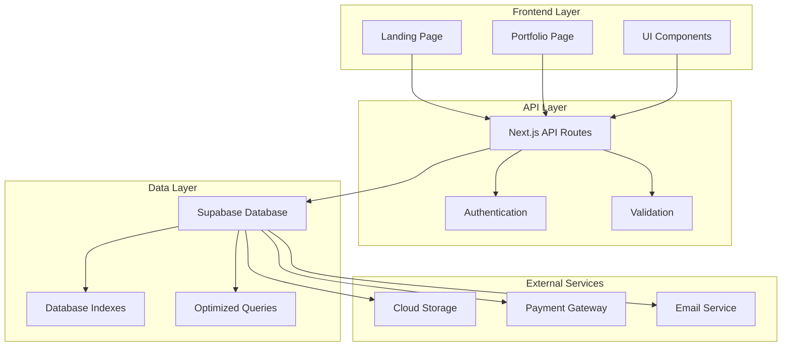
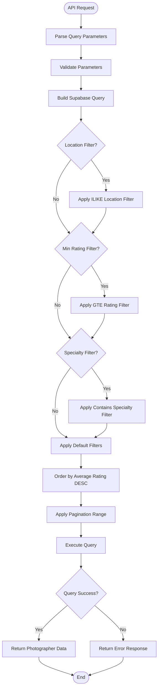
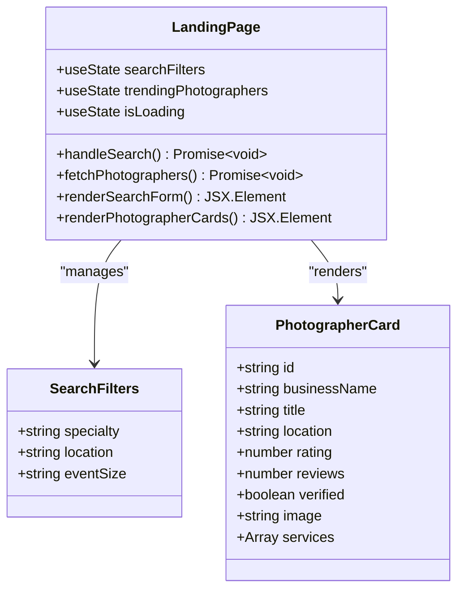
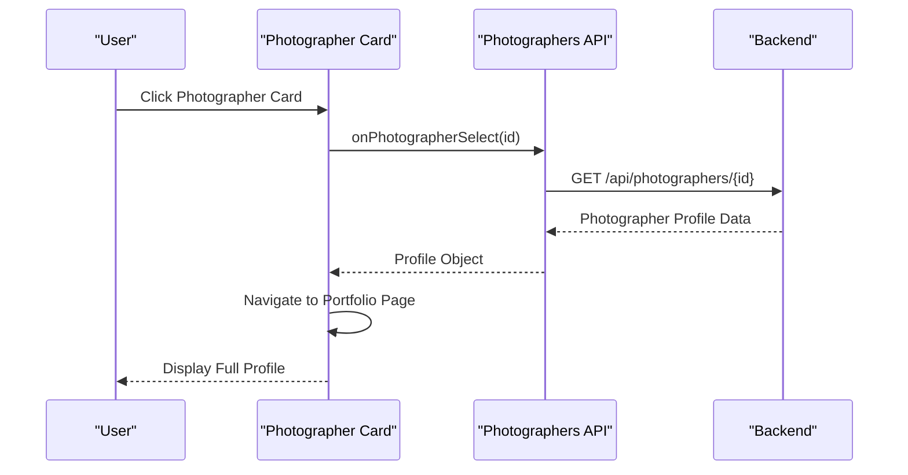
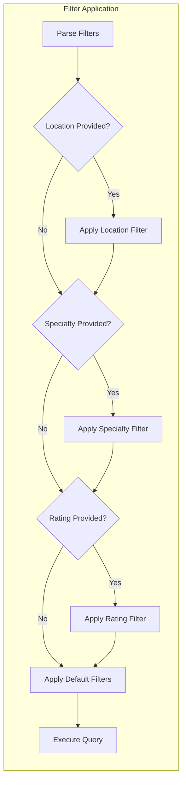
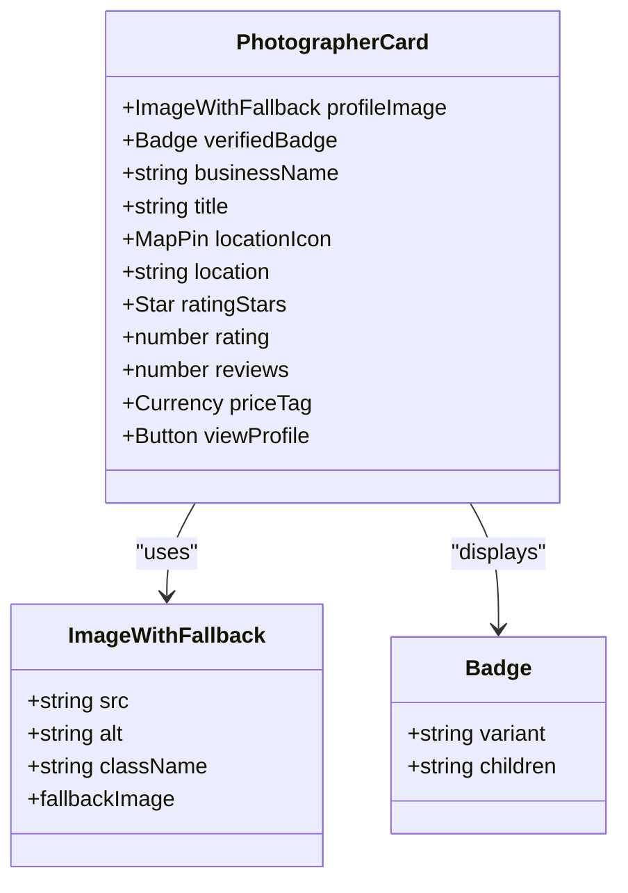
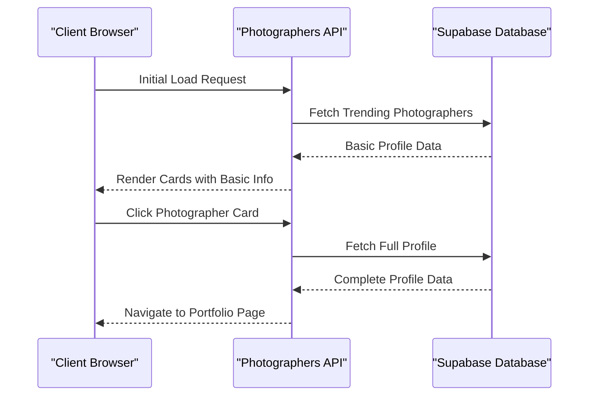
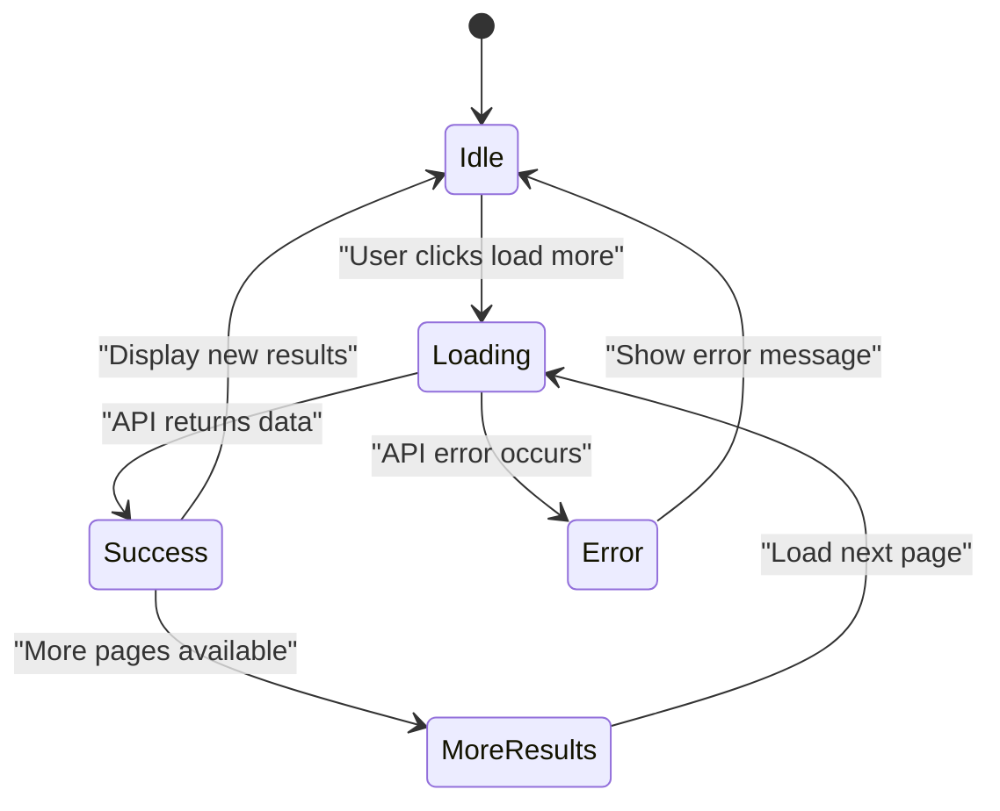
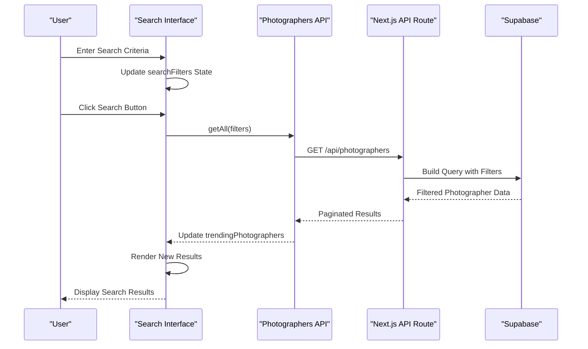

# Search and Discovery

<cite>
**Referenced Files in This Document**
- [pages/api/photographers/index.ts](file://pages/api/photographers/index.ts)
- [pages/api/photographers/[id].ts](file://pages/api/photographers/[id].ts)
- [src/lib/api.ts](file://src/lib/api.ts)
- [src/lib/supabase.ts](file://src/lib/supabase.ts)
- [src/components/LandingPage.tsx](file://src/components/LandingPage.tsx)
- [src/components/PortfolioPage.tsx](file://src/components/PortfolioPage.tsx)
- [DATABASE_DESIGN.md](file://DATABASE_DESIGN.md)
</cite>

## Table of Contents
1. [Introduction](#introduction)
2. [System Architecture](#system-architecture)
3. [API Implementation](#api-implementation)
4. [Frontend Components](#frontend-components)
5. [Search and Filter Mechanisms](#search-and-filter-mechanisms)
6. [Photographer Listing Display](#photographer-listing-display)
7. [Data Retrieval Patterns](#data-retrieval-patterns)
8. [Pagination Implementation](#pagination-implementation)
9. [Search Execution Flow](#search-execution-flow)
10. [Performance Considerations](#performance-considerations)
11. [Troubleshooting Guide](#troubleshooting-guide)
12. [Conclusion](#conclusion)

## Introduction

The SnapEvent platform implements a comprehensive search and discovery system that enables clients to browse photographers by category, location, and specialty. This system provides advanced filtering capabilities, sophisticated sorting mechanisms, and an intuitive card-based UI for displaying photographer listings. The implementation spans both the backend API layer and frontend components, creating a seamless user experience for finding professional photographers.

The search functionality is built around a RESTful API architecture with Next.js API routes, utilizing Supabase for database operations. The frontend employs React components with Tailwind CSS for styling and Framer Motion for animations, creating an engaging and responsive user interface.

## System Architecture

The search and discovery system follows a layered architecture pattern with clear separation of concerns between the presentation layer, API layer, and data layer.



**Diagram sources**
- [pages/api/photographers/index.ts](file://pages/api/photographers/index.ts#L1-L163)
- [src/lib/supabase.ts](file://src/lib/supabase.ts#L1-L242)

The architecture ensures scalability, maintainability, and performance through:

- **Separation of Concerns**: Clear boundaries between frontend, API, and database layers
- **RESTful Design**: Standardized API endpoints for consistent data access
- **Database Optimization**: Proper indexing and query optimization
- **Caching Strategy**: Frontend caching and database query optimization
- **Security Measures**: Authentication, authorization, and data validation

**Section sources**
- [pages/api/photographers/index.ts](file://pages/api/photographers/index.ts#L1-L163)
- [src/lib/supabase.ts](file://src/lib/supabase.ts#L1-L242)

## API Implementation

The backend API provides two primary endpoints for photographer data management: a collection endpoint for listing and searching photographers, and a resource endpoint for individual photographer profiles.

### Collection Endpoint (`/api/photographers`)

The collection endpoint handles GET requests for retrieving photographer listings with advanced filtering capabilities:

```typescript
// Example API call with filters
const response = await photographersAPI.getAll({
  location: 'San Francisco',
  specialty: 'Wedding Photography',
  minRating: 4.5,
  limit: 20,
  offset: 0
});
```

The endpoint implements sophisticated filtering logic:



**Diagram sources**
- [pages/api/photographers/index.ts](file://pages/api/photographers/index.ts#L15-L50)

### Resource Endpoint (`/api/photographers/[id]`)

The resource endpoint provides comprehensive photographer profile data with nested associations:

```typescript
// Individual photographer profile with all associated data
const profile = await photographersAPI.getById('photographer-id');
```

The endpoint retrieves complete photographer information including:
- Basic profile information
- User account details
- Specialties and services
- Portfolio items
- Awards and testimonials
- Availability and booking information

**Section sources**
- [pages/api/photographers/index.ts](file://pages/api/photographers/index.ts#L15-L163)
- [pages/api/photographers/[id].ts](file://pages/api/photographers/[id].ts#L1-L154)

## Frontend Components

The frontend implements a dynamic search interface with category browsing and photographer discovery features.

### Landing Page Search Interface

The main landing page provides an intuitive search form with multiple filter options:



**Diagram sources**
- [src/components/LandingPage.tsx](file://src/components/LandingPage.tsx#L15-L200)

### Category Browsing System

The platform includes predefined categories for easy navigation:

```typescript
const categories = [
  {
    name: 'Wedding',
    image: 'https://images.unsplash.com/photo-1730116309939-10a01fdf1edb',
    count: '2.1k photographers'
  },
  {
    name: 'Portrait',
    image: 'https://images.unsplash.com/photo-1586796676778-2c50b6bc3937',
    count: '1.8k photographers'
  },
  {
    name: 'Corporate',
    image: 'https://images.unsplash.com/photo-1705544363562-cdf94dd458cd',
    count: '950 photographers'
  }
];
```

### Photographer Card Component

Each photographer is displayed in a card format with interactive elements:



**Diagram sources**
- [src/components/LandingPage.tsx](file://src/components/LandingPage.tsx#L500-L650)

**Section sources**
- [src/components/LandingPage.tsx](file://src/components/LandingPage.tsx#L1-L844)

## Search and Filter Mechanisms

The search system implements multiple filtering dimensions to help users find photographers based on their specific needs.

### Location-Based Filtering

Location filtering uses case-insensitive partial matching for flexible geographic searches:

```typescript
// Location filter implementation
if (location) {
  query = query.ilike('location', `%${location}%`);
}
```

### Specialty-Based Filtering

Specialty filtering utilizes JSON array containment for precise category matching:

```typescript
// Specialty filter implementation
if (specialty) {
  query = query.contains('specialties', [{ name: specialty }]);
}
```

### Rating-Based Filtering

Minimum rating filtering ensures only highly-rated photographers appear in results:

```typescript
// Rating filter implementation
if (minRating) {
  query = query.gte('average_rating', Number(minRating));
}
```

### Combined Filtering Strategy

The system combines multiple filters dynamically based on user input:



**Diagram sources**
- [pages/api/photographers/index.ts](file://pages/api/photographers/index.ts#L30-L50)

**Section sources**
- [pages/api/photographers/index.ts](file://pages/api/photographers/index.ts#L15-L50)

## Photographer Listing Display

The photographer listing system uses a card-based UI with rich visual information and interactive elements.

### Card Layout Structure

Each photographer card displays essential information in a clean, organized layout:



**Diagram sources**
- [src/components/LandingPage.tsx](file://src/components/LandingPage.tsx#L500-L650)

### Interactive Elements

The cards include several interactive features:

- **Hover Effects**: Scale animation on hover for visual feedback
- **Click Navigation**: Direct navigation to photographer profiles
- **Verified Badges**: Visual indicator of verified photographers
- **Price Information**: Clear pricing display for quick comparison

### Responsive Design

The card layout adapts to different screen sizes:

```typescript
// Grid layout with responsive breakpoints
<div className="grid grid-cols-1 md:grid-cols-2 lg:grid-cols-3 gap-6">
  {photographers.map((photographer) => (
    <PhotographerCard key={photographer.id} photographer={photographer} />
  ))}
</div>
```

**Section sources**
- [src/components/LandingPage.tsx](file://src/components/LandingPage.tsx#L500-L650)

## Data Retrieval Patterns

The system implements efficient data retrieval patterns optimized for search and discovery scenarios.

### Selective Field Loading

The API uses selective field loading to minimize data transfer:

```typescript
// Selective field loading with nested relations
const { data: photographers, error } = await query
  .select(`
    *,
    users (
      id,
      email,
      first_name,
      last_name,
      avatar
    ),
    specialties (
      id,
      name
    )
  `)
```

### Lazy Loading Strategy

Photographer data is loaded progressively to improve perceived performance:



**Diagram sources**
- [src/lib/api.ts](file://src/lib/api.ts#L40-L80)

### Caching Strategy

The frontend implements intelligent caching for frequently accessed data:

```typescript
// API caching with automatic refresh
const fetchPhotographers = async () => {
  try {
    setIsLoading(true);
    const response = await photographersAPI.getAll({ limit: 6 });
    setTrendingPhotographers(response.photographers || []);
  } catch (error) {
    // Fallback to mock data on API failure
    setTrendingPhotographers(mockPhotographers);
  } finally {
    setIsLoading(false);
  }
};
```

**Section sources**
- [pages/api/photographers/index.ts](file://pages/api/photographers/index.ts#L20-L40)
- [src/lib/api.ts](file://src/lib/api.ts#L40-L80)

## Pagination Implementation

The system implements server-side pagination to handle large datasets efficiently.

### Pagination Parameters

The API supports standard pagination parameters:

```typescript
// Pagination implementation
const { location, specialty, minRating, limit = 20, offset = 0 } = req.query;

let query = supabase
  .from('photographer_profiles')
  .range(Number(offset), Number(offset) + Number(limit) - 1);
```

### Pagination Response Structure

The API returns pagination metadata alongside results:

```typescript
return res.status(200).json({
  photographers,
  pagination: {
    limit: Number(limit),
    offset: Number(offset),
    total: photographers?.length || 0
  }
});
```

### Frontend Pagination Handling

The frontend manages pagination state and loading indicators:



**Diagram sources**
- [pages/api/photographers/index.ts](file://pages/api/photographers/index.ts#L15-L50)

**Section sources**
- [pages/api/photographers/index.ts](file://pages/api/photographers/index.ts#L15-L50)

## Search Execution Flow

The complete search execution flow demonstrates how user queries translate into database operations and UI updates.

### Complete Search Workflow



**Diagram sources**
- [src/components/LandingPage.tsx](file://src/components/LandingPage.tsx#L122-L167)
- [pages/api/photographers/index.ts](file://pages/api/photographers/index.ts#L15-L50)

### Query Parameter Processing

The system processes various query parameters dynamically:

```typescript
// Dynamic query parameter processing
const searchParams = new URLSearchParams();
if (params?.location) searchParams.append('location', params.location);
if (params?.specialty) searchParams.append('specialty', params.specialty);
if (params?.limit) searchParams.append('limit', params.limit.toString());
if (params?.offset) searchParams.append('offset', params.offset.toString());

const queryString = searchParams.toString();
const endpoint = queryString ? `/photographers?${queryString}` : '/photographers';
```

### Error Handling and Fallbacks

The system implements robust error handling with graceful degradation:

```typescript
try {
  const response = await photographersAPI.getAll({
    specialty: searchFilters.specialty,
    location: searchFilters.location,
    limit: 6
  });
  setTrendingPhotographers(response.photographers || []);
} catch (error) {
  console.error('Search failed:', error);
  // Fallback to trending photographers
  setTrendingPhotographers(trendingPhotographers);
}
finally {
  setIsLoading(false);
}
```

**Section sources**
- [src/components/LandingPage.tsx](file://src/components/LandingPage.tsx#L122-L167)
- [src/lib/api.ts](file://src/lib/api.ts#L40-L80)

## Performance Considerations

The search and discovery system incorporates several performance optimization strategies.

### Database Indexing Strategy

The database schema includes strategic indexes for optimal query performance:

- **User.email**: Unique index for authentication
- **PhotographerProfile.location**: Geographic search optimization
- **Booking.eventDate**: Date-based queries
- **PortfolioItem.category**: Category filtering
- **Review.rating**: Rating-based sorting

### Query Optimization

The API implements optimized queries with proper filtering:

```typescript
// Optimized query with proper ordering and filtering
let query = supabase
  .from('photographer_profiles')
  .select(`...`)
  .eq('application_status', 'APPROVED')
  .eq('is_available', true)
  .order('average_rating', { ascending: false })
  .range(Number(offset), Number(offset) + Number(limit) - 1);
```

### Frontend Performance

The frontend implements several performance optimizations:

- **Skeleton Loading**: Placeholder content during data loading
- **Debounced Search**: Prevents excessive API calls
- **Virtual Scrolling**: Handles large lists efficiently
- **Image Optimization**: Lazy loading and responsive images

### Caching Strategies

Multiple caching layers improve performance:

- **Browser Cache**: Static assets and API responses
- **CDN Cache**: Static resources and images
- **Database Query Cache**: Frequently accessed data
- **Application Cache**: In-memory caching for hot data

## Troubleshooting Guide

Common issues and their solutions for the search and discovery system.

### API Connection Issues

**Problem**: API requests fail with connection errors
**Solution**: 
- Verify Supabase connection string in environment variables
- Check network connectivity and firewall settings
- Ensure database is running and accessible

### Search Results Not Appearing

**Problem**: Search returns empty results despite valid data
**Solution**:
- Verify filter parameters are correctly formatted
- Check database records match search criteria
- Ensure proper indexing on searchable fields

### Performance Issues

**Problem**: Slow search response times
**Solution**:
- Review database query execution plans
- Add appropriate database indexes
- Optimize query complexity
- Consider database connection pooling

### Frontend Rendering Problems

**Problem**: Photographer cards not displaying correctly
**Solution**:
- Check image URLs and accessibility
- Verify CSS class names and styles
- Ensure proper data structure in API responses
- Debug React component rendering

**Section sources**
- [pages/api/photographers/index.ts](file://pages/api/photographers/index.ts#L50-L70)
- [src/components/LandingPage.tsx](file://src/components/LandingPage.tsx#L122-L167)

## Conclusion

The SnapEvent search and discovery system provides a comprehensive solution for connecting clients with professional photographers. The implementation combines modern web technologies with proven design patterns to create an intuitive and efficient user experience.

Key strengths of the system include:

- **Flexible Search Capabilities**: Multi-dimensional filtering by location, specialty, and rating
- **Responsive UI**: Adaptive design that works across devices and screen sizes
- **Performance Optimization**: Efficient data retrieval and caching strategies
- **Scalable Architecture**: Clean separation of concerns and modular design
- **Robust Error Handling**: Graceful degradation and user-friendly error messages

The system is well-positioned to support future enhancements such as advanced analytics, personalized recommendations, and expanded search capabilities. The modular architecture ensures maintainability and allows for incremental improvements without disrupting existing functionality.

Future development opportunities include implementing search analytics, adding AI-powered recommendations, enhancing mobile experience, and integrating social sharing features to increase discoverability and engagement.