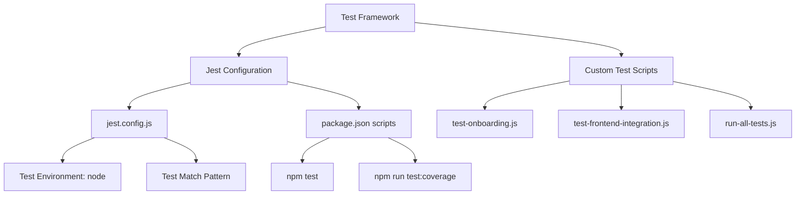
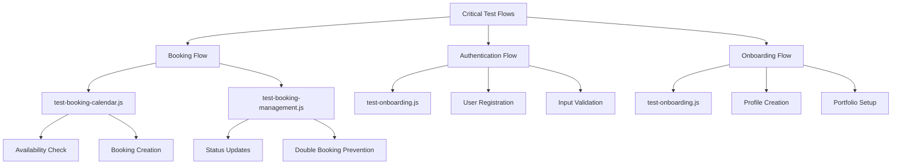
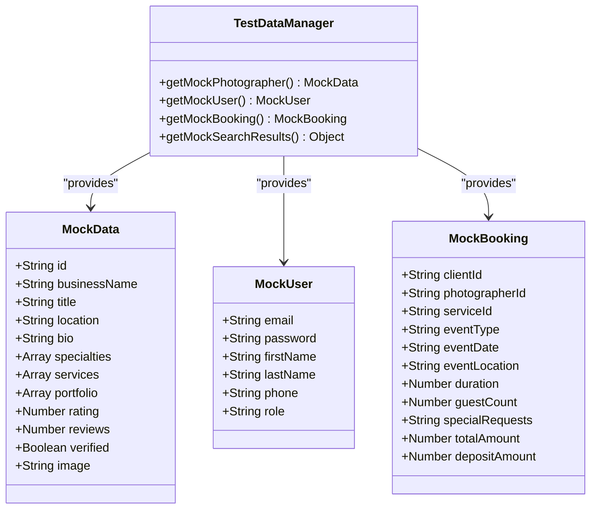
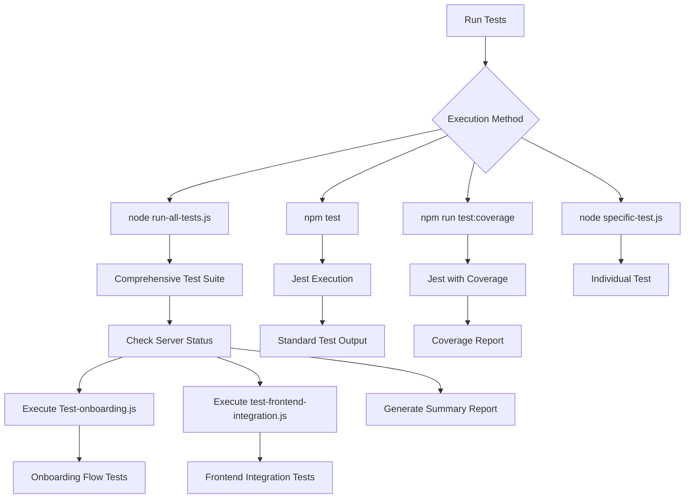

# Testing Strategy

<cite>
**Referenced Files in This Document**   
- [jest.config.js](file://jest.config.js)
- [package.json](file://package.json)
- [TEST_SCRIPTS_README.md](file://TEST_SCRIPTS_README.md)
- [test-onboarding.js](file://test-onboarding.js)
- [test-frontend-integration.js](file://test-frontend-integration.js)
- [run-all-tests.js](file://run-all-tests.js)
- [demo-mock-data.js](file://demo-mock-data.js)
- [test-booking-calendar.js](file://test-booking-calendar.js)
- [test-booking-management.js](file://test-booking-management.js)
- [test-supabase-connection.js](file://test-supabase-connection.js)
- [TEST_SUMMARY.md](file://TEST_SUMMARY.md)
</cite>

## Table of Contents
1. [Introduction](#introduction)
2. [Testing Framework and Configuration](#testing-framework-and-configuration)
3. [Test Structure and Organization](#test-structure-and-organization)
4. [Unit and Integration Testing Approach](#unit-and-integration-testing-approach)
5. [End-to-End Testing Strategy](#end-to-end-testing-strategy)
6. [Critical Test Flows](#critical-test-flows)
7. [Test Data Setup and Mocking Strategies](#test-data-setup-and-mocking-strategies)
8. [Code Coverage Goals and Reporting](#code-coverage-goals-and-reporting)
9. [Running Tests Locally and in CI/CD](#running-tests-locally-and-in-cicd)
10. [Conclusion](#conclusion)

## Introduction
The SnapEvent application implements a comprehensive testing strategy to ensure the reliability and functionality of its core features. The testing approach focuses on API integration, frontend compatibility, and critical user flows such as authentication, onboarding, and booking management. Rather than using traditional unit testing frameworks extensively, the project employs custom end-to-end test scripts that validate the entire system's behavior under realistic conditions. These tests verify API endpoints, data validation, error handling, and integration between frontend components and backend services. The testing infrastructure is designed to work seamlessly with the Next.js application architecture and Supabase backend, providing confidence in the system's stability before deployment.

**Section sources**
- [TEST_SCRIPTS_README.md](file://TEST_SCRIPTS_README.md)
- [package.json](file://package.json)

## Testing Framework and Configuration
The testing strategy primarily relies on custom Node.js test scripts rather than conventional testing frameworks like Jest for most end-to-end tests. However, Jest is configured in the project for potential unit and integration testing needs. The Jest configuration is minimal, specifying a node test environment and test file patterns, but the primary testing approach uses custom scripts that make direct HTTP requests to API endpoints. The package.json includes test scripts for running tests with and without coverage reporting. The test environment is designed to work with the development server, making real API calls to validate functionality rather than using mocked services. This approach provides high confidence in the system's production readiness by testing the actual API behavior and response formats that frontend components expect.

**Diagram sources**
- [jest.config.js](file://jest.config.js)
- [package.json](file://package.json)

**Section sources**
- [jest.config.js](file://jest.config.js)
- [package.json](file://package.json)

## Test Structure and Organization
The test suite is organized into multiple specialized test files, each focusing on specific aspects of the application. The primary test files include test-onboarding.js for user registration and profile creation, test-frontend-integration.js for API compatibility with frontend components, and specialized booking tests for calendar and management functionality. The run-all-tests.js script serves as a comprehensive test runner that executes all test suites and provides a consolidated summary. Test files are located in the project root directory rather than a dedicated tests folder, making them easily accessible. Each test script follows a consistent structure with helper functions for making HTTP requests, mock data definitions, and sequential test execution with clear pass/fail reporting. The organization allows for both individual test execution and comprehensive suite running, providing flexibility for development and CI/CD workflows.

**Section sources**
- [test-onboarding.js](file://test-onboarding.js)
- [test-frontend-integration.js](file://test-frontend-integration.js)
- [run-all-tests.js](file://run-all-tests.js)

## Unit and Integration Testing Approach
While the project has Jest configured for unit testing, the primary testing approach emphasizes integration and end-to-end testing over isolated unit tests. The integration tests validate the complete workflow between frontend components and backend API endpoints, ensuring that data flows correctly through the system. The test scripts verify API structure, request/response formats, input validation, and error handling across multiple endpoints. Each test file focuses on a specific integration point, such as onboarding functionality or frontend API compatibility. The tests make actual HTTP requests to the development server, validating that API endpoints return data in the expected format for frontend consumption. This integration-focused approach ensures that components work together correctly, catching issues that unit tests might miss while providing confidence in the system's overall functionality.

**Section sources**
- [test-frontend-integration.js](file://test-frontend-integration.js)
- [test-onboarding.js](file://test-onboarding.js)

## End-to-End Testing Strategy
The end-to-end testing strategy centers around custom test scripts that simulate real user interactions with the application's API endpoints. The test-onboarding.js script validates the complete onboarding flow, including user registration, photographer profile creation, and portfolio management. The run-all-tests.js script orchestrates the execution of multiple test suites, providing a comprehensive assessment of the system's functionality. These end-to-end tests verify critical user journeys from start to finish, ensuring that data created in one part of the system is correctly processed and available in other parts. The tests include validation of business logic such as booking creation and management, photographer search functionality, and data retrieval. By testing the complete system rather than isolated components, this strategy provides high confidence in the application's production readiness and helps identify integration issues early in the development process.

**Section sources**
- [test-onboarding.js](file://test-onboarding.js)
- [run-all-tests.js](file://run-all-tests.js)

## Critical Test Flows
The testing strategy includes comprehensive coverage of critical application flows, with specialized tests for booking, authentication, and onboarding processes. The booking functionality is tested through dedicated scripts like test-booking-calendar.js and test-booking-management.js, which validate calendar availability, booking creation, status updates, and double-booking prevention. Authentication flows are tested in test-onboarding.js, which verifies user registration, input validation, and error handling for invalid credentials. The onboarding process is thoroughly tested, including photographer profile creation, portfolio management, and service offerings. Each critical flow includes both success scenarios and error conditions, ensuring that the system handles edge cases gracefully. The tests validate that API responses match the expected format for frontend components, ensuring seamless integration between the user interface and backend services.

**Diagram sources**
- [test-booking-calendar.js](file://test-booking-calendar.js)
- [test-booking-management.js](file://test-booking-management.js)
- [test-onboarding.js](file://test-onboarding.js)

**Section sources**
- [test-booking-calendar.js](file://test-booking-calendar.js)
- [test-booking-management.js](file://test-booking-management.js)
- [test-onboarding.js](file://test-onboarding.js)

## Test Data Setup and Mocking Strategies
The testing strategy employs comprehensive mock data to simulate realistic scenarios without requiring a production database. The demo-mock-data.js file demonstrates the structure of mock data used across tests, including photographer profiles, user registration information, booking details, and search results. Each test script defines its own mock data tailored to the specific functionality being tested, ensuring consistency and predictability. The tests use mock photographer profiles with realistic details such as business names, locations, specialties, and portfolio items. Booking tests include mock client information, event details, and pricing data. The mocking strategy focuses on replicating the exact data structure expected by frontend components, allowing developers to verify that API responses match the format required by the user interface. This approach enables thorough testing without dependencies on external services or real user data.

**Diagram sources**
- [demo-mock-data.js](file://demo-mock-data.js)
- [test-onboarding.js](file://test-onboarding.js)

**Section sources**
- [demo-mock-data.js](file://demo-mock-data.js)
- [test-onboarding.js](file://test-onboarding.js)

## Code Coverage Goals and Reporting
The project includes code coverage reporting through Jest's built-in coverage capabilities, accessible via the "npm run test:coverage" command. While the current test suite focuses on integration and end-to-end testing rather than unit test coverage, the configuration supports coverage reporting for any unit tests that may be added in the future. The TEST_SUMMARY.md document indicates that the existing tests achieve 4.9% statement coverage and 11.11% branch coverage, which is expected given that the tests primarily validate script execution and integration points rather than individual functions. The coverage goals prioritize testing critical user flows and integration points over achieving high percentage coverage, recognizing that integration tests provide more value for this application's architecture. The reporting includes detailed summaries of test results, with clear pass/fail indicators and suggestions for addressing any failures.

**Section sources**
- [TEST_SUMMARY.md](file://TEST_SUMMARY.md)
- [package.json](file://package.json)

## Running Tests Locally and in CI/CD
Tests can be executed locally using several methods, with the primary approach being Node.js script execution. The run-all-tests.js script serves as the main entry point, automatically checking if the development server is running and executing all test suites in sequence. Individual tests can be run directly using Node.js, such as "node test-onboarding.js" or "node test-frontend-integration.js". The package.json includes npm scripts for running tests with Jest, including "npm test" for standard execution and "npm run test:coverage" for coverage reporting. For CI/CD environments, the test suite can be integrated into build pipelines by first starting the development server and then executing run-all-tests.js. The tests are designed to provide clear output with success indicators, partial results (accounting for expected Supabase connection issues in test environments), and failure diagnostics, making them suitable for automated environments.

**Diagram sources**
- [run-all-tests.js](file://run-all-tests.js)
- [package.json](file://package.json)

**Section sources**
- [run-all-tests.js](file://run-all-tests.js)
- [package.json](file://package.json)

## Conclusion
The SnapEvent testing strategy effectively balances comprehensive end-to-end testing with practical integration validation. By focusing on custom test scripts that validate real API interactions, the approach provides high confidence in the system's functionality and production readiness. The test suite covers critical user flows including onboarding, booking management, and frontend integration, ensuring that the application works as expected from the user's perspective. While unit test coverage is limited, the integration and end-to-end tests provide valuable validation of the system's overall behavior. The testing infrastructure is well-documented and easy to execute, with clear reporting that distinguishes between actual failures and expected warnings in the test environment. This strategy effectively supports the development workflow and helps maintain the application's quality as it evolves.