# Data Display Components

<cite>
**Referenced Files in This Document**   
- [BookingManager.tsx](file://src/components/BookingManager.tsx)
- [PortfolioPage.tsx](file://src/components/PortfolioPage.tsx)
- [table.tsx](file://src/components/ui/table.tsx)
- [tabs.tsx](file://src/components/ui/tabs.tsx)
- [accordion.tsx](file://src/components/ui/accordion.tsx)
- [carousel.tsx](file://src/components/ui/carousel.tsx)
- [chart.tsx](file://src/components/ui/chart.tsx)
- [badge.tsx](file://src/components/ui/badge.tsx)
- [avatar.tsx](file://src/components/ui/avatar.tsx)
- [progress.tsx](file://src/components/ui/progress.tsx)
- [skeleton.tsx](file://src/components/ui/skeleton.tsx)
- [api.ts](file://src/lib/api.ts)
</cite>

## Table of Contents
1. [Introduction](#introduction)
2. [Project Structure](#project-structure)
3. [Core Components](#core-components)
4. [Architecture Overview](#architecture-overview)
5. [Detailed Component Analysis](#detailed-component-analysis)
6. [Dependency Analysis](#dependency-analysis)
7. [Performance Considerations](#performance-considerations)
8. [Troubleshooting Guide](#troubleshooting-guide)
9. [Conclusion](#conclusion)

## Introduction
This document provides comprehensive documentation for data display components in the SnapEvent application. It details the implementation of various UI components used for presenting information to users, including tables, tabs, accordions, carousels, charts, badges, avatars, and progress indicators. The documentation covers accessibility patterns, performance optimization techniques, and usage examples across key components like BookingManager and PortfolioPage.

## Project Structure
The data display components are organized within the component architecture of the SnapEvent application. The core UI components reside in the `src/components/ui` directory as reusable primitive components, while higher-level composite components are located in the main components directory. The application follows a modular structure with clear separation between UI primitives and business logic components.

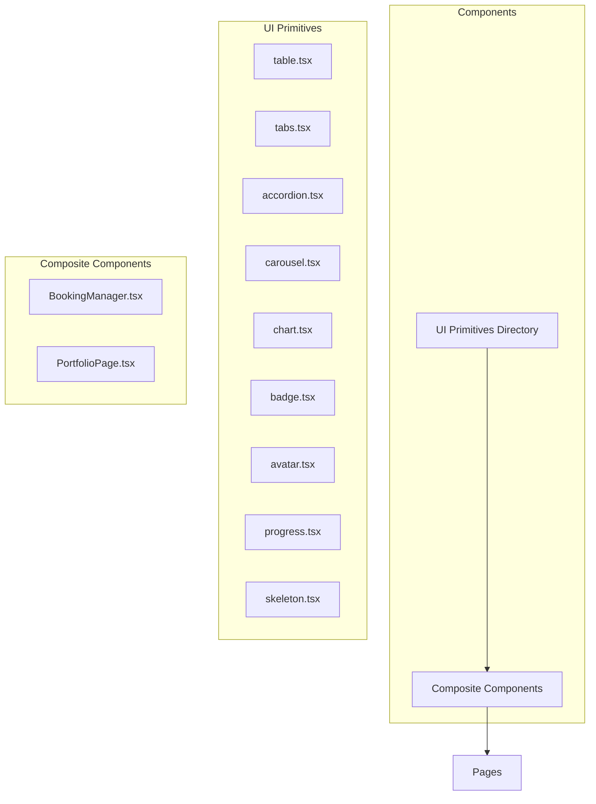

**Diagram sources**
- [src/components/ui](file://src/components/ui)
- [src/components/BookingManager.tsx](file://src/components/BookingManager.tsx)
- [src/components/PortfolioPage.tsx](file://src/components/PortfolioPage.tsx)

**Section sources**
- [src/components](file://src/components)
- [src/components/ui](file://src/components/ui)

## Core Components
The core data display components in the SnapEvent application include sortable tables for booking management, tabbed interfaces for portfolio organization, accordion layouts for service listings, carousels for image galleries, and chart components for availability visualization. These components are built using a combination of custom implementations and third-party libraries, with a focus on accessibility and performance.

**Section sources**
- [src/components/BookingManager.tsx](file://src/components/BookingManager.tsx)
- [src/components/PortfolioPage.tsx](file://src/components/PortfolioPage.tsx)
- [src/components/ui](file://src/components/ui)

## Architecture Overview
The data display architecture follows a component-based approach with a clear hierarchy from primitive UI elements to composite business components. The architecture leverages React's component model with proper state management and data flow patterns. Accessibility is prioritized through appropriate ARIA attributes and keyboard navigation support.

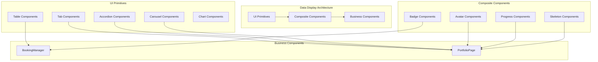

**Diagram sources**
- [src/components/ui](file://src/components/ui)
- [src/components/BookingManager.tsx](file://src/components/BookingManager.tsx)
- [src/components/PortfolioPage.tsx](file://src/components/PortfolioPage.tsx)

## Detailed Component Analysis

### Table Implementation in BookingManager
The BookingManager component implements a sortable table interface for managing photographer bookings. The table displays booking information with status badges and provides action buttons for each booking. The implementation uses the UI table primitives with custom styling and functionality.

```mermaid
classDiagram
class BookingManager {
+useState<Booking[]>(bookings)
+useState<boolean>(isLoading)
+useState<Booking | null>(selectedBooking)
+fetchBookings() void
+handleBookingStatusUpdate(id, status) void
+getStatusBadge(status) JSX.Element
}
class Table {
+Table({className, ...props}) JSX.Element
+TableHeader({className, ...props}) JSX.Element
+TableBody({className, ...props}) JSX.Element
+TableFooter({className, ...props}) JSX.Element
+TableRow({className, ...props}) JSX.Element
+TableHead({className, ...props}) JSX.Element
+TableCell({className, ...props}) JSX.Element
+TableCaption({className, ...props}) JSX.Element
}
BookingManager --> Table : "uses"
BookingManager --> Badge : "uses"
BookingManager --> Tabs : "uses"
```

**Diagram sources**
- [src/components/BookingManager.tsx](file://src/components/BookingManager.tsx)
- [src/components/ui/table.tsx](file://src/components/ui/table.tsx)
- [src/components/ui/badge.tsx](file://src/components/ui/badge.tsx)
- [src/components/ui/tabs.tsx](file://src/components/ui/tabs.tsx)

**Section sources**
- [src/components/BookingManager.tsx](file://src/components/BookingManager.tsx)
- [src/components/ui/table.tsx](file://src/components/ui/table.tsx)

### Tabbed Interface in PortfolioPage
The PortfolioPage component implements a tabbed interface for organizing different sections of a photographer's profile. The tabs provide navigation between portfolio, about, services, and reviews sections, creating a clean and organized user experience.

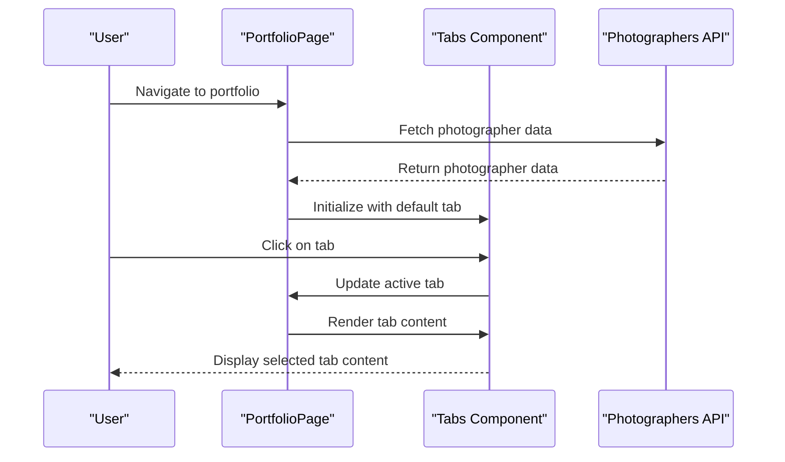

**Diagram sources**
- [src/components/PortfolioPage.tsx](file://src/components/PortfolioPage.tsx)
- [src/components/ui/tabs.tsx](file://src/components/ui/tabs.tsx)
- [src/lib/api.ts](file://src/lib/api.ts)

**Section sources**
- [src/components/PortfolioPage.tsx](file://src/components/PortfolioPage.tsx)
- [src/components/ui/tabs.tsx](file://src/components/ui/tabs.tsx)

### Accordion Layouts for Service Listings
The PortfolioPage component uses accordion layouts to present service listings in a space-efficient manner. Each service is displayed as an accordion item that can be expanded to show detailed information about the service offerings.

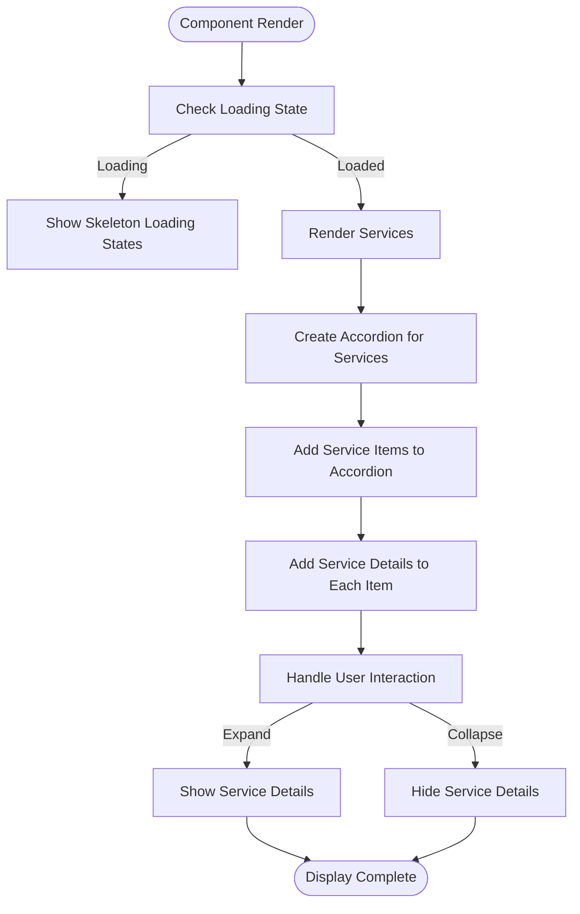

**Diagram sources**
- [src/components/PortfolioPage.tsx](file://src/components/PortfolioPage.tsx)
- [src/components/ui/accordion.tsx](file://src/components/ui/accordion.tsx)

**Section sources**
- [src/components/PortfolioPage.tsx](file://src/components/PortfolioPage.tsx)
- [src/components/ui/accordion.tsx](file://src/components/ui/accordion.tsx)

### Carousel Usage for Portfolio Galleries
The PortfolioPage component implements a carousel for displaying portfolio image galleries. The carousel provides navigation controls and supports keyboard navigation, allowing users to browse through a photographer's work seamlessly.

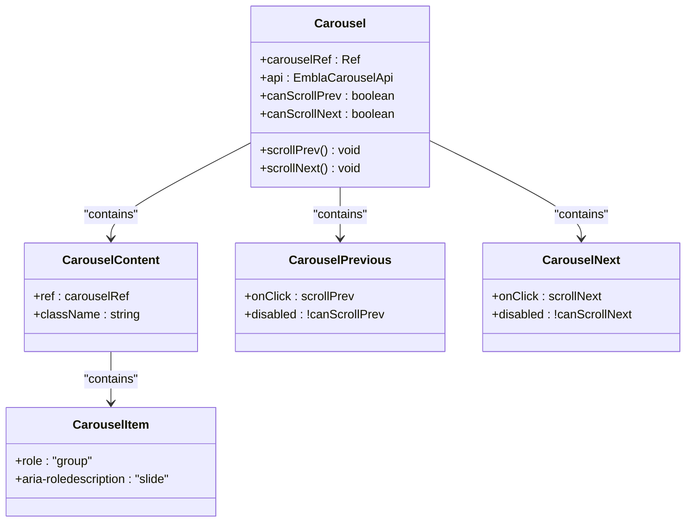

**Diagram sources**
- [src/components/ui/carousel.tsx](file://src/components/ui/carousel.tsx)

**Section sources**
- [src/components/ui/carousel.tsx](file://src/components/ui/carousel.tsx)

### Chart Components for Availability Visualization
The application includes chart components for visualizing availability data. These components use Recharts to create responsive data visualizations that help photographers and clients understand booking patterns and availability.

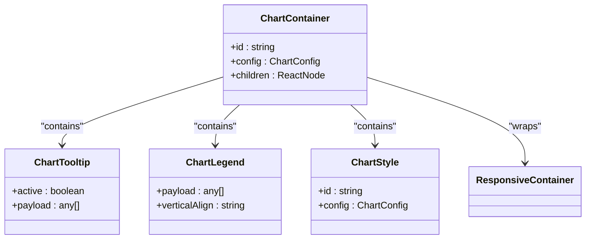

**Diagram sources**
- [src/components/ui/chart.tsx](file://src/components/ui/chart.tsx)

**Section sources**
- [src/components/ui/chart.tsx](file://src/components/ui/chart.tsx)

### Accessibility Patterns
The data display components implement comprehensive accessibility patterns to ensure usability for all users, including those using screen readers or keyboard navigation. The components use proper ARIA attributes, semantic HTML, and keyboard event handling.

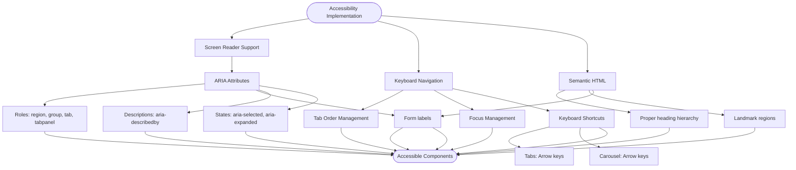

**Diagram sources**
- [src/components/ui/tabs.tsx](file://src/components/ui/tabs.tsx)
- [src/components/ui/carousel.tsx](file://src/components/ui/carousel.tsx)
- [src/components/ui/accordion.tsx](file://src/components/ui/accordion.tsx)

**Section sources**
- [src/components/ui/tabs.tsx](file://src/components/ui/tabs.tsx)
- [src/components/ui/carousel.tsx](file://src/components/ui/carousel.tsx)
- [src/components/ui/accordion.tsx](file://src/components/ui/accordion.tsx)

### Performance Optimization
The data display components implement several performance optimization techniques, including virtualization for large datasets and skeleton loading states to improve perceived performance during data loading.

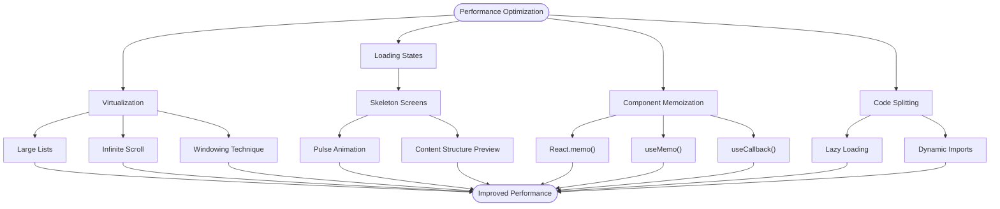

**Diagram sources**
- [src/components/PortfolioPage.tsx](file://src/components/PortfolioPage.tsx)
- [src/components/ui/skeleton.tsx](file://src/components/ui/skeleton.tsx)

**Section sources**
- [src/components/PortfolioPage.tsx](file://src/components/PortfolioPage.tsx)
- [src/components/ui/skeleton.tsx](file://src/components/ui/skeleton.tsx)

### Badge and Avatar Usage
The application uses badges and avatars extensively in user interfaces to convey status information and represent users visually. These components are implemented as reusable primitives with various styling options.

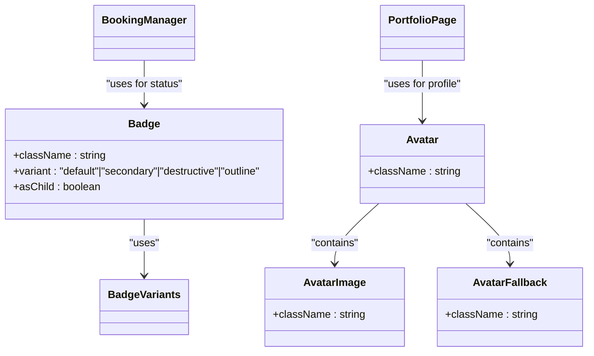

**Diagram sources**
- [src/components/ui/badge.tsx](file://src/components/ui/badge.tsx)
- [src/components/ui/avatar.tsx](file://src/components/ui/avatar.tsx)
- [src/components/BookingManager.tsx](file://src/components/BookingManager.tsx)
- [src/components/PortfolioPage.tsx](file://src/components/PortfolioPage.tsx)

**Section sources**
- [src/components/ui/badge.tsx](file://src/components/ui/badge.tsx)
- [src/components/ui/avatar.tsx](file://src/components/ui/avatar.tsx)

### Progress Indicators for Onboarding
The application uses progress indicators to show completion status in onboarding flows. These components provide visual feedback to users about their progress through multi-step processes.

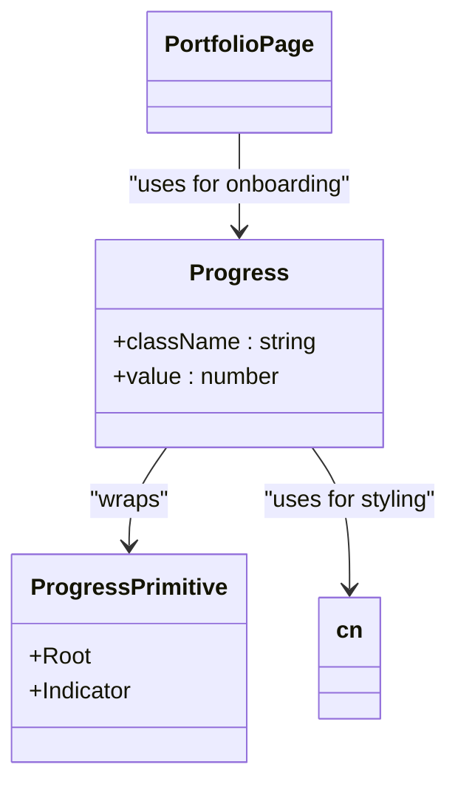

**Diagram sources**
- [src/components/ui/progress.tsx](file://src/components/ui/progress.tsx)
- [src/components/PortfolioPage.tsx](file://src/components/PortfolioPage.tsx)

**Section sources**
- [src/components/ui/progress.tsx](file://src/components/ui/progress.tsx)

## Dependency Analysis
The data display components have a clear dependency hierarchy, with primitive UI components serving as the foundation for higher-level composite components. The dependency structure ensures reusability and maintainability across the application.

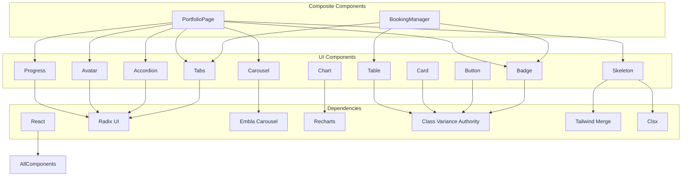

**Diagram sources**
- [src/components/ui](file://src/components/ui)
- [package.json](file://package.json)

**Section sources**
- [src/components/ui](file://src/components/ui)
- [package.json](file://package.json)

## Performance Considerations
The data display components are optimized for performance with several key considerations. For large datasets, virtualization techniques should be implemented to maintain smooth scrolling and responsive interactions. Skeleton loading states provide immediate visual feedback during data loading, improving perceived performance.

The components use React's optimization techniques such as memoization and useCallback to prevent unnecessary re-renders. The table and carousel components are particularly performance-sensitive and should be monitored for large datasets. For production use, consider implementing pagination or infinite scrolling for tables with many rows.

Accessibility is prioritized through proper ARIA attributes and keyboard navigation support, ensuring the components are usable by all users regardless of their input method. The components follow WCAG guidelines for color contrast, focus visibility, and screen reader compatibility.

**Section sources**
- [src/components/PortfolioPage.tsx](file://src/components/PortfolioPage.tsx)
- [src/components/ui/skeleton.tsx](file://src/components/ui/skeleton.tsx)
- [src/components/ui](file://src/components/ui)

## Troubleshooting Guide
When encountering issues with data display components, consider the following troubleshooting steps:

1. For table rendering issues, verify that the data structure matches the expected format in the component props.
2. If tabs are not functioning correctly, ensure that the Tabs component has unique value props for each TabsTrigger.
3. For carousel navigation problems, check that the Embla carousel API is properly initialized and that the scroll functions are correctly bound.
4. If charts are not displaying data correctly, verify that the data format matches the expected structure for Recharts components.
5. For accessibility issues, validate that all interactive elements have proper ARIA attributes and keyboard event handlers.

Common performance issues can often be resolved by implementing virtualization for large datasets or by optimizing the data fetching strategy to reduce payload size. Skeleton loading states should be used to provide immediate feedback during data loading.

**Section sources**
- [src/components/BookingManager.tsx](file://src/components/BookingManager.tsx)
- [src/components/PortfolioPage.tsx](file://src/components/PortfolioPage.tsx)
- [src/components/ui](file://src/components/ui)

## Conclusion
The data display components in the SnapEvent application provide a comprehensive set of tools for presenting information to users in an accessible and performant manner. The component architecture follows best practices with a clear separation between primitive UI elements and business components.

The implementation of tables, tabs, accordions, carousels, and charts provides flexible options for displaying different types of data. Accessibility is prioritized through proper ARIA attributes and keyboard navigation support. Performance optimizations like skeleton loading states enhance the user experience during data loading.

For future improvements, consider implementing virtualization for large datasets, adding more customization options for chart components, and expanding the accessibility features with additional screen reader optimizations. The current architecture provides a solid foundation for these enhancements while maintaining code maintainability and reusability.