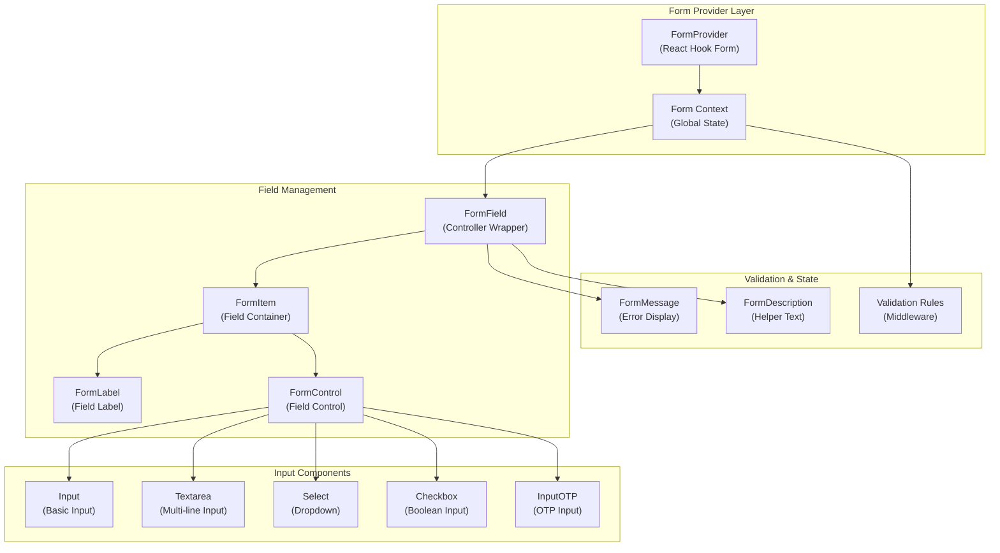
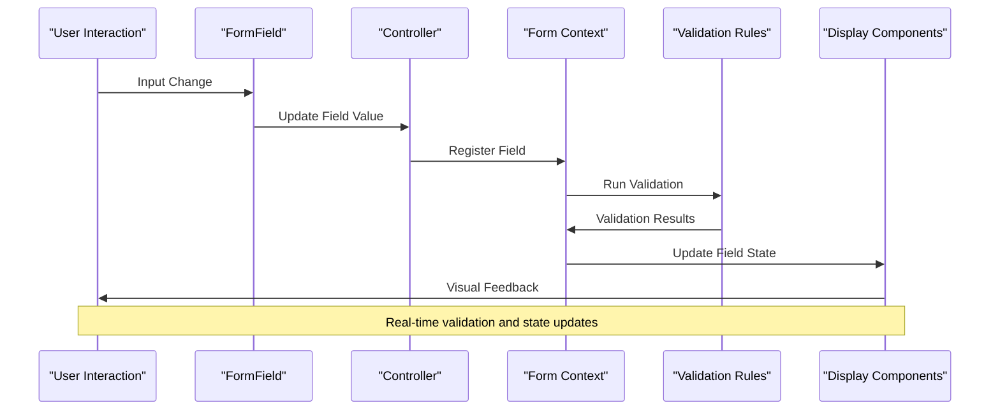

# Form & Input Components

<cite>
**Referenced Files in This Document**
- [src/components/ui/form.tsx](file://src/components/ui/form.tsx)
- [src/components/ui/input.tsx](file://src/components/ui/input.tsx)
- [src/components/ui/input-otp.tsx](file://src/components/ui/input-otp.tsx)
- [src/components/ui/textarea.tsx](file://src/components/ui/textarea.tsx)
- [src/components/ui/select.tsx](file://src/components/ui/select.tsx)
- [src/components/ui/checkbox.tsx](file://src/components/ui/checkbox.tsx)
- [src/components/ui/button.tsx](file://src/components/ui/button.tsx)
- [src/components/ui/utils.ts](file://src/components/ui/utils.ts)
- [src/components/OnboardingForm.tsx](file://src/components/OnboardingForm.tsx)
- [src/components/SignupForm.tsx](file://src/components/SignupForm.tsx)
- [src/middleware/validation.ts](file://src/middleware/validation.ts)
- [pages/onboarding.tsx](file://pages/onboarding.tsx)
</cite>

## Table of Contents
1. [Introduction](#introduction)
2. [Core Form Architecture](#core-form-architecture)
3. [Input Components](#input-components)
4. [Form Integration with React Hook Form](#form-integration-with-react-hook-form)
5. [Validation Patterns](#validation-patterns)
6. [Real-world Implementation Examples](#real-world-implementation-examples)
7. [Accessibility Guidelines](#accessibility-guidelines)
8. [Mobile Input Considerations](#mobile-input-considerations)
9. [Security Implications](#security-implications)
10. [Common Issues and Solutions](#common-issues-and-solutions)
11. [Best Practices](#best-practices)

## Introduction

The SnapEvent Landing Page implements a comprehensive form and input component system built on React Hook Form for robust form management and validation. The system provides reusable, accessible, and mobile-friendly form components that support complex workflows like onboarding and user registration.

The form system is designed with a modular architecture that separates concerns between form structure, individual input components, and validation logic. This approach ensures maintainability, reusability, and consistent user experience across different form types.

## Core Form Architecture

The form system is built around a provider-context pattern that integrates seamlessly with React Hook Form's ecosystem. The architecture consists of several key components working together to provide a complete form solution.



**Diagram sources**
- [src/components/ui/form.tsx](file://src/components/ui/form.tsx#L1-L169)
- [src/components/ui/input.tsx](file://src/components/ui/input.tsx#L1-L22)
- [src/components/ui/textarea.tsx](file://src/components/ui/textarea.tsx#L1-L19)

**Section sources**
- [src/components/ui/form.tsx](file://src/components/ui/form.tsx#L1-L169)

## Input Components

The system provides a comprehensive set of input components, each designed with accessibility, usability, and modern design principles in mind.

### Basic Input Component

The Input component serves as the foundation for text-based inputs, providing consistent styling and behavior across the application.

```typescript
// Basic Input Props
interface InputProps extends React.ComponentProps<"input"> {
  className?: string;
  type?: string;
}

// Key Features:
// - Tailwind CSS integration with responsive design
// - Focus states with ring effects
// - Error state handling
// - Disabled state support
// - Accessibility attributes
```

### Textarea Component

The Textarea component extends the basic input functionality to support multi-line text input with enhanced styling and behavior.

```typescript
// Textarea Props
interface TextareaProps extends React.ComponentProps<"textarea"> {
  className?: string;
}

// Enhanced Features:
// - Resize prevention with resize-none
// - Placeholder text styling
// - Focus and error state handling
// - Mobile-optimized touch targets
```

### Select Component

The Select component provides a sophisticated dropdown interface with keyboard navigation and accessibility support.

```typescript
// Select Component Architecture
// - SelectTrigger: Button interface
// - SelectContent: Dropdown menu
// - SelectItem: Individual options
// - SelectValue: Display value
// - SelectLabel: Group labels
```

### Checkbox Component

The Checkbox component implements a modern checkbox interface with visual feedback and accessibility compliance.

```typescript
// Checkbox Features:
// - Radix UI primitives for accessibility
// - Checked/unchecked states
// - Focus and hover interactions
// - Disabled state handling
// - Custom indicator icons
```

**Section sources**
- [src/components/ui/input.tsx](file://src/components/ui/input.tsx#L1-L22)
- [src/components/ui/textarea.tsx](file://src/components/ui/textarea.tsx#L1-L19)
- [src/components/ui/select.tsx](file://src/components/ui/select.tsx#L1-L190)
- [src/components/ui/checkbox.tsx](file://src/components/ui/checkbox.tsx#L1-L33)

## Form Integration with React Hook Form

The form system leverages React Hook Form's Controller pattern to manage form state and validation. This integration provides optimal performance and seamless React integration.



**Diagram sources**
- [src/components/ui/form.tsx](file://src/components/ui/form.tsx#L25-L45)
- [src/components/ui/form.tsx](file://src/components/ui/form.tsx#L47-L75)

### FormField Context Management

The FormField component creates isolated contexts for each form field, enabling independent validation and state management.

```typescript
// FormField Context Structure
interface FormFieldContextValue {
  name: FieldPath<TFieldValues>;
}

interface FormItemContextValue {
  id: string;
}

// Benefits:
// - Isolated field validation
// - Independent state management
// - Access to field metadata
// - Context-based rendering optimization
```

### Controller Integration

The Controller component bridges React Hook Form's state management with the form field components, ensuring proper lifecycle management and error handling.

**Section sources**
- [src/components/ui/form.tsx](file://src/components/ui/form.tsx#L25-L75)

## Validation Patterns

The system implements multiple validation approaches, from client-side validation to server-side validation middleware.

### Client-Side Validation

Client-side validation provides immediate feedback and enhances user experience by catching errors before form submission.

```typescript
// Validation Rules Structure
interface ValidationRule {
  field: string;
  required?: boolean;
  type?: 'string' | 'number' | 'boolean' | 'email' | 'date' | 'array';
  minLength?: number;
  maxLength?: number;
  min?: number;
  max?: number;
  pattern?: RegExp;
  custom?: (value: any) => string | null;
}

// Real-time Validation Example
const validateField = (field: string, value: string) => {
  let fieldError = '';
  
  switch (field) {
    case 'email':
      if (value.trim() && !/^[^\s@]+@[^\s@]+\.[^\s@]+$/.test(value.trim())) {
        fieldError = 'Invalid email format';
      }
      break;
    case 'password':
      if (value && value.length < 8) {
        fieldError = 'Must be at least 8 characters';
      }
      break;
  }
  
  setFieldErrors(prev => ({ ...prev, [field]: fieldError }));
};
```

### Server-Side Validation Middleware

The validation middleware provides centralized validation logic for API endpoints, ensuring data integrity and security.

```typescript
// Validation Middleware Usage
export function withValidation(rules: ValidationRule[]) {
  return function(handler: (req: NextApiRequest, res: NextApiResponse) => Promise<void>) {
    return async (req: NextApiRequest, res: NextApiResponse) => {
      const errors: string[] = [];
      
      // Apply validation rules
      for (const rule of rules) {
        const value = body[rule.field];
        
        // Type validation
        if (rule.type) {
          switch (rule.type) {
            case 'email':
              const emailPattern = /^[^\s@]+@[^\s@]+\.[^\s@]+$/;
              if (typeof value !== 'string' || !emailPattern.test(value)) {
                errors.push(`${rule.field} must be a valid email address`);
              }
              break;
          }
        }
        
        // Length validation
        if (rule.minLength && value.length < rule.minLength) {
          errors.push(`${rule.field} must be at least ${rule.minLength} characters long`);
        }
      }
      
      if (errors.length > 0) {
        return res.status(400).json({
          error: 'Validation failed',
          details: errors
        });
      }
      
      return handler(req, res);
    };
  };
}
```

**Section sources**
- [src/middleware/validation.ts](file://src/middleware/validation.ts#L1-L161)
- [src/components/SignupForm.tsx](file://src/components/SignupForm.tsx#L35-L112)

## Real-world Implementation Examples

### OnboardingForm Component

The OnboardingForm demonstrates complex form handling with multi-step progression, bilingual support, and advanced validation.

```typescript
// OnboardingForm Architecture
interface FormData {
  fullName: string;
  phoneNumber: string;
  email: string;
  location: string;
  cameraManufacturer: string;
  cameraModel: string;
  lenses: string;
  photographerType: string;
  experience: string;
  photoTypes: string[];
  otherPhotoText: string;
  additionalServices: string[];
  startingPrice: string;
  language: string;
  rankedPhotoTypes: string;
  rankedAdditionalServices: string;
}

// Key Features:
// - Multi-step form progression
// - Bilingual form fields
// - File upload validation
// - Price range validation
// - Real-time ranking updates
// - Theme switching
```

### SignupForm Component

The SignupForm showcases comprehensive user registration with real-time validation and error handling.

```typescript
// SignupForm Validation Flow
const validateForm = () => {
  // Comprehensive field validation
  if (!formData.firstName.trim()) {
    setError('First name is required');
    return false;
  }
  
  if (!formData.email.trim()) {
    setError('Email address is required');
    return false;
  }
  
  // Password strength validation
  if (!/(?=.*[a-z])(?=.*[A-Z])(?=.*\d)/.test(formData.password)) {
    setError('Password must contain uppercase, lowercase, and number');
    return false;
  }
  
  return true;
};

// Form Submission
const handleSubmit = async (e: React.FormEvent) => {
  e.preventDefault();
  
  if (!validateForm()) {
    // Focus on first invalid field
    const firstInput = document.querySelector('input:invalid') as HTMLInputElement;
    if (firstInput) firstInput.focus();
    return;
  }
  
  setIsLoading(true);
  setError('');
  
  try {
    const response = await fetch('/api/auth/signup', {
      method: 'POST',
      headers: { 'Content-Type': 'application/json' },
      body: JSON.stringify({
        firstName: formData.firstName.trim(),
        lastName: formData.lastName.trim(),
        email: formData.email.trim().toLowerCase(),
        phone: formData.phone.replace(/[\s\-\(\)]/g, ''),
        password: formData.password,
        role: 'CLIENT'
      }),
    });
    
    if (!response.ok) {
      throw new Error('Failed to create account');
    }
    
    // Success handling
    setIsSuccess(true);
    setTimeout(() => onSignupSuccess(), 1500);
    
  } catch (error) {
    setError(error instanceof Error ? error.message : 'An unexpected error occurred');
  } finally {
    setIsLoading(false);
  }
};
```

**Section sources**
- [src/components/OnboardingForm.tsx](file://src/components/OnboardingForm.tsx#L1-L933)
- [src/components/SignupForm.tsx](file://src/components/SignupForm.tsx#L1-L493)

## Accessibility Guidelines

The form components implement comprehensive accessibility features to ensure usability for all users, including those using assistive technologies.

### Semantic HTML Structure

Each form component uses appropriate semantic HTML elements and ARIA attributes:

```typescript
// Input Component Accessibility
<input
  type={type}
  data-slot="input"
  className={cn(
    "file:text-foreground placeholder:text-muted-foreground selection:bg-primary selection:text-primary-foreground",
    "focus-visible:border-ring focus-visible:ring-ring/50 focus-visible:ring-[3px]",
    "aria-invalid:ring-destructive/20 dark:aria-invalid:ring-destructive/40 aria-invalid:border-destructive",
    className,
  )}
  {...props}
/>

// Form Label Accessibility
<FormLabel>
  <Label
    data-slot="form-label"
    data-error={!!error}
    className={cn("data-[error=true]:text-destructive", className)}
    htmlFor={formItemId}
    {...props}
  />
</FormLabel>
```

### Keyboard Navigation

All form components support full keyboard navigation:

- Tab order follows logical flow
- Arrow keys navigate dropdown options
- Enter/Space activates buttons and checkboxes
- Escape closes dropdowns and modals

### Screen Reader Support

Components include appropriate ARIA labels and descriptions:

```typescript
// Form Control Accessibility
<Slot
  data-slot="form-control"
  id={formItemId}
  aria-describedby={
    !error
      ? `${formDescriptionId}`
      : `${formDescriptionId} ${formMessageId}`
  }
  aria-invalid={!!error}
  {...props}
/>
```

### Focus Management

Proper focus management ensures users can track their position in forms:

- Automatic focus on first error field
- Logical tab order through form fields
- Focus indicators for keyboard navigation
- Proper landmark navigation

**Section sources**
- [src/components/ui/input.tsx](file://src/components/ui/input.tsx#L6-L21)
- [src/components/ui/form.tsx](file://src/components/ui/form.tsx#L85-L105)

## Mobile Input Considerations

The form system is optimized for mobile devices with responsive design patterns and mobile-specific input behaviors.

### Responsive Input Sizing

Inputs automatically adjust to screen sizes:

```typescript
// Mobile-Optimized Input Classes
className={cn(
  "flex h-9 w-full min-w-0 rounded-md border px-3 py-1 text-base bg-input-background transition-[color,box-shadow] outline-none",
  "md:text-sm", // Medium breakpoint text sizing
  className,
)}
```

### Touch-Friendly Targets

Input components provide adequate touch targets:

- Minimum 44px touch target size
- Spaced-out interactive elements
- Proper padding for finger-friendly interaction
- Reduced hover states for touch devices

### Mobile Keyboard Optimization

Different input types trigger appropriate mobile keyboards:

```typescript
// Type-specific keyboard optimization
<Input
  type="email" // Triggers email keyboard
  type="tel"   // Triggers numeric keypad
  type="password" // Hides characters on mobile
/>
```

### Scroll Behavior

Forms handle scrolling gracefully on mobile devices:

- Prevents accidental scrolling during input
- Maintains focus on active fields
- Handles virtual keyboard appearance
- Ensures form elements remain visible

**Section sources**
- [src/components/ui/input.tsx](file://src/components/ui/input.tsx#L6-L21)

## Security Implications

The form system implements several security measures to protect against common web vulnerabilities and ensure data integrity.

### Input Sanitization

Client-side validation prevents malicious input:

```typescript
// Phone number sanitization
const cleanPhone = formData.phone.replace(/[\s\-\(\)]/g, '');

// Email normalization
const normalizedEmail = formData.email.trim().toLowerCase();

// XSS Prevention
// - No HTML injection in text inputs
// - Proper escaping of user content
// - Content Security Policy compliance
```

### CSRF Protection

Form submissions include CSRF tokens for protection:

```typescript
// CSRF Token Implementation
const handleSubmit = async (e: React.FormEvent) => {
  e.preventDefault();
  
  const response = await fetch('/api/auth/signup', {
    method: 'POST',
    headers: {
      'Content-Type': 'application/json',
      'X-CSRF-Token': csrfToken, // Included in headers
    },
    body: JSON.stringify(formData),
  });
};
```

### Rate Limiting

Server-side rate limiting prevents abuse:

```typescript
// Rate limiting middleware
export function withRateLimit(maxRequests: number, windowMs: number) {
  return function(handler: (req: NextApiRequest, res: NextApiResponse) => Promise<void>) {
    return async (req: NextApiRequest, res: NextApiResponse) => {
      const ip = req.ip || 'unknown';
      const key = `rate_limit:${ip}`;
      
      // Check Redis cache for rate limit
      const count = await redis.get(key);
      
      if (count && parseInt(count) >= maxRequests) {
        return res.status(429).json({ error: 'Too many requests' });
      }
      
      // Increment counter
      await redis.incr(key);
      await redis.expire(key, windowMs / 1000);
      
      return handler(req, res);
    };
  };
}
```

### File Upload Security

File uploads include security validations:

```typescript
// File validation
const handleProfilePictureChange = (event: React.ChangeEvent<HTMLInputElement>) => {
  const file = event.target.files?.[0];
  if (file) {
    // Validate file type
    if (!file.type.startsWith('image/')) {
      alert('Please select an image file');
      return;
    }
    
    // Validate file size (5MB max)
    if (file.size > 5 * 1024 * 1024) {
      alert('File size must be less than 5MB');
      return;
    }
    
    setFormData(prev => ({ ...prev, profilePicture: file }));
  }
};
```

**Section sources**
- [src/components/SignupForm.tsx](file://src/components/SignupForm.tsx#L244-L258)
- [src/middleware/validation.ts](file://src/middleware/validation.ts#L1-L161)

## Common Issues and Solutions

### Uncontrolled Component Warnings

React Hook Form requires controlled components to function properly. Common solutions include:

```typescript
// Problem: Uncontrolled component warning
// Solution: Ensure proper value binding
<Input
  value={formData.email} // Controlled value
  onChange={(e) => handleInputChange('email', e.target.value)}
  // ... other props
/>

// Alternative: Use Controller wrapper
<Controller
  name="email"
  control={control}
  defaultValue=""
  render={({ field }) => (
    <Input {...field} />
  )}
/>
```

### Form Submission Handling

Proper form submission requires careful error handling and loading states:

```typescript
// Proper submission handling
const handleSubmit = async (e: React.FormEvent) => {
  e.preventDefault(); // Prevent default form submission
  
  // Validate form before submission
  if (!validateForm()) {
    // Focus on first invalid field
    const firstInput = document.querySelector('input:invalid') as HTMLInputElement;
    if (firstInput) firstInput.focus();
    return;
  }
  
  setIsLoading(true);
  setError('');
  
  try {
    const response = await fetch('/api/endpoint', {
      method: 'POST',
      headers: { 'Content-Type': 'application/json' },
      body: JSON.stringify(formData),
    });
    
    if (!response.ok) {
      throw new Error('Submission failed');
    }
    
    // Handle success
    onFormSuccess();
    
  } catch (error) {
    setError(error instanceof Error ? error.message : 'An unexpected error occurred');
  } finally {
    setIsLoading(false);
  }
};
```

### State Management Issues

Complex form state can lead to performance issues:

```typescript
// Efficient state updates
const handleInputChange = (field: string, value: any) => {
  setFormData(prev => ({ ...prev, [field]: value }));
  
  // Debounced validation
  setTimeout(() => validateField(field, value), 300);
};

// Memoized form calculations
const rankedList = useMemo(() => {
  return checkedValues.map((value, index) => {
    return `${index + 1}. ${getDisplayValue(value)}`;
  }).join(', ');
}, [checkedValues]);
```

### Error State Management

Proper error state management ensures clear user feedback:

```typescript
// Structured error handling
const [fieldErrors, setFieldErrors] = useState<{[key: string]: string}>({});

const validateField = (field: string, value: string) => {
  let fieldError = '';
  
  switch (field) {
    case 'email':
      if (!/^[^\s@]+@[^\s@]+\.[^\s@]+$/.test(value)) {
        fieldError = 'Invalid email format';
      }
      break;
    case 'password':
      if (value.length < 8) {
        fieldError = 'Must be at least 8 characters';
      }
      break;
  }
  
  setFieldErrors(prev => ({ ...prev, [field]: fieldError }));
};

// Display errors conditionally
{fieldErrors[field] && (
  <p className="text-xs text-red-500 mt-1">{fieldErrors[field]}</p>
)}
```

**Section sources**
- [src/components/SignupForm.tsx](file://src/components/SignupForm.tsx#L25-L35)
- [src/components/SignupForm.tsx](file://src/components/SignupForm.tsx#L114-L160)

## Best Practices

### Component Design Principles

1. **Single Responsibility**: Each component handles one specific concern
2. **Composition Over Inheritance**: Components are composed rather than extended
3. **Props Interface**: Clear, typed props for better developer experience
4. **Default Props**: Reasonable defaults for optional props

### Validation Strategy

1. **Client-side First**: Immediate feedback for better UX
2. **Server-side Validation**: Final validation for security
3. **Real-time Validation**: Debounced validation for performance
4. **Clear Error Messages**: User-friendly error descriptions

### State Management

1. **Local State**: Use local state for UI state (loading, errors)
2. **Form State**: Use React Hook Form for form field state
3. **Debouncing**: Debounce expensive operations like validation
4. **Memoization**: Use useMemo and useCallback for performance

### Testing Considerations

1. **Unit Tests**: Test individual component behavior
2. **Integration Tests**: Test form workflows
3. **Accessibility Tests**: Automated accessibility testing
4. **Cross-browser Testing**: Test across different browsers

### Performance Optimization

1. **Code Splitting**: Lazy load heavy components
2. **Memoization**: Use memoization for expensive computations
3. **Debouncing**: Debounce user input events
4. **Virtualization**: Use virtualization for large lists

### Security Best Practices

1. **Input Validation**: Validate all user inputs
2. **Sanitization**: Sanitize user-generated content
3. **CSRF Protection**: Implement CSRF tokens
4. **Rate Limiting**: Protect against abuse
5. **HTTPS**: Always use HTTPS for form submissions