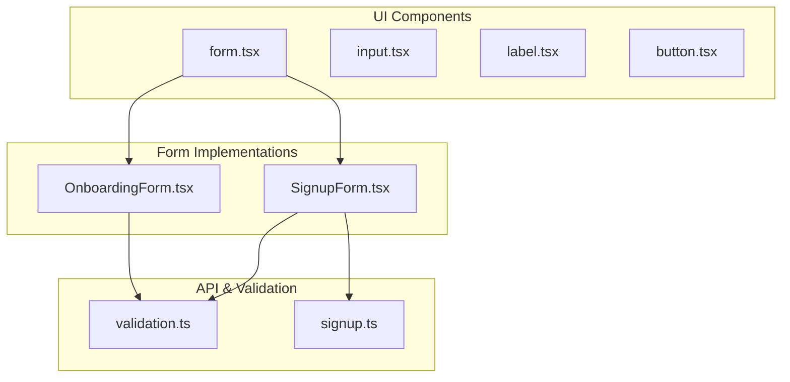
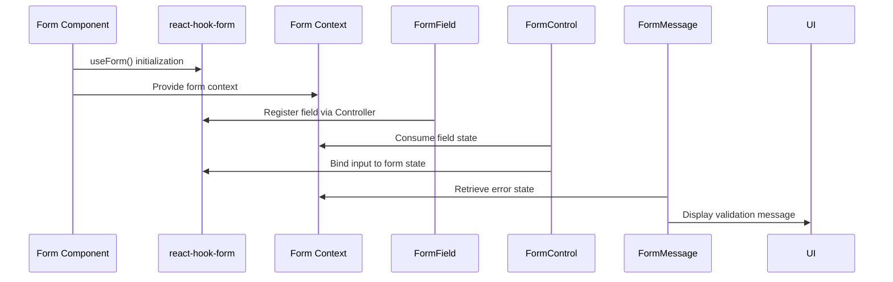
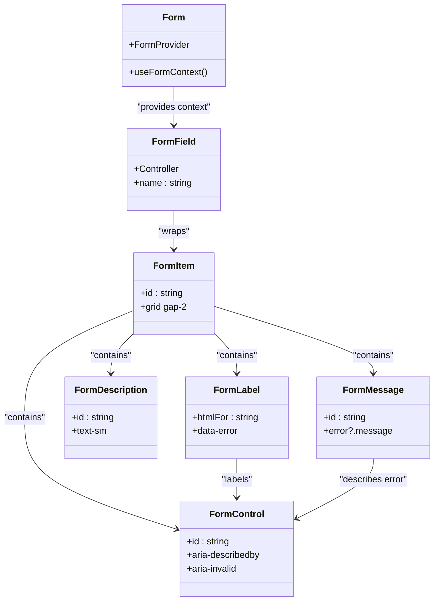
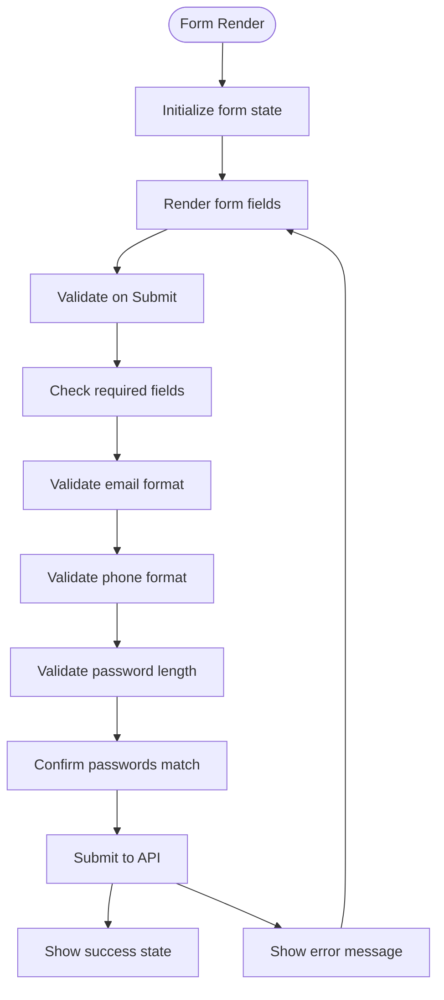

# Form Component

<cite>
**Referenced Files in This Document**   
- [form.tsx](file://src/components/ui/form.tsx)
- [OnboardingForm.tsx](file://src/components/OnboardingForm.tsx)
- [SignupForm.tsx](file://src/components/SignupForm.tsx)
- [validation.ts](file://src/middleware/validation.ts)
- [signup.ts](file://pages/api/auth/signup.ts)
</cite>

## Table of Contents
1. [Introduction](#introduction)
2. [Project Structure](#project-structure)
3. [Core Components](#core-components)
4. [Architecture Overview](#architecture-overview)
5. [Detailed Component Analysis](#detailed-component-analysis)
6. [Dependency Analysis](#dependency-analysis)
7. [Performance Considerations](#performance-considerations)
8. [Troubleshooting Guide](#troubleshooting-guide)
9. [Conclusion](#conclusion)

## Introduction
The Form component serves as the foundational building block for all form implementations within the SnapEvent application. It provides a structured, accessible, and reusable pattern for managing form state, validation, and submission through integration with react-hook-form. This documentation details the component's architecture, its implementation in key forms like OnboardingForm and SignupForm, and best practices for customization and optimization.

## Project Structure
The Form component is located in the UI component library and is consumed by various form implementations across the application. The structure follows a component-based architecture with clear separation between UI presentation and form logic.



**Diagram sources**
- [form.tsx](file://src/components/ui/form.tsx)
- [OnboardingForm.tsx](file://src/components/OnboardingForm.tsx)
- [SignupForm.tsx](file://src/components/SignupForm.tsx)
- [validation.ts](file://src/middleware/validation.ts)
- [signup.ts](file://pages/api/auth/signup.ts)

**Section sources**
- [form.tsx](file://src/components/ui/form.tsx)
- [OnboardingForm.tsx](file://src/components/OnboardingForm.tsx)
- [SignupForm.tsx](file://src/components/SignupForm.tsx)

## Core Components
The Form component leverages react-hook-form for efficient form state management, providing a clean API for field registration, validation, and error handling. It uses React Context to propagate form state to child components like FormLabel, FormControl, and FormMessage, ensuring consistent behavior and accessibility.

**Section sources**
- [form.tsx](file://src/components/ui/form.tsx#L1-L168)
- [utils.ts](file://src/components/ui/utils.ts#L1-L7)

## Architecture Overview
The Form component architecture is built around react-hook-form's Controller and FormProvider patterns, enabling declarative form management. It integrates with Zod-inspired validation rules (via custom validation middleware) to provide schema-based validation, though Zod itself is not directly used in the codebase.



**Diagram sources**
- [form.tsx](file://src/components/ui/form.tsx#L1-L168)

## Detailed Component Analysis

### Form Component Analysis
The Form component implements a headless UI pattern using react-hook-form, providing accessibility features through ARIA attributes and context propagation. It consists of several subcomponents that work together to create a cohesive form experience.

#### Component Structure:


**Diagram sources**
- [form.tsx](file://src/components/ui/form.tsx#L1-L168)

**Section sources**
- [form.tsx](file://src/components/ui/form.tsx#L1-L168)

### OnboardingForm Implementation
The OnboardingForm demonstrates a complex multi-step form implementation using the Form component pattern. It manages extensive user data including personal information, equipment details, and service offerings.

**Section sources**
- [OnboardingForm.tsx](file://src/components/OnboardingForm.tsx#L1-L399)

### SignupForm Implementation
The SignupForm provides a simpler form implementation focused on user registration, demonstrating basic validation and submission handling patterns.



**Diagram sources**
- [SignupForm.tsx](file://src/components/SignupForm.tsx#L1-L199)

**Section sources**
- [SignupForm.tsx](file://src/components/SignupForm.tsx#L1-L199)

## Dependency Analysis
The Form component has well-defined dependencies that enable its functionality while maintaining separation of concerns.

```mermaid
graph LR
A[Form Component] --> B[react-hook-form]
A --> C[@radix-ui/react-label]
A --> D[@radix-ui/react-slot]
A --> E[clsx]
A --> F[tailwind-merge]
B --> G[React Context]
C --> H[Accessibility]
D --> I[Slot Prop]
E & F --> J[Class Merging]
K[OnboardingForm] --> A
L[SignupForm] --> A
M[validation.ts] --> N[API Routes]
N --> O[Supabase]
```

**Diagram sources**
- [form.tsx](file://src/components/ui/form.tsx)
- [package.json](file://package.json)
- [validation.ts](file://src/middleware/validation.ts)

**Section sources**
- [form.tsx](file://src/components/ui/form.tsx)
- [package.json](file://package.json#L1-L95)
- [validation.ts](file://src/middleware/validation.ts)

## Performance Considerations
The Form component is optimized for performance through several mechanisms:
- Uses react-hook-form's uncontrolled component pattern to minimize re-renders
- Implements proper memoization through React Context
- Leverages efficient class merging with clsx and tailwind-merge
- Avoids unnecessary re-renders in form field components

For large forms like OnboardingForm, consider implementing:
- Field-level code splitting
- Lazy loading of form steps
- Debounced validation for expensive operations
- Memoized components for complex field groups

## Troubleshooting Guide
Common issues and solutions when working with the Form component:

**Section sources**
- [form.tsx](file://src/components/ui/form.tsx)
- [OnboardingForm.tsx](file://src/components/OnboardingForm.tsx)
- [SignupForm.tsx](file://src/components/SignupForm.tsx)
- [validation.ts](file://src/middleware/validation.ts)

## Conclusion
The Form component provides a robust foundation for form management in the SnapEvent application. By leveraging react-hook-form and React Context, it delivers an accessible, performant, and maintainable solution for both simple and complex form use cases. The integration with custom validation middleware ensures data integrity while maintaining flexibility for future enhancements.