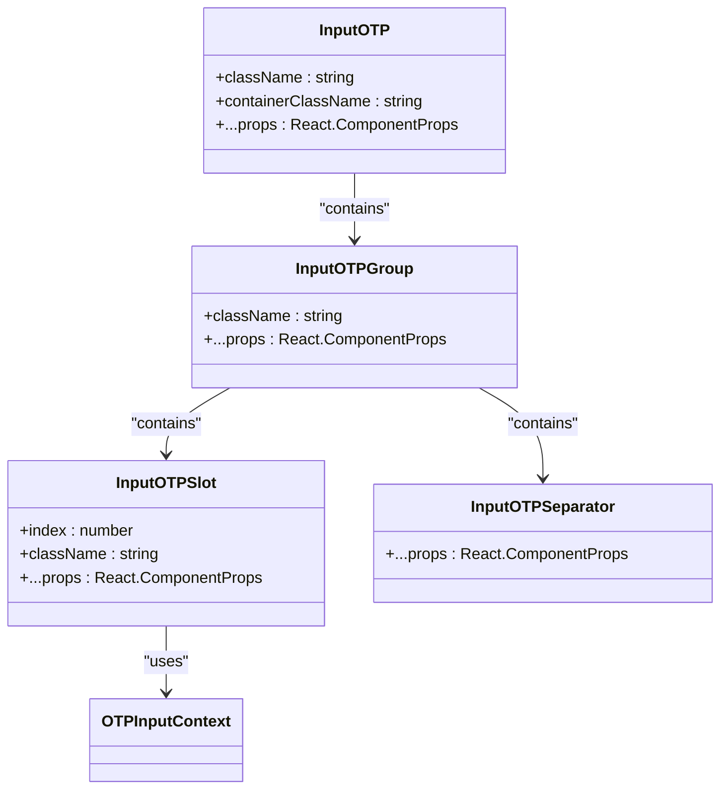
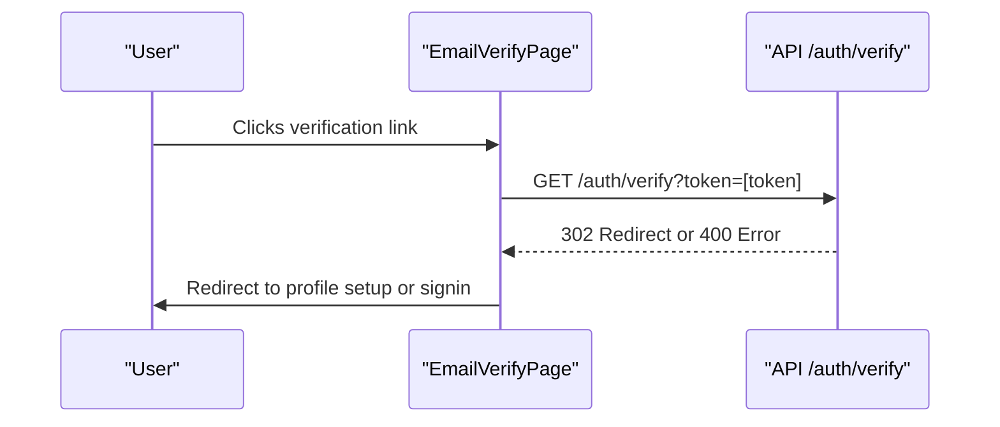

# OTP Input Component

<cite>
**Referenced Files in This Document**   
- [input-otp.tsx](file://src/components/ui/input-otp.tsx)
- [email-verify.tsx](file://pages/auth/email-verify.tsx)
- [verify.ts](file://pages/api/auth/verify.ts)
- [utils.ts](file://src/components/ui/utils.ts)
</cite>

## Table of Contents
1. [Introduction](#introduction)
2. [Component Architecture](#component-architecture)
3. [Core Features](#core-features)
4. [Integration with Email Verification](#integration-with-email-verification)
5. [Accessibility and User Experience](#accessibility-and-user-experience)
6. [Security Considerations](#security-considerations)
7. [Common Issues and Mitigation](#common-issues-and-mitigation)
8. [Conclusion](#conclusion)

## Introduction
The OTP Input Component is a specialized user interface element designed for multi-digit verification code entry. This component provides a secure and user-friendly way to handle one-time password inputs, commonly used in authentication flows such as email verification. The implementation leverages the input-otp library to provide a robust foundation while extending it with custom styling and behavior to match the application's design system.

**Section sources**
- [input-otp.tsx](file://src/components/ui/input-otp.tsx#L1-L77)

## Component Architecture
The OTP Input Component is composed of several sub-components that work together to create a cohesive user experience:

**Diagram sources**
- [input-otp.tsx](file://src/components/ui/input-otp.tsx#L8-L76)

**Section sources**
- [input-otp.tsx](file://src/components/ui/input-otp.tsx#L8-L76)

## Core Features
The OTP Input Component provides several key features that enhance the user experience for verification code entry:

### Individual Input Slots
Each digit of the OTP is entered into a separate visual slot, providing clear feedback to users about their input progress. The slots are implemented as individual components that render the entered character and manage focus states.

### Automatic Focus Traversal
The component automatically moves focus to the next input slot when a digit is entered, creating a seamless typing experience. When users delete a digit, focus moves back to the previous slot.

### Secure Input Handling
The component is designed with security in mind, preventing code leakage through proper input handling and ensuring that verification codes are transmitted securely.

### Customizable Props
The component accepts several props to customize its behavior and appearance:
- **maxLength**: Controls the number of digits in the OTP
- **containerClassName**: Allows custom styling of the container element
- **inputMode**: Sets the input mode to "numeric" for mobile keyboards

**Section sources**
- [input-otp.tsx](file://src/components/ui/input-otp.tsx#L8-L76)

## Integration with Email Verification
The OTP Input Component is integrated into the email verification flow, where it plays a crucial role in confirming user identities.

**Diagram sources**
- [email-verify.tsx](file://pages/auth/email-verify.tsx#L1-L33)
- [verify.ts](file://pages/api/auth/verify.ts#L1-L64)

**Section sources**
- [email-verify.tsx](file://pages/auth/email-verify.tsx#L1-L33)
- [verify.ts](file://pages/api/auth/verify.ts#L1-L64)

## Accessibility and User Experience
The component includes several accessibility features to ensure it can be used by all users:

### Screen Reader Support
The component provides proper labeling and ARIA attributes to ensure screen readers can accurately convey the purpose and state of each input slot to visually impaired users.

### Paste Event Handling
The component supports paste events to auto-fill codes, allowing users to quickly complete verification by pasting a code from their email or messaging app.

### Visual Feedback
The component provides clear visual feedback through:
- Focus indicators
- Active state styling
- Error state highlighting
- Animated caret for the active input position

**Section sources**
- [input-otp.tsx](file://src/components/ui/input-otp.tsx#L38-L52)
- [input-otp.tsx](file://src/components/ui/input-otp.tsx#L53-L76)

## Security Considerations
The implementation addresses several security aspects to protect user verification codes:

### Code Leakage Prevention
The component ensures that verification codes are not logged or stored in browser history by using proper HTTP methods and response handling.

### Secure Transmission
Verification codes are transmitted over HTTPS using secure tokens that are validated on the server side with proper expiration times.

### Timeout Handling
The backend implementation includes token expiration (30 minutes) to prevent replay attacks and ensure that verification links cannot be used indefinitely.

### Input Validation
All inputs are validated on both client and server sides to prevent injection attacks and ensure data integrity.

**Section sources**
- [verify.ts](file://pages/api/auth/verify.ts#L1-L64)
- [input-otp.tsx](file://src/components/ui/input-otp.tsx#L8-L76)

## Common Issues and Mitigation
Several common issues have been addressed in the implementation:

### Caret Positioning
The component uses a fake caret animation to indicate the active input position, ensuring consistent behavior across different browsers and devices.

### Browser Autofill Conflicts
The implementation minimizes conflicts with browser autofill features by using appropriate input attributes and handling autofill events properly.

### Mobile Keyboard Behavior
The component sets inputMode="numeric" to ensure the appropriate keyboard is displayed on mobile devices, improving the user experience for code entry.

### Styling Consistency
The cn utility function from the UI components ensures consistent styling across the application by properly merging Tailwind CSS classes.

**Section sources**
- [input-otp.tsx](file://src/components/ui/input-otp.tsx#L8-L76)
- [utils.ts](file://src/components/ui/utils.ts#L1-L7)

## Conclusion
The OTP Input Component provides a robust solution for multi-digit verification code entry, combining security, accessibility, and user experience considerations. By leveraging the input-otp library and extending it with custom styling and behavior, the component offers a seamless verification experience that integrates well with the application's authentication flows. The implementation demonstrates attention to detail in handling edge cases, security concerns, and cross-platform compatibility, making it a reliable component for critical authentication processes.