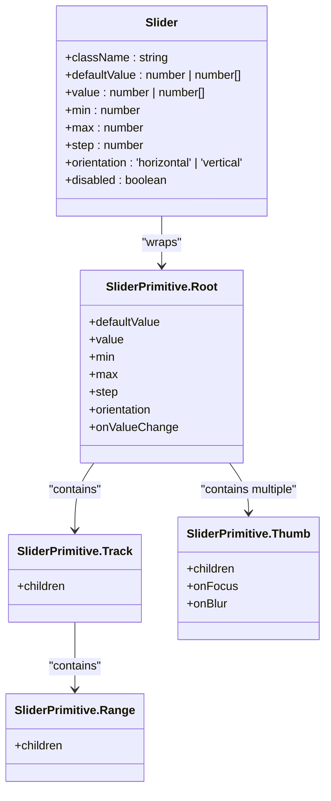
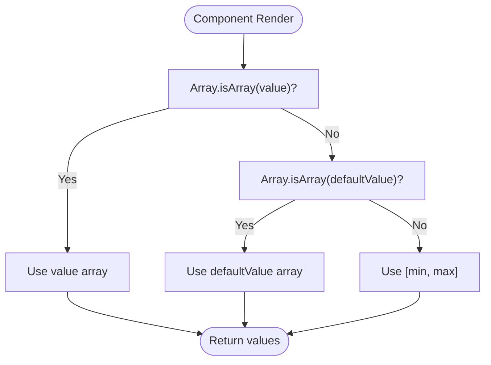
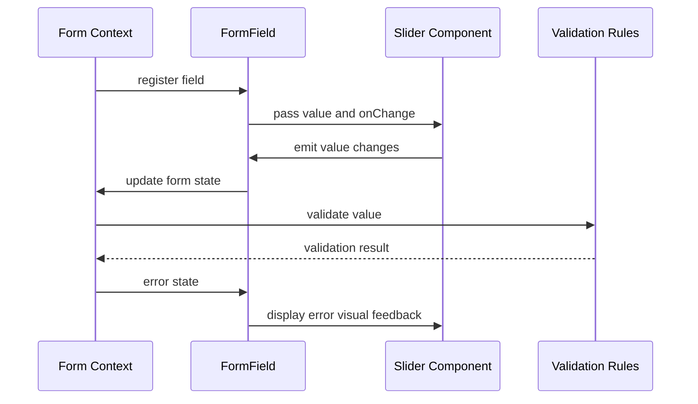

# Range & Slider Inputs

<cite>
**Referenced Files in This Document**   
- [slider.tsx](file://src/components/ui/slider.tsx)
- [OnboardingForm.tsx](file://src/components/OnboardingForm.tsx)
- [utils.ts](file://src/components/ui/utils.ts)
- [form.tsx](file://src/components/ui/form.tsx)
</cite>

## Table of Contents
1. [Introduction](#introduction)
2. [Core Component Architecture](#core-component-architecture)
3. [Props and Configuration](#props-and-configuration)
4. [Value Binding and State Management](#value-binding-and-state-management)
5. [Visual Feedback Mechanisms](#visual-feedback-mechanisms)
6. [Accessibility Implementation](#accessibility-implementation)
7. [Interaction Patterns](#interaction-patterns)
8. [Responsive Behavior](#responsive-behavior)
9. [Form Integration and Validation](#form-integration-and-validation)
10. [Multi-Thumb Range Selection](#multi-thumb-range-selection)
11. [Common Issues and Solutions](#common-issues-and-solutions)
12. [Performance Optimization](#performance-optimization)
13. [Field Value Coordination](#field-value-coordination)

## Introduction
The Slider component in the SnapEvent application provides a user-friendly interface for numeric range inputs. Built on top of Radix UI's accessible slider primitive, it enables users to select values within a defined range through intuitive drag interactions. While the current implementation in OnboardingForm.tsx uses Select components for price range and availability inputs, the underlying Slider component is available for more granular numeric input scenarios that require precise value selection.

**Section sources**
- [slider.tsx](file://src/components/ui/slider.tsx#L1-L64)
- [OnboardingForm.tsx](file://src/components/OnboardingForm.tsx#L1-L50)

## Core Component Architecture
The Slider component is implemented as a wrapper around Radix UI's SliderPrimitive, providing a consistent design system integration through Tailwind CSS classes. The architecture follows a composition pattern where the root slider element contains a track with a range indicator and multiple thumb controls. The component supports both single-value and range selection through array-based value handling.

**Diagram sources**
- [slider.tsx](file://src/components/ui/slider.tsx#L7-L64)

**Section sources**
- [slider.tsx](file://src/components/ui/slider.tsx#L7-L64)

## Props and Configuration
The Slider component accepts standard props for range configuration including min, max, and step values, with defaults of 0, 100, and 1 respectively. The defaultValue prop sets the initial value(s), while the value prop enables controlled component behavior. The component automatically handles both single-value and range scenarios by detecting array inputs. Additional props from React.ComponentProps<typeof SliderPrimitive.Root> are passed through to the underlying primitive for extended functionality.

**Section sources**
- [slider.tsx](file://src/components/ui/slider.tsx#L7-L14)

## Value Binding and State Management
The component implements value binding through React's useState and useMemo hooks, with the _values constant using useMemo to prevent unnecessary recalculations. The value handling logic prioritizes controlled component behavior (value prop) over uncontrolled (defaultValue prop), falling back to [min, max] as the default range. This approach ensures consistent state management whether the slider is used in controlled or uncontrolled mode.

**Diagram sources**
- [slider.tsx](file://src/components/ui/slider.tsx#L15-L25)

**Section sources**
- [slider.tsx](file://src/components/ui/slider.tsx#L15-L25)

## Visual Feedback Mechanisms
The slider provides visual feedback through multiple channels. The track displays a filled range indicator (SliderPrimitive.Range) that visually represents the selected portion of the scale. Thumb controls change appearance on hover and focus states, with CSS transitions for ring effects. The component uses data attributes (data-slot) for styling hooks and supports both horizontal and vertical orientations with appropriate dimension adjustments. Disabled states are indicated through opacity changes.

**Section sources**
- [slider.tsx](file://src/components/ui/slider.tsx#L26-L58)

## Accessibility Implementation
The component inherits comprehensive accessibility features from Radix UI's SliderPrimitive, including proper ARIA attributes for screen readers. The implementation automatically includes ARIA-valuenow, ARIA-valuemin, and ARIA-valuemax attributes on thumb elements. Keyboard navigation is fully supported with arrow keys for precise adjustment and Page Up/Down for larger increments. Focus management ensures visible focus rings for keyboard users, enhancing accessibility compliance.

**Section sources**
- [slider.tsx](file://src/components/ui/slider.tsx#L26-L64)

## Interaction Patterns
The slider supports both mouse and touch interactions through the "touch-none" CSS class and native browser event handling. Users can click anywhere on the track to move the nearest thumb, or drag thumbs directly for precise control. For multi-thumb sliders, the component prevents thumb overlap by constraining movement. The implementation includes hover effects and focus states to provide visual feedback during interactions.

**Section sources**
- [slider.tsx](file://src/components/ui/slider.tsx#L52-L58)

## Responsive Behavior
The component is designed to be responsive across device types with flexible width and orientation support. Horizontal sliders (default) adapt to container width, while vertical sliders have a minimum height constraint (min-h-44) for touch targets. The styling uses responsive classes that adjust dimensions based on orientation, ensuring adequate touch target sizes on mobile devices. The component automatically handles window resize events through the underlying Radix UI implementation.

**Section sources**
- [slider.tsx](file://src/components/ui/slider.tsx#L30-L31)

## Form Integration and Validation
While not currently implemented in OnboardingForm.tsx, the slider component can be integrated with form validation systems through react-hook-form. The component could be wrapped in a FormField to connect with the form context, allowing validation rules to be applied to slider values. Error states could be communicated through associated FormMessage components, with visual indicators on the slider itself through data-error attributes.

**Diagram sources**
- [form.tsx](file://src/components/ui/form.tsx#L1-L169)
- [slider.tsx](file://src/components/ui/slider.tsx#L1-L64)

**Section sources**
- [form.tsx](file://src/components/ui/form.tsx#L1-L169)

## Multi-Thumb Range Selection
The component supports multiple thumbs for range selection through array-based value handling. When provided with an array of values, the component renders a thumb for each value and creates a range between them. The implementation uses Array.from with the length of values to generate the appropriate number of thumb elements. This enables use cases such as selecting price ranges or availability periods with start and end points.

**Section sources**
- [slider.tsx](file://src/components/ui/slider.tsx#L52-L58)

## Common Issues and Solutions
The component addresses several common slider implementation challenges. Precision errors with floating-point values are mitigated through the underlying Radix UI implementation. Step alignment is handled automatically by the primitive component, ensuring values snap to the defined step interval. While tooltip display during drag is not currently implemented, this could be added through custom event handlers that update a tooltip component based on the current thumb position.

**Section sources**
- [slider.tsx](file://src/components/ui/slider.tsx#L7-L64)

## Performance Optimization
The component implements performance optimizations through React's useMemo hook to prevent unnecessary recalculations of the values array. The implementation avoids inline object creation in props to prevent unnecessary re-renders. For scenarios with frequent updates, the component benefits from Radix UI's optimized event handling and requestAnimationFrame-based updates, ensuring smooth drag interactions even on lower-powered devices.

**Section sources**
- [slider.tsx](file://src/components/ui/slider.tsx#L15-L25)

## Field Value Coordination
Although the current OnboardingForm implementation uses Select components for price range and availability inputs, the slider component could be used to create coordinated field relationships. For example, a photographer's pricing slider could dynamically update a displayed hourly rate, or an availability slider could adjust calendar visibility. This coordination would be implemented through shared state management and effect hooks that synchronize related form fields.

**Section sources**
- [OnboardingForm.tsx](file://src/components/OnboardingForm.tsx#L574-L603)
- [slider.tsx](file://src/components/ui/slider.tsx#L1-L64)