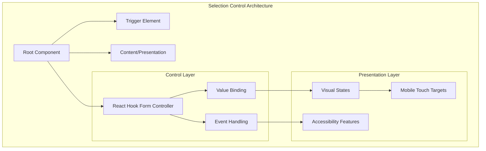
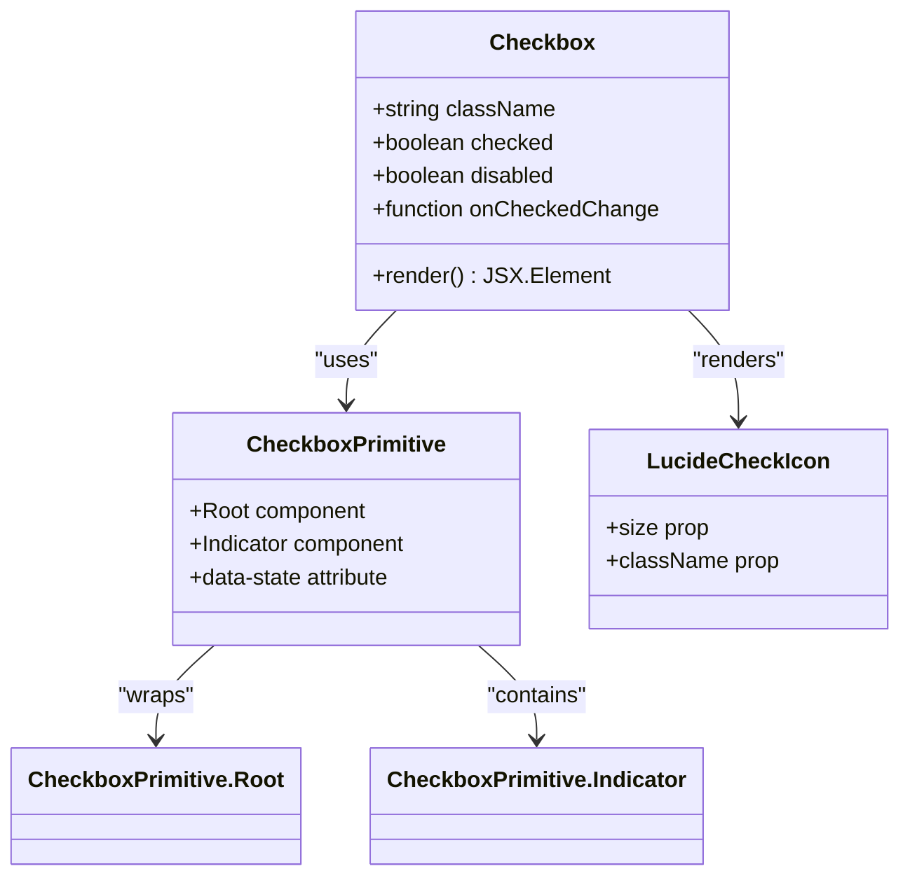
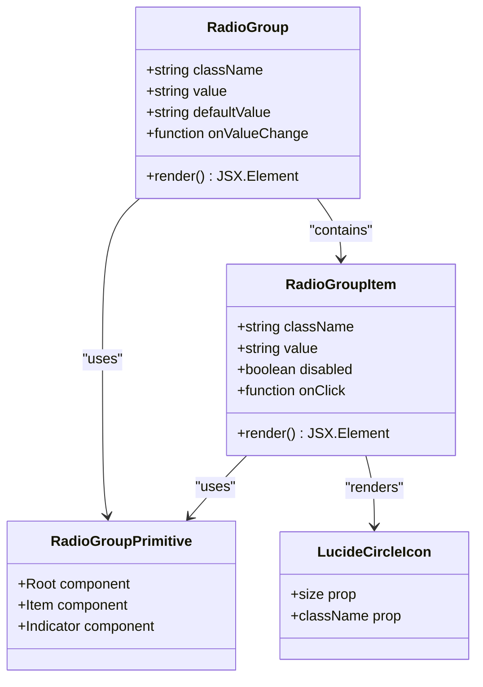
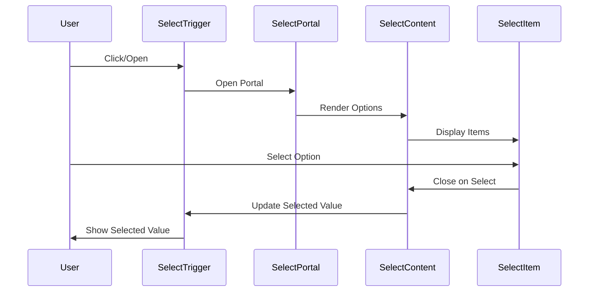
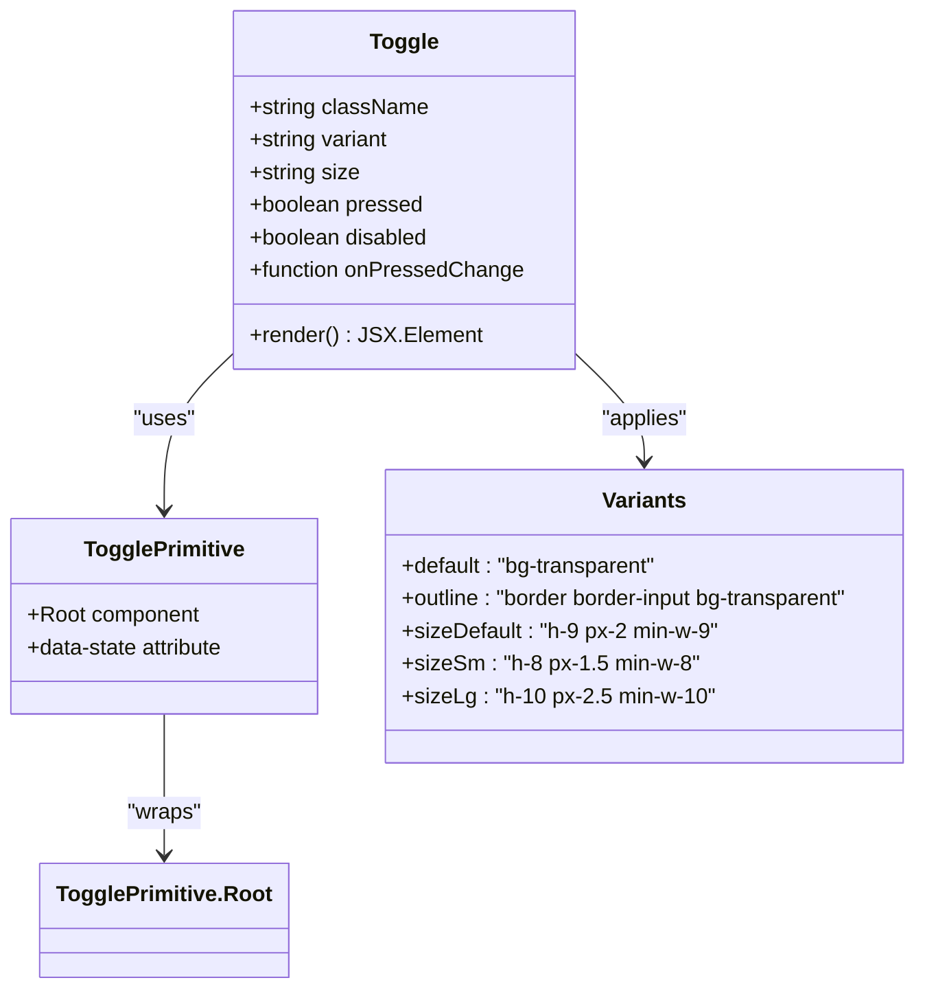
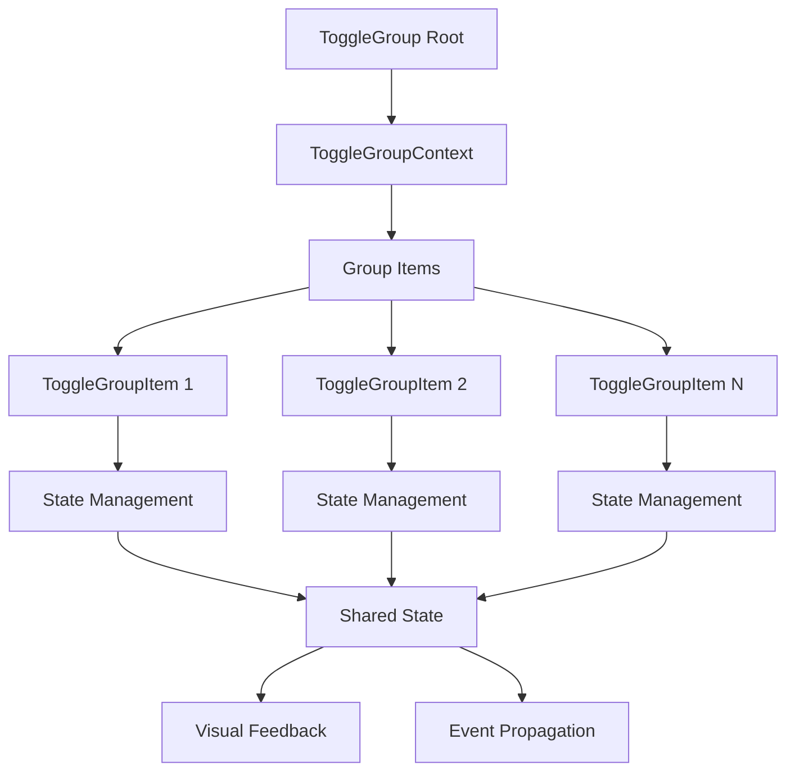
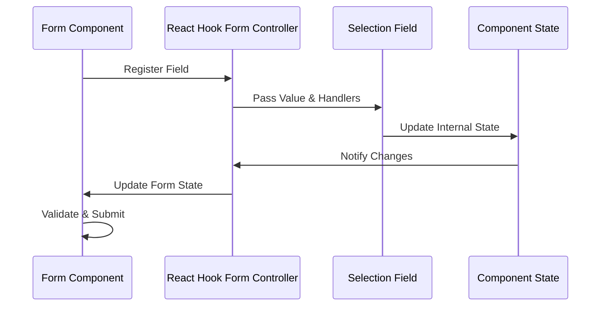

# Selection Controls

<cite>
**Referenced Files in This Document**
- [OnboardingForm.tsx](file://src/components/OnboardingForm.tsx)
- [checkbox.tsx](file://src/components/ui/checkbox.tsx)
- [radio-group.tsx](file://src/components/ui/radio-group.tsx)
- [select.tsx](file://src/components/ui/select.tsx)
- [toggle.tsx](file://src/components/ui/toggle.tsx)
- [toggle-group.tsx](file://src/components/ui/toggle-group.tsx)
- [form.tsx](file://src/components/ui/form.tsx)
- [UserTypeSelection.tsx](file://src/components/UserTypeSelection.tsx)
</cite>

## Table of Contents
1. [Introduction](#introduction)
2. [Component Architecture](#component-architecture)
3. [Checkbox Component](#checkbox-component)
4. [Radio Group Component](#radio-group-component)
5. [Select Component](#select-component)
6. [Toggle Component](#toggle-component)
7. [Toggle Group Component](#toggle-group-component)
8. [React Hook Form Integration](#react-hook-form-integration)
9. [Accessibility Standards](#accessibility-standards)
10. [Visual States and Theming](#visual-states-and-theming)
11. [Mobile Touch Targets](#mobile-touch-targets)
12. [Common Implementation Pitfalls](#common-implementation-pitfalls)
13. [Best Practices](#best-practices)
14. [Troubleshooting Guide](#troubleshooting-guide)
15. [Conclusion](#conclusion)

## Introduction

Selection controls are fundamental form elements that enable users to make choices from predefined options. This documentation covers five primary selection components used in the SnapEvent platform: Checkbox, Radio Group, Select, Toggle, and Toggle Group. These components are designed to work seamlessly within forms, particularly with React Hook Form's controller pattern, providing robust value binding mechanisms and comprehensive event handling.

The selection controls in this codebase demonstrate modern web development practices with emphasis on accessibility, responsive design, and intuitive user experiences. They integrate with Tailwind CSS for styling and Radix UI primitives for reliable cross-browser compatibility.

## Component Architecture

The selection controls follow a consistent architectural pattern built on Radix UI primitives, ensuring accessibility and reliability across different browsers and devices.



**Diagram sources**
- [checkbox.tsx](file://src/components/ui/checkbox.tsx#L1-L33)
- [radio-group.tsx](file://src/components/ui/radio-group.tsx#L1-L46)
- [select.tsx](file://src/components/ui/select.tsx#L1-L190)

## Checkbox Component

The Checkbox component provides a binary selection mechanism with support for indeterminate states and comprehensive accessibility features.

### Component Structure



**Diagram sources**
- [checkbox.tsx](file://src/components/ui/checkbox.tsx#L8-L32)

### Props and Configuration

The Checkbox component accepts the following props:

- **className**: Additional CSS classes for customization
- **checked**: Boolean indicating the current checked state
- **disabled**: Boolean disabling user interaction
- **onCheckedChange**: Callback function triggered when state changes
- **id**: Unique identifier for accessibility
- **value**: The value associated with the checkbox

### Value Binding Mechanism

The checkbox implements controlled component behavior through React state management:

```typescript
// Example from OnboardingForm.tsx
const handleCheckboxChange = (e: React.ChangeEvent<HTMLInputElement>, fieldName: 'photoTypes' | 'additionalServices') => {
  const { value, checked, id } = e.target;
  
  setFormData((prev: FormData) => {
    const currentArray = prev[fieldName];
    let newArray;
    
    if (checked) {
      // Limit to 2 selections
      if (currentArray.length < 2) {
        newArray = [...currentArray, value];
      } else {
        return prev; // Don't add if already 2 selected
      }
    } else {
      newArray = currentArray.filter((item: string) => item !== value);
    }
    
    // Update ranked list
    setTimeout(() => updateRankedList(fieldName, newArray), 0);
    
    return { ...prev, [fieldName]: newArray };
  });
};
```

### Event Handling

The checkbox supports comprehensive event handling:

- **onChange**: Standard change event for state updates
- **onCheckedChange**: Radix UI specific callback for state management
- **onClick**: Mouse click event for additional interaction
- **onKeyDown**: Keyboard navigation support

**Section sources**
- [checkbox.tsx](file://src/components/ui/checkbox.tsx#L1-L33)
- [OnboardingForm.tsx](file://src/components/OnboardingForm.tsx#L85-L110)

## Radio Group Component

The Radio Group component enables single-selection from a set of mutually exclusive options, commonly used for selecting preferences or categories.

### Component Structure



**Diagram sources**
- [radio-group.tsx](file://src/components/ui/radio-group.tsx#L8-L45)

### Props and Configuration

The Radio Group accepts these primary props:

- **className**: Additional styling classes
- **value**: Currently selected value
- **defaultValue**: Initial value before user interaction
- **onValueChange**: Callback for value changes
- **orientation**: Layout direction (horizontal/vertical)
- **disabled**: Disables all radio items

### Value Binding and Event Handling

The radio group maintains single-selection behavior through controlled state management:

```typescript
// Example from OnboardingForm.tsx
<Select value={formData.experience} onValueChange={(value) => handleInputChange('experience', value)}>
  <SelectTrigger>
    <SelectValue placeholder="Select your experience level" />
  </SelectTrigger>
  <SelectContent>
    <SelectItem value="beginner">Less than 1 year</SelectItem>
    <SelectItem value="intermediate">1-3 years</SelectItem>
    <SelectItem value="experienced">3-5 years</SelectItem>
    <SelectItem value="expert">5+ years</SelectItem>
  </SelectContent>
</Select>
```

**Section sources**
- [radio-group.tsx](file://src/components/ui/radio-group.tsx#L1-L46)
- [OnboardingForm.tsx](file://src/components/OnboardingForm.tsx#L250-L270)

## Select Component

The Select component provides a dropdown interface for choosing from a list of options, featuring advanced filtering, virtualization, and accessibility support.

### Component Architecture



**Diagram sources**
- [select.tsx](file://src/components/ui/select.tsx#L15-L190)

### Props and Configuration

The Select component offers extensive configuration options:

#### Root Component
- **value**: Current selected value
- **onValueChange**: Change handler
- **disabled**: Disable interaction
- **dir**: Direction (ltr/rtl)

#### Trigger Component
- **size**: Size variants (sm, default)
- **children**: Custom trigger content

#### Content Component
- **position**: Positioning strategy
- **avoidCollisions**: Collision detection
- **sideOffset**: Offset distance

### Advanced Features

The Select component includes several advanced features:

- **Virtual Scrolling**: Handles large option lists efficiently
- **Keyboard Navigation**: Full keyboard support
- **Search Filtering**: Real-time option filtering
- **Custom Rendering**: Flexible option rendering
- **Scroll Buttons**: Navigation for long lists

### Event Handling Patterns

```typescript
// Example from OnboardingForm.tsx
<Select value={formData.priceRange} onValueChange={(value) => handleInputChange('priceRange', value)}>
  <SelectTrigger>
    <SelectValue placeholder="Select your starting price range" />
  </SelectTrigger>
  <SelectContent>
    <SelectItem value="budget">Under $500</SelectItem>
    <SelectItem value="mid">$500 - $1,000</SelectItem>
    <SelectItem value="premium">$1,000 - $2,500</SelectItem>
    <SelectItem value="luxury">$2,500+</SelectItem>
  </SelectContent>
</Select>
```

**Section sources**
- [select.tsx](file://src/components/ui/select.tsx#L1-L190)
- [OnboardingForm.tsx](file://src/components/OnboardingForm.tsx#L320-L340)

## Toggle Component

The Toggle component functions as a two-state switch with visual feedback, commonly used for enabling/disabling features or toggling modes.

### Component Structure



**Diagram sources**
- [toggle.tsx](file://src/components/ui/toggle.tsx#L15-L47)

### Props and Configuration

The Toggle component supports:

- **variant**: Visual appearance (default, outline)
- **size**: Dimension variants (default, sm, lg)
- **pressed**: Current state (true/false)
- **disabled**: Interaction capability
- **onPressedChange**: State change callback

### Visual States

The Toggle component displays different visual states:

- **Default State**: Transparent background with subtle hover effects
- **Pressed State**: Accent color background with text contrast
- **Disabled State**: Reduced opacity and no interaction
- **Focus State**: Ring outline for keyboard navigation

**Section sources**
- [toggle.tsx](file://src/components/ui/toggle.tsx#L1-L48)

## Toggle Group Component

The Toggle Group component manages collections of Toggle buttons with mutual exclusivity or multi-selection capabilities.

### Component Architecture



**Diagram sources**
- [toggle-group.tsx](file://src/components/ui/toggle-group.tsx#L15-L74)

### Props and Configuration

The Toggle Group accepts:

- **variant**: Consistent visual style across items
- **size**: Uniform sizing for all items
- **type**: Single/multiple selection mode
- **value**: Current selection values
- **onValueChange**: Selection change handler

### Multi-Selection Behavior

The Toggle Group supports both single and multiple selection modes:

```typescript
// Example from OnboardingForm.tsx
<div>
  <label className="block text-sm font-medium mb-2">Photography Specialties</label>
  <p className="text-sm text-muted-foreground mb-3">Select all that apply</p>
  <div className="grid grid-cols-1 md:grid-cols-2 gap-3">
    {specialtyOptions.map((specialty) => (
      <motion.div
        key={specialty}
        whileHover={{ scale: 1.02, x: 4 }}
        transition={{ type: "spring", stiffness: 400, damping: 17 }}
        className="flex items-center space-x-2 p-2 rounded-lg hover:bg-muted/50 transition-colors duration-200"
      >
        <Checkbox
          id={specialty}
          checked={formData.specialties.includes(specialty)}
          onCheckedChange={() => handleSpecialtyToggle(specialty)}
        />
        <label htmlFor={specialty} className="text-sm cursor-pointer flex-1">
          {specialty}
        </label>
      </motion.div>
    ))}
  </div>
</div>
```

**Section sources**
- [toggle-group.tsx](file://src/components/ui/toggle-group.tsx#L1-L74)
- [OnboardingForm.tsx](file://src/components/OnboardingForm.tsx#L270-L290)

## React Hook Form Integration

The selection controls integrate seamlessly with React Hook Form's controller pattern, providing robust form state management and validation.

### Controller Pattern Implementation



**Diagram sources**
- [form.tsx](file://src/components/ui/form.tsx#L25-L48)

### Form Field Context

The form system establishes context for field management:

```typescript
// From form.tsx
const FormField = <
  TFieldValues extends FieldValues = FieldValues,
  TName extends FieldPath<TFieldValues> = FieldPath<TFieldValues>,
>({
  ...props
}: ControllerProps<TFieldValues, TName>) => {
  return (
    <FormFieldContext.Provider value={{ name: props.name }}>
      <Controller {...props} />
    </FormFieldContext.Provider>
  );
};
```

### Validation Integration

The selection controls support comprehensive validation:

- **Required Fields**: Mandatory selection validation
- **Custom Validators**: Business logic validation
- **Error Messages**: Dynamic error display
- **Validation Triggers**: On blur, on submit, real-time

**Section sources**
- [form.tsx](file://src/components/ui/form.tsx#L1-L169)

## Accessibility Standards

The selection controls implement comprehensive accessibility features following WCAG guidelines and ARIA specifications.

### ARIA Roles and Attributes

Each component implements appropriate ARIA attributes:

- **Checkbox**: `role="checkbox"`, `aria-checked`, `aria-labelledby`
- **Radio Group**: `role="radiogroup"`, `aria-required`
- **Select**: `role="combobox"`, `aria-expanded`, `aria-controls`
- **Toggle**: `role="button"`, `aria-pressed`

### Keyboard Navigation

All components support full keyboard navigation:

- **Tab**: Move between interactive elements
- **Space/Enter**: Activate checkboxes and toggles
- **Arrow Keys**: Navigate radio groups and selects
- **Escape**: Close dropdowns and menus
- **Home/End**: Jump to first/last options

### Screen Reader Support

Components provide comprehensive screen reader support:

- **Labels**: Associated with form controls
- **Descriptions**: Additional context for complex controls
- **Status Updates**: Real-time feedback on changes
- **Live Regions**: Dynamic content announcements

## Visual States and Theming

The selection controls support comprehensive visual states and theme switching for optimal user experience.

### State Variations

Each component displays distinct visual states:

#### Checkbox States
- **Unchecked**: Empty box with subtle border
- **Checked**: Filled box with checkmark icon
- **Indeterminate**: Dash in center for partial selection
- **Disabled**: Reduced opacity and no interaction
- **Hover/Focus**: Enhanced visual feedback

#### Select States
- **Closed**: Trigger with down arrow indicator
- **Open**: Expanded content with highlighted selections
- **Loading**: Spinner or loading indicator
- **Error**: Red border and error icon

#### Toggle States
- **Default**: Transparent background
- **Pressed**: Accent color background
- **Hover**: Subtle background change
- **Focus**: Ring outline

### Theme Integration

The components integrate with Tailwind CSS themes:

```typescript
// Example from checkbox.tsx
className={cn(
  "peer border bg-input-background dark:bg-input/30 data-[state=checked]:bg-primary data-[state=checked]:text-primary-foreground",
  className,
)}
```

**Section sources**
- [checkbox.tsx](file://src/components/ui/checkbox.tsx#L12-L20)
- [radio-group.tsx](file://src/components/ui/radio-group.tsx#L20-L30)

## Mobile Touch Targets

The selection controls are optimized for mobile devices with appropriate touch target sizes and gesture support.

### Touch Target Sizing

Minimum touch target sizes according to WCAG guidelines:

- **Checkbox**: 24x24 pixels minimum
- **Radio**: 44x44 pixels minimum
- **Select**: 44x44 pixels minimum
- **Toggle**: 44x44 pixels minimum

### Gesture Support

Mobile-optimized interaction patterns:

- **Tap**: Primary activation gesture
- **Long Press**: Context menu for complex controls
- **Swipe**: Horizontal navigation for toggle groups
- **Pinch**: Zoom for expanded views

### Responsive Design

Components adapt to different screen sizes:

```typescript
// Example from select.tsx
className={cn(
  "border-input data-[placeholder]:text-muted-foreground",
  "data-[size=default]:h-9 data-[size=sm]:h-8",
  className,
)}
```

**Section sources**
- [select.tsx](file://src/components/ui/select.tsx#L40-L50)

## Common Implementation Pitfalls

Understanding common pitfalls helps developers avoid issues when implementing selection controls.

### Uncontrolled to Controlled Transition

**Problem**: Switching between uncontrolled and controlled components causes React warnings.

**Solution**: Always initialize with proper default values:

```typescript
// Good practice
const [value, setValue] = useState(initialValue || '');

// Avoid
const [value, setValue] = useState(); // Undefined initial state
```

### Group Name Collisions

**Problem**: Multiple selection groups sharing the same name cause conflicts.

**Solution**: Use unique identifiers for each group:

```typescript
// Good practice
<RadioGroup name="experience-level">
  <RadioGroupItem value="beginner" />
  <RadioGroupItem value="intermediate" />
</RadioGroup>

<Select name="price-range">
  <SelectItem value="budget">Budget</SelectItem>
</Select>
```

### Proper Label Association

**Problem**: Labels not properly associated with controls break accessibility.

**Solution**: Use explicit label associations:

```typescript
// Good practice
<label htmlFor="specialty-checkbox">Photography Specialty</label>
<Checkbox id="specialty-checkbox" />

// Or use form wrapper
<FormField>
  <FormLabel>Photography Specialty</FormLabel>
  <FormControl>
    <Checkbox />
  </FormControl>
</FormField>
```

### State Management Issues

**Problem**: Inconsistent state updates causing unexpected behavior.

**Solution**: Use functional updates for complex state changes:

```typescript
// Good practice
setFormData(prev => ({
  ...prev,
  specialties: prev.specialties.includes(specialty)
    ? prev.specialties.filter(s => s !== specialty)
    : [...prev.specialties, specialty]
}));
```

## Best Practices

Following established best practices ensures optimal user experience and maintainable code.

### Layout and Alignment

- **Consistent Spacing**: Use uniform margins and padding
- **Logical Grouping**: Group related controls together
- **Clear Labels**: Provide descriptive, contextual labels
- **Visual Hierarchy**: Use size and color to indicate importance

### Error State Presentation

- **Immediate Feedback**: Show errors as soon as they occur
- **Clear Messaging**: Use specific, actionable error messages
- **Visual Indicators**: Combine color and icons for emphasis
- **Contextual Help**: Provide guidance for fixing errors

### Performance Optimization

- **Virtualization**: Use virtual scrolling for large option lists
- **Debouncing**: Debounce search inputs for better responsiveness
- **Memoization**: Memoize expensive calculations
- **Lazy Loading**: Load options on demand when possible

### Testing Strategies

- **Unit Tests**: Test individual component behavior
- **Integration Tests**: Test component interactions
- **Accessibility Tests**: Verify WCAG compliance
- **Cross-Browser Testing**: Ensure compatibility across browsers

## Troubleshooting Guide

Common issues and their solutions when working with selection controls.

### Component Not Responding

**Symptoms**: Clicks/taps don't register, state doesn't update

**Possible Causes**:
- Disabled property is set to true
- Event handlers aren't properly bound
- Parent container has pointer-events: none

**Solutions**:
```typescript
// Check component state
console.log('Component disabled:', disabled);

// Verify event handler binding
const handleClick = useCallback(() => {
  console.log('Clicked');
}, []);

// Inspect CSS properties
const styles = window.getComputedStyle(element);
console.log('Pointer events:', styles.pointerEvents);
```

### Styling Issues

**Symptoms**: Components appear broken or don't match design

**Possible Causes**:
- Missing Tailwind CSS classes
- Conflicting CSS rules
- Incorrect theme configuration

**Solutions**:
```typescript
// Verify class composition
className={cn(
  "peer border bg-input-background",
  "data-[state=checked]:bg-primary",
  className,
)}

// Check theme context
const theme = useTheme(); // Custom theme hook
console.log('Active theme:', theme);
```

### Form Validation Problems

**Symptoms**: Validation errors not displaying, form submission failing

**Possible Causes**:
- Missing validation rules
- Incorrect field registration
- Async validation timing issues

**Solutions**:
```typescript
// Add validation rules
const validationRules = {
  required: 'This field is required',
  minLength: { value: 2, message: 'Minimum 2 characters' }
};

// Verify field registration
const { register } = useFormContext();
register('fieldName', validationRules);
```

### Accessibility Concerns

**Symptoms**: Screen readers not announcing correctly, keyboard navigation issues

**Possible Causes**:
- Missing ARIA attributes
- Improper label associations
- Focus management problems

**Solutions**:
```typescript
// Add proper ARIA attributes
<Checkbox
  id="unique-id"
  aria-label="Accept terms and conditions"
  aria-describedby="terms-help"
/>

// Ensure proper labeling
<FormLabel htmlFor="unique-id">
  Accept terms and conditions
</FormLabel>
```

## Conclusion

The selection controls in the SnapEvent platform demonstrate modern web development best practices with comprehensive accessibility, responsive design, and seamless React Hook Form integration. By following the patterns and guidelines outlined in this documentation, developers can create robust, user-friendly selection interfaces that meet both functional and accessibility requirements.

Key takeaways include:

- **Consistency**: Maintain consistent patterns across all selection components
- **Accessibility**: Implement comprehensive ARIA support and keyboard navigation
- **Performance**: Optimize for mobile devices and large datasets
- **Testing**: Thoroughly test across browsers and assistive technologies
- **Documentation**: Provide clear examples and usage guidelines

The modular architecture allows for easy customization and extension while maintaining the core functionality and accessibility features that make these components suitable for production applications.