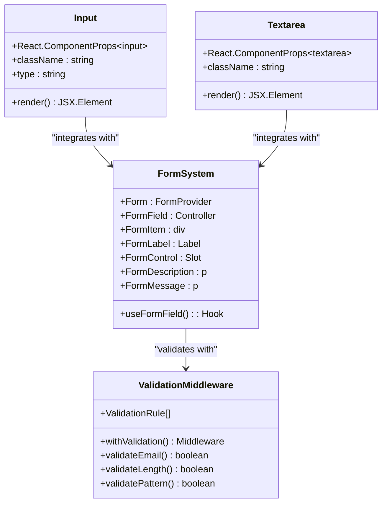
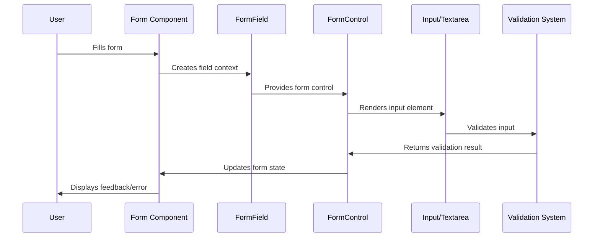

# Text Input & Textarea Components

<cite>
**Referenced Files in This Document**
- [src/components/ui/input.tsx](file://src/components/ui/input.tsx)
- [src/components/ui/textarea.tsx](file://src/components/ui/textarea.tsx)
- [src/components/ui/form.tsx](file://src/components/ui/form.tsx)
- [src/components/ui/utils.ts](file://src/components/ui/utils.ts)
- [src/components/OnboardingForm.tsx](file://src/components/OnboardingForm.tsx)
- [src/components/GeneralizedSignupFlow.tsx](file://src/components/GeneralizedSignupFlow.tsx)
- [src/middleware/validation.ts](file://src/middleware/validation.ts)
- [tailwind.config.js](file://tailwind.config.js)
</cite>

## Table of Contents
1. [Introduction](#introduction)
2. [Component Architecture](#component-architecture)
3. [Input Component](#input-component)
4. [Textarea Component](#textarea-component)
5. [Form Integration](#form-integration)
6. [Styling with Tailwind CSS](#styling-with-tailwind-css)
7. [Usage Examples](#usage-examples)
8. [Accessibility Features](#accessibility-features)
9. [Performance Considerations](#performance-considerations)
10. [Common Issues & Solutions](#common-issues--solutions)
11. [Best Practices](#best-practices)

## Introduction

The SnapEvent landing page features a robust text input and textarea component system built with React and Tailwind CSS. These components provide consistent styling, accessibility features, and seamless integration with form validation systems. The implementation emphasizes controlled behavior, responsive design, and mobile-friendly experiences.

The components are designed to work together with a sophisticated form system that handles validation, error display, and user feedback. They support both light and dark themes, internationalization, and provide excellent user experience across different devices and screen sizes.

## Component Architecture

The text input and textarea components follow a consistent architectural pattern that promotes reusability and maintainability:



**Diagram sources**
- [src/components/ui/input.tsx](file://src/components/ui/input.tsx#L1-L22)
- [src/components/ui/textarea.tsx](file://src/components/ui/textarea.tsx#L1-L19)
- [src/components/ui/form.tsx](file://src/components/ui/form.tsx#L1-L169)

**Section sources**
- [src/components/ui/input.tsx](file://src/components/ui/input.tsx#L1-L22)
- [src/components/ui/textarea.tsx](file://src/components/ui/textarea.tsx#L1-L19)
- [src/components/ui/form.tsx](file://src/components/ui/form.tsx#L1-L169)

## Input Component

The Input component serves as the foundation for single-line text inputs throughout the application. It provides comprehensive styling, accessibility features, and integration with the form system.

### Props and Configuration

The Input component accepts standard HTML input attributes along with specialized styling:

```typescript
interface InputProps extends React.ComponentProps<"input"> {
  className?: string;
  type?: string;
}
```

Key features include:
- **Type Support**: Supports all standard HTML input types (text, email, password, tel, etc.)
- **Controlled Behavior**: Designed to work seamlessly with form state management
- **Accessibility**: Includes appropriate ARIA attributes and keyboard navigation
- **Responsive Design**: Adapts to different screen sizes and orientations

### Implementation Details

```typescript
function Input({ className, type, ...props }: React.ComponentProps<"input">) {
  return (
    <input
      type={type}
      data-slot="input"
      className={cn(
        "file:text-foreground placeholder:text-muted-foreground selection:bg-primary selection:text-primary-foreground dark:bg-input/30 border-input flex h-9 w-full min-w-0 rounded-md border px-3 py-1 text-base bg-input-background transition-[color,box-shadow] outline-none file:inline-flex file:h-7 file:border-0 file:bg-transparent file:text-sm file:font-medium disabled:pointer-events-none disabled:cursor-not-allowed disabled:opacity-50 md:text-sm",
        "focus-visible:border-ring focus-visible:ring-ring/50 focus-visible:ring-[3px]",
        "aria-invalid:ring-destructive/20 dark:aria-invalid:ring-destructive/40 aria-invalid:border-destructive",
        className,
      )}
      {...props}
    />
  );
}
```

**Section sources**
- [src/components/ui/input.tsx](file://src/components/ui/input.tsx#L1-L22)

## Textarea Component

The Textarea component provides multi-line text input capabilities with automatic resizing and enhanced user experience features.

### Props and Configuration

```typescript
interface TextareaProps extends React.ComponentProps<"textarea"> {
  className?: string;
}
```

### Key Features

- **Auto-Resizing**: Uses `resize-none` to prevent manual resizing while maintaining content-based sizing
- **Minimum Height**: Enforces a minimum height of `min-h-16` for consistent appearance
- **Field Sizing**: Integrates with `field-sizing-content` for optimal content fitting
- **Mobile Optimization**: Provides excellent touch and keyboard experiences on mobile devices

### Implementation Details

```typescript
function Textarea({ className, ...props }: React.ComponentProps<"textarea">) {
  return (
    <textarea
      data-slot="textarea"
      className={cn(
        "resize-none border-input placeholder:text-muted-foreground focus-visible:border-ring focus-visible:ring-ring/50 aria-invalid:ring-destructive/20 dark:aria-invalid:ring-destructive/40 aria-invalid:border-destructive dark:bg-input/30 flex field-sizing-content min-h-16 w-full rounded-md border bg-input-background px-3 py-2 text-base transition-[color,box-shadow] outline-none focus-visible:ring-[3px] disabled:cursor-not-allowed disabled:opacity-50 md:text-sm",
        className,
      )}
      {...props}
    />
  );
}
```

**Section sources**
- [src/components/ui/textarea.tsx](file://src/components/ui/textarea.tsx#L1-L19)

## Form Integration

The text input and textarea components integrate seamlessly with a sophisticated form system that provides validation, error handling, and user feedback mechanisms.

### Form System Architecture



**Diagram sources**
- [src/components/ui/form.tsx](file://src/components/ui/form.tsx#L30-L50)
- [src/components/ui/form.tsx](file://src/components/ui/form.tsx#L98-L110)

### FormField Context

The form system uses React Context to manage field state and validation:

```typescript
const FormFieldContext = React.createContext<FormFieldContextValue>(
  {} as FormFieldContextValue,
);

const FormItemContext = React.createContext<FormItemContextValue>(
  {} as FormItemContextValue,
);
```

### Validation Integration

The components automatically integrate with validation systems through ARIA attributes:

- **aria-invalid**: Set to `true` when validation fails
- **aria-describedby**: Links to error messages and descriptions
- **Focus Management**: Properly handles focus states during validation

**Section sources**
- [src/components/ui/form.tsx](file://src/components/ui/form.tsx#L1-L169)

## Styling with Tailwind CSS

The components leverage Tailwind CSS for consistent, responsive styling that adapts to different themes and screen sizes.

### Color System Integration

The components integrate with the application's color system:

```javascript
// Tailwind config colors
colors: {
  border: "hsl(var(--border))",
  input: "hsl(var(--input))",
  ring: "hsl(var(--ring))",
  background: "hsl(var(--background))",
  foreground: "hsl(var(--foreground))",
  primary: {
    DEFAULT: "hsl(var(--primary))",
    foreground: "hsl(var(--primary-foreground))",
  },
  destructive: {
    DEFAULT: "hsl(var(--destructive))",
    foreground: "hsl(var(--destructive-foreground))",
  },
}
```

### Responsive Design

Components adapt to different screen sizes:

- **Mobile**: Base styles for small screens
- **Desktop**: Enhanced spacing and typography for larger displays
- **Breakpoints**: Utilizes Tailwind's responsive prefixes (`md:`)

### Theme Support

- **Light Mode**: Uses light background colors and dark text
- **Dark Mode**: Applies dark background colors with appropriate contrast
- **Transitions**: Smooth transitions for state changes and focus effects

**Section sources**
- [tailwind.config.js](file://tailwind.config.js#L1-L78)
- [src/components/ui/utils.ts](file://src/components/ui/utils.ts#L1-L7)

## Usage Examples

### Basic Input Usage

```typescript
<Input
  type="text"
  id="username"
  name="username"
  value={formData.username}
  onChange={handleChange}
  placeholder="Enter your username"
  className="mt-1 block w-full"
/>
```

### Email Input with Validation

```typescript
<Input
  type="email"
  id="email"
  name="email"
  value={formData.email}
  onChange={handleChange}
  placeholder="you@example.com"
  required
  className="mt-1 block w-full"
/>
```

### Textarea for Descriptions

```typescript
<Textarea
  id="description"
  name="description"
  value={formData.description}
  onChange={handleChange}
  placeholder="Describe your project..."
  rows={4}
  className="mt-1 block w-full"
/>
```

### Complete Form Example

From the OnboardingForm component:

```typescript
// Personal Information Step
<div className="form-group">
  <label htmlFor="fullName" className="block text-sm font-medium mb-1">
    Full Name
  </label>
  <Input
    type="text"
    id="fullName"
    name="fullName"
    value={formData.fullName}
    onChange={handleFormInputChange}
    className="mt-1 block w-full px-4 py-2 border rounded-lg shadow-sm"
    required
  />
</div>

// Portfolio Description
<div>
  <label className="block text-sm font-medium mb-2">Portfolio Description</label>
  <Textarea
    value={formData.portfolioDescription}
    onChange={(e) => handleInputChange('portfolioDescription', e.target.value)}
    placeholder="Describe your photography style and what makes your work unique..."
    rows={4}
  />
</div>
```

**Section sources**
- [src/components/OnboardingForm.tsx](file://src/components/OnboardingForm.tsx#L400-L450)
- [src/components/OnboardingForm.tsx](file://src/components/OnboardingForm.tsx#L600-L650)

## Accessibility Features

The components implement comprehensive accessibility features to ensure usability for all users:

### ARIA Attributes

- **aria-invalid**: Indicates validation errors
- **aria-describedby**: Links to associated descriptions and error messages
- **aria-label**: Provides alternative text for screen readers
- **aria-required**: Marks required fields

### Keyboard Navigation

- **Tab Navigation**: Proper tab order through form fields
- **Enter/Escape**: Standard form interaction patterns
- **Focus Management**: Clear focus indicators and proper focus handling

### Screen Reader Support

- **Semantic HTML**: Uses appropriate HTML elements
- **Descriptive Labels**: Clear labeling for all form controls
- **Error Announcements**: Automatic announcements of validation errors

### Mobile Considerations

- **Touch Targets**: Minimum 44px touch targets
- **Keyboard Access**: Full keyboard navigation support
- **Virtual Keyboard**: Optimized for mobile virtual keyboards

## Performance Considerations

### Controlled Components

The components use controlled behavior to prevent unnecessary re-renders:

```typescript
// Efficient change handling
const handleChange = (e: React.ChangeEvent<HTMLInputElement>) => {
  const { name, value } = e.target;
  setFormData(prev => ({ ...prev, [name]: value }));
};
```

### Debouncing Strategies

For real-time validation scenarios:

```typescript
// Debounced input handling
const debouncedChange = useCallback(
  debounce((value: string) => {
    validateInput(value);
  }, 300),
  []
);
```

### Memoization

Components can benefit from React.memo for expensive calculations:

```typescript
const OptimizedInput = React.memo(Input, (prevProps, nextProps) => {
  return prevProps.value === nextProps.value;
});
```

### Rendering Optimization

- **Conditional Rendering**: Only render error messages when needed
- **Lazy Loading**: Load validation logic only when required
- **Event Delegation**: Efficient event handling for large forms

## Common Issues & Solutions

### Input Masking

**Problem**: Need to enforce specific input formats (phone numbers, dates)

**Solution**: Use external libraries or custom validation:

```typescript
const formatPhoneNumber = (value: string) => {
  const cleaned = value.replace(/\D/g, '');
  const match = cleaned.match(/^(\d{0,3})(\d{0,3})(\d{0,4})$/);
  if (!match) return value;
  
  return !match[2] ? match[1] : '(' + match[1] + ') ' + match[2] + (match[3] ? '-' + match[3] : '');
};
```

### Character Limits

**Problem**: Preventing excessive input length

**Solution**: Implement character counting and validation:

```typescript
const [characterCount, setCharacterCount] = useState(0);

const handleChange = (e: React.ChangeEvent<HTMLTextAreaElement>) => {
  const value = e.target.value;
  if (value.length <= MAX_LENGTH) {
    setValue(value);
    setCharacterCount(value.length);
  }
};
```

### Auto-Resizing Textareas

**Problem**: Textareas not adjusting to content

**Solution**: Use CSS and JavaScript combination:

```typescript
const textareaRef = useRef<HTMLTextAreaElement>(null);

useEffect(() => {
  if (textareaRef.current) {
    textareaRef.current.style.height = 'auto';
    textareaRef.current.style.height = `${textareaRef.current.scrollHeight}px`;
  }
}, [value]);
```

### XSS Prevention

**Problem**: Malicious script injection in multiline inputs

**Solution**: Sanitize input data:

```typescript
const sanitizeInput = (value: string) => {
  return DOMPurify.sanitize(value, {
    ALLOWED_TAGS: ['b', 'i', 'em', 'strong', 'a'],
    ALLOWED_ATTR: ['href']
  });
};
```

### Frequent Re-renders

**Problem**: Performance degradation during typing

**Solution**: Implement debouncing and optimization:

```typescript
// Debounce expensive operations
const debouncedValidation = useMemo(
  () => debounce(validateInput, 500),
  []
);

// Optimize render cycles
const OptimizedForm = () => {
  const [formData, setFormData] = useState(initialData);
  
  const handleChange = useCallback((e: React.ChangeEvent<HTMLInputElement>) => {
    const { name, value } = e.target;
    setFormData(prev => ({ ...prev, [name]: value }));
  }, []);
  
  return <Form onChange={handleChange} />;
};
```

## Best Practices

### Component Usage

1. **Always Use Labels**: Associate labels with inputs using `htmlFor` and `id`
2. **Provide Placeholders**: Use meaningful placeholder text for guidance
3. **Set Proper Types**: Use appropriate input types for different data
4. **Implement Validation**: Always include client-side validation

### Form Design

1. **Logical Grouping**: Group related fields together
2. **Clear Instructions**: Provide helpful form descriptions
3. **Progress Indicators**: Show progress for multi-step forms
4. **Error Handling**: Provide clear, actionable error messages

### Performance Optimization

1. **Debounce Heavy Operations**: Use debouncing for real-time validation
2. **Memoize Expensive Calculations**: Use React.memo for complex components
3. **Optimize Event Handlers**: Use useCallback for event handlers
4. **Lazy Load Validation**: Load validation logic only when needed

### Accessibility Compliance

1. **Keyboard Navigation**: Ensure full keyboard accessibility
2. **Screen Reader Support**: Test with screen readers
3. **Color Contrast**: Maintain adequate color contrast ratios
4. **Focus Management**: Provide clear focus indicators

### Internationalization

1. **Bilingual Support**: Implement language switching
2. **Localized Placeholders**: Use localized placeholder text
3. **RTL Support**: Consider right-to-left languages
4. **Cultural Adaptations**: Adapt to cultural preferences

The text input and textarea components provide a solid foundation for building accessible, performant, and user-friendly forms. By following these guidelines and leveraging the built-in features, developers can create exceptional user experiences across all devices and accessibility needs.