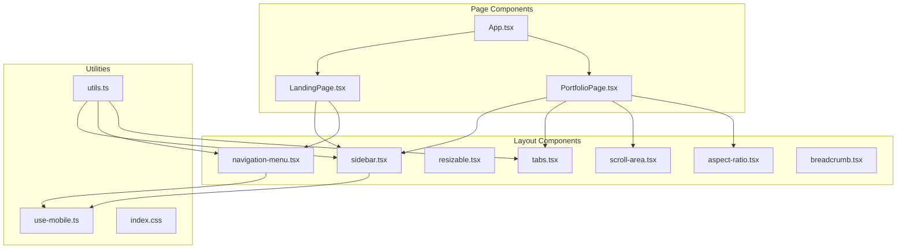
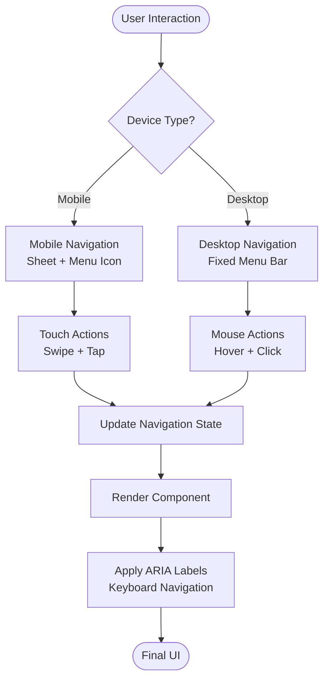
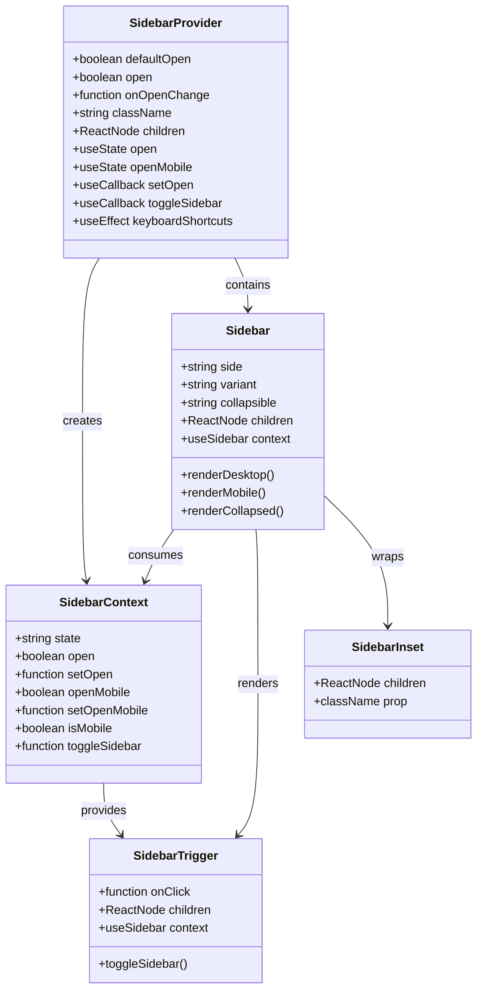
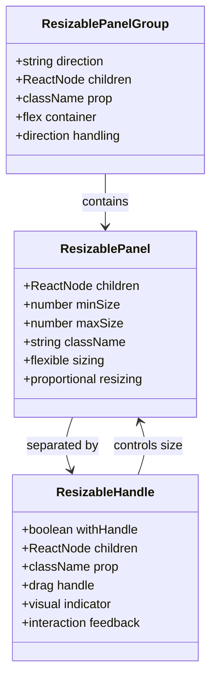
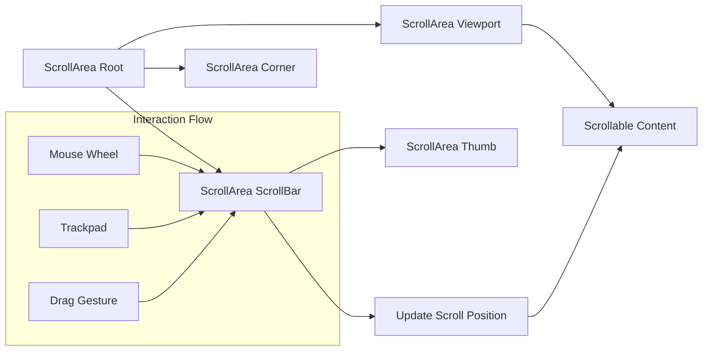
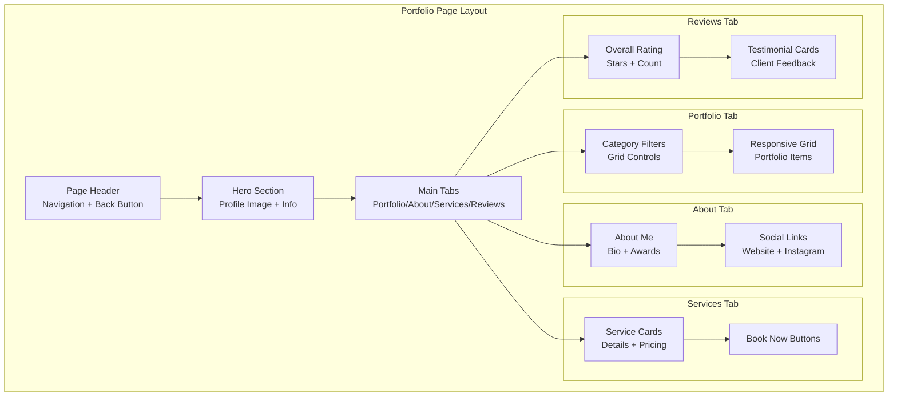
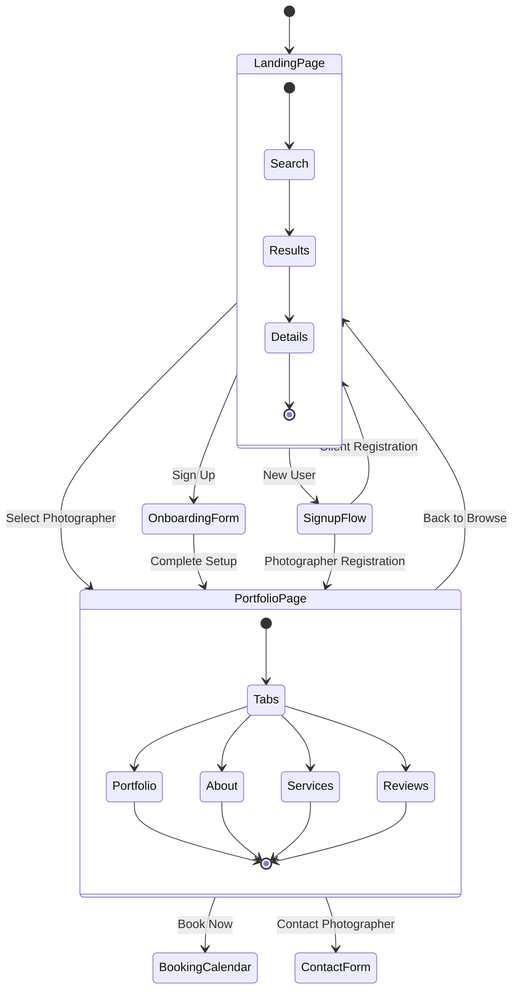

# Layout & Navigation Components

<cite>
**Referenced Files in This Document**
- [src/components/ui/sidebar.tsx](file://src/components/ui/sidebar.tsx)
- [src/components/ui/navigation-menu.tsx](file://src/components/ui/navigation-menu.tsx)
- [src/components/ui/resizable.tsx](file://src/components/ui/resizable.tsx)
- [src/components/ui/scroll-area.tsx](file://src/components/ui/scroll-area.tsx)
- [src/components/ui/aspect-ratio.tsx](file://src/components/ui/aspect-ratio.tsx)
- [src/components/ui/use-mobile.ts](file://src/components/ui/use-mobile.ts)
- [src/components/ui/utils.ts](file://src/components/ui/utils.ts)
- [src/components/ui/tabs.tsx](file://src/components/ui/tabs.tsx)
- [src/components/ui/breadcrumb.tsx](file://src/components/ui/breadcrumb.tsx)
- [src/components/PortfolioPage.tsx](file://src/components/PortfolioPage.tsx)
- [src/components/LandingPage.tsx](file://src/components/LandingPage.tsx)
- [src/App.tsx](file://src/App.tsx)
- [src/index.css](file://src/index.css)
</cite>

## Table of Contents
1. [Introduction](#introduction)
2. [Project Structure](#project-structure)
3. [Core Layout Components](#core-layout-components)
4. [Responsive Navigation Architecture](#responsive-navigation-architecture)
5. [Sidebar Implementation](#sidebar-implementation)
6. [Navigation Menu System](#navigation-menu-system)
7. [Resizable Containers](#resizable-containers)
8. [Scroll Areas & Aspect Ratios](#scroll-areas--aspect-ratios)
9. [Portfolio Page Layout](#portfolio-page-layout)
10. [State Management & Routing](#state-management--routing)
11. [Accessibility & Performance](#accessibility--performance)
12. [Troubleshooting Guide](#troubleshooting-guide)
13. [Conclusion](#conclusion)

## Introduction

The SnapEvent Landing Page implements a sophisticated layout and navigation system built with modern React components and Tailwind CSS. The architecture emphasizes responsiveness, accessibility, and performance optimization across multiple device sizes and user contexts. This documentation covers the implementation of sidebar navigation, responsive layouts, scroll areas, aspect ratios, and integration patterns with application routes and state management.

The layout system is designed around several key principles:
- **Mobile-first responsive design** with progressive enhancement
- **Component-based architecture** using reusable UI primitives
- **Accessibility compliance** with ARIA standards and keyboard navigation
- **Performance optimization** through lazy loading and efficient rendering
- **Visual consistency** maintained across breakpoints and themes

## Project Structure

The layout and navigation components are organized within a modular architecture that separates concerns and promotes reusability:



**Diagram sources**
- [src/components/ui/sidebar.tsx](file://src/components/ui/sidebar.tsx#L1-L50)
- [src/components/ui/navigation-menu.tsx](file://src/components/ui/navigation-menu.tsx#L1-L50)
- [src/components/ui/resizable.tsx](file://src/components/ui/resizable.tsx#L1-L50)
- [src/components/ui/scroll-area.tsx](file://src/components/ui/scroll-area.tsx#L1-L50)
- [src/components/ui/aspect-ratio.tsx](file://src/components/ui/aspect-ratio.tsx#L1-L50)

**Section sources**
- [src/components/ui/sidebar.tsx](file://src/components/ui/sidebar.tsx#L1-L727)
- [src/components/ui/navigation-menu.tsx](file://src/components/ui/navigation-menu.tsx#L1-L169)
- [src/components/ui/resizable.tsx](file://src/components/ui/resizable.tsx#L1-L57)
- [src/components/ui/scroll-area.tsx](file://src/components/ui/scroll-area.tsx#L1-L59)
- [src/components/ui/aspect-ratio.tsx](file://src/components/ui/aspect-ratio.tsx#L1-L12)

## Core Layout Components

The layout system is built around several foundational components that provide responsive behavior and accessibility features:

### Responsive Breakpoint System

The application uses a mobile-first approach with a 768px breakpoint for determining mobile vs. desktop layouts:

```typescript
const MOBILE_BREAKPOINT = 768;

export function useIsMobile() {
  const [isMobile, setIsMobile] = React.useState<boolean | undefined>(undefined);
  
  React.useEffect(() => {
    const mql = window.matchMedia(`(max-width: ${MOBILE_BREAKPOINT - 1}px)`);
    const onChange = () => {
      setIsMobile(window.innerWidth < MOBILE_BREAKPOINT);
    };
    mql.addEventListener("change", onChange);
    setIsMobile(window.innerWidth < MOBILE_BREAKPOINT);
    return () => mql.removeEventListener("change", onChange);
  }, []);
  
  return !!isMobile;
}
```

### Utility Functions

The `cn` utility combines Tailwind classes with conditional logic:

```typescript
import { clsx, type ClassValue } from "clsx";
import { twMerge } from "tailwind-merge";

export function cn(...inputs: ClassValue[]) {
  return twMerge(clsx(inputs));
}
```

**Section sources**
- [src/components/ui/use-mobile.ts](file://src/components/ui/use-mobile.ts#L1-L22)
- [src/components/ui/utils.ts](file://src/components/ui/utils.ts#L1-L7)

## Responsive Navigation Architecture

The navigation system adapts seamlessly between mobile and desktop experiences through a combination of conditional rendering and responsive design patterns.

### Navigation Flow Architecture



**Diagram sources**
- [src/components/ui/navigation-menu.tsx](file://src/components/ui/navigation-menu.tsx#L1-L169)
- [src/components/LandingPage.tsx](file://src/components/LandingPage.tsx#L1-L844)

### Navigation State Management

The navigation system maintains state through a provider pattern that manages visibility, active states, and user interactions:

```typescript
// Navigation state interface
interface NavigationState {
  isMenuOpen: boolean;
  activeTab: string;
  selectedPhotographer: string | null;
  searchTerm: string;
}

// Navigation actions
const actions = {
  toggleMenu: () => setState(prev => ({ ...prev, isMenuOpen: !prev.isMenuOpen })),
  setActiveTab: (tab: string) => setState(prev => ({ ...prev, activeTab: tab })),
  selectPhotographer: (id: string) => setState(prev => ({ ...prev, selectedPhotographer: id })),
  updateSearch: (term: string) => setState(prev => ({ ...prev, searchTerm: term }))
};
```

**Section sources**
- [src/components/LandingPage.tsx](file://src/components/LandingPage.tsx#L1-L100)

## Sidebar Implementation

The sidebar component provides a comprehensive navigation solution with multiple variants, collapsible states, and responsive behavior.

### Sidebar Architecture



**Diagram sources**
- [src/components/ui/sidebar.tsx](file://src/components/ui/sidebar.tsx#L40-L150)
- [src/components/ui/sidebar.tsx](file://src/components/ui/sidebar.tsx#L152-L250)
- [src/components/ui/sidebar.tsx](file://src/components/ui/sidebar.tsx#L252-L350)

### Sidebar Variants and Behavior

The sidebar supports three main variants:

1. **Sidebar Variant**: Full-width navigation with expandable/collapsible sections
2. **Floating Variant**: Compact overlay-style navigation
3. **Inset Variant**: Embedded within content area

```typescript
// Sidebar configuration options
const sidebarConfig = {
  side: "left" | "right",
  variant: "sidebar" | "floating" | "inset",
  collapsible: "offcanvas" | "icon" | "none"
};

// Collapsible behavior
const collapsibleBehavior = {
  offcanvas: "Full sidebar slides in/out",
  icon: "Only icons visible when collapsed",
  none: "Sidebar always visible"
};
```

### Keyboard Navigation Support

The sidebar includes comprehensive keyboard navigation support:

```typescript
// Keyboard shortcut for toggling sidebar
const SIDEBAR_KEYBOARD_SHORTCUT = "b";

// Keyboard event handler
const handleKeyDown = (event: KeyboardEvent) => {
  if (event.key === SIDEBAR_KEYBOARD_SHORTCUT && (event.metaKey || event.ctrlKey)) {
    event.preventDefault();
    toggleSidebar();
  }
};
```

**Section sources**
- [src/components/ui/sidebar.tsx](file://src/components/ui/sidebar.tsx#L1-L727)

## Navigation Menu System

The navigation menu provides hierarchical navigation with dropdown capabilities and responsive behavior.

### Navigation Menu Components

```mermaid
sequenceDiagram
participant User
participant Trigger as NavigationTrigger
participant Menu as NavigationMenu
participant Content as NavigationContent
participant Link as NavigationLink
User->>Trigger : Hover/Click
Trigger->>Menu : Open Menu
Menu->>Content : Render Dropdown
Content->>Link : Display Links
User->>Link : Select Option
Link->>Menu : Close Menu
Menu->>User : Navigate/Update State
```

**Diagram sources**
- [src/components/ui/navigation-menu.tsx](file://src/components/ui/navigation-menu.tsx#L1-L169)

### Navigation Menu Implementation

The navigation menu system uses Radix UI primitives for accessibility and follows a structured component hierarchy:

```typescript
// Navigation menu structure
interface NavigationMenuStructure {
  root: NavigationMenuRoot;
  list: NavigationMenuList[];
  items: NavigationMenuItem[];
  triggers: NavigationMenuTrigger[];
  content: NavigationMenuContent[];
  links: NavigationMenuLink[];
  viewport: NavigationMenuViewport;
}

// Responsive behavior
const navigationBehavior = {
  desktop: {
    hover: true,
    click: false,
    animations: true
  },
  mobile: {
    tap: true,
    swipe: true,
    animations: false
  }
};
```

### Menu Item States

The navigation menu supports various states for interactive feedback:

```typescript
// Menu item states
const menuItemStates = {
  default: "Normal state with hover effects",
  active: "Current page or section highlighted",
  disabled: "Unavailable option with reduced opacity",
  loading: "Pending action with spinner"
};
```

**Section sources**
- [src/components/ui/navigation-menu.tsx](file://src/components/ui/navigation-menu.tsx#L1-L169)

## Resizable Containers

The resizable panel system allows users to adjust the size of layout sections dynamically.

### Resizable Panel Architecture



**Diagram sources**
- [src/components/ui/resizable.tsx](file://src/components/ui/resizable.tsx#L1-L57)

### Resizable Handle Implementation

The resizable handle provides visual feedback and interaction capabilities:

```typescript
// Resizable handle with visual indicators
const ResizableHandle = ({
  withHandle,
  className,
  ...props
}: React.ComponentProps<typeof ResizablePrimitive.PanelResizeHandle> & {
  withHandle?: boolean;
}) => {
  return (
    <ResizablePrimitive.PanelResizeHandle
      className={cn(
        "bg-border focus-visible:ring-ring relative flex w-px items-center justify-center after:absolute after:inset-y-0 after:left-1/2 after:w-1 after:-translate-x-1/2 focus-visible:ring-1 focus-visible:ring-offset-1 focus-visible:outline-hidden",
        className,
      )}
      {...props}
    >
      {withHandle && (
        <div className="bg-border z-10 flex h-4 w-3 items-center justify-center rounded-xs border">
          <GripVerticalIcon className="size-2.5" />
        </div>
      )}
    </ResizablePrimitive.PanelResizeHandle>
  );
};
```

**Section sources**
- [src/components/ui/resizable.tsx](file://src/components/ui/resizable.tsx#L1-L57)

## Scroll Areas & Aspect Ratios

The scroll area and aspect ratio components provide controlled scrolling and consistent image display.

### Scroll Area Implementation



**Diagram sources**
- [src/components/ui/scroll-area.tsx](file://src/components/ui/scroll-area.tsx#L1-L59)

### Aspect Ratio Control

The aspect ratio component ensures consistent image display across different screen sizes:

```typescript
// Aspect ratio implementation
const AspectRatio = ({
  ratio = 16 / 9,
  children,
  ...props
}: React.ComponentProps<typeof AspectRatioPrimitive.Root> & {
  ratio?: number;
}) => {
  return (
    <AspectRatioPrimitive.Root
      data-slot="aspect-ratio"
      className={cn("relative")}
      style={{ aspectRatio: ratio }}
      {...props}
    >
      {children}
    </AspectRatioPrimitive.Root>
  );
};
```

**Section sources**
- [src/components/ui/scroll-area.tsx](file://src/components/ui/scroll-area.tsx#L1-L59)
- [src/components/ui/aspect-ratio.tsx](file://src/components/ui/aspect-ratio.tsx#L1-L12)

## Portfolio Page Layout

The PortfolioPage component demonstrates advanced layout patterns including responsive grids, navigation integration, and state management.

### Portfolio Layout Structure



**Diagram sources**
- [src/components/PortfolioPage.tsx](file://src/components/PortfolioPage.tsx#L1-L889)

### Responsive Portfolio Grid

The portfolio grid adapts to different screen sizes with dynamic column calculations:

```typescript
// Responsive grid configuration
const gridConfig = {
  mobile: { columns: 1, gap: 16 },
  tablet: { columns: 2, gap: 24 },
  desktop: { columns: 3, gap: 32 },
  wide: { columns: 4, gap: 40 }
};

// Dynamic grid calculation
const calculateGrid = (screenWidth: number): GridConfig => {
  if (screenWidth < 640) return gridConfig.mobile;
  if (screenWidth < 768) return gridConfig.tablet;
  if (screenWidth < 1024) return gridConfig.desktop;
  return gridConfig.wide;
};
```

### State Management Patterns

The PortfolioPage implements sophisticated state management for modals, forms, and navigation:

```typescript
// Portfolio state management
const portfolioState = {
  selectedCategory: 'all',
  showContactForm: false,
  showBookingCalendar: false,
  showAvailabilityManager: false,
  showBookingManager: false,
  showSuccessBanner: true,
  showSharePopup: false,
  isLoading: true,
  photographer: null
};

// State transitions
const stateTransitions = {
  openContactForm: () => setState(prev => ({ ...prev, showContactForm: true })),
  closeContactForm: () => setState(prev => ({ ...prev, showContactForm: false })),
  openBookingCalendar: () => setState(prev => ({ ...prev, showBookingCalendar: true })),
  closeBookingCalendar: () => setState(prev => ({ ...prev, showBookingCalendar: false }))
};
```

**Section sources**
- [src/components/PortfolioPage.tsx](file://src/components/PortfolioPage.tsx#L1-L889)

## State Management & Routing

The application uses a centralized state management approach with React hooks and context providers.

### Application State Architecture



**Diagram sources**
- [src/App.tsx](file://src/App.tsx#L1-L55)

### Route Navigation Pattern

The routing system uses a navigation function pattern for type-safe page transitions:

```typescript
// Navigation interface
interface NavigationInterface {
  onNavigate: (page: 'landing' | 'onboarding' | 'portfolio' | 'signup', photographerId?: string) => void;
  onPhotographerSelect: (id: string) => void;
}

// Navigation implementation
const navigateTo = (page: Page, photographerId?: string) => {
  setCurrentPage(page);
  if (photographerId) {
    setSelectedPhotographerId(photographerId);
  }
};

// Type-safe navigation
const safeNavigation = (target: Page, params?: Record<string, any>) => {
  if (isValidRoute(target)) {
    navigateTo(target, params?.photographerId);
  } else {
    console.warn(`Invalid route: ${target}`);
  }
};
```

**Section sources**
- [src/App.tsx](file://src/App.tsx#L1-L55)

## Accessibility & Performance

The layout and navigation components prioritize accessibility and performance optimization.

### Accessibility Features

```typescript
// Keyboard navigation support
const keyboardSupport = {
  tabNavigation: true,
  arrowKeys: true,
  enterKey: true,
  escapeKey: true,
  spaceKey: true
};

// ARIA attributes implementation
const ariaAttributes = {
  navigation: {
    role: "navigation",
    "aria-label": "Main navigation"
  },
  menu: {
    role: "menu",
    "aria-expanded": "false",
    "aria-haspopup": "true"
  },
  menuItem: {
    role: "menuitem",
    "aria-current": "false"
  }
};
```

### Performance Optimizations

The layout system implements several performance optimizations:

1. **Lazy Loading**: Components load only when needed
2. **Virtual Scrolling**: Large lists use virtualization
3. **Debounced Searches**: Search inputs debounce API calls
4. **Efficient Rendering**: Minimal re-renders through memoization

```typescript
// Performance optimization patterns
const performancePatterns = {
  memoization: React.memo(Component),
  debouncing: debounce(apiCall, 300),
  lazyLoading: React.lazy(() => import('./HeavyComponent')),
  virtualization: VirtualList({ itemCount: 1000 })
};
```

## Troubleshooting Guide

Common issues and solutions for layout and navigation components:

### Sidebar Issues

**Problem**: Sidebar not responding to clicks
**Solution**: Check if `useIsMobile()` returns correct device detection

**Problem**: Sidebar animation glitches
**Solution**: Verify CSS transitions and ensure proper `data-state` attributes

### Navigation Menu Problems

**Problem**: Dropdown menus not opening
**Solution**: Ensure Radix UI context providers wrap the menu components

**Problem**: Keyboard navigation not working
**Solution**: Verify `aria-expanded` and `tabIndex` attributes are set correctly

### Responsive Layout Issues

**Problem**: Layout breaking on small screens
**Solution**: Check media query breakpoints and Tailwind class combinations

**Problem**: Touch interactions not smooth
**Solution**: Implement proper touch event handling and preventDefault()

**Section sources**
- [src/components/ui/sidebar.tsx](file://src/components/ui/sidebar.tsx#L1-L727)
- [src/components/ui/navigation-menu.tsx](file://src/components/ui/navigation-menu.tsx#L1-L169)

## Conclusion

The SnapEvent Landing Page layout and navigation system demonstrates a sophisticated approach to building responsive, accessible, and performant web applications. The modular component architecture, combined with thoughtful state management and accessibility features, creates a robust foundation for complex user interfaces.

Key takeaways from this implementation:

1. **Modular Design**: Components are designed for reusability and maintainability
2. **Responsive First**: Mobile-first approach ensures optimal user experience across devices
3. **Accessibility Priority**: Comprehensive ARIA support and keyboard navigation
4. **Performance Focus**: Optimized rendering and efficient resource management
5. **Developer Experience**: Clear APIs and well-documented patterns

The layout system serves as an excellent example of modern React development practices, combining functional programming principles with practical usability considerations. Future enhancements could include additional animation systems, enhanced accessibility features, and expanded customization options.