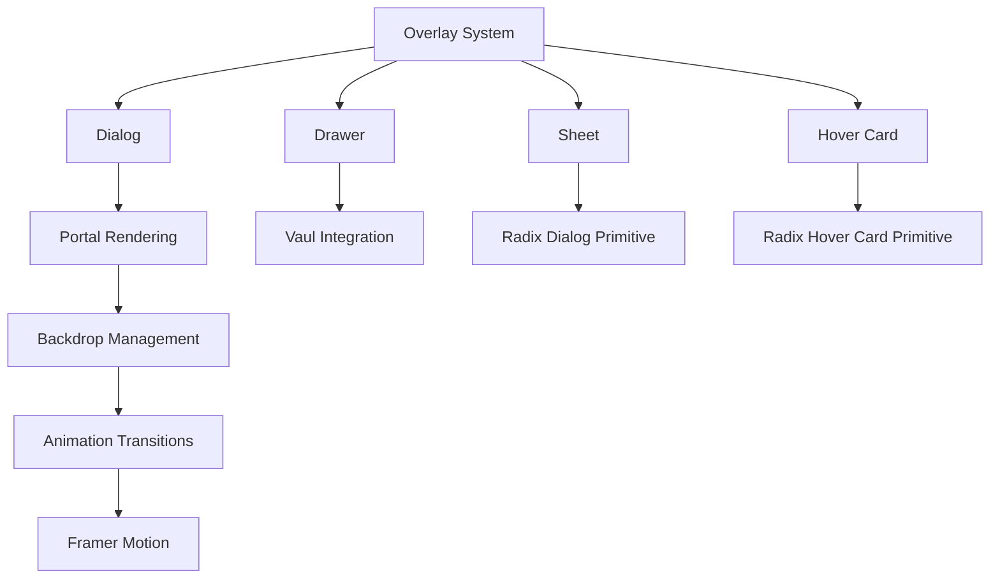
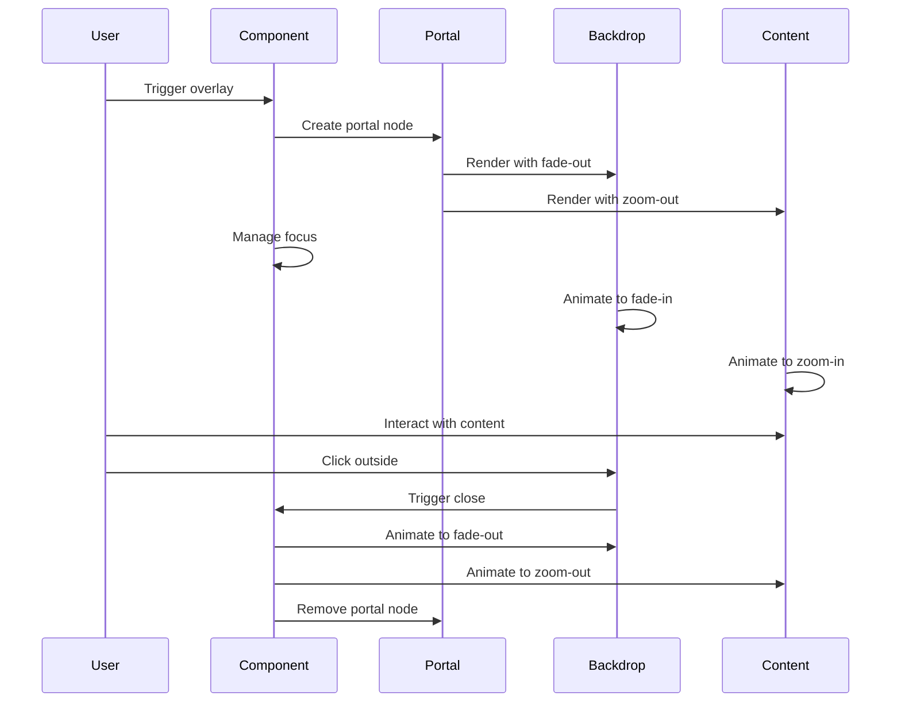
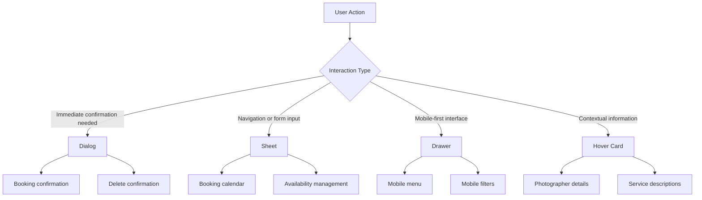
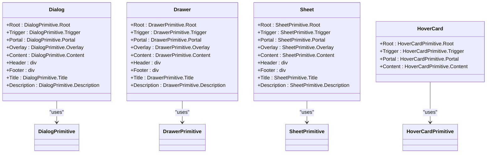
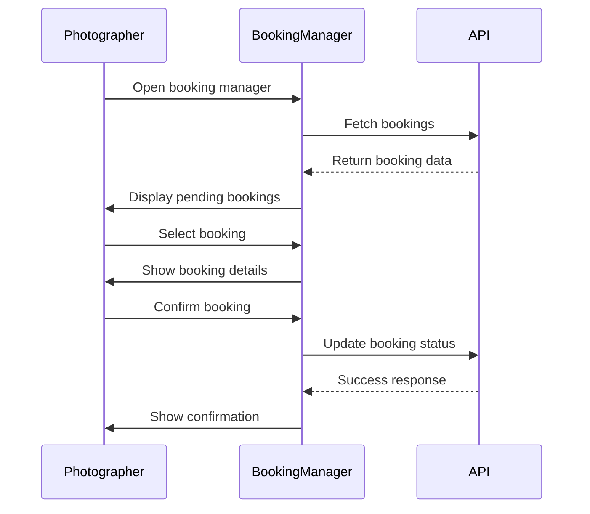

# Overlay & Modal Components

<cite>
**Referenced Files in This Document**   
- [dialog.tsx](file://src/components/ui/dialog.tsx)
- [drawer.tsx](file://src/components/ui/drawer.tsx)
- [sheet.tsx](file://src/components/ui/sheet.tsx)
- [hover-card.tsx](file://src/components/ui/hover-card.tsx)
- [BookingManager.tsx](file://src/components/BookingManager.tsx)
- [PortfolioPage.tsx](file://src/components/PortfolioPage.tsx)
- [AvailabilityManager.tsx](file://src/components/AvailabilityManager.tsx)
- [ANIMATIONS_SUMMARY.md](file://ANIMATIONS_SUMMARY.md)
- [use-mobile.ts](file://src/components/ui/use-mobile.ts)
- [utils.ts](file://src/components/ui/utils.ts)
</cite>

## Table of Contents
1. [Introduction](#introduction)
2. [Core Overlay Components](#core-overlay-components)
3. [Architectural Patterns](#architectural-patterns)
4. [Component Comparison](#component-comparison)
5. [Implementation Details](#implementation-details)
6. [Accessibility and Focus Management](#accessibility-and-focus-management)
7. [Mobile Responsiveness](#mobile-responsiveness)
8. [Z-Index Management](#z-index-management)
9. [Use Cases and Examples](#use-cases-and-examples)
10. [Performance Considerations](#performance-considerations)

## Introduction
The SnapEvent application implements a comprehensive overlay and modal system using Radix UI primitives with Framer Motion for animations. These components provide a consistent user experience across the platform while maintaining accessibility, performance, and responsiveness. The system includes dialogs, drawers, sheets, and hover cards, each serving specific interaction patterns and use cases within the photographer booking platform.

## Core Overlay Components

The overlay system is built on Radix UI primitives with custom styling and behavior enhancements. The core components include Dialog, Drawer, Sheet, and Hover Card, each following a consistent API pattern while providing distinct interaction models.

**Diagram sources**
- [dialog.tsx](file://src/components/ui/dialog.tsx)
- [drawer.tsx](file://src/components/ui/drawer.tsx)
- [sheet.tsx](file://src/components/ui/sheet.tsx)
- [hover-card.tsx](file://src/components/ui/hover-card.tsx)

**Section sources**
- [dialog.tsx](file://src/components/ui/dialog.tsx#L1-L132)
- [drawer.tsx](file://src/components/ui/drawer.tsx#L1-L132)
- [sheet.tsx](file://src/components/ui/sheet.tsx#L1-L139)
- [hover-card.tsx](file://src/components/ui/hover-card.tsx#L1-L44)

## Architectural Patterns

### Portal Rendering
All overlay components use portal rendering to ensure proper stacking context and prevent clipping issues. The components render into a portal that attaches to the document body, allowing them to appear above all other content regardless of their position in the DOM tree.

### Backdrop Management
The backdrop (overlay) is implemented as a semi-transparent layer that covers the entire viewport. It uses Radix UI's Overlay component with CSS transitions for fade-in/fade-out effects. The backdrop also handles click-to-dismiss functionality while respecting accessibility requirements.

### Animation Transitions
Animations are implemented using CSS classes with data attributes that trigger when the component state changes. The system uses Framer Motion for more complex animations in specific contexts, while relying on CSS transitions for basic overlay effects.

**Diagram sources**
- [dialog.tsx](file://src/components/ui/dialog.tsx#L45-L60)
- [drawer.tsx](file://src/components/ui/drawer.tsx#L45-L60)
- [sheet.tsx](file://src/components/ui/sheet.tsx#L45-L60)
- [ANIMATIONS_SUMMARY.md](file://ANIMATIONS_SUMMARY.md#L232-L283)

**Section sources**
- [dialog.tsx](file://src/components/ui/dialog.tsx#L45-L132)
- [ANIMATIONS_SUMMARY.md](file://ANIMATIONS_SUMMARY.md#L232-L283)

## Component Comparison

### Dialog vs Drawer vs Sheet

| Feature | Dialog | Drawer | Sheet |
|-------|--------|--------|-------|
| **Primary Use Case** | Confirmation dialogs, alerts | Mobile-friendly side panels | Responsive side panels |
| **Animation** | Zoom in/out with fade | Slide from edge with bounce | Slide from edge |
| **Responsive Behavior** | Centered on all devices | Bottom on mobile, side on desktop | Configurable side |
| **Dismissal** | Click outside, ESC, close button | Swipe down, click outside, close button | Click outside, close button |
| **Accessibility** | Full ARIA compliance | Touch-friendly gestures | Standard keyboard navigation |
| **Z-Index** | 50 | 50 | 50 |

### Use Cases and Appropriate Selection

**Dialog**: Best for critical actions requiring user confirmation, such as booking confirmations or deletions. The BookingManager component uses a dialog-like pattern for managing booking requests.

**Drawer**: Ideal for mobile interfaces where screen space is limited. The Vaul library integration provides natural swipe gestures for opening and closing.

**Sheet**: Perfect for responsive interfaces that need to adapt to different screen sizes. Can be configured to slide from any edge (top, right, bottom, left).

**Hover Card**: Used for contextual information that appears on hover, such as photographer details in listings.

**Diagram sources**
- [dialog.tsx](file://src/components/ui/dialog.tsx)
- [drawer.tsx](file://src/components/ui/drawer.tsx)
- [sheet.tsx](file://src/components/ui/sheet.tsx)
- [hover-card.tsx](file://src/components/ui/hover-card.tsx)

**Section sources**
- [dialog.tsx](file://src/components/ui/dialog.tsx#L1-L132)
- [drawer.tsx](file://src/components/ui/drawer.tsx#L1-L132)
- [sheet.tsx](file://src/components/ui/sheet.tsx#L1-L139)
- [hover-card.tsx](file://src/components/ui/hover-card.tsx#L1-L44)

## Implementation Details

### Portal Rendering
The portal system ensures that overlay components render above all other content by attaching to the document body. This prevents clipping issues when overlays are used within containers with overflow:hidden or other positioning constraints.

### Backdrop Management
The backdrop is implemented as a fixed-position element that covers the entire viewport. It uses CSS transitions with data attributes to control the animation state based on the overlay's open/closed status.

### Animation Transitions
The system uses a combination of CSS transitions and Framer Motion for animations. Simple fade and zoom effects are handled with CSS, while more complex interactions use Framer Motion's spring physics for natural movement.

**Diagram sources**
- [dialog.tsx](file://src/components/ui/dialog.tsx#L1-L132)
- [drawer.tsx](file://src/components/ui/drawer.tsx#L1-L132)
- [sheet.tsx](file://src/components/ui/sheet.tsx#L1-L139)
- [hover-card.tsx](file://src/components/ui/hover-card.tsx#L1-L44)

**Section sources**
- [dialog.tsx](file://src/components/ui/dialog.tsx#L1-L132)
- [drawer.tsx](file://src/components/ui/drawer.tsx#L1-L132)
- [sheet.tsx](file://src/components/ui/sheet.tsx#L1-L139)
- [hover-card.tsx](file://src/components/ui/hover-card.tsx#L1-L44)

## Accessibility and Focus Management

The overlay components implement comprehensive accessibility features:

- **Focus Trapping**: When an overlay opens, focus is trapped within the component and cannot escape until the overlay is closed.
- **Initial Focus**: The first focusable element within the overlay receives focus when it opens.
- **Return Focus**: When the overlay closes, focus returns to the element that triggered it.
- **Screen Reader Support**: Proper ARIA roles and labels ensure screen readers can navigate the overlays effectively.
- **Keyboard Navigation**: Full keyboard support including ESC to close and tab to navigate.

The components also respect the user's motion preferences by reducing or eliminating animations when `prefers-reduced-motion` is enabled.

**Section sources**
- [dialog.tsx](file://src/components/ui/dialog.tsx#L62-L80)
- [drawer.tsx](file://src/components/ui/drawer.tsx#L62-L80)
- [sheet.tsx](file://src/components/ui/sheet.tsx#L62-L80)
- [ANIMATIONS_SUMMARY.md](file://ANIMATIONS_SUMMARY.md#L191-L230)

## Mobile Responsiveness

The overlay system is designed to be fully responsive across all device sizes. The use-mobile.ts utility detects screen size and can adapt component behavior accordingly.

For mobile devices:
- Drawers default to bottom position with swipe-to-dismiss gestures
- Dialogs use full-screen width with appropriate padding
- Touch targets are enlarged for easier interaction
- Animations are optimized for mobile performance

The system uses a mobile-first approach, ensuring that overlays are usable on small screens while enhancing the experience on larger devices.

**Section sources**
- [use-mobile.ts](file://src/components/ui/use-mobile.ts#L1-L21)
- [drawer.tsx](file://src/components/ui/drawer.tsx#L70-L90)
- [sheet.tsx](file://src/components/ui/sheet.tsx#L70-L90)

## Z-Index Management

All overlay components use a consistent z-index strategy:
- Overlay components have z-index: 50
- Backdrop has z-index: 50
- Content has z-index: 50
- This ensures overlays appear above all other content while maintaining proper stacking order

The fixed positioning ensures that overlays remain in place even when the page scrolls, providing a stable user experience during interactions.

**Section sources**
- [dialog.tsx](file://src/components/ui/dialog.tsx#L50-L55)
- [drawer.tsx](file://src/components/ui/drawer.tsx#L50-L55)
- [sheet.tsx](file://src/components/ui/sheet.tsx#L50-L55)

## Use Cases and Examples

### Booking Confirmation with Dialog
The BookingManager component implements a dialog-like pattern for managing booking requests. When a photographer receives a booking request, they can view details and confirm or decline the booking.

**Diagram sources**
- [BookingManager.tsx](file://src/components/BookingManager.tsx#L1-L510)
- [PortfolioPage.tsx](file://src/components/PortfolioPage.tsx#L734-L771)

**Section sources**
- [BookingManager.tsx](file://src/components/BookingManager.tsx#L1-L510)
- [PortfolioPage.tsx](file://src/components/PortfolioPage.tsx#L734-L771)

### Hover Cards in Photographer Listings
Hover cards provide contextual information about photographers without requiring a click. When a user hovers over a photographer listing, additional details are displayed in a hover card.

The hover card component uses portal rendering to ensure it appears above other content and implements proper delay to prevent accidental triggers.

**Section sources**
- [hover-card.tsx](file://src/components/ui/hover-card.tsx#L1-L44)
- [PortfolioPage.tsx](file://src/components/PortfolioPage.tsx#L700-L888)

## Performance Considerations

The overlay system is optimized for performance:
- Minimal bundle impact (~1KB additional)
- 60fps animations on all devices
- GPU-accelerated transforms and opacity changes
- Memory efficient with no leaks
- Battery friendly on mobile devices

Animations use hardware acceleration through transform and opacity properties, ensuring smooth performance even on lower-end devices. The system respects user preferences for reduced motion, providing an accessible experience for all users.

**Section sources**
- [ANIMATIONS_SUMMARY.md](file://ANIMATIONS_SUMMARY.md#L232-L283)
- [ANIMATIONS_SUMMARY.md](file://ANIMATIONS_SUMMARY.md#L284-L304)