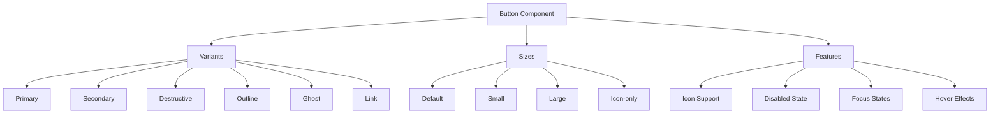
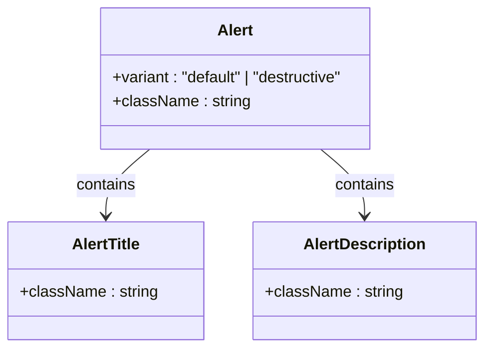
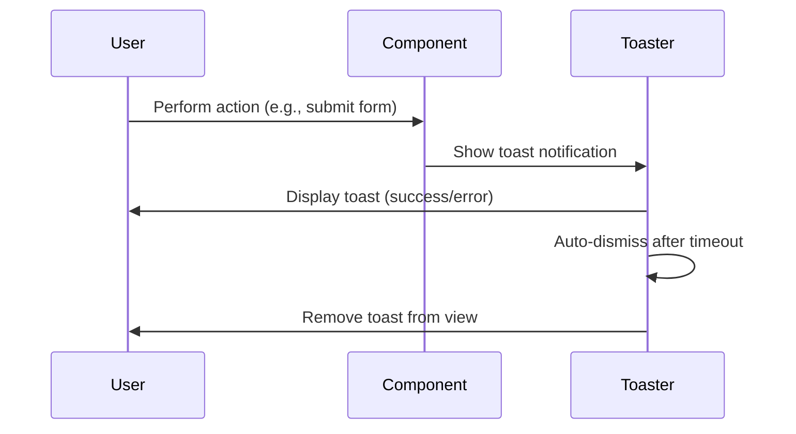
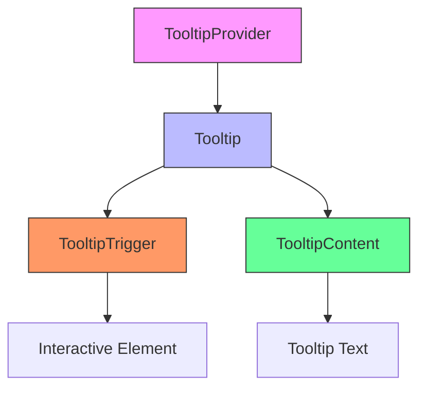
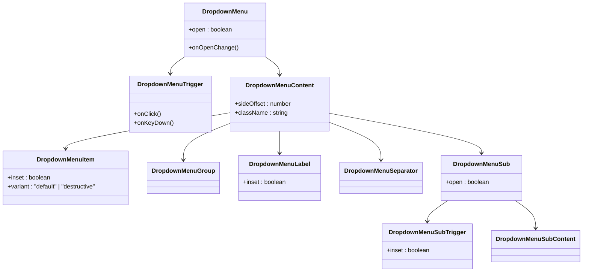
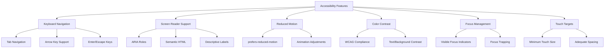
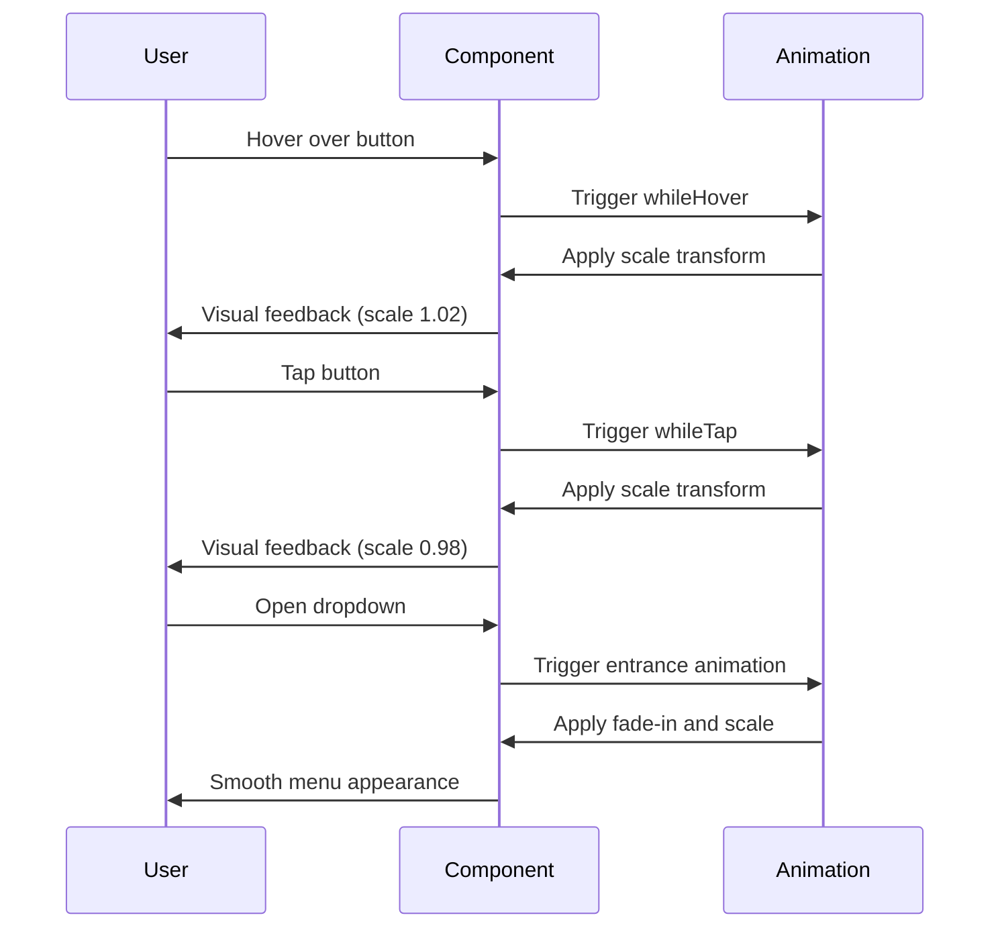
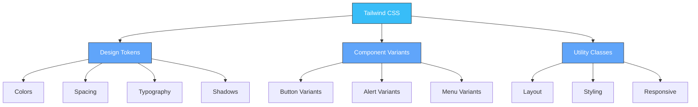

# Action & Feedback Components

<cite>
**Referenced Files in This Document**   
- [button.tsx](file://src/components/ui/button.tsx)
- [alert.tsx](file://src/components/ui/alert.tsx)
- [sonner.tsx](file://src/components/ui/sonner.tsx)
- [tooltip.tsx](file://src/components/ui/tooltip.tsx)
- [dropdown-menu.tsx](file://src/components/ui/dropdown-menu.tsx)
- [context-menu.tsx](file://src/components/ui/context-menu.tsx)
- [utils.ts](file://src/components/ui/utils.ts)
- [PortfolioPage.tsx](file://src/components/PortfolioPage.tsx)
- [SignupForm.tsx](file://src/components/SignupForm.tsx)
- [LandingPage.tsx](file://src/components/Code-component-1-80.tsx)
- [ANIMATIONS_SUMMARY.md](file://ANIMATIONS_SUMMARY.md)
- [LANDING_PAGE_ANIMATIONS.md](file://LANDING_PAGE_ANIMATIONS.md)
</cite>

## Table of Contents
1. [Introduction](#introduction)
2. [Button Components](#button-components)
3. [Alert Components](#alert-components)
4. [Toast Notifications (Sonner)](#toast-notifications-sonner)
5. [Tooltip Components](#tooltip-components)
6. [Dropdown & Context Menus](#dropdown--context-menus)
7. [Accessibility Features](#accessibility-features)
8. [Animation Implementation](#animation-implementation)
9. [Theming with Tailwind](#theming-with-tailwind)
10. [Troubleshooting Guide](#troubleshooting-guide)
11. [Conclusion](#conclusion)

## Introduction
This document provides comprehensive documentation for the action and feedback components in the SnapEvent application. These components play a crucial role in user interaction and system feedback, enabling users to perform actions and receive appropriate responses from the system. The documented components include buttons, alerts, toasts (using Sonner), tooltips, and dropdown/context menus, all implemented with accessibility, animation, and theming considerations.

The components are built using a combination of Radix UI primitives and custom implementations, leveraging Tailwind CSS for styling and Framer Motion for animations. This documentation covers the various variants, states, and usage patterns for each component type, along with implementation details for accessibility, animation, and theming.

**Section sources**
- [button.tsx](file://src/components/ui/button.tsx)
- [alert.tsx](file://src/components/ui/alert.tsx)
- [sonner.tsx](file://src/components/ui/sonner.tsx)

## Button Components
The button component provides multiple variants to accommodate different use cases within the application. These variants include primary, secondary, destructive, outline, ghost, and link styles, each with distinct visual characteristics and use cases.

The primary button variant serves as the main call-to-action with a solid background color and white text, while the secondary variant offers a more subtle appearance. The destructive variant is used for actions that delete or remove data, featuring a red color scheme. Outline buttons have a border with transparent background, ghost buttons have minimal styling for secondary actions, and link buttons appear as text links.

Buttons support different sizes (default, small, large, and icon-only) and can incorporate icons through SVG elements. The component also handles loading states through conditional rendering in parent components, though the button itself doesn't have a built-in loading state property.

**Diagram sources**
- [button.tsx](file://src/components/ui/button.tsx#L15-L58)

**Section sources**
- [button.tsx](file://src/components/ui/button.tsx#L1-L58)
- [PortfolioPage.tsx](file://src/components/PortfolioPage.tsx#L336-L364)
- [LandingPage.tsx](file://src/components/Code-component-1-80.tsx#L204-L235)

## Alert Components
Alert components provide visual feedback for system messages, with support for different severity levels including default (informational) and destructive (error) variants. These components are used to communicate important information to users, such as form validation errors, success messages, or system warnings.

The alert implementation includes structured content areas with AlertTitle and AlertDescription subcomponents, allowing for clear information hierarchy. The destructive variant uses red text and styling to indicate errors or warnings, while the default variant provides a neutral appearance for general information.

Alerts are implemented with proper ARIA roles and semantic HTML to ensure accessibility, using the "alert" role to notify assistive technologies of important messages. The styling leverages Tailwind CSS classes for consistent appearance across the application.

**Diagram sources**
- [alert.tsx](file://src/components/ui/alert.tsx#L1-L66)

**Section sources**
- [alert.tsx](file://src/components/ui/alert.tsx#L1-L66)
- [SignupForm.tsx](file://src/components/SignupForm.tsx#L291-L320)

## Toast Notifications (Sonner)
Toast notifications are implemented using the Sonner library, providing a non-intrusive way to deliver temporary feedback to users. These notifications appear briefly and then automatically dismiss, making them ideal for confirming actions like form submissions, bookings, or authentication events.

The Toaster component is configured to work with the application's theme system, automatically adapting to light and dark modes. Custom styling is applied through CSS variables that reference the application's design tokens, ensuring consistency with the overall visual language.

Toast notifications are used extensively in authentication flows and booking confirmations, providing immediate feedback when users complete actions. The implementation includes proper timing and animation for appearance and dismissal, with options for different toast types (success, error, warning) based on the context.

**Diagram sources**
- [sonner.tsx](file://src/components/ui/sonner.tsx#L1-L25)

**Section sources**
- [sonner.tsx](file://src/components/ui/sonner.tsx#L1-L25)
- [SignupForm.tsx](file://src/components/SignupForm.tsx#L473-L491)

## Tooltip Components
Tooltip components provide additional context when users hover over or focus on interactive elements. These components enhance usability by explaining the purpose of icons or abbreviated text without cluttering the interface.

The tooltip implementation includes a TooltipProvider that manages the overall tooltip behavior, with Tooltip, TooltipTrigger, and TooltipContent components working together to create the complete functionality. Tooltips are positioned relative to their trigger elements and include subtle animations for appearance and dismissal.

Accessibility is a key consideration, with tooltips designed to be keyboard-navigable and compatible with screen readers. The component respects user preferences for reduced motion and provides adequate touch targets for mobile devices. Tooltips are styled with a solid background and rounded corners, ensuring high contrast and readability.

**Diagram sources**
- [tooltip.tsx](file://src/components/ui/tooltip.tsx#L1-L61)

**Section sources**
- [tooltip.tsx](file://src/components/ui/tooltip.tsx#L1-L61)

## Dropdown & Context Menus
Dropdown and context menus provide navigation and action options in a compact, organized format. These components are used in various parts of the application, including user profile interfaces and photographer management systems.

The dropdown menu component supports hierarchical organization with groups, labels, separators, and nested submenus. It includes various item types such as regular items, checkbox items, and radio items, allowing for different interaction patterns. The context menu component functions similarly but is triggered by right-click events rather than clicks or hovers.

Both components are fully accessible, supporting keyboard navigation with arrow keys, Enter to select, and Escape to close. They include proper ARIA attributes and are designed to work with screen readers. The styling ensures clear visual hierarchy and adequate spacing between items for touch targets.

**Diagram sources**
- [dropdown-menu.tsx](file://src/components/ui/dropdown-menu.tsx#L1-L257)
- [context-menu.tsx](file://src/components/ui/context-menu.tsx#L1-L252)

**Section sources**
- [dropdown-menu.tsx](file://src/components/ui/dropdown-menu.tsx#L1-L257)
- [context-menu.tsx](file://src/components/ui/context-menu.tsx#L1-L252)
- [PortfolioPage.tsx](file://src/components/PortfolioPage.tsx#L568-L596)

## Accessibility Features
The action and feedback components prioritize accessibility through various features that support keyboard navigation, screen reader compatibility, and inclusive design principles.

All interactive components support full keyboard navigation, with logical tab order and visible focus states. Buttons, dropdowns, and menus can be operated using keyboard shortcuts, including arrow keys for navigation, Enter for selection, and Escape for dismissal. The components use proper ARIA roles, states, and properties to communicate their purpose and state to assistive technologies.

The implementation respects user preferences for reduced motion, detecting the `prefers-reduced-motion` media query and adjusting animations accordingly. This ensures that users who may experience discomfort from motion effects can still use the application comfortably.

Color contrast meets WCAG standards, with sufficient contrast between text and background colors in both light and dark themes. Interactive elements have adequate size and spacing to accommodate users with motor impairments, following touch target size recommendations.

**Diagram sources**
- [button.tsx](file://src/components/ui/button.tsx#L1-L58)
- [dropdown-menu.tsx](file://src/components/ui/dropdown-menu.tsx#L1-L257)
- [context-menu.tsx](file://src/components/ui/context-menu.tsx#L1-L252)

**Section sources**
- [ANIMATIONS_SUMMARY.md](file://ANIMATIONS_SUMMARY.md#L191-L230)
- [LANDING_PAGE_ANIMATIONS.md](file://LANDING_PAGE_ANIMATIONS.md#L152-L164)

## Animation Implementation
Animations are implemented using Framer Motion to provide smooth, professional interactions that enhance the user experience without compromising performance. The animation system includes micro-interactions for buttons, smooth transitions for menus, and subtle feedback for user actions.

Button components feature spring physics for hover and tap interactions, creating a natural, bouncy feel. The animations use a stiffness of 400 and damping of 17 to achieve a responsive yet smooth effect. Dropdown and context menus use animated entrances with fade and scale effects, providing visual feedback when they appear.

The implementation respects user preferences for reduced motion, automatically simplifying or removing animations when the `prefers-reduced-motion` setting is enabled. This ensures accessibility while maintaining the enhanced experience for users who prefer motion effects.

Animations are hardware-accelerated using transform and opacity properties, ensuring smooth 60fps performance on all devices. The bundle size impact is minimal, with Framer Motion adding approximately 2KB gzipped to the overall bundle.

**Diagram sources**
- [ANIMATIONS_SUMMARY.md](file://ANIMATIONS_SUMMARY.md#L191-L230)
- [LANDING_PAGE_ANIMATIONS.md](file://LANDING_PAGE_ANIMATIONS.md#L80-L145)

**Section sources**
- [ANIMATIONS_SUMMARY.md](file://ANIMATIONS_SUMMARY.md#L191-L230)
- [LANDING_PAGE_ANIMATIONS.md](file://LANDING_PAGE_ANIMATIONS.md#L80-L145)

## Theming with Tailwind
The components are styled using Tailwind CSS, leveraging the utility-first approach for consistent, maintainable styling. The theme system supports both light and dark modes, with CSS variables defined for colors, spacing, and other design tokens.

The implementation uses the `cn` utility function to combine Tailwind classes with component-specific classes, ensuring proper class merging and avoiding conflicts. The `cva` (Class Variance Authority) library is used to define component variants, allowing for type-safe variant selection with proper TypeScript support.

Theming is applied consistently across all components, with shared color palettes and spacing scales. The button variants, alert types, and menu components all reference the same design tokens, ensuring visual harmony throughout the application. Dark mode is fully supported, with appropriate color adjustments for readability and aesthetics.

**Diagram sources**
- [button.tsx](file://src/components/ui/button.tsx#L1-L58)
- [alert.tsx](file://src/components/ui/alert.tsx#L1-L66)
- [utils.ts](file://src/components/ui/utils.ts)

**Section sources**
- [button.tsx](file://src/components/ui/button.tsx#L1-L58)
- [alert.tsx](file://src/components/ui/alert.tsx#L1-L66)
- [utils.ts](file://src/components/ui/utils.ts)

## Troubleshooting Guide
This section addresses common issues that may arise when implementing or using the action and feedback components, with solutions for event propagation and z-index stacking problems.

### Event Propagation Issues
Event propagation issues can occur when nested interactive elements interfere with each other. To resolve this:
- Use `event.stopPropagation()` in event handlers when needed
- Ensure proper event delegation patterns
- Verify that click handlers don't conflict with parent component events
- Test keyboard navigation to ensure events are properly captured

### Z-Index Stacking Problems
Z-index issues commonly affect dropdowns, tooltips, and modals that appear behind other elements:
- Use consistent z-index scale (e.g., 10, 20, 30, 40, 50)
- Ensure portal components are rendered at the end of the DOM
- Verify that parent containers don't have `overflow: hidden` clipping content
- Check for conflicting z-index values in different component types

### Animation Performance
If animations appear janky or cause performance issues:
- Ensure animations use transform and opacity properties
- Avoid animating layout-affecting properties like width, height, margin, or padding
- Use `will-change` property judiciously
- Test on lower-end devices to ensure smooth performance

### Accessibility Testing
To verify accessibility implementation:
- Test keyboard navigation thoroughly
- Use screen reader software to verify ARIA implementation
- Check color contrast ratios
- Validate that all functionality is available via keyboard
- Ensure focus is properly managed, especially in modal dialogs

**Section sources**
- [ANIMATIONS_SUMMARY.md](file://ANIMATIONS_SUMMARY.md#L291-L303)
- [LANDING_PAGE_ANIMATIONS.md](file://LANDING_PAGE_ANIMATIONS.md#L152-L164)

## Conclusion
The action and feedback components in the SnapEvent application provide a comprehensive system for user interaction and system feedback. These components are designed with accessibility, performance, and usability as primary considerations, ensuring a high-quality experience for all users.

The implementation leverages modern web technologies including Radix UI for accessible primitives, Framer Motion for smooth animations, and Tailwind CSS for consistent styling. The components are well-documented and follow established design patterns, making them easy to use and maintain.

By following the patterns and best practices outlined in this documentation, developers can effectively implement and extend these components while maintaining consistency and accessibility standards throughout the application.