# Data Display Components

<cite>
**Referenced Files in This Document**   
- [table.tsx](file://src/components/ui/table.tsx)
- [card.tsx](file://src/components/ui/card.tsx)
- [accordion.tsx](file://src/components/ui/accordion.tsx)
- [avatar.tsx](file://src/components/ui/avatar.tsx)
- [badge.tsx](file://src/components/ui/badge.tsx)
- [chart.tsx](file://src/components/ui/chart.tsx)
- [progress.tsx](file://src/components/ui/progress.tsx)
- [skeleton.tsx](file://src/components/ui/skeleton.tsx)
- [PortfolioPage.tsx](file://src/components/PortfolioPage.tsx)
- [BookingManager.tsx](file://src/components/BookingManager.tsx)
- [supabase.ts](file://src/lib/supabase.ts)
- [api.ts](file://src/lib/api.ts)
- [utils.ts](file://src/components/ui/utils.ts)
</cite>

## Table of Contents
1. [Introduction](#introduction)
2. [Core Data Display Components](#core-data-display-components)
3. [Component Integration in PortfolioPage](#component-integration-in-portfoliopage)
4. [Booking Summary Implementation in BookingManager](#booking-summary-implementation-in-bookingmanager)
5. [Data Binding and Dynamic Content](#data-binding-and-dynamic-content)
6. [Styling and Responsive Design](#styling-and-responsive-design)
7. [Loading States and Skeleton Placeholders](#loading-states-and-skeleton-placeholders)
8. [Accessibility Considerations](#accessibility-considerations)
9. [Performance Optimization](#performance-optimization)
10. [Theming and Animation](#theming-and-animation)

## Introduction
This document provides comprehensive documentation for the data display components used in the SnapEvent application. These components are essential for presenting structured information in a visually appealing and user-friendly manner. The documentation covers the implementation and usage of table, card, accordion, avatar, badge, chart, progress bar, and skeleton loader components, with specific examples from the Photographer profile displays in PortfolioPage.tsx and booking summaries in BookingManager.tsx.

**Section sources**
- [PortfolioPage.tsx](file://src/components/PortfolioPage.tsx#L0-L26)
- [BookingManager.tsx](file://src/components/BookingManager.tsx#L0-L50)

## Core Data Display Components

### Table Component
The Table component provides a structured way to display tabular data with proper styling and accessibility features. It includes subcomponents for TableHeader, TableBody, TableFooter, TableRow, TableHead, and TableCell, allowing for flexible table construction.

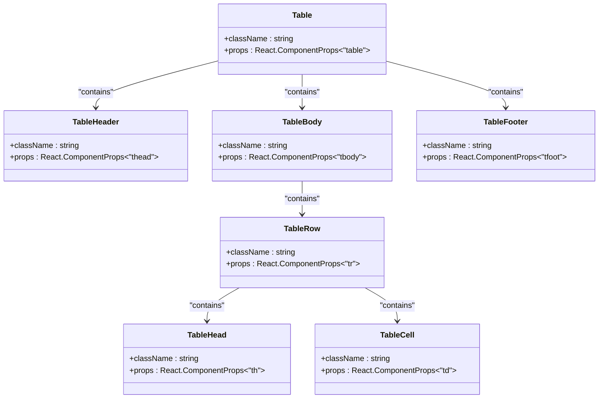

**Diagram sources**
- [table.tsx](file://src/components/ui/table.tsx#L0-L116)

**Section sources**
- [table.tsx](file://src/components/ui/table.tsx#L0-L116)

### Card Component
The Card component serves as a container for related information, providing a visually distinct grouping of content. It includes subcomponents for CardHeader, CardTitle, CardDescription, CardAction, CardContent, and CardFooter, enabling structured content organization.

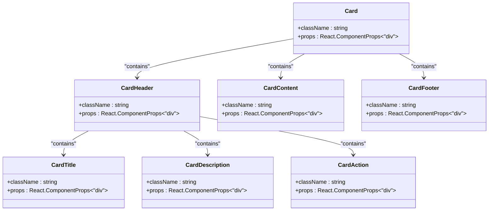

**Diagram sources**
- [card.tsx](file://src/components/ui/card.tsx#L0-L92)

**Section sources**
- [card.tsx](file://src/components/ui/card.tsx#L0-L92)

### Accordion Component
The Accordion component enables collapsible content sections, improving information hierarchy and saving screen space. It uses Radix UI's Accordion primitives for accessible interactions.

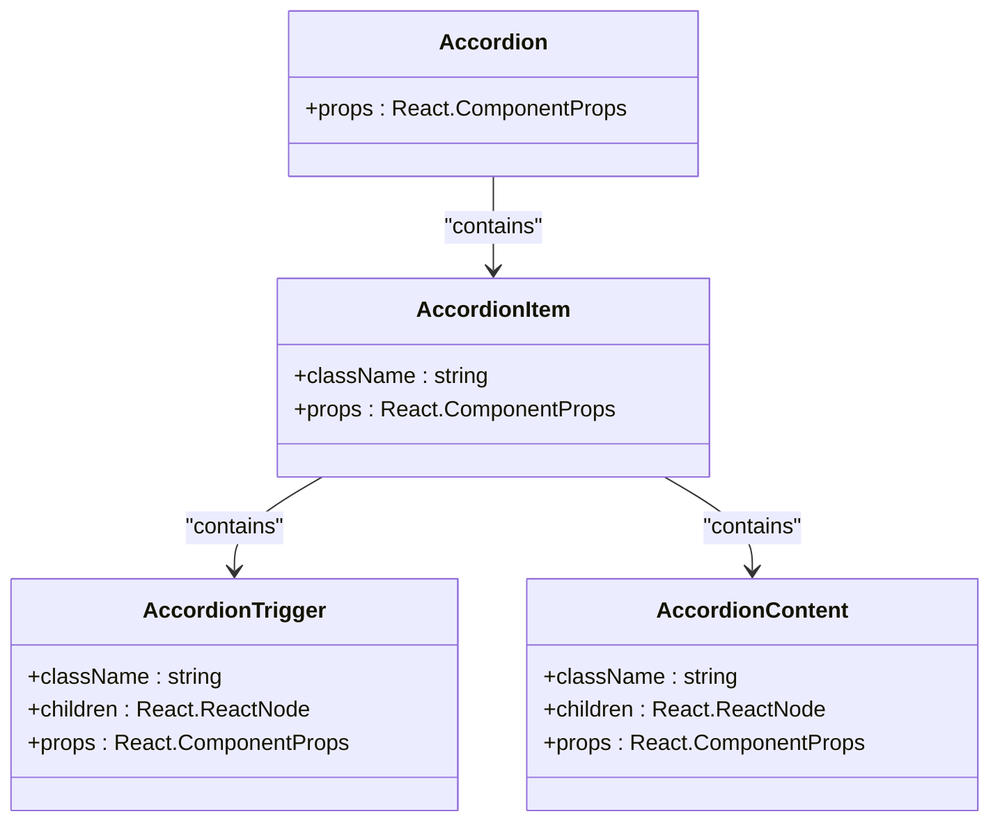

**Diagram sources**
- [accordion.tsx](file://src/components/ui/accordion.tsx#L0-L66)

**Section sources**
- [accordion.tsx](file://src/components/ui/accordion.tsx#L0-L66)

### Avatar Component
The Avatar component displays user profile images with fallback text when images are unavailable. It uses Radix UI's Avatar primitives for consistent behavior.

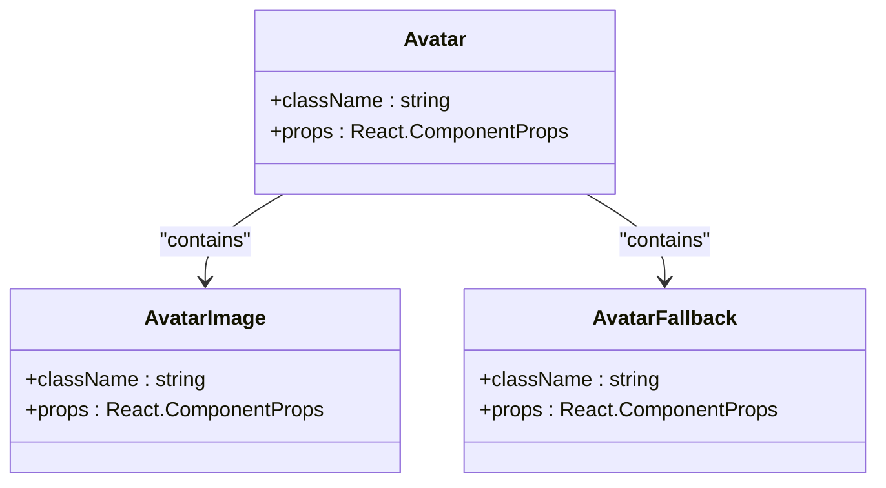

**Diagram sources**
- [avatar.tsx](file://src/components/ui/avatar.tsx#L0-L53)

**Section sources**
- [avatar.tsx](file://src/components/ui/avatar.tsx#L0-L53)

### Badge Component
The Badge component displays small pieces of information or status indicators with different visual variants (default, secondary, destructive, outline).

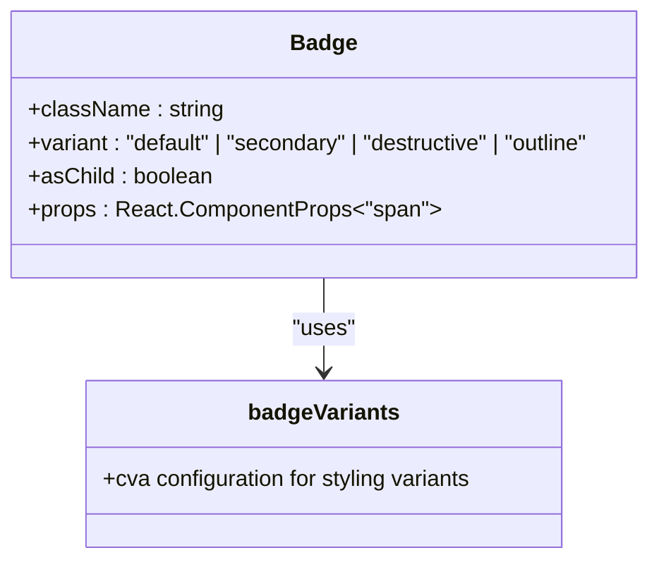

**Diagram sources**
- [badge.tsx](file://src/components/ui/badge.tsx#L0-L46)

**Section sources**
- [badge.tsx](file://src/components/ui/badge.tsx#L0-L46)

### Chart Component
The Chart component integrates Recharts for data visualization, providing a wrapper with theme support and accessibility features.

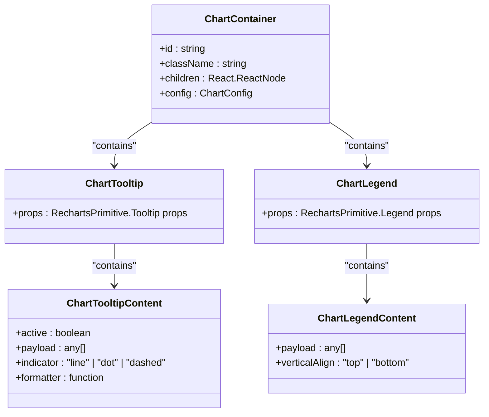

**Diagram sources**
- [chart.tsx](file://src/components/ui/chart.tsx#L0-L353)

**Section sources**
- [chart.tsx](file://src/components/ui/chart.tsx#L0-L353)

### Progress Component
The Progress component visually represents progress or completion status with a customizable bar.

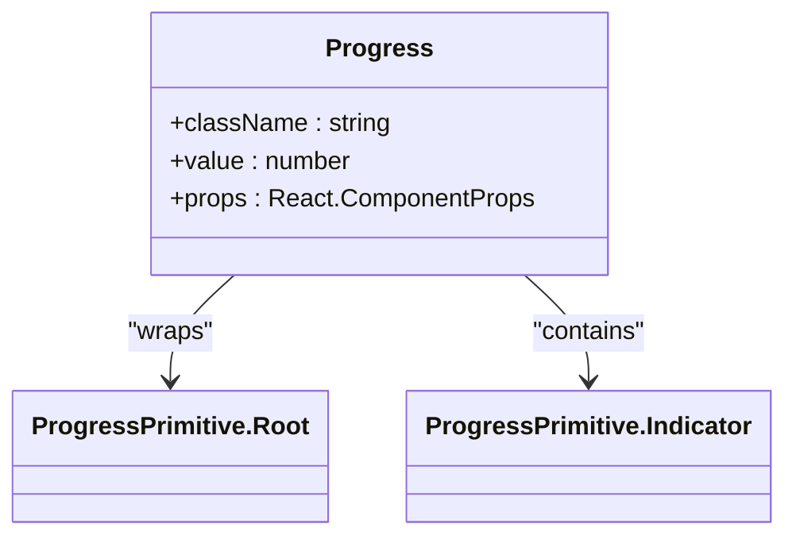

**Diagram sources**
- [progress.tsx](file://src/components/ui/progress.tsx#L0-L31)

**Section sources**
- [progress.tsx](file://src/components/ui/progress.tsx#L0-L31)

### Skeleton Component
The Skeleton component provides loading placeholders with animated effects to indicate content loading.

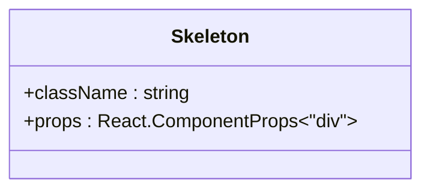

**Diagram sources**
- [skeleton.tsx](file://src/components/ui/skeleton.tsx#L0-L13)

**Section sources**
- [skeleton.tsx](file://src/components/ui/skeleton.tsx#L0-L13)

## Component Integration in PortfolioPage

### Photographer Profile Display
The PortfolioPage component integrates multiple data display components to present photographer information in a structured format. The layout uses cards for content grouping, badges for status indicators, and avatars for profile images.

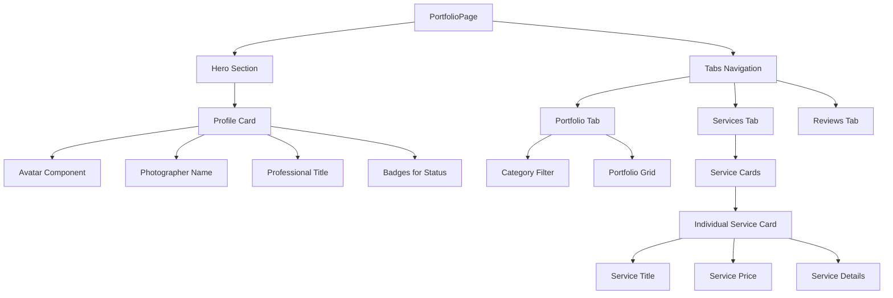

**Diagram sources**
- [PortfolioPage.tsx](file://src/components/PortfolioPage.tsx#L0-L26)
- [card.tsx](file://src/components/ui/card.tsx#L0-L92)
- [badge.tsx](file://src/components/ui/badge.tsx#L0-L46)
- [avatar.tsx](file://src/components/ui/avatar.tsx#L0-L53)

**Section sources**
- [PortfolioPage.tsx](file://src/components/PortfolioPage.tsx#L0-L26)
- [PortfolioPage.tsx](file://src/components/PortfolioPage.tsx#L188-L225)

## Booking Summary Implementation in BookingManager

### Booking Management Interface
The BookingManager component uses data display components to manage booking requests with a tabbed interface for different booking statuses.

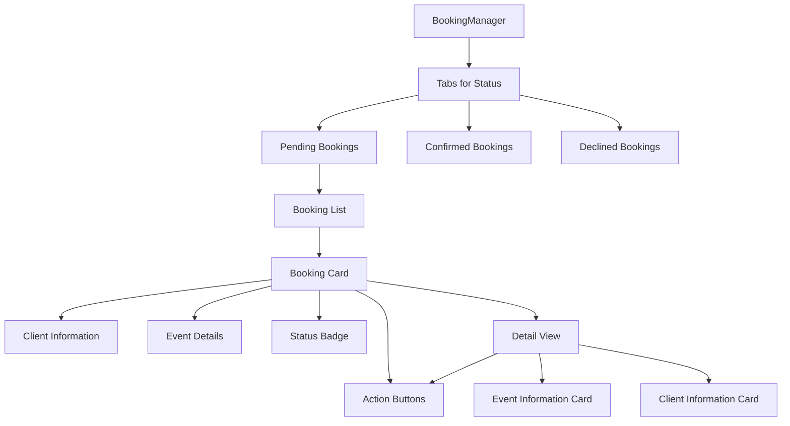

**Diagram sources**
- [BookingManager.tsx](file://src/components/BookingManager.tsx#L0-L509)
- [card.tsx](file://src/components/ui/card.tsx#L0-L92)
- [badge.tsx](file://src/components/ui/badge.tsx#L0-L46)
- [button.tsx](file://src/components/ui/button.tsx#L0-L50)

**Section sources**
- [BookingManager.tsx](file://src/components/BookingManager.tsx#L0-L509)

## Data Binding and Dynamic Content

### Supabase Integration
Data display components are populated with dynamic content from Supabase through API calls. The integration follows a service layer pattern with typed responses.

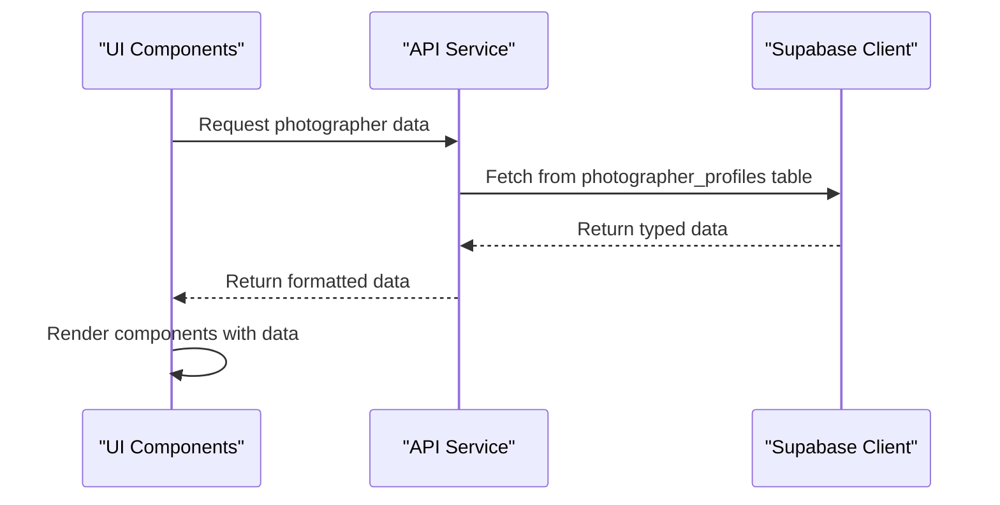

**Diagram sources**
- [supabase.ts](file://src/lib/supabase.ts#L0-L241)
- [api.ts](file://src/lib/api.ts#L0-L260)
- [PortfolioPage.tsx](file://src/components/PortfolioPage.tsx#L0-L26)

**Section sources**
- [supabase.ts](file://src/lib/supabase.ts#L0-L241)
- [api.ts](file://src/lib/api.ts#L0-L260)

## Styling and Responsive Design

### Tailwind CSS Integration
All data display components use Tailwind CSS for styling, with utility classes for responsive layouts and visual customization.

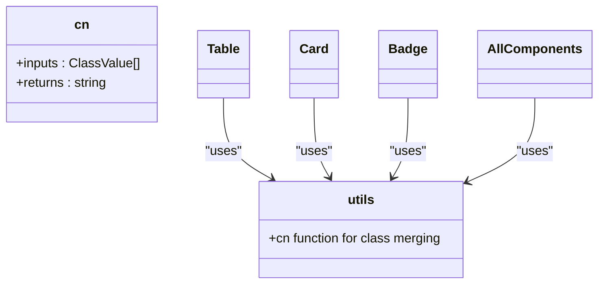

**Diagram sources**
- [utils.ts](file://src/components/ui/utils.ts#L0-L6)
- [table.tsx](file://src/components/ui/table.tsx#L0-L116)
- [card.tsx](file://src/components/ui/card.tsx#L0-L92)
- [badge.tsx](file://src/components/ui/badge.tsx#L0-L46)

**Section sources**
- [utils.ts](file://src/components/ui/utils.ts#L0-L6)

## Loading States and Skeleton Placeholders

### Loading State Management
Components implement loading states using skeleton placeholders to provide visual feedback during data fetching.

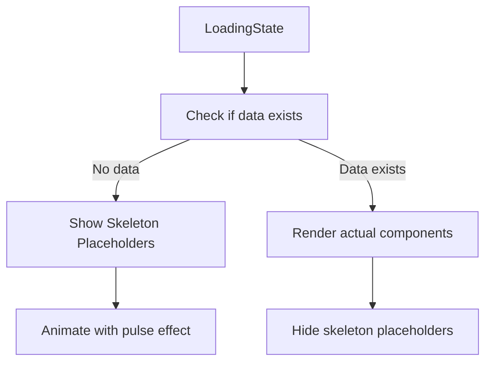

**Diagram sources**
- [skeleton.tsx](file://src/components/ui/skeleton.tsx#L0-L13)
- [PortfolioPage.tsx](file://src/components/PortfolioPage.tsx#L188-L225)
- [BookingManager.tsx](file://src/components/BookingManager.tsx#L0-L509)

**Section sources**
- [skeleton.tsx](file://src/components/ui/skeleton.tsx#L0-L13)
- [PortfolioPage.tsx](file://src/components/PortfolioPage.tsx#L188-L225)

## Accessibility Considerations

### ARIA and Semantic HTML
Data display components follow accessibility best practices with proper ARIA attributes and semantic HTML structure.

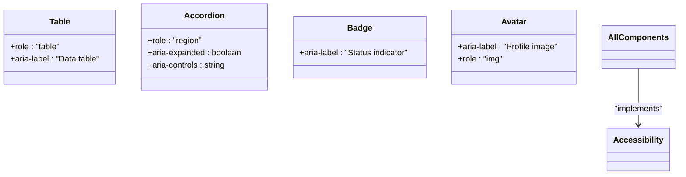

**Diagram sources**
- [table.tsx](file://src/components/ui/table.tsx#L0-L116)
- [accordion.tsx](file://src/components/ui/accordion.tsx#L0-L66)
- [badge.tsx](file://src/components/ui/badge.tsx#L0-L46)
- [avatar.tsx](file://src/components/ui/avatar.tsx#L0-L53)

**Section sources**
- [table.tsx](file://src/components/ui/table.tsx#L0-L116)
- [accordion.tsx](file://src/components/ui/accordion.tsx#L0-L66)

## Performance Optimization

### Large Data Handling
Components are optimized for performance when displaying large datasets, particularly in tables and charts.

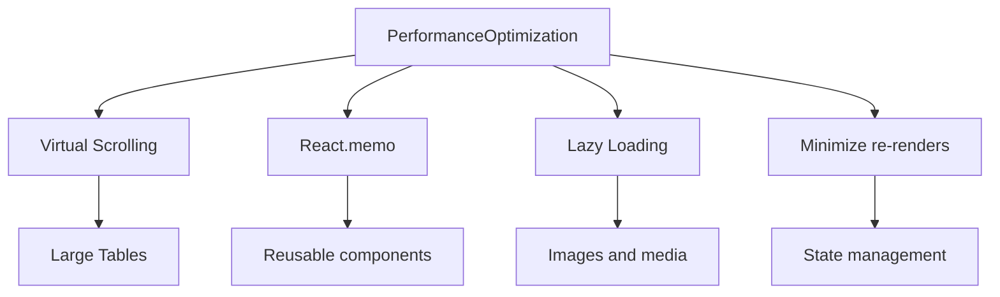

**Section sources**
- [table.tsx](file://src/components/ui/table.tsx#L0-L116)
- [chart.tsx](file://src/components/ui/chart.tsx#L0-L353)
- [BookingManager.tsx](file://src/components/BookingManager.tsx#L0-L509)

## Theming and Animation

### Visual Feedback and Branding
Components support theming and animation to enhance user experience and provide visual feedback.

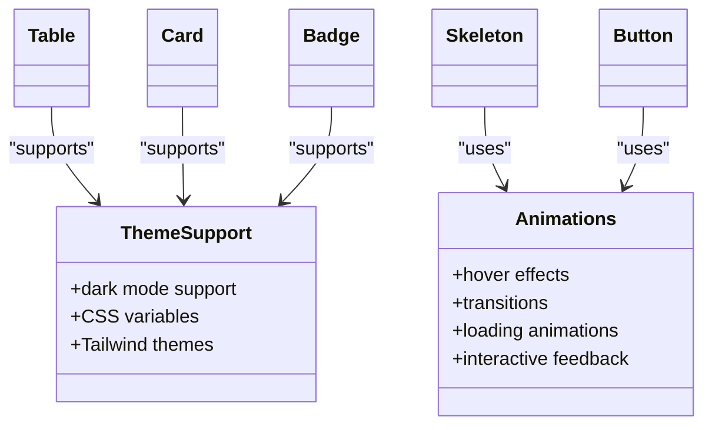

**Section sources**
- [table.tsx](file://src/components/ui/table.tsx#L0-L116)
- [card.tsx](file://src/components/ui/card.tsx#L0-L92)
- [badge.tsx](file://src/components/ui/badge.tsx#L0-L46)
- [skeleton.tsx](file://src/components/ui/skeleton.tsx#L0-L13)
- [utils.ts](file://src/components/ui/utils.ts#L0-L6)