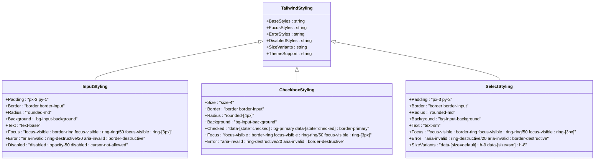

# Form Components

<cite>
**Referenced Files in This Document**   
- [form.tsx](file://src/components/ui/form.tsx)
- [input.tsx](file://src/components/ui/input.tsx)
- [textarea.tsx](file://src/components/ui/textarea.tsx)
- [checkbox.tsx](file://src/components/ui/checkbox.tsx)
- [radio-group.tsx](file://src/components/ui/radio-group.tsx)
- [select.tsx](file://src/components/ui/select.tsx)
- [switch.tsx](file://src/components/ui/switch.tsx)
- [slider.tsx](file://src/components/ui/slider.tsx)
- [input-otp.tsx](file://src/components/ui/input-otp.tsx)
- [label.tsx](file://src/components/ui/label.tsx)
- [GeneralizedSignupFlow.tsx](file://src/components/GeneralizedSignupFlow.tsx)
- [OnboardingForm.tsx](file://src/components/OnboardingForm.tsx)
- [utils.ts](file://src/components/ui/utils.ts)
- [validation.ts](file://src/middleware/validation.ts)
</cite>

## Table of Contents
1. [Introduction](#introduction)
2. [Form Architecture and Integration](#form-architecture-and-integration)
3. [Core Form Components](#core-form-components)
4. [Form Validation System](#form-validation-system)
5. [Accessibility Implementation](#accessibility-implementation)
6. [Styling with Tailwind CSS](#styling-with-tailwind-css)
7. [Real-World Usage Examples](#real-world-usage-examples)
8. [Common Issues and Solutions](#common-issues-and-solutions)
9. [Advanced Features](#advanced-features)
10. [Component Reference](#component-reference)

## Introduction
This documentation provides comprehensive guidance on the form-related UI components within the SnapEvent application. The form system is built on a robust architecture that integrates React Hook Form for state management, Radix UI for accessible component primitives, and Tailwind CSS for styling. The components are designed to work together seamlessly through a wrapper-based approach, enabling consistent validation, error handling, and accessibility across the application. This document covers the implementation details, usage patterns, and best practices for all form components including input fields, selection controls, and specialized inputs.

## Form Architecture and Integration

**Diagram sources**
- [form.tsx](file://src/components/ui/form.tsx#L1-L167)

**Section sources**
- [form.tsx](file://src/components/ui/form.tsx#L1-L167)

## Core Form Components

### Input Components
The form system includes several input components that are designed to work within the Form wrapper context. Each component is built with accessibility and validation in mind, using Radix UI primitives and Tailwind CSS for styling.

#### Text Input and Textarea
The Input and Textarea components provide basic text input functionality with consistent styling and validation feedback. They integrate with the Form system through the FormControl component, which manages accessibility attributes and error states.

**Diagram sources**
- [input.tsx](file://src/components/ui/input.tsx#L1-L21)
- [textarea.tsx](file://src/components/ui/textarea.tsx#L1-L18)
- [form.tsx](file://src/components/ui/form.tsx#L1-L167)

### Selection Components
The form system includes various selection components that provide different ways for users to make choices within forms.

#### Checkbox and Radio Group
The Checkbox and RadioGroup components provide binary and multiple choice selection capabilities. They use Radix UI's accessible primitives to ensure proper keyboard navigation and screen reader support.

**Diagram sources**
- [checkbox.tsx](file://src/components/ui/checkbox.tsx#L1-L32)
- [radio-group.tsx](file://src/components/ui/radio-group.tsx#L1-L45)
- [form.tsx](file://src/components/ui/form.tsx#L1-L167)

#### Select Component
The Select component provides a dropdown menu for selecting from a list of options. It uses Radix UI's Select primitive to ensure accessibility and includes support for grouping, separators, and scrolling.

**Diagram sources**
- [select.tsx](file://src/components/ui/select.tsx#L1-L189)
- [form.tsx](file://src/components/ui/form.tsx#L1-L167)

### Specialized Input Components
The form system includes specialized components for specific input scenarios.

#### Switch and Slider
The Switch component provides a toggle interface for binary choices, while the Slider component allows users to select a value from a range.

**Diagram sources**
- [switch.tsx](file://src/components/ui/switch.tsx#L1-L31)
- [slider.tsx](file://src/components/ui/slider.tsx#L1-L63)
- [form.tsx](file://src/components/ui/form.tsx#L1-L167)

#### OTP Input
The InputOTP component provides a specialized interface for entering one-time passwords or verification codes, with support for grouping and separators.

**Diagram sources**
- [input-otp.tsx](file://src/components/ui/input-otp.tsx#L1-L77)
- [form.tsx](file://src/components/ui/form.tsx#L1-L167)

**Section sources**
- [input.tsx](file://src/components/ui/input.tsx#L1-L21)
- [textarea.tsx](file://src/components/ui/textarea.tsx#L1-L18)
- [checkbox.tsx](file://src/components/ui/checkbox.tsx#L1-L32)
- [radio-group.tsx](file://src/components/ui/radio-group.tsx#L1-L45)
- [select.tsx](file://src/components/ui/select.tsx#L1-L189)
- [switch.tsx](file://src/components/ui/switch.tsx#L1-L31)
- [slider.tsx](file://src/components/ui/slider.tsx#L1-L63)
- [input-otp.tsx](file://src/components/ui/input-otp.tsx#L1-L77)
- [form.tsx](file://src/components/ui/form.tsx#L1-L167)

## Form Validation System

**Diagram sources**
- [form.tsx](file://src/components/ui/form.tsx#L1-L167)
- [validation.ts](file://src/middleware/validation.ts#L1-L159)

**Section sources**
- [form.tsx](file://src/components/ui/form.tsx#L1-L167)
- [validation.ts](file://src/middleware/validation.ts#L1-L159)

## Accessibility Implementation
The form components are designed with accessibility as a core principle, leveraging Radix UI's accessible primitives and implementing proper ARIA attributes.

**Diagram sources**
- [form.tsx](file://src/components/ui/form.tsx#L1-L167)
- [label.tsx](file://src/components/ui/label.tsx)
- [input.tsx](file://src/components/ui/input.tsx#L1-L21)

**Section sources**
- [form.tsx](file://src/components/ui/form.tsx#L1-L167)

## Styling with Tailwind CSS
The form components use Tailwind CSS for styling, with a consistent design system that supports both light and dark modes.

**Diagram sources**
- [input.tsx](file://src/components/ui/input.tsx#L1-L21)
- [checkbox.tsx](file://src/components/ui/checkbox.tsx#L1-L32)
- [select.tsx](file://src/components/ui/select.tsx#L1-L189)
- [utils.ts](file://src/components/ui/utils.ts)

**Section sources**
- [input.tsx](file://src/components/ui/input.tsx#L1-L21)
- [checkbox.tsx](file://src/components/ui/checkbox.tsx#L1-L32)
- [select.tsx](file://src/components/ui/select.tsx#L1-L189)
- [utils.ts](file://src/components/ui/utils.ts)

## Real-World Usage Examples

### Generalized Signup Flow
The GeneralizedSignupFlow component demonstrates a multi-step form process that guides users through account creation, user type selection, and onboarding.

**Diagram sources**
- [GeneralizedSignupFlow.tsx](file://src/components/GeneralizedSignupFlow.tsx#L1-L191)
- [OnboardingForm.tsx](file://src/components/OnboardingForm.tsx#L1-L199)

### Onboarding Form
The OnboardingForm component demonstrates a complex form with multiple sections, conditional fields, and validation requirements.

**Diagram sources**
- [OnboardingForm.tsx](file://src/components/OnboardingForm.tsx#L1-L199)

**Section sources**
- [GeneralizedSignupFlow.tsx](file://src/components/GeneralizedSignupFlow.tsx#L1-L191)
- [OnboardingForm.tsx](file://src/components/OnboardingForm.tsx#L1-L199)

## Common Issues and Solutions

### Uncontrolled vs Controlled Behavior
A common issue in React forms is the mixing of uncontrolled and controlled components. The form system addresses this by using react-hook-form's Controller component to wrap all form elements, ensuring consistent state management.

**Diagram sources**
- [form.tsx](file://src/components/ui/form.tsx#L1-L167)

### Accessibility Labeling
Proper labeling is crucial for accessibility. The form system uses the FormLabel component to ensure all inputs have associated labels with proper htmlFor attributes.

**Diagram sources**
- [form.tsx](file://src/components/ui/form.tsx#L1-L167)
- [label.tsx](file://src/components/ui/label.tsx)

### Responsive Layout Adjustments
Forms need to work well on all device sizes. The form system uses Tailwind CSS's responsive utilities to adjust layouts based on screen size.

**Diagram sources**
- [form.tsx](file://src/components/ui/form.tsx#L1-L167)
- [radio-group.tsx](file://src/components/ui/radio-group.tsx#L1-L45)

**Section sources**
- [form.tsx](file://src/components/ui/form.tsx#L1-L167)

## Advanced Features

### Custom Validation
The form system supports custom validation through both client-side and server-side validation rules.

**Diagram sources**
- [validation.ts](file://src/middleware/validation.ts#L1-L159)
- [form.tsx](file://src/components/ui/form.tsx#L1-L167)

### Animation with Framer Motion
The form components integrate with Framer Motion to provide smooth transitions and animations for form state changes.

**Diagram sources**
- [GeneralizedSignupFlow.tsx](file://src/components/GeneralizedSignupFlow.tsx#L1-L191)
- [OnboardingForm.tsx](file://src/components/OnboardingForm.tsx#L1-L199)

**Section sources**
- [validation.ts](file://src/middleware/validation.ts#L1-L159)
- [GeneralizedSignupFlow.tsx](file://src/components/GeneralizedSignupFlow.tsx#L1-L191)
- [OnboardingForm.tsx](file://src/components/OnboardingForm.tsx#L1-L199)

## Component Reference

### Form Component
The Form component is a wrapper that provides the react-hook-form context to all form elements.

**Props**
- `form`: The form methods object from `useForm()`
- `onSubmit`: The submit handler function
- `children`: The form content

**Section sources**
- [form.tsx](file://src/components/ui/form.tsx#L1-L167)

### FormField Component
The FormField component wraps individual form controls and connects them to react-hook-form.

**Props**
- `name`: The field name in the form
- `control`: The control object from `useForm()`
- `rules`: Validation rules for the field
- `render`: The render function for the field

**Section sources**
- [form.tsx](file://src/components/ui/form.tsx#L1-L167)

### FormItem Component
The FormItem component provides a container for form fields with consistent spacing.

**Props**
- `className`: Additional CSS classes
- `children`: The form field content

**Section sources**
- [form.tsx](file://src/components/ui/form.tsx#L1-L167)

### FormLabel Component
The FormLabel component provides an accessible label for form fields.

**Props**
- `className`: Additional CSS classes
- `children`: The label text

**Section sources**
- [form.tsx](file://src/components/ui/form.tsx#L1-L167)

### FormControl Component
The FormControl component wraps the actual input element and manages accessibility attributes.

**Props**
- `children`: The input element

**Section sources**
- [form.tsx](file://src/components/ui/form.tsx#L1-L167)

### FormDescription Component
The FormDescription component provides additional information about a form field.

**Props**
- `className`: Additional CSS classes
- `children`: The description text

**Section sources**
- [form.tsx](file://src/components/ui/form.tsx#L1-L167)

### FormMessage Component
The FormMessage component displays validation errors for a form field.

**Props**
- `className`: Additional CSS classes
- `children`: The error message (optional, uses validation error by default)

**Section sources**
- [form.tsx](file://src/components/ui/form.tsx#L1-L167)

### Input Component
The Input component provides a styled text input field.

**Props**
- `type`: The input type (text, email, password, etc.)
- `className`: Additional CSS classes
- `placeholder`: Placeholder text
- `disabled`: Whether the input is disabled
- `required`: Whether the input is required

**Section sources**
- [input.tsx](file://src/components/ui/input.tsx#L1-L21)

### Textarea Component
The Textarea component provides a styled multi-line text input.

**Props**
- `className`: Additional CSS classes
- `placeholder`: Placeholder text
- `disabled`: Whether the textarea is disabled
- `required`: Whether the textarea is required
- `rows`: Number of visible rows
- `cols`: Number of visible columns

**Section sources**
- [textarea.tsx](file://src/components/ui/textarea.tsx#L1-L18)

### Checkbox Component
The Checkbox component provides a styled checkbox input.

**Props**
- `checked`: Whether the checkbox is checked
- `onCheckedChange`: Callback when checked state changes
- `disabled`: Whether the checkbox is disabled
- `required`: Whether the checkbox is required
- `name`: The field name
- `value`: The field value

**Section sources**
- [checkbox.tsx](file://src/components/ui/checkbox.tsx#L1-L32)

### RadioGroup Component
The RadioGroup component provides a container for radio buttons.

**Props**
- `value`: The currently selected value
- `onValueChange`: Callback when selection changes
- `disabled`: Whether the group is disabled
- `name`: The group name
- `orientation`: Layout orientation ("horizontal" or "vertical")

**Section sources**
- [radio-group.tsx](file://src/components/ui/radio-group.tsx#L1-L45)

### Select Component
The Select component provides a dropdown selection interface.

**Props**
- `value`: The currently selected value
- `onValueChange`: Callback when selection changes
- `disabled`: Whether the select is disabled
- `name`: The field name

**Section sources**
- [select.tsx](file://src/components/ui/select.tsx#L1-L189)

### Switch Component
The Switch component provides a toggle switch interface.

**Props**
- `checked`: Whether the switch is on
- `onCheckedChange`: Callback when state changes
- `disabled`: Whether the switch is disabled
- `required`: Whether the switch is required
- `name`: The field name

**Section sources**
- [switch.tsx](file://src/components/ui/switch.tsx#L1-L31)

### Slider Component
The Slider component provides a range selection interface.

**Props**
- `value`: The current value(s)
- `onValueChange`: Callback when value changes
- `min`: Minimum value
- `max`: Maximum value
- `step`: Step increment
- `disabled`: Whether the slider is disabled
- `orientation`: Layout orientation ("horizontal" or "vertical")

**Section sources**
- [slider.tsx](file://src/components/ui/slider.tsx#L1-L63)

### InputOTP Component
The InputOTP component provides a one-time password input interface.

**Props**
- `value`: The current OTP value
- `onChange`: Callback when value changes
- `containerClassName`: Additional classes for container
- `maxLength`: Maximum number of digits
- `pattern`: Regex pattern for validation
- `disabled`: Whether the input is disabled

**Section sources**
- [input-otp.tsx](file://src/components/ui/input-otp.tsx#L1-L77)