# Interactive Overlays & Modals

<cite>
**Referenced Files in This Document**   
- [dialog.tsx](file://src/components/ui/dialog.tsx)
- [drawer.tsx](file://src/components/ui/drawer.tsx)
- [sheet.tsx](file://src/components/ui/sheet.tsx)
- [alert-dialog.tsx](file://src/components/ui/alert-dialog.tsx)
- [popover.tsx](file://src/components/ui/popover.tsx)
- [hover-card.tsx](file://src/components/ui/hover-card.tsx)
- [command.tsx](file://src/components/ui/command.tsx)
- [use-mobile.ts](file://src/components/ui/use-mobile.ts)
- [BookingManager.tsx](file://src/components/BookingManager.tsx)
- [PortfolioPage.tsx](file://src/components/PortfolioPage.tsx)
- [utils.ts](file://src/components/ui/utils.ts)
</cite>

## Table of Contents
1. [Introduction](#introduction)
2. [Core Overlay Components](#core-overlay-components)
3. [Implementation with Radix UI Primitives](#implementation-with-radix-ui-primitives)
4. [Portal Rendering Mechanism](#portal-rendering-mechanism)
5. [Trigger Mechanisms and State Management](#trigger-mechanisms-and-state-management)
6. [Animation System with Framer Motion](#animation-system-with-framer-motion)
7. [Accessibility Features](#accessibility-features)
8. [Responsive Behavior Patterns](#responsive-behavior-patterns)
9. [Component-Specific Implementations](#component-specific-implementations)
10. [Common Issues and Solutions](#common-issues-and-solutions)
11. [Performance Optimization](#performance-optimization)

## Introduction
This document provides comprehensive documentation for interactive overlay and modal components in the SnapEvent application. The system implements a robust set of UI components including dialogs, drawers, sheets, alert dialogs, popovers, hover cards, and command menus. These components are built using Radix UI primitives and enhanced with portal rendering, Framer Motion animations, and responsive design patterns. The documentation covers implementation details, accessibility features, and practical usage examples from key components like BookingManager.tsx and PortfolioPage.tsx where modals are used for booking confirmation and image previews.

## Core Overlay Components

The application implements seven primary overlay components, each serving distinct user interaction patterns:

- **Dialog**: Standard modal dialog for focused user interactions
- **Drawer**: Sliding panel from screen edges, typically used for navigation or forms
- **Sheet**: Similar to drawer but with different animation and positioning logic
- **Alert Dialog**: Specialized dialog for critical user decisions with confirmation actions
- **Popover**: Floating panel that appears on hover or click, anchored to a trigger element
- **Hover Card**: Lightweight overlay that appears on mouse hover over elements
- **Command Menu**: Keyboard-accessible interface for executing commands, implemented as a dialog wrapper

**Section sources**
- [dialog.tsx](file://src/components/ui/dialog.tsx)
- [drawer.tsx](file://src/components/ui/drawer.tsx)
- [sheet.tsx](file://src/components/ui/sheet.tsx)
- [alert-dialog.tsx](file://src/components/ui/alert-dialog.tsx)
- [popover.tsx](file://src/components/ui/popover.tsx)
- [hover-card.tsx](file://src/components/ui/hover-card.tsx)
- [command.tsx](file://src/components/ui/command.tsx)

## Implementation with Radix UI Primitives

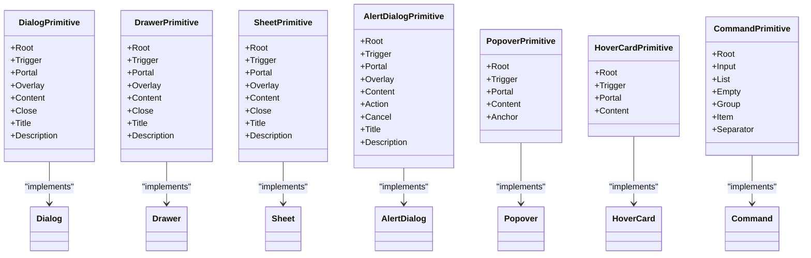

**Diagram sources**
- [dialog.tsx](file://src/components/ui/dialog.tsx)
- [drawer.tsx](file://src/components/ui/drawer.tsx)
- [sheet.tsx](file://src/components/ui/sheet.tsx)
- [alert-dialog.tsx](file://src/components/ui/alert-dialog.tsx)
- [popover.tsx](file://src/components/ui/popover.tsx)
- [hover-card.tsx](file://src/components/ui/hover-card.tsx)
- [command.tsx](file://src/components/ui/command.tsx)

**Section sources**
- [dialog.tsx](file://src/components/ui/dialog.tsx#L1-L132)
- [drawer.tsx](file://src/components/ui/drawer.tsx#L1-L132)
- [sheet.tsx](file://src/components/ui/sheet.tsx#L1-L139)

## Portal Rendering Mechanism

The overlay components utilize portal rendering to ensure proper z-index stacking and escape container overflow constraints. All components implement a Portal primitive that renders content at the end of the document body.

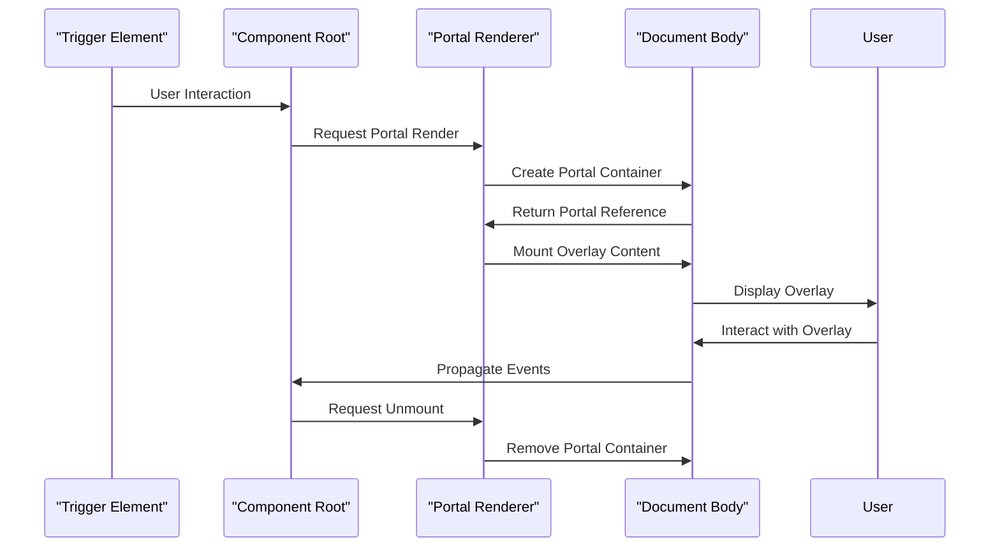

**Diagram sources**
- [dialog.tsx](file://src/components/ui/dialog.tsx#L45-L50)
- [drawer.tsx](file://src/components/ui/drawer.tsx#L45-L50)
- [sheet.tsx](file://src/components/ui/sheet.tsx#L45-L50)
- [alert-dialog.tsx](file://src/components/ui/alert-dialog.tsx#L45-L50)

**Section sources**
- [dialog.tsx](file://src/components/ui/dialog.tsx#L40-L55)
- [drawer.tsx](file://src/components/ui/drawer.tsx#L40-L55)
- [sheet.tsx](file://src/components/ui/sheet.tsx#L40-L55)

## Trigger Mechanisms and State Management

Overlay components are controlled through trigger mechanisms and external state management. The system uses React state hooks to manage visibility, with triggers that toggle the state.

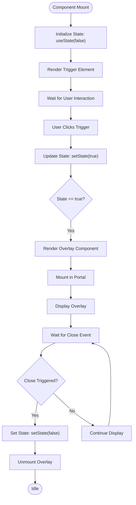

**Diagram sources**
- [BookingManager.tsx](file://src/components/BookingManager.tsx#L26-L30)
- [PortfolioPage.tsx](file://src/components/PortfolioPage.tsx#L26-L30)

**Section sources**
- [BookingManager.tsx](file://src/components/BookingManager.tsx#L26-L30)
- [PortfolioPage.tsx](file://src/components/PortfolioPage.tsx#L26-L30)

## Animation System with Framer Motion

While Radix UI components have built-in CSS animations, additional components use Framer Motion for more sophisticated transitions. The system implements entrance and exit animations with configurable duration and easing.

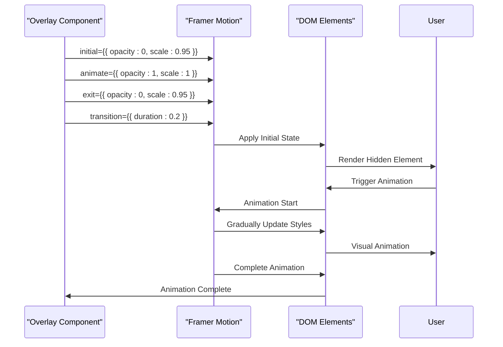

**Diagram sources**
- [PortfolioPage.tsx](file://src/components/PortfolioPage.tsx#L734-L771)

**Section sources**
- [PortfolioPage.tsx](file://src/components/PortfolioPage.tsx#L734-L771)

## Accessibility Features

The overlay system implements comprehensive accessibility features following WAI-ARIA guidelines, including proper role assignment, focus management, and screen reader support.

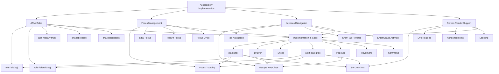

**Diagram sources**
- [dialog.tsx](file://src/components/ui/dialog.tsx#L1-L132)
- [alert-dialog.tsx](file://src/components/ui/alert-dialog.tsx#L1-L157)
- [popover.tsx](file://src/components/ui/popover.tsx#L1-L48)

**Section sources**
- [dialog.tsx](file://src/components/ui/dialog.tsx#L1-L132)
- [alert-dialog.tsx](file://src/components/ui/alert-dialog.tsx#L1-L157)

## Responsive Behavior Patterns

The system implements responsive behavior patterns that adapt overlay presentation based on device characteristics, particularly using the use-mobile hook to determine presentation style.

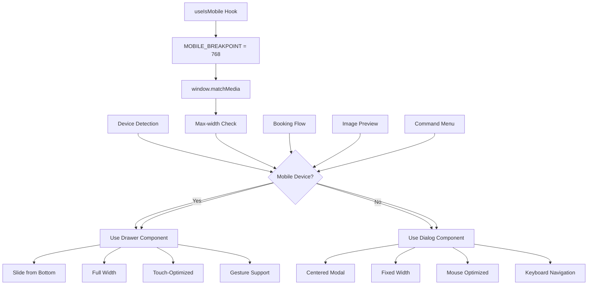

**Diagram sources**
- [use-mobile.ts](file://src/components/ui/use-mobile.ts#L1-L21)
- [PortfolioPage.tsx](file://src/components/PortfolioPage.tsx#L26-L30)

**Section sources**
- [use-mobile.ts](file://src/components/ui/use-mobile.ts#L1-L21)
- [PortfolioPage.tsx](file://src/components/PortfolioPage.tsx#L26-L30)

## Component-Specific Implementations

### Booking Manager Implementation
The BookingManager component uses a dialog-style overlay for managing photographer bookings, with tabs for different booking statuses and detailed views for individual bookings.

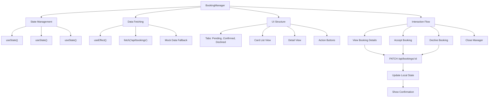

**Diagram sources**
- [BookingManager.tsx](file://src/components/BookingManager.tsx#L1-L509)

**Section sources**
- [BookingManager.tsx](file://src/components/BookingManager.tsx#L1-L509)

### Portfolio Page Implementation
The PortfolioPage component implements multiple overlay types for different use cases, including a share popup with Framer Motion animations.

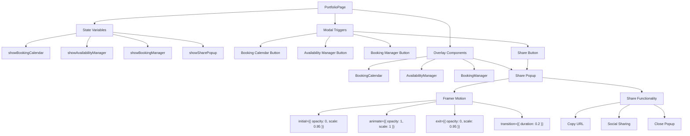

**Diagram sources**
- [PortfolioPage.tsx](file://src/components/PortfolioPage.tsx#L26-L30)
- [PortfolioPage.tsx](file://src/components/PortfolioPage.tsx#L734-L771)

**Section sources**
- [PortfolioPage.tsx](file://src/components/PortfolioPage.tsx#L26-L30)
- [PortfolioPage.tsx](file://src/components/PortfolioPage.tsx#L734-L771)

## Common Issues and Solutions

### Scroll Lock Management
The overlay system must manage document scrolling when overlays are active to prevent background content from scrolling.

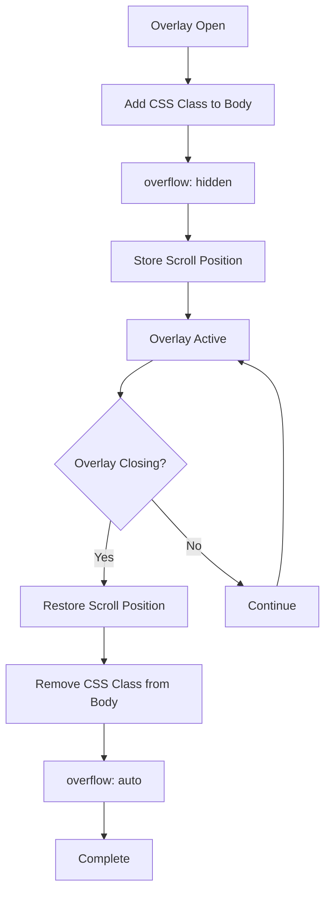

**Section sources**
- [dialog.tsx](file://src/components/ui/dialog.tsx)
- [drawer.tsx](file://src/components/ui/drawer.tsx)

### Z-Index Conflicts
Proper z-index stacking is critical for overlay components to display correctly above other content.

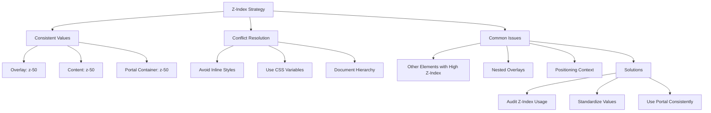

**Section sources**
- [dialog.tsx](file://src/components/ui/dialog.tsx)
- [drawer.tsx](file://src/components/ui/drawer.tsx)
- [sheet.tsx](file://src/components/ui/sheet.tsx)

## Performance Optimization

### Complex Content Rendering
For overlays with complex content, optimization techniques prevent performance degradation.

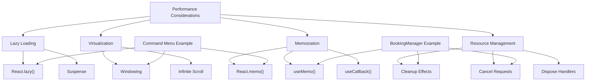

**Section sources**
- [BookingManager.tsx](file://src/components/BookingManager.tsx)
- [command.tsx](file://src/components/ui/command.tsx)