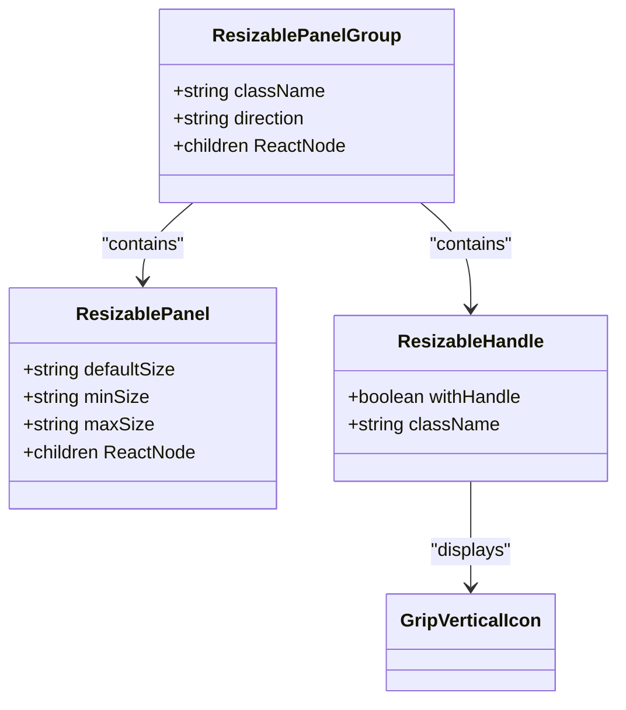
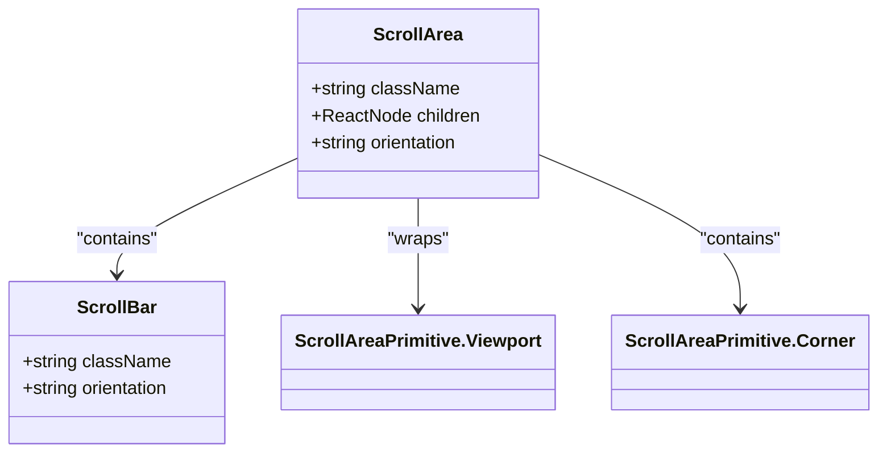
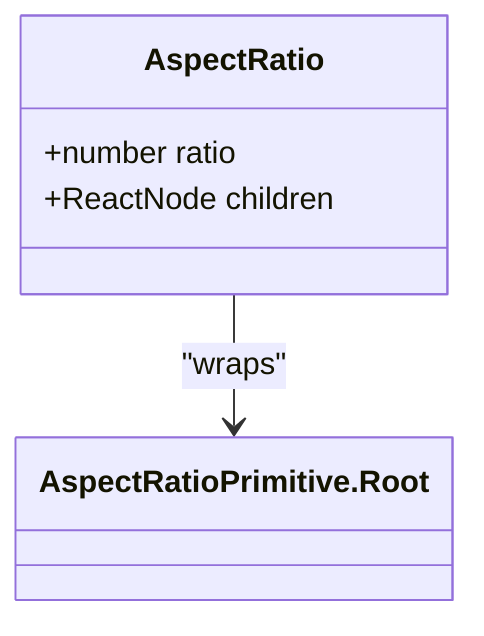
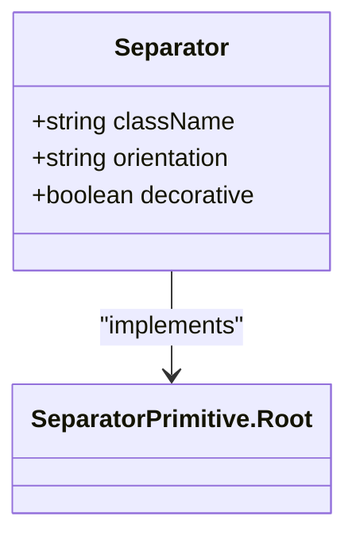
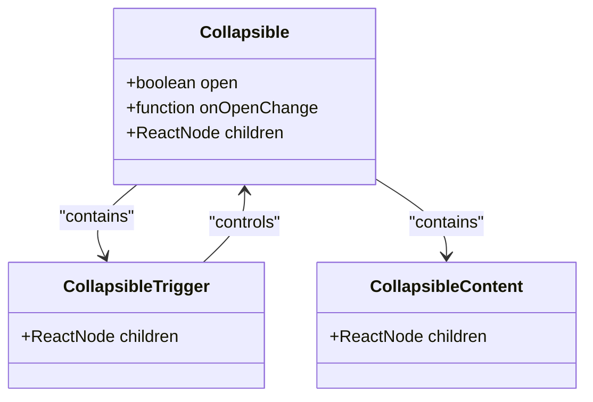
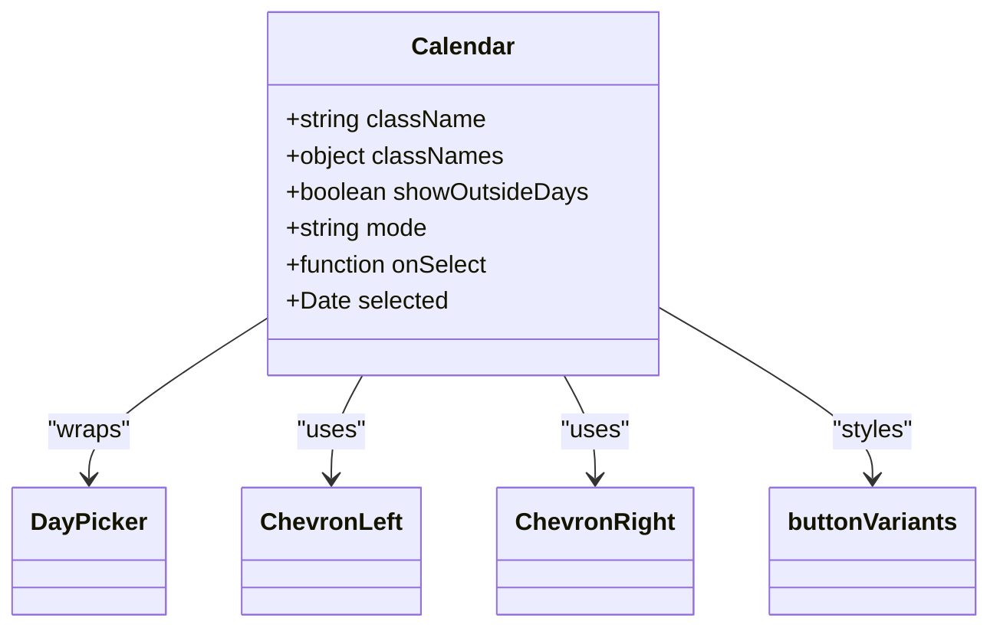
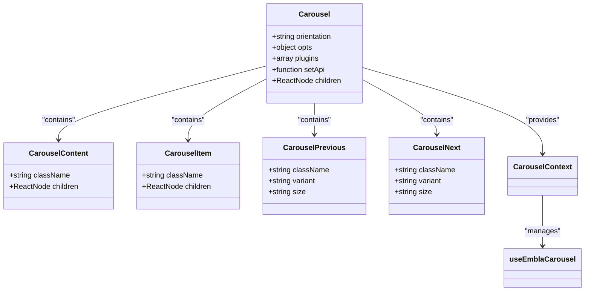
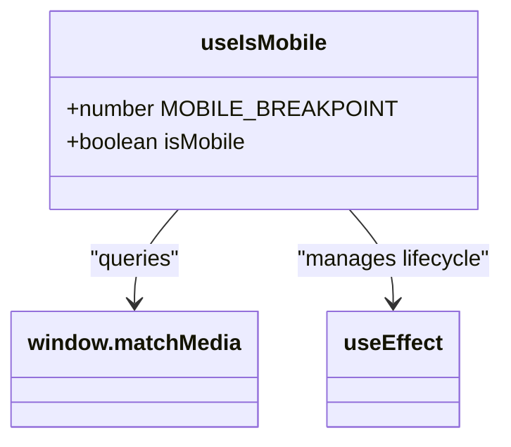
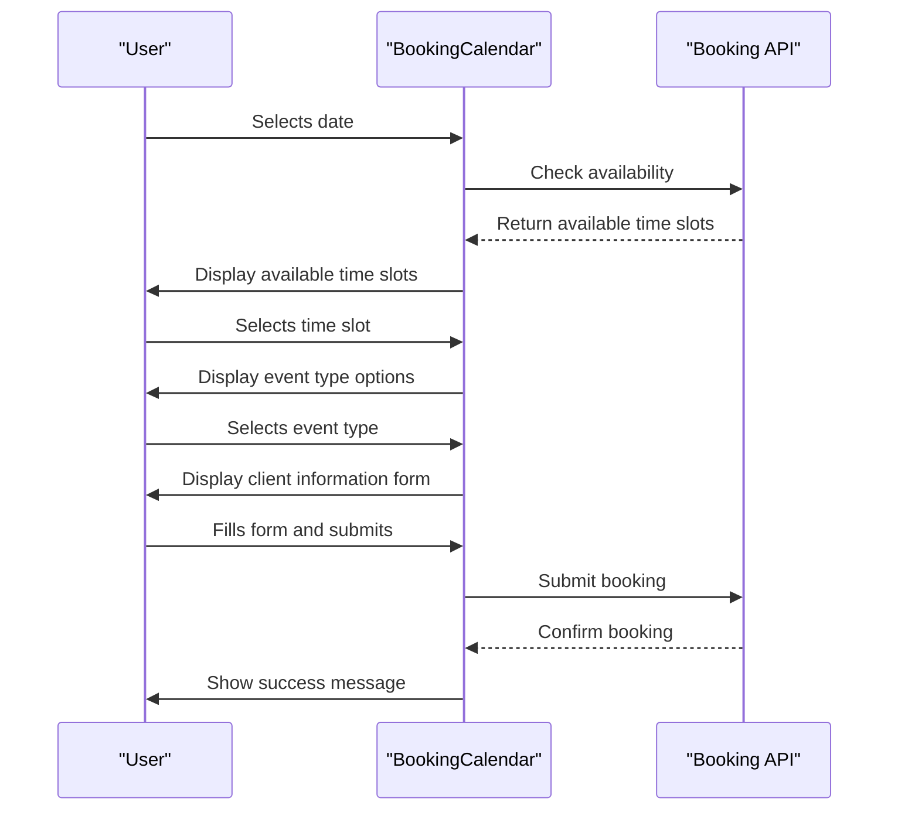
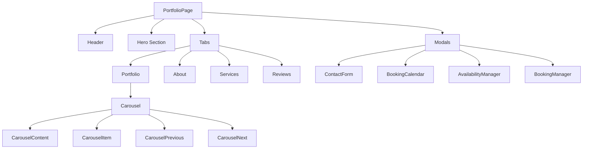

# Layout & Utility Components

<cite>
**Referenced Files in This Document**   
- [resizable.tsx](file://src/components/ui/resizable.tsx)
- [scroll-area.tsx](file://src/components/ui/scroll-area.tsx)
- [aspect-ratio.tsx](file://src/components/ui/aspect-ratio.tsx)
- [separator.tsx](file://src/components/ui/separator.tsx)
- [collapsible.tsx](file://src/components/ui/collapsible.tsx)
- [calendar.tsx](file://src/components/ui/calendar.tsx)
- [carousel.tsx](file://src/components/ui/carousel.tsx)
- [use-mobile.ts](file://src/components/ui/use-mobile.ts)
- [utils.ts](file://src/components/ui/utils.ts)
- [BookingCalendar.tsx](file://src/components/BookingCalendar.tsx)
- [PortfolioPage.tsx](file://src/components/PortfolioPage.tsx)
</cite>

## Table of Contents
1. [Introduction](#introduction)
2. [Core Layout Components](#core-layout-components)
3. [Utility Components](#utility-components)
4. [Integration Examples](#integration-examples)
5. [Implementation Details](#implementation-details)
6. [Common Issues and Solutions](#common-issues-and-solutions)
7. [Conclusion](#conclusion)

## Introduction
This document provides comprehensive documentation for the layout and utility components used in the SnapEvent Landing Page application. These components form the foundation of responsive and dynamic user interfaces, enabling the creation of flexible layouts and interactive experiences. The documentation covers key components such as resizable panels, scroll areas, aspect ratio containers, separators, collapsible sections, calendar, carousel, and utility hooks/functions. Special attention is given to their implementation details, integration patterns, and best practices for building accessible and performant interfaces.

## Core Layout Components

### Resizable Panels
The Resizable component system enables the creation of flexible, user-adjustable layouts through drag-based resizing. Built on react-resizable-panels, this system provides three core components: ResizablePanelGroup, ResizablePanel, and ResizableHandle. The implementation supports both horizontal and vertical orientations through CSS utility classes that modify flex direction based on the data attribute panel-group-direction. The ResizableHandle includes optional grip visualization with a vertical grip icon from lucide-react, enhancing the user experience by providing visual feedback during resizing operations.

**Diagram sources**
- [resizable.tsx](file://src/components/ui/resizable.tsx#L1-L55)

**Section sources**
- [resizable.tsx](file://src/components/ui/resizable.tsx#L1-L55)

### Scroll Areas
The ScrollArea component provides a styled, cross-browser consistent scrolling container that enhances the native scrollbar experience. Built on @radix-ui/react-scroll-area, it implements a clean, minimal scrollbar design that appears only when needed. The component supports both vertical and horizontal orientations, with appropriate styling adjustments for each. The implementation includes a viewport wrapper that ensures content maintains its border radius, and a corner element that handles the intersection of scrollbars in both directions. The scrollbar thumb has a subtle background color and rounded styling, providing a modern aesthetic while maintaining usability.

**Diagram sources**
- [scroll-area.tsx](file://src/components/ui/scroll-area.tsx#L1-L57)

**Section sources**
- [scroll-area.tsx](file://src/components/ui/scroll-area.tsx#L1-L57)

### Aspect Ratio Containers
The AspectRatio component ensures consistent element proportions regardless of viewport size, preventing layout shifts and maintaining visual harmony. Built on @radix-ui/react-aspect-ratio, this utility wraps content in a container that maintains a specific width-to-height ratio. The implementation is minimal, focusing on the core functionality of ratio preservation without additional styling or behavior. This component is particularly valuable for media elements like images and videos, ensuring they display correctly across different devices and screen sizes without distortion.

**Diagram sources**
- [aspect-ratio.tsx](file://src/components/ui/aspect-ratio.tsx#L1-L10)

**Section sources**
- [aspect-ratio.tsx](file://src/components/ui/aspect-ratio.tsx#L1-L10)

### Separators
The Separator component provides a simple, accessible divider between content sections. Built on @radix-ui/react-separator, it supports both horizontal and vertical orientations with appropriate styling for each. The implementation uses a thin border-like element that adapts its dimensions based on the orientation prop. The component is designed to be lightweight and semantically correct, using the appropriate ARIA attributes to ensure accessibility. It serves as a visual cue to group related content while maintaining a clean, unobtrusive appearance.

**Diagram sources**
- [separator.tsx](file://src/components/ui/separator.tsx#L1-L28)

**Section sources**
- [separator.tsx](file://src/components/ui/separator.tsx#L1-L28)

### Collapsible Sections
The Collapsible component enables content toggling with smooth animations and proper accessibility semantics. Built on @radix-ui/react-collapsible, it provides a controlled way to show and hide content. The implementation consists of three parts: Collapsible (the root component), CollapsibleTrigger (the toggle button), and CollapsibleContent (the animatable content area). This pattern ensures that the component is fully accessible, with proper keyboard navigation and screen reader support. The collapsible behavior is particularly useful for progressive disclosure of information, helping to reduce cognitive load and improve user experience.

**Diagram sources**
- [collapsible.tsx](file://src/components/ui/collapsible.tsx#L1-L33)

**Section sources**
- [collapsible.tsx](file://src/components/ui/collapsible.tsx#L1-L33)

## Utility Components

### Calendar Component
The Calendar component provides a full-featured date selection interface built on react-day-picker. It offers extensive customization options through props and CSS classes, allowing for integration with various design systems. The implementation includes navigation controls with chevron icons, day selection states, and support for different selection modes (single, range). The component handles various visual states including selected days, today's date, disabled dates, and range selection endpoints. It also supports internationalization and localization through the underlying react-day-picker library.

**Diagram sources**
- [calendar.tsx](file://src/components/ui/calendar.tsx#L1-L75)

**Section sources**
- [calendar.tsx](file://src/components/ui/calendar.tsx#L1-L75)

### Carousel Component
The Carousel component implements a touch-friendly, keyboard-accessible image slider built on embla-carousel-react. It provides a comprehensive API for controlling carousel behavior, including navigation, autoplay, and custom transitions. The implementation uses React context to manage state across multiple subcomponents, ensuring a clean separation of concerns. The component supports both horizontal and vertical orientations and includes built-in controls for navigation. It also handles keyboard events for accessibility, allowing users to navigate with arrow keys.

**Diagram sources**
- [carousel.tsx](file://src/components/ui/carousel.tsx#L1-L241)

**Section sources**
- [carousel.tsx](file://src/components/ui/carousel.tsx#L1-L241)

### Mobile Detection Hook
The useIsMobile hook provides a reliable way to detect mobile devices based on screen width, enabling responsive behavior in React components. The implementation uses window.matchMedia to create a media query listener that detects screens smaller than 768px. It returns a boolean value indicating whether the current device should be considered mobile. The hook properly handles the component lifecycle by adding and removing event listeners, preventing memory leaks. This utility is essential for implementing mobile-specific behaviors and layouts.

**Diagram sources**
- [use-mobile.ts](file://src/components/ui/use-mobile.ts#L1-L20)

**Section sources**
- [use-mobile.ts](file://src/components/ui/use-mobile.ts#L1-L20)

## Integration Examples

### Booking Calendar Implementation
The BookingCalendar component demonstrates the integration of multiple utility components to create a comprehensive booking interface. It uses the Calendar component for date selection, Button components for time slot selection, and Card components for organizing content. The implementation follows a step-by-step workflow, guiding users through the booking process. The component manages complex state including selected dates, time slots, event types, and client information. It also handles API integration for checking availability and submitting bookings.

**Diagram sources**
- [BookingCalendar.tsx](file://src/components/BookingCalendar.tsx#L1-L383)

**Section sources**
- [BookingCalendar.tsx](file://src/components/BookingCalendar.tsx#L1-L383)

### Portfolio Page with Carousel
The PortfolioPage component showcases the use of the Carousel component for displaying photographer portfolios. It integrates the Carousel with other UI components like Tabs, Buttons, and Cards to create a rich, interactive experience. The implementation includes category filtering, modal dialogs, and social sharing functionality. The carousel is used to display portfolio images in a visually appealing way, with navigation controls and keyboard accessibility. The component also demonstrates the use of animations with framer-motion for enhanced user experience.

**Diagram sources**
- [PortfolioPage.tsx](file://src/components/PortfolioPage.tsx#L1-L799)

**Section sources**
- [PortfolioPage.tsx](file://src/components/PortfolioPage.tsx#L1-L799)

## Implementation Details

### Event Handling and Touch Support
The layout and utility components implement comprehensive event handling to ensure accessibility and usability across different input methods. The Resizable component handles mouse events for drag-based resizing, while the Carousel component supports both mouse and touch events for navigation. The useIsMobile hook enables conditional rendering and behavior based on device type, allowing for optimized experiences on mobile devices. All interactive components include keyboard event handlers to ensure accessibility for users who navigate with keyboards.

### Performance Optimization
The components implement several performance optimizations to ensure smooth user experiences. The useIsMobile hook uses React.useCallback to memoize event handlers and prevent unnecessary re-renders. The Carousel component implements selective re-rendering by only updating the navigation state when the carousel API changes. The ScrollArea component uses CSS transitions for smooth scrollbar appearance and disappearance. These optimizations help maintain high frame rates and responsive interfaces, even on lower-end devices.

### Accessibility Considerations
All components follow accessibility best practices, using appropriate ARIA attributes and semantic HTML. The Calendar component includes proper labeling and keyboard navigation for date selection. The Collapsible component manages focus properly when content is expanded or collapsed. The Carousel component includes ARIA roles and properties to indicate its function as a carousel. The Separator component includes the decorative prop to indicate whether it conveys meaningful information or is purely visual.

## Common Issues and Solutions

### Touch Event Conflicts
When multiple touch-enabled components are used together, touch event conflicts can occur. The recommended solution is to implement proper event propagation control and use touch-action CSS properties to define how elements respond to touch input. For example, the Resizable component should prevent default touch behavior during drag operations to avoid conflicts with parent scrollable areas.

### Hydration Mismatches
Hydration mismatches can occur when server-rendered content differs from client-rendered content, particularly with components that depend on window properties like useIsMobile. The solution is to delay rendering mobile-specific content until after hydration by using useEffect to set the initial state, or by implementing a loading state that accounts for the initial undefined state of the hook.

### Accessibility of Non-Semantic Layout Elements
Non-semantic layout elements like dividers and spacers can create accessibility issues if not properly implemented. The solution is to use appropriate ARIA roles and properties, and to ensure that all interactive elements are keyboard-navigable. For example, the Separator component should be marked as decorative when it doesn't convey meaningful information, and should have appropriate ARIA labels when it does.

## Conclusion
The layout and utility components in the SnapEvent Landing Page application provide a robust foundation for building responsive, accessible, and user-friendly interfaces. By leveraging well-established libraries like Radix UI and implementing thoughtful custom utilities, the application achieves a high level of consistency and quality across its user interface. The components are designed with performance, accessibility, and developer experience in mind, making it easier to create complex layouts and interactions. The integration examples demonstrate how these components can be combined to create sophisticated user experiences while maintaining code maintainability and scalability.