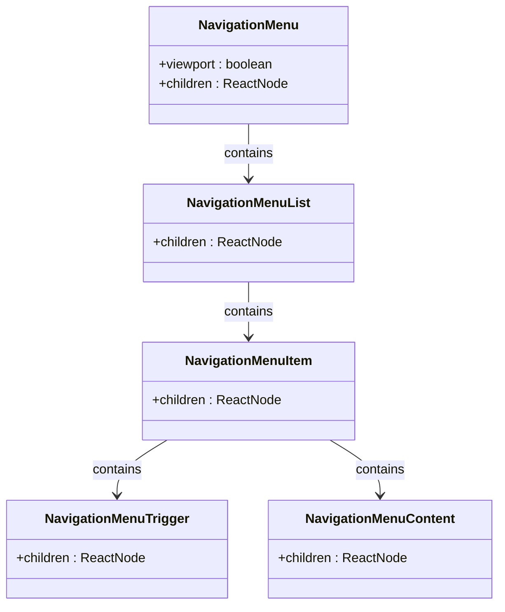
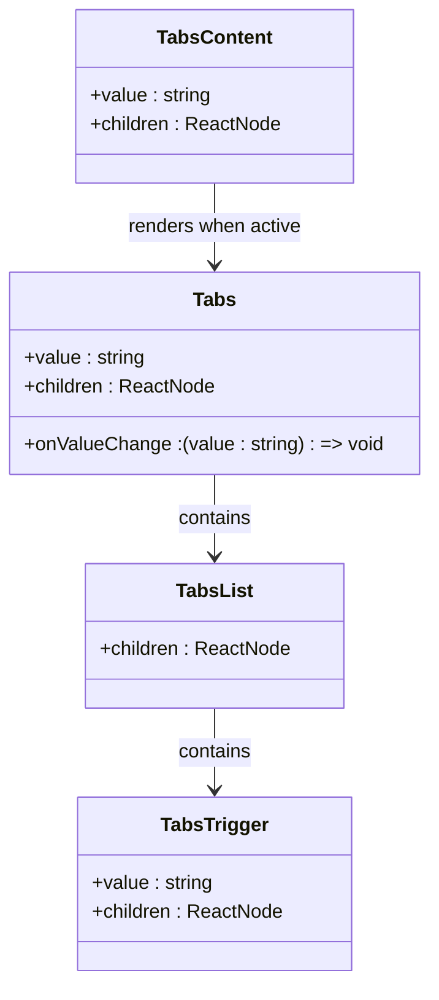
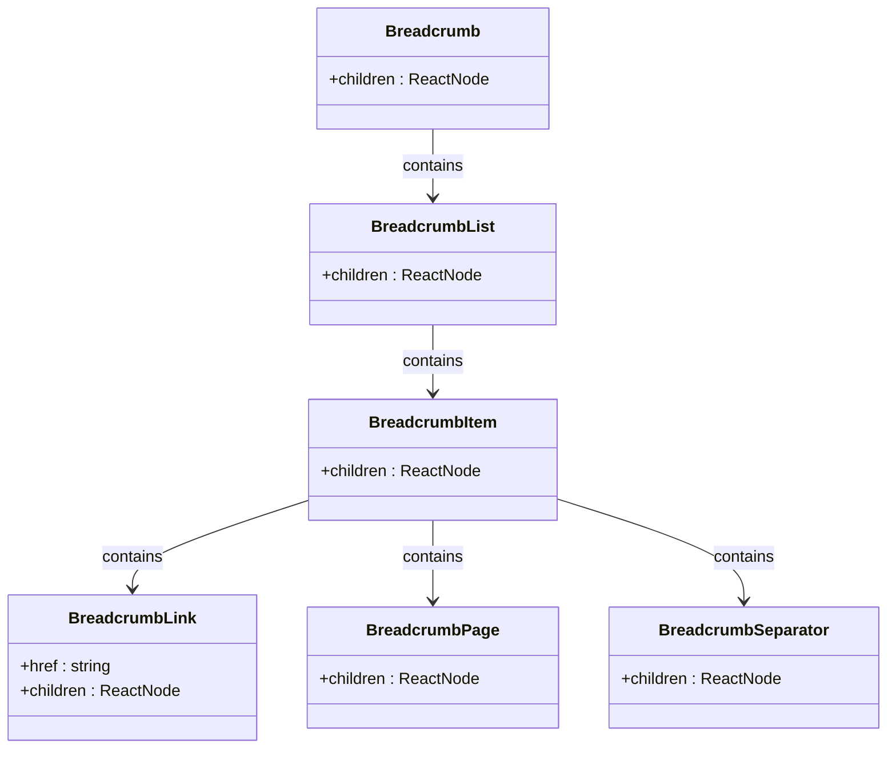
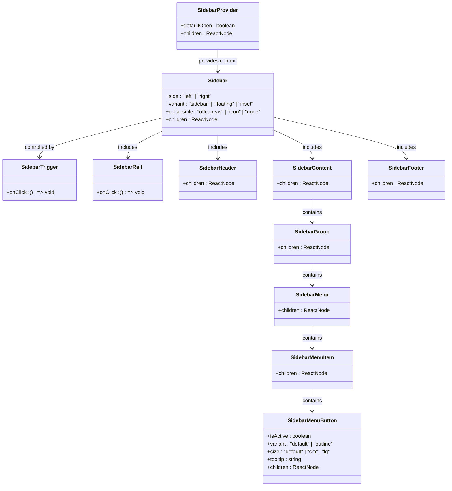
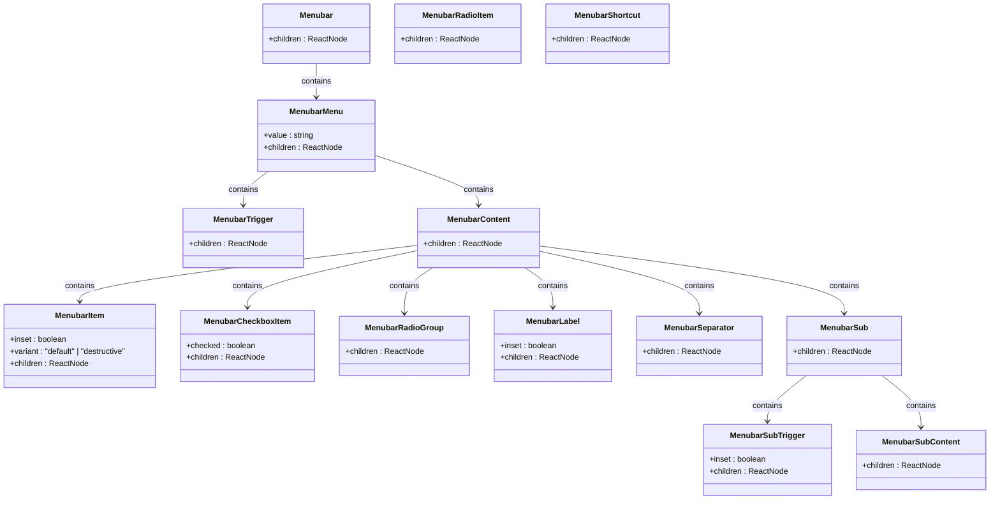
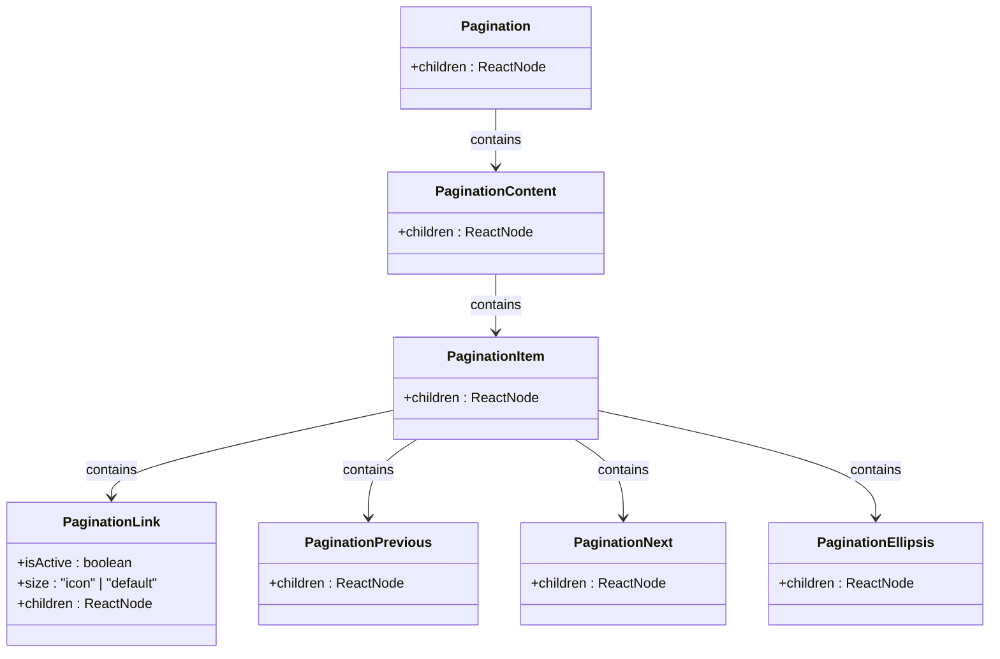
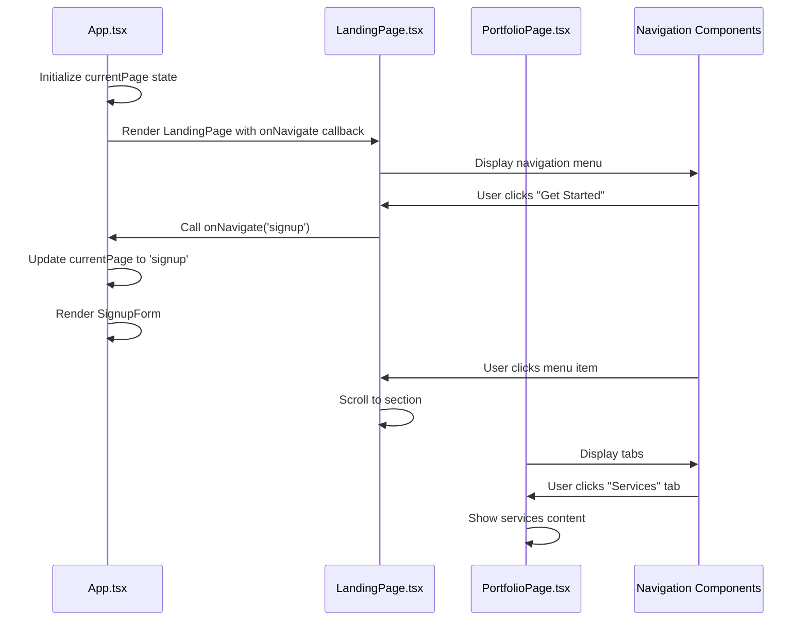

# Navigation Components

<cite>
**Referenced Files in This Document**   
- [App.tsx](file://src/App.tsx)
- [LandingPage.tsx](file://src/components/LandingPage.tsx)
- [PortfolioPage.tsx](file://src/components/PortfolioPage.tsx)
- [breadcrumb.tsx](file://src/components/ui/breadcrumb.tsx)
- [sidebar.tsx](file://src/components/ui/sidebar.tsx)
- [tabs.tsx](file://src/components/ui/tabs.tsx)
- [pagination.tsx](file://src/components/ui/pagination.tsx)
- [menubar.tsx](file://src/components/ui/menubar.tsx)
- [navigation-menu.tsx](file://src/components/ui/navigation-menu.tsx)
- [use-mobile.ts](file://src/components/ui/use-mobile.ts)
</cite>

## Table of Contents
1. [Introduction](#introduction)
2. [Navigation Menu](#navigation-menu)
3. [Tabs](#tabs)
4. [Breadcrumb](#breadcrumb)
5. [Sidebar](#sidebar)
6. [Menubar](#menubar)
7. [Pagination](#pagination)
8. [Integration with Application Flow](#integration-with-application-flow)
9. [Accessibility and Keyboard Navigation](#accessibility-and-keyboard-navigation)
10. [Responsive Design](#responsive-design)
11. [Styling with Tailwind](#styling-with-tailwind)
12. [Troubleshooting](#troubleshooting)

## Introduction
This document provides comprehensive documentation for the navigation components used in the SnapEvent application. The navigation system plays a crucial role in structuring the application flow and enhancing user orientation across different pages and sections. The components covered include navigation menu, tabs, breadcrumb, sidebar, menubar, and pagination, each serving specific purposes in the user interface.

The navigation components are implemented using Radix UI primitives with custom styling via Tailwind CSS. They are integrated throughout the application, particularly in App.tsx and LandingPage.tsx for main navigation, and in PortfolioPage.tsx for section switching. The components support keyboard navigation, proper active state management, and responsive design patterns including collapsible sidebar on mobile devices.

**Section sources**
- [App.tsx](file://src/App.tsx#L1-L55)
- [LandingPage.tsx](file://src/components/LandingPage.tsx#L1-L844)
- [PortfolioPage.tsx](file://src/components/PortfolioPage.tsx#L1-L889)

## Navigation Menu
The navigation menu component provides primary navigation for the application, allowing users to move between major sections. It is implemented using the NavigationMenu component from Radix UI with custom styling.

The navigation menu appears in the header of the LandingPage component and includes links to key sections such as "Find Photographers," "How it Works," and "Pricing." The menu supports both desktop and mobile views, with a collapsible hamburger menu on smaller screens. On mobile devices, the menu expands to show navigation options in a vertical layout.

The component uses framer-motion for smooth animations when opening and closing the mobile menu. It also implements scroll-based navigation, where clicking on menu items scrolls to the corresponding section on the page rather than navigating to a different URL.

**Diagram sources**
- [navigation-menu.tsx](file://src/components/ui/navigation-menu.tsx#L1-L169)

**Section sources**
- [LandingPage.tsx](file://src/components/LandingPage.tsx#L1-L844)
- [navigation-menu.tsx](file://src/components/ui/navigation-menu.tsx#L1-L169)

## Tabs
The tabs component is used for section switching within a page, most notably in the PortfolioPage component. It allows users to navigate between different content sections such as Portfolio, About, Services, and Reviews without leaving the page.

The tabs are implemented using the Tabs component from Radix UI, which provides accessible tabbed interfaces. The component manages active state internally, ensuring that only one tab panel is visible at a time. When a user clicks on a tab, the corresponding content panel is displayed while others are hidden.

In the PortfolioPage, tabs are used to organize photographer information into logical sections. The component supports dynamic tab generation based on the photographer's services and portfolio categories. It also includes smooth transitions between tabs using framer-motion animations.

**Diagram sources**
- [tabs.tsx](file://src/components/ui/tabs.tsx#L1-L67)

**Section sources**
- [PortfolioPage.tsx](file://src/components/PortfolioPage.tsx#L1-L889)
- [tabs.tsx](file://src/components/ui/tabs.tsx#L1-L67)

## Breadcrumb
The breadcrumb component provides a hierarchical navigation trail, showing users their current location within the application's information architecture. Although not prominently displayed in the current implementation, the breadcrumb component is available for use in the application.

The breadcrumb is implemented as a set of connected components that work together to create an accessible navigation trail. It uses semantic HTML elements like nav, ol, and li to ensure proper accessibility. Each breadcrumb item can be a link to a previous level in the hierarchy, allowing users to navigate back to higher-level pages.

The component supports both regular breadcrumb items and "current page" indicators, with the current page having a distinct visual style and aria-current="page" attribute for screen readers. It also includes support for breadcrumb separators and ellipsis for long breadcrumb trails.

**Diagram sources**
- [breadcrumb.tsx](file://src/components/ui/breadcrumb.tsx#L1-L110)

**Section sources**
- [breadcrumb.tsx](file://src/components/ui/breadcrumb.tsx#L1-L110)

## Sidebar
The sidebar component provides a collapsible navigation panel that can be toggled open or closed. It is implemented as a comprehensive system with multiple subcomponents that work together to create a responsive sidebar experience.

The sidebar supports multiple configurations including offcanvas (slides in from side), icon-only (shows only icons), and none (always expanded). It includes features like keyboard shortcuts (Ctrl+B to toggle), touch-friendly rail for resizing, and responsive behavior that automatically collapses on mobile devices.

The component uses a context-based architecture with SidebarProvider to manage the global sidebar state. It supports nested menu items with submenus, badges for notifications, and skeleton loaders for content that is loading. The sidebar also includes accessibility features like proper focus management and ARIA attributes.

**Diagram sources**
- [sidebar.tsx](file://src/components/ui/sidebar.tsx#L1-L727)

**Section sources**
- [sidebar.tsx](file://src/components/ui/sidebar.tsx#L1-L727)

## Menubar
The menubar component provides a horizontal menu bar interface, typically used for application-level navigation or command access. It is implemented using Radix UI's Menubar components with custom styling.

The menubar supports nested submenus, keyboard navigation, and various item types including regular items, checkboxes, radio groups, and labels. It includes visual indicators for menu state and supports keyboard shortcuts displayed alongside menu items.

Each menu item can have different variants including default and destructive (for actions like delete). The component handles focus management automatically, ensuring that keyboard users can navigate through the menu structure efficiently. It also supports grouping of related menu items with separators between groups.

**Diagram sources**
- [menubar.tsx](file://src/components/ui/menubar.tsx#L1-L277)

**Section sources**
- [menubar.tsx](file://src/components/ui/menubar.tsx#L1-L277)

## Pagination
The pagination component is used to navigate between pages of content, typically in list or grid views. It provides a set of navigation controls including previous/next buttons and page number links.

The component supports marking the current page with aria-current="page" for accessibility. It includes Previous and Next buttons with appropriate labels and icons, as well as ellipsis indicators for skipped page ranges. The pagination links are styled as buttons with hover and focus states.

The component is designed to be flexible, allowing for different sizes and configurations. It uses semantic HTML with proper ARIA attributes to ensure accessibility for screen readers and keyboard users. The current page is visually distinguished from other page links.

**Diagram sources**
- [pagination.tsx](file://src/components/ui/pagination.tsx#L1-L128)

**Section sources**
- [pagination.tsx](file://src/components/ui/pagination.tsx#L1-L128)

## Integration with Application Flow
The navigation components are deeply integrated with the application flow, particularly in App.tsx, LandingPage.tsx, and PortfolioPage.tsx. The application uses a state-based navigation system rather than traditional URL routing for page transitions.

In App.tsx, the currentPage state manages which main view is displayed (landing, onboarding, portfolio, or signup). The navigateTo function updates this state and can also pass parameters like photographerId to the target page. This approach creates smooth transitions between pages using framer-motion animations.

The LandingPage component uses navigation for both internal section scrolling and page-level navigation. Menu items trigger scroll animations to different sections of the page, while buttons like "Get Started" trigger page transitions by calling the onNavigate callback passed from App.tsx.

The PortfolioPage component uses tabs for section switching within the photographer's profile. The tabs allow users to view different aspects of the photographer's offerings without leaving the page. The component also includes navigation buttons for actions like booking, contacting, and editing the profile.

**Diagram sources**
- [App.tsx](file://src/App.tsx#L1-L55)
- [LandingPage.tsx](file://src/components/LandingPage.tsx#L1-L844)
- [PortfolioPage.tsx](file://src/components/PortfolioPage.tsx#L1-L889)

**Section sources**
- [App.tsx](file://src/App.tsx#L1-L55)
- [LandingPage.tsx](file://src/components/LandingPage.tsx#L1-L844)
- [PortfolioPage.tsx](file://src/components/PortfolioPage.tsx#L1-L889)

## Accessibility and Keyboard Navigation
The navigation components implement comprehensive accessibility features to ensure they are usable by all users, including those who rely on keyboard navigation or screen readers.

All navigation components follow WAI-ARIA best practices with appropriate roles, states, and properties. For example, tabs use role="tablist", role="tab", and role="tabpanel" with aria-selected and aria-controls attributes to create an accessible tab interface. The current page in pagination is marked with aria-current="page".

Keyboard navigation is fully supported across all components. Users can navigate through menu items, tabs, and pagination controls using arrow keys, Enter, and Space. The sidebar can be toggled with Ctrl+B, and focus is properly managed when components open and close.

Focus indicators are visible and meet contrast requirements. All interactive elements have appropriate labels for screen readers, and icon-only buttons include visually hidden text using the "sr-only" class. The components also support reduced motion preferences through the use of prefers-reduced-motion media queries.

**Section sources**
- [breadcrumb.tsx](file://src/components/ui/breadcrumb.tsx#L1-L110)
- [sidebar.tsx](file://src/components/ui/sidebar.tsx#L1-L727)
- [tabs.tsx](file://src/components/ui/tabs.tsx#L1-L67)
- [pagination.tsx](file://src/components/ui/pagination.tsx#L1-L128)
- [menubar.tsx](file://src/components/ui/menubar.tsx#L1-L277)
- [navigation-menu.tsx](file://src/components/ui/navigation-menu.tsx#L1-L169)

## Responsive Design
The navigation components implement responsive design patterns to provide an optimal user experience across different device sizes.

The useIsMobile hook determines the current device size based on a 768px breakpoint. This hook is used by components like Sidebar to automatically adjust their behavior on mobile devices. The sidebar collapses into an offcanvas menu on mobile, while the navigation menu switches to a hamburger menu.

Media queries are used to adjust layout and styling at different breakpoints. For example, the navigation menu shows a horizontal layout on desktop but switches to a vertical layout in the mobile drawer. Similarly, pagination buttons show text labels on larger screens but only icons on smaller screens.

The components use CSS variables for responsive sizing, allowing for consistent dimensions across the application. The sidebar width is defined as CSS variables (--sidebar-width, --sidebar-width-icon) that can be customized based on the device and configuration.

**Section sources**
- [use-mobile.ts](file://src/components/ui/use-mobile.ts#L1-L22)
- [sidebar.tsx](file://src/components/ui/sidebar.tsx#L1-L727)
- [navigation-menu.tsx](file://src/components/ui/navigation-menu.tsx#L1-L169)
- [LandingPage.tsx](file://src/components/LandingPage.tsx#L1-L844)

## Styling with Tailwind
The navigation components are styled using Tailwind CSS, leveraging utility classes for consistent and responsive design.

The components use a combination of base styles and variants to create a cohesive design system. For example, the SidebarMenuButton uses the sidebarMenuButtonVariants function from class-variance-authority to define different visual styles based on props like variant and size.

Custom CSS variables are used for theming and responsive behavior. The sidebar uses CSS variables for width (--sidebar-width, --sidebar-width-icon) that can be customized based on the device and configuration. These variables are defined in the SidebarProvider and inherited by child components.

The styling approach emphasizes consistency across components while allowing for customization. Shared utility functions like cn() are used to combine class names safely, and reusable style definitions are extracted to prevent duplication.

**Section sources**
- [sidebar.tsx](file://src/components/ui/sidebar.tsx#L1-L727)
- [tabs.tsx](file://src/components/ui/tabs.tsx#L1-L67)
- [breadcrumb.tsx](file://src/components/ui/breadcrumb.tsx#L1-L110)
- [pagination.tsx](file://src/components/ui/pagination.tsx#L1-L128)
- [menubar.tsx](file://src/components/ui/menubar.tsx#L1-L277)
- [navigation-menu.tsx](file://src/components/ui/navigation-menu.tsx#L1-L169)

## Troubleshooting
This section addresses common issues that may arise when implementing and using the navigation components.

**Routing Sync Issues**: When using the state-based navigation in App.tsx, ensure that the onNavigate callback is properly passed through all components. If page transitions are not working, verify that the currentPage state is being updated correctly and that the conditional rendering in App.tsx is functioning as expected.

**Layout Overflow**: On mobile devices, ensure that the viewport meta tag is properly configured to prevent layout issues. If content is overflowing, check that the mobile breakpoint in useIsMobile.ts matches your design requirements and that responsive classes are applied correctly.

**Accessibility Issues**: Verify that all interactive elements have proper ARIA attributes and keyboard support. Test navigation with keyboard only to ensure all components are reachable and usable. Check that focus indicators are visible and that focus is properly managed when components open and close.

**Performance Issues**: If the sidebar or other navigation components are causing performance issues, ensure that content is only rendered when needed. Use React.memo for components that don't need to re-render frequently, and consider lazy loading content in tabs or offscreen panels.

**Responsive Behavior**: If components are not responding correctly to screen size changes, verify that the useIsMobile hook is working properly. Check that the MOBILE_BREAKPOINT constant matches your design requirements and that the media query is correctly implemented.

**Section sources**
- [App.tsx](file://src/App.tsx#L1-L55)
- [use-mobile.ts](file://src/components/ui/use-mobile.ts#L1-L22)
- [sidebar.tsx](file://src/components/ui/sidebar.tsx#L1-L727)
- [LandingPage.tsx](file://src/components/LandingPage.tsx#L1-L844)