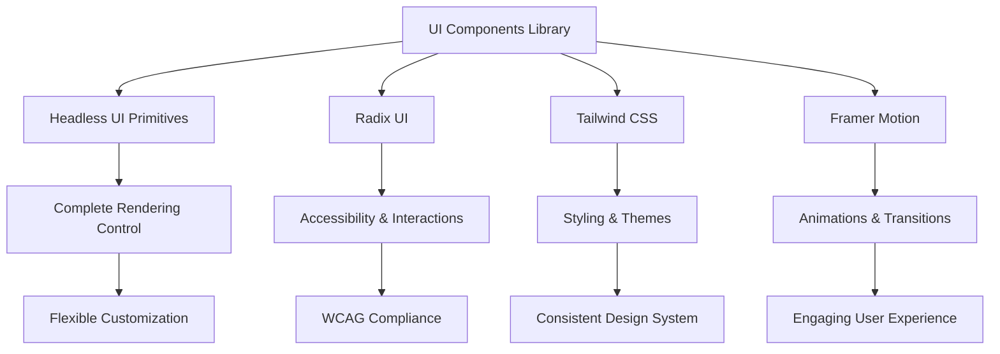
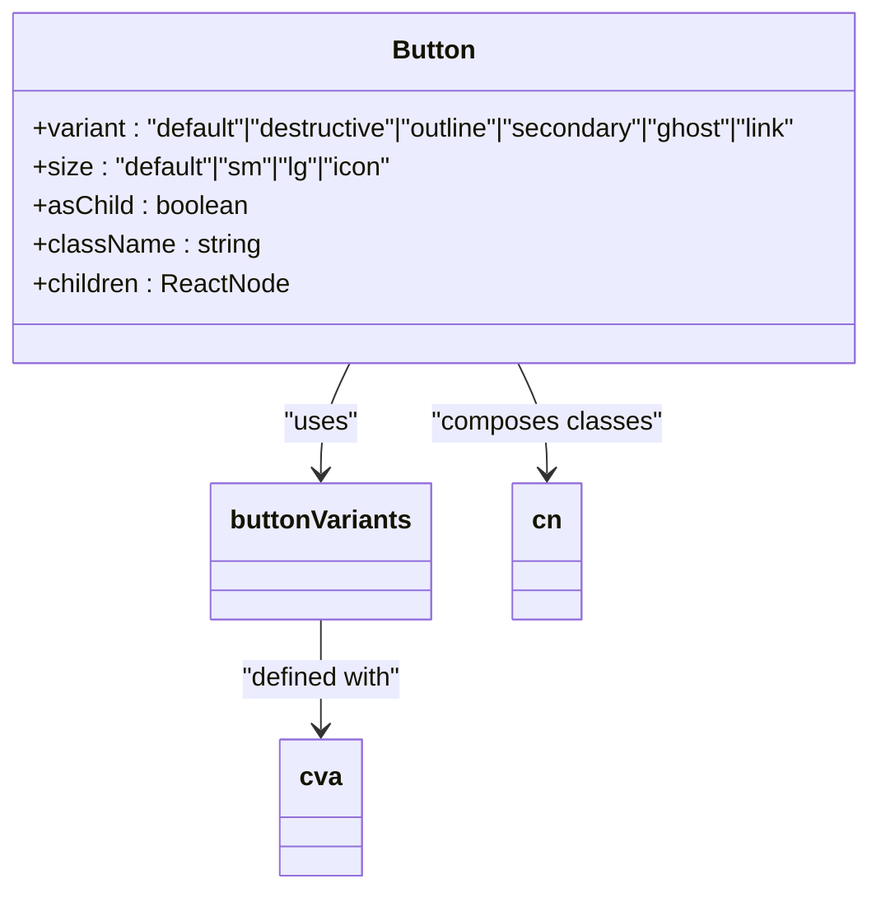
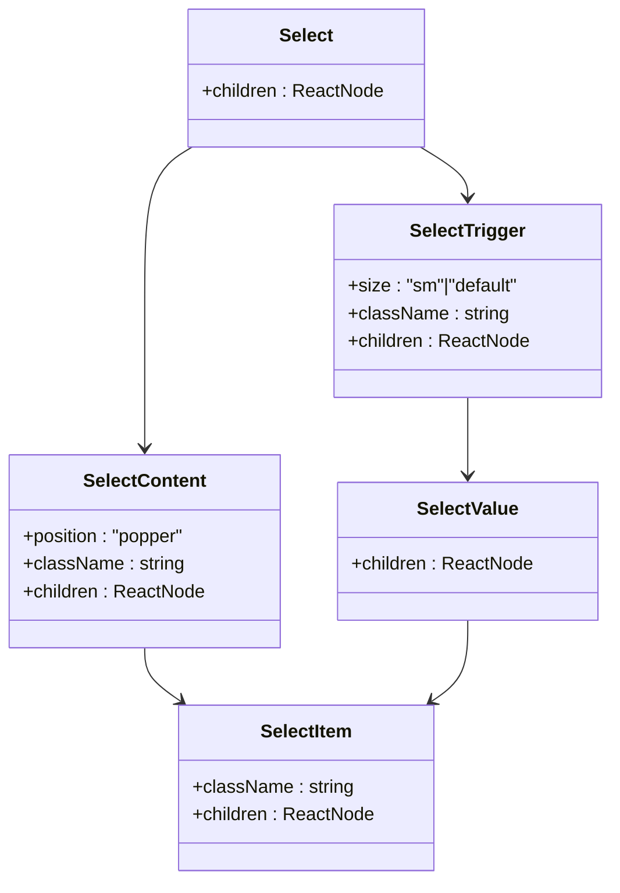
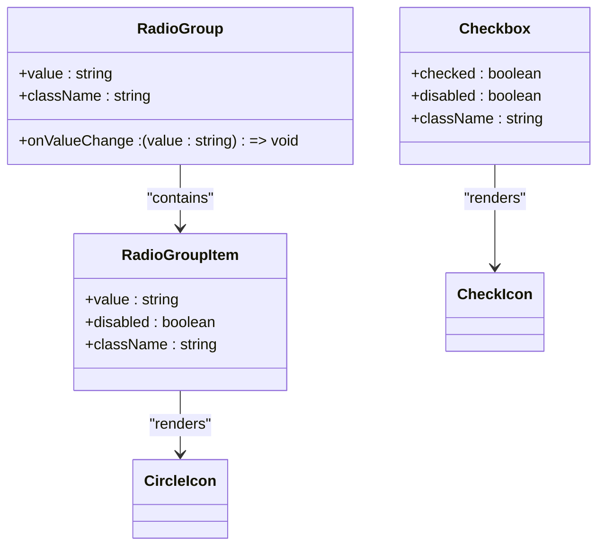
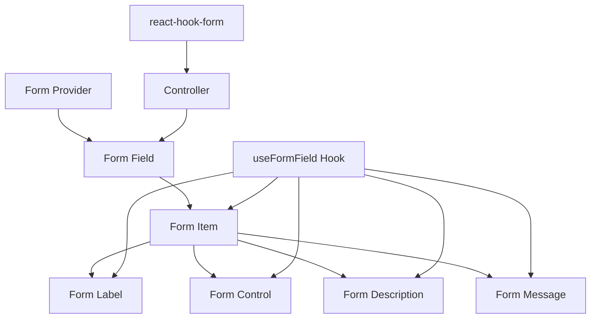
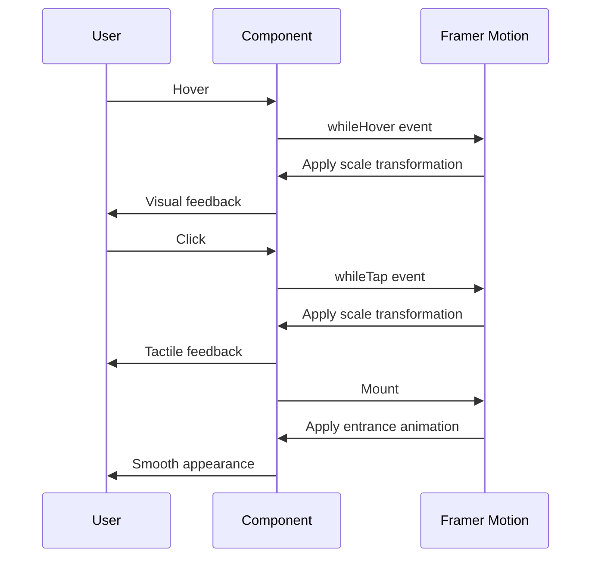
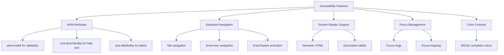
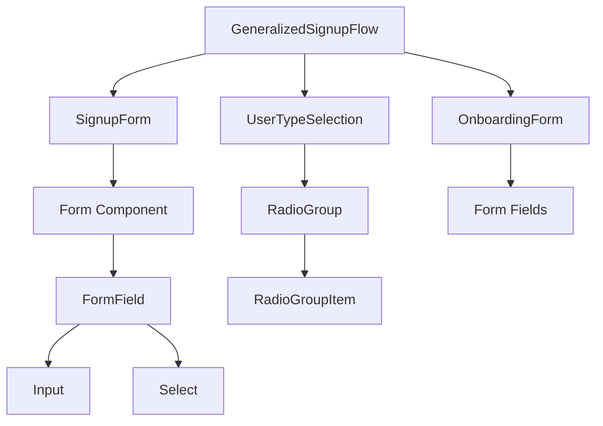
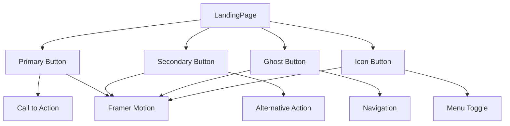

# UI Components Library

<cite>
**Referenced Files in This Document**   
- [button.tsx](file://src/components/ui/button.tsx)
- [form.tsx](file://src/components/ui/form.tsx)
- [input.tsx](file://src/components/ui/input.tsx)
- [select.tsx](file://src/components/ui/select.tsx)
- [checkbox.tsx](file://src/components/ui/checkbox.tsx)
- [radio-group.tsx](file://src/components/ui/radio-group.tsx)
- [dialog.tsx](file://src/components/ui/dialog.tsx)
- [alert.tsx](file://src/components/ui/alert.tsx)
- [card.tsx](file://src/components/ui/card.tsx)
- [badge.tsx](file://src/components/ui/badge.tsx)
- [avatar.tsx](file://src/components/ui/avatar.tsx)
- [utils.ts](file://src/components/ui/utils.ts)
- [LandingPage.tsx](file://src/components/LandingPage.tsx)
- [GeneralizedSignupFlow.tsx](file://src/components/GeneralizedSignupFlow.tsx)
</cite>

## Table of Contents
1. [Introduction](#introduction)
2. [Design Principles](#design-principles)
3. [Core Components](#core-components)
4. [Form System](#form-system)
5. [Styling and Theme Extension](#styling-and-theme-extension)
6. [Animation Integration](#animation-integration)
7. [Accessibility Features](#accessibility-features)
8. [Practical Usage Examples](#practical-usage-examples)
9. [Common Implementation Issues](#common-implementation-issues)
10. [Conclusion](#conclusion)

## Introduction
The UI Components Library is a comprehensive collection of reusable components built using Headless UI and Radix UI primitives. This library provides a consistent, accessible, and customizable interface system for the SnapEvent application. The components are designed to work seamlessly with Tailwind CSS for styling and Framer Motion for animations, creating a cohesive user experience across the platform.

The library follows modern React patterns with a focus on accessibility, performance, and developer experience. By leveraging headless UI primitives, the components provide complete control over rendering while maintaining proper accessibility semantics and interaction patterns.

**Section sources**
- [button.tsx](file://src/components/ui/button.tsx)
- [form.tsx](file://src/components/ui/form.tsx)

## Design Principles
The UI components library follows several key design principles that ensure consistency, accessibility, and maintainability across the application:

1. **Headless Architecture**: Components are built using Radix UI primitives, providing complete control over rendering while maintaining proper accessibility and interaction patterns.

2. **Composition over Inheritance**: Components are designed to be composed together rather than extended through inheritance, promoting flexibility and reusability.

3. **Accessibility First**: All interactive components include proper ARIA attributes, keyboard navigation, and screen reader support.

4. **Theme Consistency**: Components use a consistent design system with predefined variants and sizes that align with the application's design tokens.

5. **Performance Optimization**: Components are optimized for performance with minimal re-renders and efficient event handling.



**Diagram sources**
- [button.tsx](file://src/components/ui/button.tsx)
- [form.tsx](file://src/components/ui/form.tsx)
- [utils.ts](file://src/components/ui/utils.ts)

**Section sources**
- [button.tsx](file://src/components/ui/button.tsx)
- [form.tsx](file://src/components/ui/form.tsx)
- [utils.ts](file://src/components/ui/utils.ts)

## Core Components

### Button Component
The Button component is a versatile interactive element with multiple variants and sizes. It supports different visual styles including default, destructive, outline, secondary, ghost, and link variants. The component also provides size options: default, small, large, and icon-only.

Key features:
- Uses `cva` (Class Variance Authority) for variant management
- Supports `asChild` prop to render as different elements
- Includes focus and hover states with appropriate visual feedback
- Implements proper disabled states with reduced opacity
- Provides accessibility attributes for form validation states



**Diagram sources**
- [button.tsx](file://src/components/ui/button.tsx)

**Section sources**
- [button.tsx](file://src/components/ui/button.tsx)
- [LandingPage.tsx](file://src/components/LandingPage.tsx)

### Input Component
The Input component provides a styled text input with consistent styling and accessibility features. It supports all standard HTML input attributes and includes visual feedback for different states.

Key features:
- Consistent styling with application design system
- Focus states with ring indicators
- Validation states with visual feedback
- Support for file inputs with custom styling
- Proper handling of placeholder text
- Selection styling that matches the theme

**Section sources**
- [input.tsx](file://src/components/ui/input.tsx)

### Select Component
The Select component implements a custom dropdown menu using Radix UI primitives. It provides a fully accessible dropdown with keyboard navigation and screen reader support.

Key features:
- Composed of multiple sub-components (Trigger, Content, Item, Value)
- Properly handles keyboard navigation (arrow keys, enter, escape)
- Visual indicators for selected items
- Support for scroll buttons in long lists
- Positioning options (popper vs. item-based)
- Size variants (default and small)



**Diagram sources**
- [select.tsx](file://src/components/ui/select.tsx)

**Section sources**
- [select.tsx](file://src/components/ui/select.tsx)
- [LandingPage.tsx](file://src/components/LandingPage.tsx)

### Checkbox and Radio Group Components
These form control components provide accessible selection interfaces with proper visual feedback.

Key features:
- Proper ARIA attributes for screen readers
- Visual indicators for checked/selected states
- Focus and hover states with appropriate feedback
- Disabled state handling
- Consistent styling with theme colors



**Diagram sources**
- [checkbox.tsx](file://src/components/ui/checkbox.tsx)
- [radio-group.tsx](file://src/components/ui/radio-group.tsx)

**Section sources**
- [checkbox.tsx](file://src/components/ui/checkbox.tsx)
- [radio-group.tsx](file://src/components/ui/radio-group.tsx)
- [GeneralizedSignupFlow.tsx](file://src/components/GeneralizedSignupFlow.tsx)

## Form System

### Form Component Architecture
The form system is built on react-hook-form with Radix UI primitives for accessible form controls. This combination provides a robust foundation for form handling with minimal boilerplate.



**Diagram sources**
- [form.tsx](file://src/components/ui/form.tsx)

**Section sources**
- [form.tsx](file://src/components/ui/form.tsx)
- [GeneralizedSignupFlow.tsx](file://src/components/GeneralizedSignupFlow.tsx)

### Form Components
The form system consists of several composable components that work together to create accessible forms:

- **Form**: The provider component that wraps the entire form
- **FormField**: Connects form fields to react-hook-form
- **FormItem**: Groups related form elements
- **FormLabel**: Accessible label for form controls
- **FormControl**: The actual input element
- **FormDescription**: Helper text for form fields
- **FormMessage**: Displays validation messages

Key features:
- Automatic ID generation and linking between labels and controls
- Context-based error handling
- ARIA attributes for accessibility
- Validation state visualization
- Flexible composition for complex form layouts

## Styling and Theme Extension

### Utility Functions
The library uses utility functions for consistent class composition:

```mermaid
classDiagram
class cn {
+inputs : ClassValue[]
+returns : string
}
cn --> clsx : "uses"
cn --> tailwind-merge : "uses"
clsx --> "Class Variance Authority" : "integrates"
tailwind-merge --> "Tailwind CSS" : "extends"
```

**Diagram sources**
- [utils.ts](file://src/components/ui/utils.ts)

**Section sources**
- [utils.ts](file://src/components/ui/utils.ts)
- [button.tsx](file://src/components/ui/button.tsx)

### Theme Extension
Components support theme extension through utility classes and variant system:

1. **Class Composition**: The `cn` function merges Tailwind classes with component defaults
2. **Variant System**: `cva` defines component variants with theme-aware defaults
3. **Size Scaling**: Consistent sizing across components using Tailwind's spacing scale
4. **Color Palette**: Components use semantic color names (primary, destructive, secondary) that map to the design system

Best practices for extending themes:
- Use the `className` prop to add custom styles
- Leverage Tailwind's arbitrary value syntax for one-off adjustments
- Create custom variants using `cva` for frequently used combinations
- Use data attributes for conditional styling

## Animation Integration

### Framer Motion Implementation
The library integrates Framer Motion for smooth transitions and micro-interactions:



**Diagram sources**
- [LandingPage.tsx](file://src/components/LandingPage.tsx)

**Section sources**
- [LandingPage.tsx](file://src/components/LandingPage.tsx)
- [GeneralizedSignupFlow.tsx](file://src/components/GeneralizedSignupFlow.tsx)

### Animation Patterns
Common animation patterns used in the application:

- **Fade and Slide**: Elements fade in while sliding into position
- **Staggered Appearance**: Lists of items appear sequentially
- **Hover Effects**: Subtle scale transformations on interactive elements
- **Page Transitions**: Smooth transitions between views
- **Loading States**: Skeleton screens with shimmer effects

## Accessibility Features

### ARIA Implementation
The components library implements comprehensive accessibility features:



**Diagram sources**
- [button.tsx](file://src/components/ui/button.tsx)
- [form.tsx](file://src/components/ui/form.tsx)
- [dialog.tsx](file://src/components/ui/dialog.tsx)

**Section sources**
- [button.tsx](file://src/components/ui/button.tsx)
- [form.tsx](file://src/components/ui/form.tsx)
- [dialog.tsx](file://src/components/ui/dialog.tsx)

### Key Accessibility Features
- **Focus Indicators**: Visible focus rings on interactive elements
- **Validation States**: Visual and programmatic indication of form errors
- **Semantic Structure**: Proper heading hierarchy and landmark regions
- **Keyboard Navigation**: Full keyboard operability for all interactive elements
- **Screen Reader Labels**: Descriptive labels and instructions
- **Color Contrast**: Sufficient contrast ratios for text and interactive elements

## Practical Usage Examples

### Form Integration in GeneralizedSignupFlow
The GeneralizedSignupFlow component demonstrates the form system in action:



**Diagram sources**
- [GeneralizedSignupFlow.tsx](file://src/components/GeneralizedSignupFlow.tsx)
- [form.tsx](file://src/components/ui/form.tsx)

**Section sources**
- [GeneralizedSignupFlow.tsx](file://src/components/GeneralizedSignupFlow.tsx)
- [form.tsx](file://src/components/ui/form.tsx)

### Button Usage in LandingPage
The LandingPage component showcases various button patterns:



**Diagram sources**
- [LandingPage.tsx](file://src/components/LandingPage.tsx)
- [button.tsx](file://src/components/ui/button.tsx)

**Section sources**
- [LandingPage.tsx](file://src/components/LandingPage.tsx)
- [button.tsx](file://src/components/ui/button.tsx)

## Common Implementation Issues

### Form Validation States
Common issues and solutions for form validation:

1. **Delayed Error Display**: Ensure validation messages appear immediately on blur or submit
2. **Visual Consistency**: Maintain consistent styling for error states across components
3. **Accessibility**: Ensure screen readers announce validation errors
4. **Real-time Feedback**: Provide immediate feedback for valid/invalid input

### Responsive Layout Adjustments
Strategies for responsive design:

1. **Mobile-first Approach**: Design for mobile and enhance for larger screens
2. **Flexible Grids**: Use CSS Grid and Flexbox for adaptable layouts
3. **Touch Targets**: Ensure adequate size for touch interactions
4. **Content Hierarchy**: Adjust typography and spacing for different screen sizes

## Conclusion
The UI Components Library provides a robust foundation for building consistent, accessible, and visually appealing interfaces. By leveraging headless UI primitives, Tailwind CSS, and Framer Motion, the library offers a flexible and maintainable approach to component development.

The design principles of composition, accessibility, and theming enable developers to create cohesive user experiences while maintaining flexibility for customization. The practical examples in GeneralizedSignupFlow and LandingPage demonstrate how these components work together to create engaging user interfaces.

By following the documented patterns and best practices, developers can effectively use and extend the component library to meet the evolving needs of the application.

**Section sources**
- [button.tsx](file://src/components/ui/button.tsx)
- [form.tsx](file://src/components/ui/form.tsx)
- [LandingPage.tsx](file://src/components/LandingPage.tsx)
- [GeneralizedSignupFlow.tsx](file://src/components/GeneralizedSignupFlow.tsx)