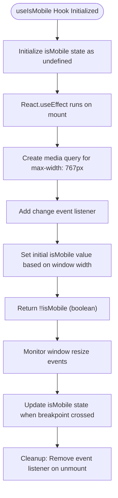
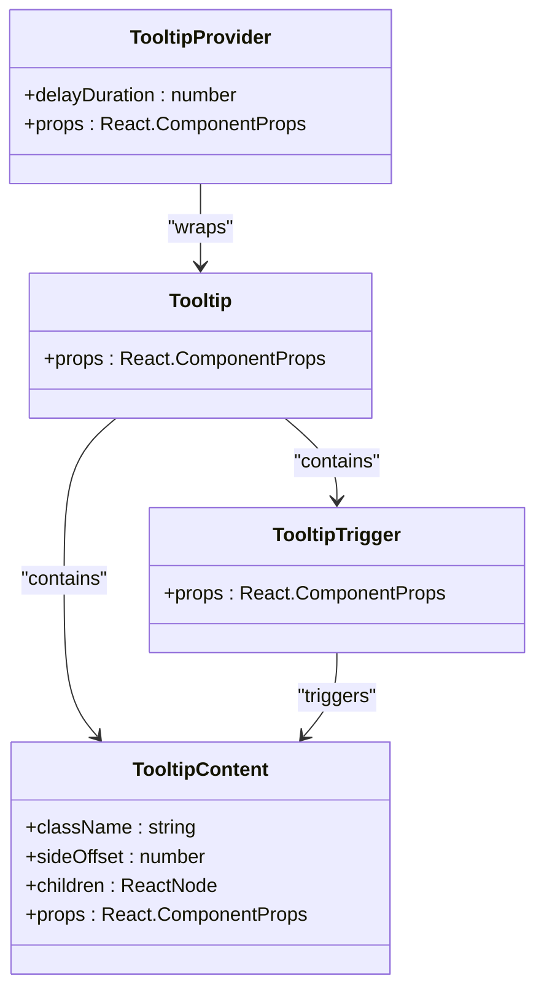
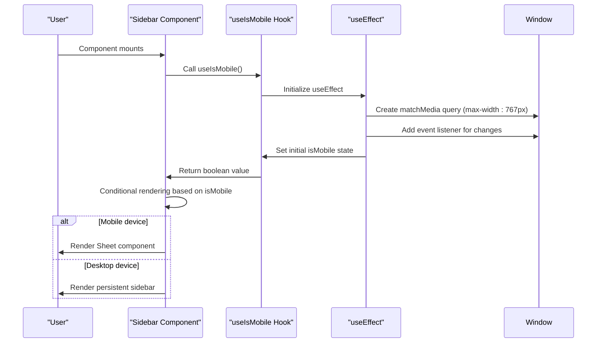

# Utility & Helper Components

<cite>
**Referenced Files in This Document**   
- [utils.ts](file://src/components/ui/utils.ts)
- [use-mobile.ts](file://src/components/ui/use-mobile.ts)
- [separator.tsx](file://src/components/ui/separator.tsx)
- [label.tsx](file://src/components/ui/label.tsx)
- [tooltip.tsx](file://src/components/ui/tooltip.tsx)
- [sidebar.tsx](file://src/components/ui/sidebar.tsx)
- [button.tsx](file://src/components/ui/button.tsx)
- [navigation-menu.tsx](file://src/components/ui/navigation-menu.tsx)
</cite>

## Table of Contents
1. [Introduction](#introduction)
2. [Utility Functions](#utility-functions)
3. [Responsive Hooks](#responsive-hooks)
4. [UI Enhancement Components](#ui-enhancement-components)
5. [Responsive Layout Integration](#responsive-layout-integration)
6. [SSR and Hydration Considerations](#ssr-and-hydration-considerations)
7. [Conclusion](#conclusion)

## Introduction
This document provides comprehensive documentation for utility components and hooks in the SnapEvent landing page application. It covers the core utility functions for className merging, the useMobile hook for responsive behavior detection, and UI enhancement components like separator, label, and tooltip. The documentation also addresses integration patterns in responsive layouts and considerations for server-side rendering compatibility.

## Utility Functions

The utility functions provide essential tools for className manipulation and conditional styling in the application. The primary utility is the `cn` function in `utils.ts`, which combines Tailwind CSS classes with conditional logic.

The `cn` function leverages `clsx` and `tailwind-merge` to handle className merging, ensuring that conflicting Tailwind classes are properly resolved and that conditional classes are applied correctly. This utility is extensively used throughout the component library to manage complex styling requirements.

**Section sources**
- [utils.ts](file://src/components/ui/utils.ts#L1-L7)

## Responsive Hooks

### useIsMobile Hook

The `useIsMobile` hook provides responsive behavior detection by monitoring the viewport width against a predefined breakpoint of 768px. This custom React hook returns a boolean value indicating whether the current device should be considered mobile based on the window width.

The hook uses `window.matchMedia` to create a media query listener that detects changes in viewport size. It initializes with an undefined state and updates when the component mounts, ensuring accurate detection of the current device type. The hook properly handles cleanup by removing event listeners when the component unmounts, preventing memory leaks.

This hook is particularly valuable for implementing responsive design patterns where component behavior or layout needs to change between mobile and desktop views.

**Diagram sources**
- [use-mobile.ts](file://src/components/ui/use-mobile.ts#L1-L22)

**Section sources**
- [use-mobile.ts](file://src/components/ui/use-mobile.ts#L1-L22)

## UI Enhancement Components

### Separator Component

The Separator component provides a visual divider between content sections. It supports both horizontal and vertical orientations and is styled with a subtle border color that matches the application's design system. The component uses the `cn` utility to merge custom className props with default styling.

The separator adapts its dimensions based on orientation: full width with 1px height for horizontal separators, and full height with 1px width for vertical separators. This flexibility allows consistent spacing and visual hierarchy across different layout requirements.

**Section sources**
- [separator.tsx](file://src/components/ui/separator.tsx#L1-L29)

### Label Component

The Label component enhances form accessibility and usability by providing styled text labels for form elements. It includes built-in styling for disabled states and integrates with the application's typography system using small font size with proper line height.

The component uses the `peer-disabled` selector to automatically adjust opacity and cursor style when associated form elements are disabled, creating a cohesive user experience. It also includes proper ARIA attributes and semantic HTML structure for accessibility compliance.

**Section sources**
- [label.tsx](file://src/components/ui/label.tsx#L1-L25)

### Tooltip Component

The Tooltip component provides contextual information through hover-activated overlays. It consists of multiple subcomponents: TooltipProvider, Tooltip, TooltipTrigger, and TooltipContent, which work together to create a complete tooltip system.

The tooltip implementation includes several key features:
- Configurable delay duration through the provider
- Automatic positioning with side offset options
- Animated entrance and exit transitions
- Arrow indicator for visual connection to the trigger
- Z-index management for proper stacking order

The tooltip content is rendered in a portal to avoid clipping issues and ensure it appears above other elements. The styling includes subtle animations for improved user experience and follows the application's color scheme with primary background and foreground colors.

**Diagram sources**
- [tooltip.tsx](file://src/components/ui/tooltip.tsx#L1-L62)

**Section sources**
- [tooltip.tsx](file://src/components/ui/tooltip.tsx#L1-L62)

## Responsive Layout Integration

### Sidebar Component Integration

The useMobile hook is critically integrated into the Sidebar component to provide different behaviors on mobile and desktop devices. On mobile devices, the sidebar transforms into a sheet component that slides in from the side, while on desktop it remains as a persistent sidebar.

The integration pattern follows these key principles:
- Mobile detection determines the rendering strategy
- State management differs between mobile and desktop
- Animation and transition effects are optimized for each device type
- Touch targets are enlarged for mobile usability

The sidebar uses the mobile detection to conditionally render either a Sheet component for mobile views or a positioned div for desktop views, ensuring optimal user experience across device types.

**Diagram sources**
- [sidebar.tsx](file://src/components/ui/sidebar.tsx#L1-L727)
- [use-mobile.ts](file://src/components/ui/use-mobile.ts#L1-L22)

### Navigation Menu Integration

The navigation components leverage both the className utility and responsive hooks to create adaptive interfaces. The NavigationMenu component uses the `cn` function to conditionally apply classes based on component state, while integrating with the mobile detection system to modify behavior when needed.

Key integration patterns include:
- Using `cn` to merge dynamic class names with component variants
- Applying different styles based on hover, focus, and active states
- Modifying layout and interaction patterns based on device type
- Ensuring accessibility through proper ARIA attributes and keyboard navigation

The navigation system demonstrates how utility functions and responsive hooks work together to create a seamless user experience across different devices and input methods.

**Section sources**
- [navigation-menu.tsx](file://src/components/ui/navigation-menu.tsx#L1-L169)
- [button.tsx](file://src/components/ui/button.tsx#L1-L59)
- [sidebar.tsx](file://src/components/ui/sidebar.tsx#L1-L727)

## SSR and Hydration Considerations

### Hydration Mismatch Issues

The useMobile hook presents potential hydration mismatches when used in server-side rendering environments. Since the server has no access to client viewport dimensions, the initial render may differ from the client's first render, causing React to issue hydration warnings.

The current implementation mitigates this by initializing the `isMobile` state as `undefined` rather than a boolean value. This creates a consistent server-client rendering pattern where the component renders without mobile-specific styling on the server, then updates to the correct state after hydration on the client.

### SSR Compatibility Strategies

To ensure server-side rendering compatibility, the following strategies are employed:

1. **Delayed State Resolution**: The mobile detection logic runs only in the useEffect hook, which does not execute on the server, preventing reference errors to window objects.

2. **Graceful Degradation**: Components using the hook are designed to function correctly even when the mobile state is initially undefined, avoiding layout shifts or functionality issues.

3. **Consistent Initial State**: By starting with an undefined state, the server and client renders match initially, with the client then updating to the correct mobile state after hydration.

4. **Event Listener Cleanup**: Proper cleanup of event listeners prevents memory leaks and ensures clean component unmounting, which is particularly important in SSR environments with multiple requests.

These strategies ensure that the responsive components work reliably in server-rendered applications while maintaining optimal performance and user experience.

**Section sources**
- [use-mobile.ts](file://src/components/ui/use-mobile.ts#L1-L22)
- [sidebar.tsx](file://src/components/ui/sidebar.tsx#L1-L727)

## Conclusion

The utility components and hooks in the SnapEvent application provide a robust foundation for building responsive, accessible user interfaces. The `cn` utility function simplifies className management and conditional styling, while the `useIsMobile` hook enables adaptive behavior based on device characteristics.

The UI enhancement components—separator, label, and tooltip—contribute to a cohesive design system with consistent styling and behavior. Their integration into layout components like sidebar and navigation demonstrates effective patterns for responsive design.

The implementation carefully considers server-side rendering requirements, employing strategies to prevent hydration mismatches and ensure compatibility across different rendering environments. Together, these utilities and components form an essential part of the application's frontend architecture, enabling developers to create high-quality user experiences across devices.