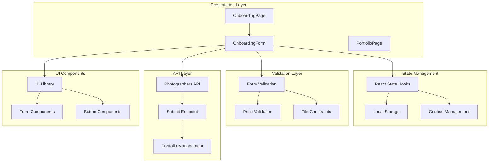
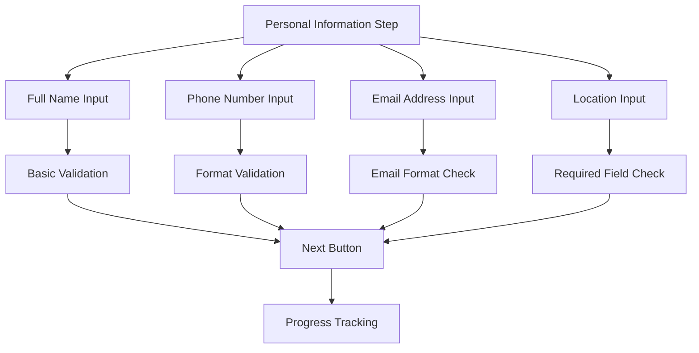
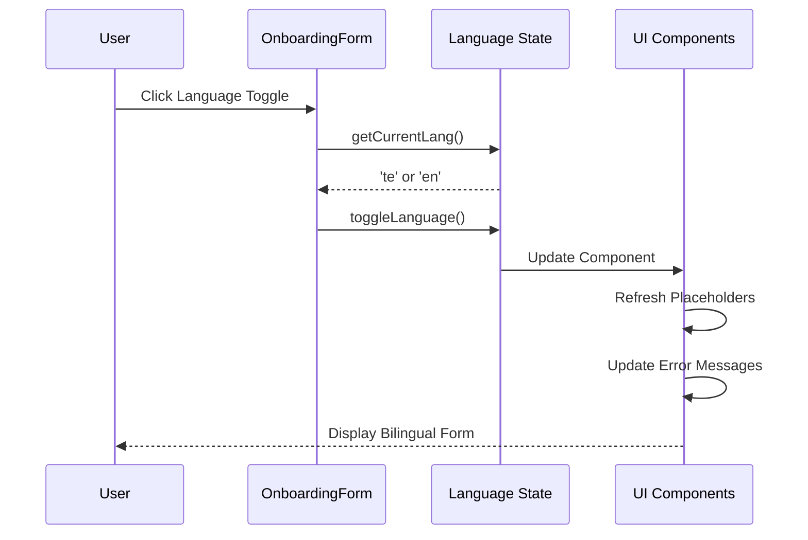
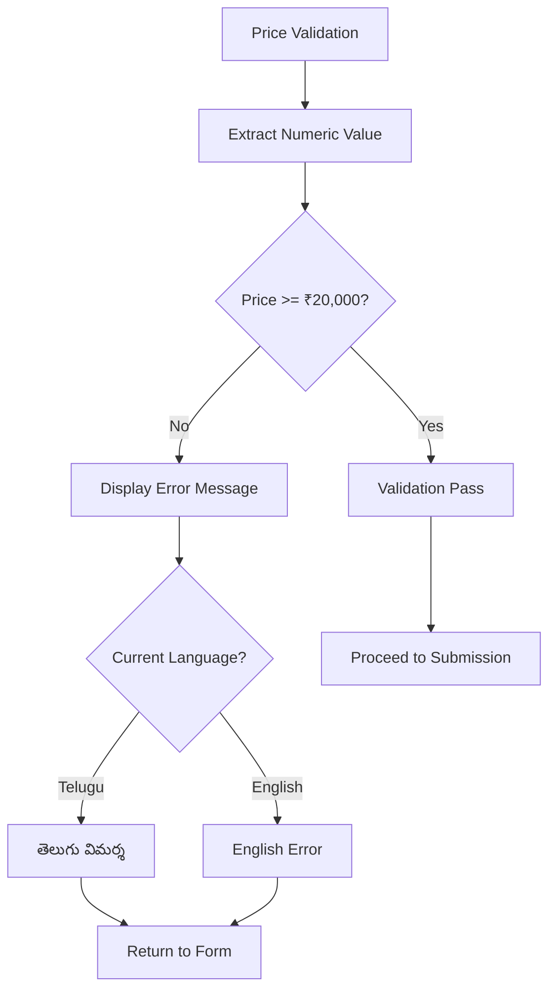
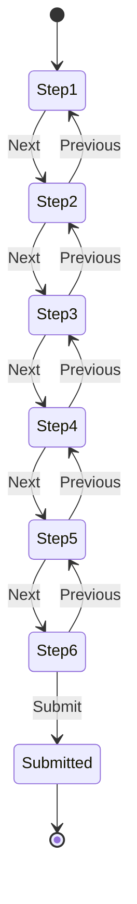
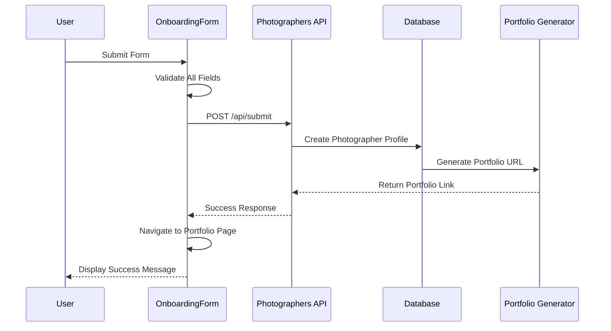
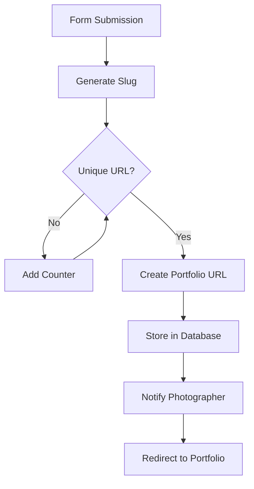

# Photographer Onboarding Process

<cite>
**Referenced Files in This Document**
- [pages/onboarding.tsx](file://pages/onboarding.tsx)
- [src/components/OnboardingForm.tsx](file://src/components/OnboardingForm.tsx)
- [src/lib/api.ts](file://src/lib/api.ts)
- [src/utils/portfolio.ts](file://src/utils/portfolio.ts)
- [src/components/PortfolioPage.tsx](file://src/components/PortfolioPage.tsx)
- [src/components/ui/form.tsx](file://src/components/ui/form.tsx)
- [src/components/ui/button.tsx](file://src/components/ui/button.tsx)
- [INSTANT_REGISTRATION_UPDATE.md](file://INSTANT_REGISTRATION_UPDATE.md)
- [ONBOARDING_UPDATES.md](file://ONBOARDING_UPDATES.md)
- [PROFILE_PICTURE_FEATURE.md](file://PROFILE_PICTURE_FEATURE.md)
</cite>

## Table of Contents
1. [Introduction](#introduction)
2. [Onboarding Architecture](#onboarding-architecture)
3. [Multi-Step Form Structure](#multi-step-form-structure)
4. [Bilingual Form Support](#bilingual-form-support)
5. [Form Validation and Constraints](#form-validation-and-constraints)
6. [State Management and Navigation](#state-management-and-navigation)
7. [Data Submission and API Integration](#data-submission-and-api-integration)
8. [Responsive Design and Theme Management](#responsive-design-and-theme-management)
9. [Portfolio Integration](#portfolio-integration)
10. [Error Handling and User Feedback](#error-handling-and-user-feedback)
11. [Security and Quality Control](#security-and-quality-control)
12. [Troubleshooting Guide](#troubleshooting-guide)
13. [Conclusion](#conclusion)

## Introduction

The SnapEvent photographer onboarding process is a sophisticated, multi-step form designed to collect comprehensive professional information from photographers joining the platform. This system enables instant registration with immediate portfolio creation, eliminating traditional approval bottlenecks while maintaining quality standards through automated validation and user feedback mechanisms.

The onboarding process consists of six distinct steps covering personal information, professional background, services and pricing, equipment details, portfolio samples, and final submission. The system supports bilingual operation in English and Telugu languages, implements responsive design principles, and integrates seamlessly with the platform's portfolio management system.

## Onboarding Architecture

The onboarding system follows a modular architecture with clear separation of concerns between presentation, state management, and data persistence layers.

**Diagram sources**
- [pages/onboarding.tsx](file://pages/onboarding.tsx#L1-L25)
- [src/components/OnboardingForm.tsx](file://src/components/OnboardingForm.tsx#L1-L50)
- [src/components/PortfolioPage.tsx](file://src/components/PortfolioPage.tsx#L1-L50)

**Section sources**
- [pages/onboarding.tsx](file://pages/onboarding.tsx#L1-L25)
- [src/components/OnboardingForm.tsx](file://src/components/OnboardingForm.tsx#L1-L100)

## Multi-Step Form Structure

The onboarding form is organized into six sequential steps, each focusing on specific aspects of the photographer's professional profile. The form uses animated transitions between steps and provides clear progress indicators.

### Step 1: Personal Information Collection

The first step gathers essential personal details including full name, phone number, email address, and location information. This foundational data serves as the basis for portfolio URL generation and communication preferences.

**Diagram sources**
- [src/components/OnboardingForm.tsx](file://src/components/OnboardingForm.tsx#L400-L500)

### Step 2: Professional Background Details

This step focuses on collecting professional experience, photography specialties, camera equipment, and current website information. The form uses interactive checkboxes and dropdown menus to facilitate efficient data entry.

### Step 3: Services and Pricing Configuration

Photographers can specify the services they offer, set their starting price range, and define their availability schedule. This information is crucial for matching photographers with appropriate client requests.

### Step 4: Portfolio and Social Media Integration

The fourth step allows photographers to describe their photography style, provide Instagram handles, and upload work samples. This step emphasizes visual representation and social proof.

### Step 5: Final Submission and Pricing Validation

The final step includes sample photo album uploads, starting price validation (minimum ₹20,000), language preference selection, and comprehensive form validation before submission.

**Section sources**
- [src/components/OnboardingForm.tsx](file://src/components/OnboardingForm.tsx#L400-L800)

## Bilingual Form Support

The onboarding system implements comprehensive bilingual support for both English and Telugu languages, enabling photographers from diverse linguistic backgrounds to complete the registration process comfortably.

### Language Toggle Mechanism

The form includes an intelligent language toggle that switches between English and Telugu while preserving all entered data. The system maintains separate placeholder texts and error messages for each language.

**Diagram sources**
- [src/components/OnboardingForm.tsx](file://src/components/OnboardingForm.tsx#L100-L120)

### Placeholder Text Management

The system maintains a comprehensive dictionary of localized placeholder texts for all form fields, ensuring optimal user experience regardless of language preference.

**Section sources**
- [src/components/OnboardingForm.tsx](file://src/components/OnboardingForm.tsx#L150-L200)

## Form Validation and Constraints

The onboarding form implements robust validation mechanisms to ensure data quality and compliance with platform requirements.

### Price Range Validation

A critical validation constraint requires photographers to set a minimum starting price of ₹20,000 per day for both photos and videos. This validation prevents unrealistic pricing and ensures professional standards.

**Diagram sources**
- [src/components/OnboardingForm.tsx](file://src/components/OnboardingForm.tsx#L600-L650)

### File Upload Constraints

The system enforces strict constraints on profile picture uploads including:
- **File Type Validation**: Only image files (JPEG, PNG) are accepted
- **Size Limitation**: Maximum 5MB per file
- **Format Compliance**: Supports standard image formats
- **Quality Standards**: Ensures professional appearance

### Rank Selection System

The form implements a ranked selection system for photo types and services, allowing photographers to prioritize their offerings. This system automatically generates ranked lists based on user selections.

**Section sources**
- [src/components/OnboardingForm.tsx](file://src/components/OnboardingForm.tsx#L600-L700)

## State Management and Navigation

The onboarding process utilizes React's state management capabilities combined with local storage persistence for seamless user experience across sessions.

### Progressive State Tracking

Each step maintains its own state while preserving data from previous steps. The system tracks:
- Current step progression
- Form data persistence
- Theme preferences
- Language settings
- Validation error states

### Navigation Controls

The form provides intuitive navigation controls including:
- **Previous/Next Buttons**: Sequential step navigation
- **Progress Bar**: Visual indication of completion status
- **Skip Functionality**: Ability to revisit previous steps
- **Exit Protection**: Prevents accidental navigation away from incomplete forms

**Diagram sources**
- [src/components/OnboardingForm.tsx](file://src/components/OnboardingForm.tsx#L300-L350)

**Section sources**
- [src/components/OnboardingForm.tsx](file://src/components/OnboardingForm.tsx#L300-L400)

## Data Submission and API Integration

The onboarding form submits collected data to the platform's backend through a dedicated API endpoint, creating a comprehensive photographer profile with immediate portfolio activation.

### Submission Process Flow

**Diagram sources**
- [src/components/OnboardingForm.tsx](file://src/components/OnboardingForm.tsx#L650-L750)

### Data Structure and Transformation

The form data undergoes transformation before submission to match the backend API requirements. This includes:
- **Field Mapping**: Converting form field names to API-compatible keys
- **Data Normalization**: Standardizing date formats and numeric values
- **Object Construction**: Building structured data objects for API consumption
- **Legacy Compatibility**: Maintaining backward compatibility with existing systems

**Section sources**
- [src/components/OnboardingForm.tsx](file://src/components/OnboardingForm.tsx#L650-L800)

## Responsive Design and Theme Management

The onboarding interface implements comprehensive responsive design principles and dynamic theme management to ensure optimal user experience across all device types.

### Adaptive Layout System

The form adapts seamlessly to different screen sizes:
- **Mobile Devices**: Stacked vertical layout with touch-friendly controls
- **Tablet Devices**: Optimized grid layouts with balanced spacing
- **Desktop Devices**: Expanded layouts with enhanced visual hierarchy

### Theme Persistence

The system maintains user theme preferences using local storage, ensuring consistent appearance across sessions while respecting system-level dark mode preferences.

**Section sources**
- [src/components/OnboardingForm.tsx](file://src/components/OnboardingForm.tsx#L80-L120)

## Portfolio Integration

The onboarding process seamlessly integrates with the platform's portfolio management system, creating instant portfolio pages for newly registered photographers.

### Automatic Portfolio URL Generation

Upon successful form submission, the system automatically generates a unique portfolio URL based on the photographer's name and existing portfolio slugs. This URL becomes immediately accessible to clients.

**Diagram sources**
- [src/utils/portfolio.ts](file://src/utils/portfolio.ts#L10-L50)

### Portfolio Page Navigation

Successful submissions trigger automatic redirection to the photographer's personalized portfolio page, where they can view and manage their professional profile.

**Section sources**
- [src/utils/portfolio.ts](file://src/utils/portfolio.ts#L1-L92)
- [src/components/OnboardingForm.tsx](file://src/components/OnboardingForm.tsx#L700-L750)

## Error Handling and User Feedback

The onboarding system implements comprehensive error handling and user feedback mechanisms to guide photographers through the registration process successfully.

### Real-Time Validation Feedback

The form provides immediate validation feedback for:
- **Field-Level Errors**: Specific field validation failures
- **Form-Level Warnings**: Overall form completeness indicators
- **Success Confirmation**: Positive feedback for completed validations
- **Network Errors**: Graceful handling of API connectivity issues

### Multilingual Error Messages

Error messages are dynamically translated based on the user's selected language, ensuring clear communication regardless of language preference.

**Section sources**
- [src/components/OnboardingForm.tsx](file://src/components/OnboardingForm.tsx#L600-L650)

## Security and Quality Control

While the onboarding system enables instant registration, it maintains quality standards through several security and validation measures.

### Profile Picture Quality Control

The system enforces professional standards through profile picture requirements:
- **Visual Verification**: Profile pictures indicate serious photographers
- **Quality Standards**: Minimum resolution and format requirements
- **User Engagement**: Visual elements enhance platform credibility

### Data Integrity Measures

The system implements safeguards to maintain data integrity:
- **Input Sanitization**: Prevents malicious input injection
- **Data Validation**: Comprehensive field validation and sanitization
- **Rate Limiting**: Prevents abuse of the submission endpoint
- **Duplicate Prevention**: Unique identifier generation for portfolio URLs

**Section sources**
- [PROFILE_PICTURE_FEATURE.md](file://PROFILE_PICTURE_FEATURE.md#L145-L151)

## Troubleshooting Guide

Common issues and solutions for the photographer onboarding process:

### Form Submission Failures

**Issue**: Form submission fails with network errors
**Solution**: 
- Verify internet connectivity
- Check API endpoint accessibility
- Clear browser cache and cookies
- Retry submission after refreshing the page

### Price Validation Errors

**Issue**: Price validation fails despite meeting requirements
**Solution**:
- Ensure price is entered in numeric format only
- Verify the minimum requirement of ₹20,000
- Remove currency symbols and commas
- Check for hidden characters in the input field

### Language Toggle Issues

**Issue**: Language toggle doesn't persist preferences
**Solution**:
- Clear local storage data
- Check browser compatibility
- Verify JavaScript is enabled
- Try switching languages multiple times

### Portfolio URL Generation Problems

**Issue**: Portfolio URL not generated after submission
**Solution**:
- Verify successful API response
- Check database connectivity
- Ensure unique name generation
- Contact support if issue persists

**Section sources**
- [src/components/OnboardingForm.tsx](file://src/components/OnboardingForm.tsx#L650-L750)

## Conclusion

The SnapEvent photographer onboarding process represents a sophisticated balance between user experience and operational efficiency. By implementing instant registration with comprehensive validation, the system enables rapid platform growth while maintaining quality standards through automated checks and user feedback mechanisms.

The multi-step form structure, bilingual support, responsive design, and seamless portfolio integration create a professional onboarding experience that accommodates photographers from diverse backgrounds and technical skill levels. The system's emphasis on immediate feedback, progressive validation, and intuitive navigation ensures successful completion rates while providing photographers with clear guidance throughout the registration process.

Future enhancements may include additional language support, expanded equipment catalogs, and enhanced portfolio customization options, building upon the solid foundation established by this comprehensive onboarding solution.