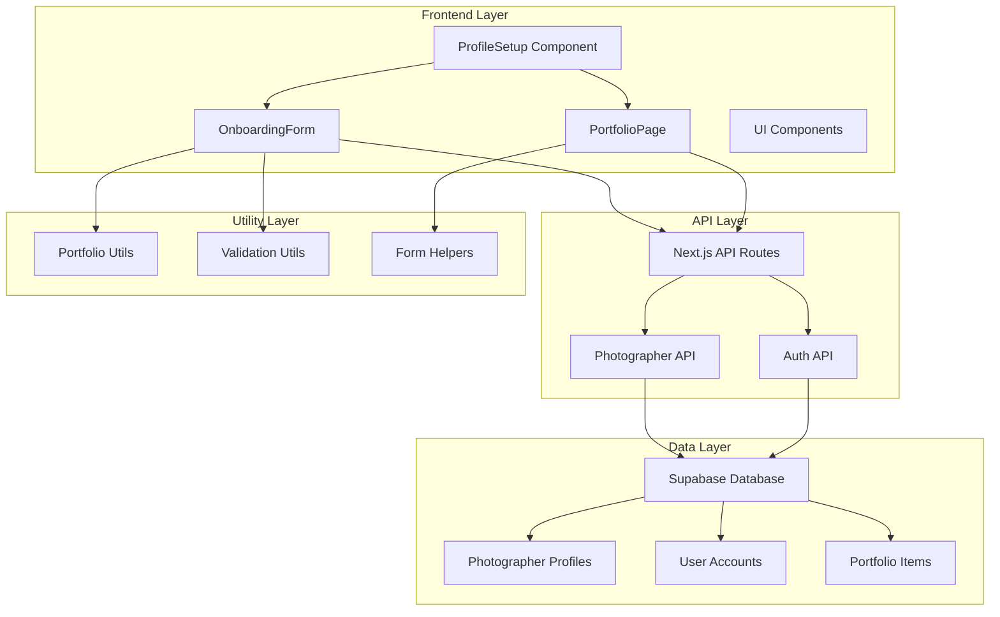
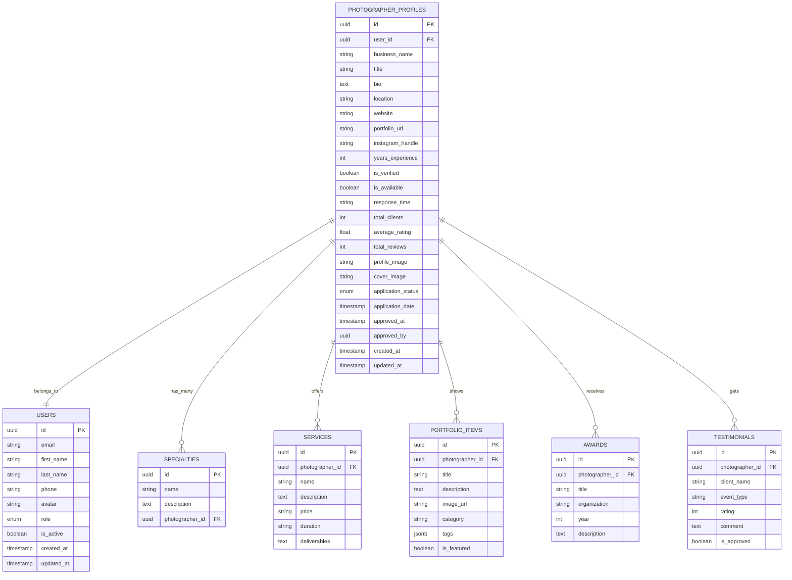
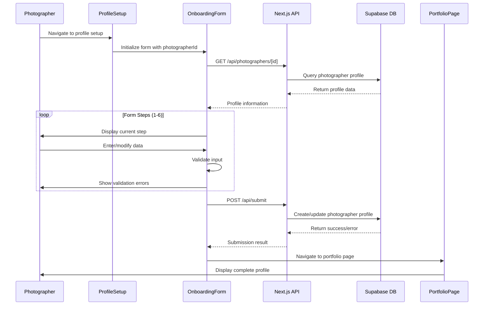
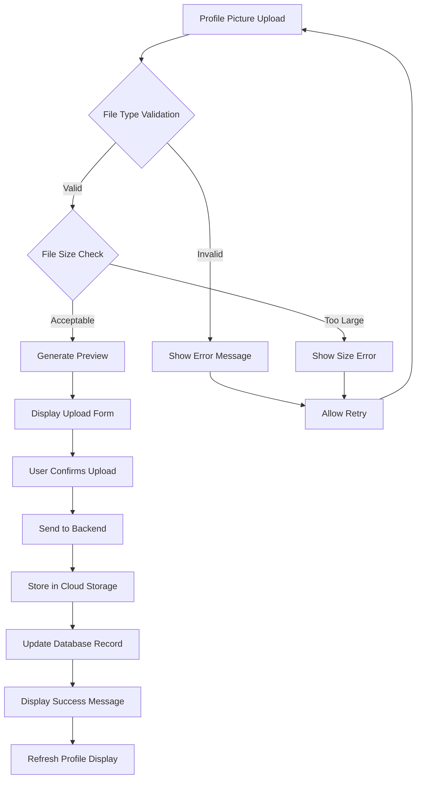
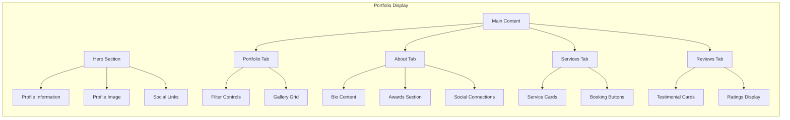
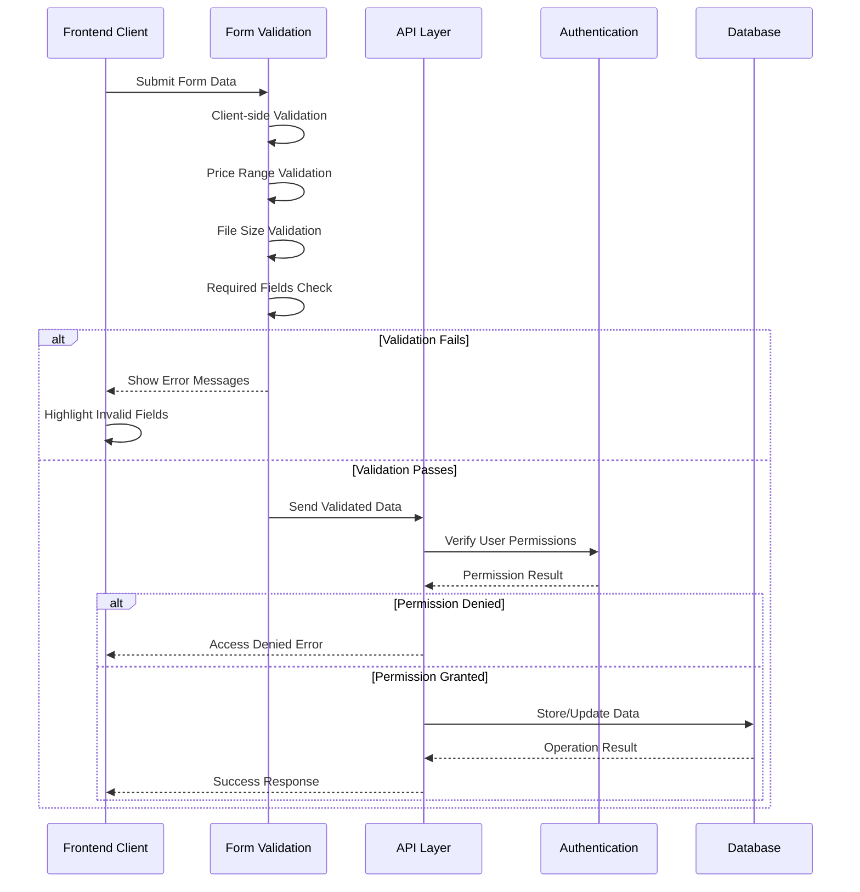
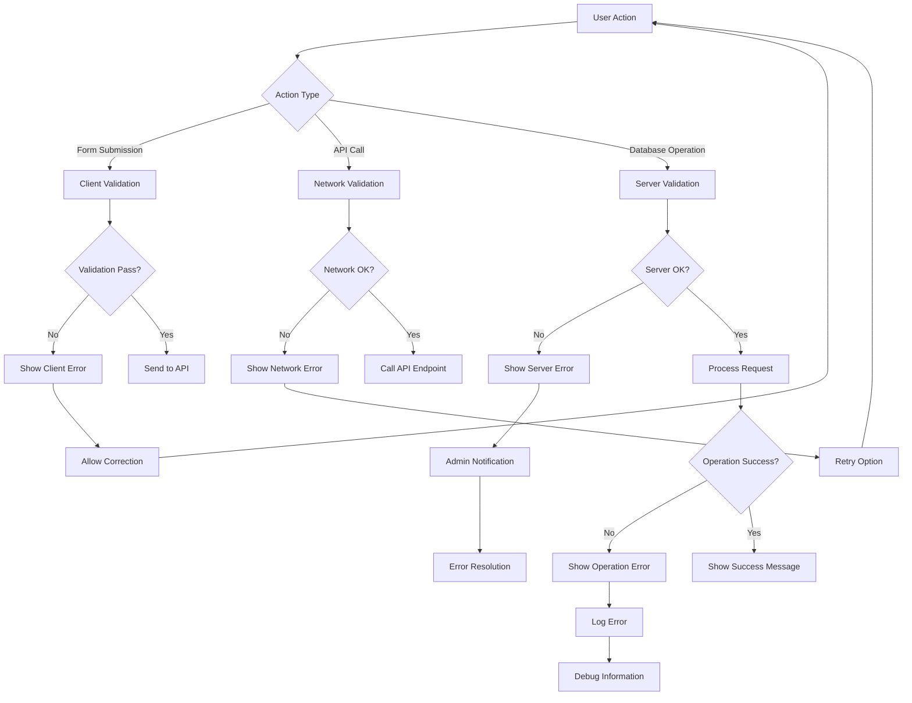

# Profile Management Interface Documentation

<cite>
**Referenced Files in This Document**
- [pages/profile/setup.tsx](file://pages/profile/setup.tsx)
- [src/components/PortfolioPage.tsx](file://src/components/PortfolioPage.tsx)
- [src/components/OnboardingForm.tsx](file://src/components/OnboardingForm.tsx)
- [src/lib/api.ts](file://src/lib/api.ts)
- [pages/api/photographers/[id].ts](file://pages/api/photographers/[id].ts)
- [src/lib/supabase.ts](file://src/lib/supabase.ts)
- [src/utils/portfolio.ts](file://src/utils/portfolio.ts)
- [src/components/ui/form.tsx](file://src/components/ui/form.tsx)
</cite>

## Table of Contents
1. [Introduction](#introduction)
2. [System Architecture](#system-architecture)
3. [Profile Data Structure](#profile-data-structure)
4. [Profile Setup Flow](#profile-setup-flow)
5. [API Integration](#api-integration)
6. [Profile Picture Management](#profile-picture-management)
7. [Portfolio Display](#portfolio-display)
8. [Access Control and Validation](#access-control-and-validation)
9. [Error Handling](#error-handling)
10. [Performance Considerations](#performance-considerations)
11. [Troubleshooting Guide](#troubleshooting-guide)
12. [Conclusion](#conclusion)

## Introduction

The SnapEvent profile management system provides photographers with a comprehensive interface for creating, editing, and managing their business profiles. This system enables photographers to showcase their work, manage availability, handle bookings, and maintain professional presence on the platform. The interface is designed with a focus on user experience, offering both setup and editing capabilities with immediate feedback and seamless transitions between modes.

The profile management system integrates multiple components including onboarding forms, portfolio displays, API endpoints, and database operations. It supports both new registrations and existing profile updates, with automatic portfolio URL generation and real-time validation.

## System Architecture

The profile management system follows a modern React-based architecture with Next.js API routes and Supabase for database operations. The system is structured around several key components that work together to provide a seamless user experience.



**Diagram sources**
- [pages/profile/setup.tsx](file://pages/profile/setup.tsx#L1-L21)
- [src/components/OnboardingForm.tsx](file://src/components/OnboardingForm.tsx#L1-L50)
- [src/components/PortfolioPage.tsx](file://src/components/PortfolioPage.tsx#L1-L50)

**Section sources**
- [pages/profile/setup.tsx](file://pages/profile/setup.tsx#L1-L21)
- [src/components/OnboardingForm.tsx](file://src/components/OnboardingForm.tsx#L1-L100)
- [src/components/PortfolioPage.tsx](file://src/components/PortfolioPage.tsx#L1-L100)

## Profile Data Structure

The photographer profile data is structured to capture comprehensive business information, technical specifications, and portfolio details. The system uses a normalized database schema with separate tables for different profile components.



**Diagram sources**
- [src/lib/supabase.ts](file://src/lib/supabase.ts#L25-L150)

The profile data structure includes several key fields:

### Core Business Information
- **businessName**: The official name of the photography business
- **title**: Professional designation or specialty title
- **location**: Geographic location serving
- **bio**: Comprehensive biography highlighting experience and style
- **specialties**: Array of photographic specialties offered

### Technical Specifications
- **equipment**: Detailed camera and lens information
- **services**: Array of services offered with pricing
- **priceRange**: Budget categorization for services
- **availability**: Schedule flexibility information

### Marketing Assets
- **portfolio**: Collection of featured images with metadata
- **awards**: Professional recognitions and certifications
- **testimonials**: Client feedback and ratings
- **socialMedia**: Links to external platforms

**Section sources**
- [src/lib/supabase.ts](file://src/lib/supabase.ts#L25-L150)
- [src/lib/api.ts](file://src/lib/api.ts#L150-L200)

## Profile Setup Flow

The profile setup process is implemented through a sophisticated onboarding form that guides photographers through creating their complete profile. The system supports both new registrations and existing profile updates with intelligent form progression and validation.



**Diagram sources**
- [pages/profile/setup.tsx](file://pages/profile/setup.tsx#L1-L21)
- [src/components/OnboardingForm.tsx](file://src/components/OnboardingForm.tsx#L50-L100)
- [pages/api/photographers/[id].ts](file://pages/api/photographers/[id].ts#L1-L50)

### Step-by-Step Setup Process

The onboarding form is divided into six comprehensive steps:

#### Step 1: Personal Information
Collects basic identification and contact information:
- Full name and contact details
- Location and preferred communication language
- Phone number with WhatsApp preference

#### Step 2: Professional Background
Captures professional qualifications and equipment:
- Years of experience classification
- Photography specialties selection
- Camera equipment description
- Current website integration

#### Step 3: Services & Pricing
Defines service offerings and pricing structure:
- Available services with checkboxes
- Price range categorization
- Availability scheduling options

#### Step 4: Portfolio & Social Media
Builds visual portfolio foundation:
- Portfolio description and style
- Instagram handle integration
- Work samples upload capability

#### Step 5: Pricing & Sample Work
Finalizes financial and sample information:
- Minimum starting price validation (₹20,000)
- Google Drive link for sample albums
- Preferred communication language selection

#### Step 6: Final Submission
Completes the setup process:
- Form validation and error checking
- API submission with error handling
- Success confirmation and navigation

**Section sources**
- [src/components/OnboardingForm.tsx](file://src/components/OnboardingForm.tsx#L1-L200)
- [src/components/OnboardingForm.tsx](file://src/components/OnboardingForm.tsx#L200-L400)
- [src/components/OnboardingForm.tsx](file://src/components/OnboardingForm.tsx#L400-L600)

## API Integration

The profile management system utilizes a robust API layer built on Next.js API routes that communicate with Supabase for database operations. The API provides comprehensive CRUD operations with proper error handling and validation.

```mermaid
classDiagram
class PhotographersAPI {
+getAll(params) Promise~Photographer[]~
+getById(id) Promise~Photographer~
+create(data) Promise~{id : string}~
+update(id, data) Promise~Photographer~
}
class SupabasePhotographer {
+id : string
+businessName : string
+title : string
+bio : string
+location : string
+website : string
+instagramHandle : string
+yearsExperience : number
+isAvailable : boolean
+responseTime : string
}
class APIServer {
+handler(req, res)
+getPhotographerProfile(req, res, id)
+updatePhotographerProfile(req, res, id)
+deletePhotographerProfile(req, res, id)
}
PhotographersAPI --> APIServer : "uses"
APIServer --> SupabasePhotographer : "manages"
APIServer --> SupabasePhotographer : "queries"
```

**Diagram sources**
- [src/lib/api.ts](file://src/lib/api.ts#L50-L150)
- [pages/api/photographers/[id].ts](file://pages/api/photographers/[id].ts#L1-L50)

### API Endpoint Details

The primary API endpoint `/api/photographers/[id]` handles all profile operations:

#### GET Request
Retrieves complete photographer profile with associated data:
- Basic profile information
- User account details
- Specialties and services
- Portfolio items with metadata
- Awards and testimonials
- Social media connections

#### PUT Request
Updates specific profile fields with partial updates:
- Business name modification
- Title and bio updates
- Location changes
- Website and social media links
- Experience and availability updates
- Response time preferences

#### DELETE Request
Removes photographer profile and associated data:
- Profile deletion cascade
- Portfolio item cleanup
- Booking data preservation
- User account retention

**Section sources**
- [pages/api/photographers/[id].ts](file://pages/api/photographers/[id].ts#L1-L154)
- [src/lib/api.ts](file://src/lib/api.ts#L50-L150)

## Profile Picture Management

The system implements comprehensive profile picture handling with validation, storage, and display capabilities. Profile pictures serve as essential branding elements and verification indicators for photographers.



**Diagram sources**
- [src/components/OnboardingForm.tsx](file://src/components/OnboardingForm.tsx#L250-L280)

### Profile Picture Features

#### Validation Rules
- **File Type**: Supports JPEG, PNG, GIF formats
- **Size Limit**: Maximum 5MB per file
- **Dimensions**: Optimized for web display
- **Format**: Compressed for fast loading

#### Upload Process
The profile picture upload process includes comprehensive validation and user feedback:

1. **File Selection**: Drag-and-drop or browse interface
2. **Real-time Validation**: Immediate feedback on file type and size
3. **Preview Generation**: Thumbnail preview before upload
4. **Progress Indication**: Visual upload progress bar
5. **Success Confirmation**: Green success banner with retry option

#### Storage and Display
- **Cloud Storage**: Secure cloud-based image storage
- **CDN Integration**: Fast global delivery
- **Responsive Images**: Multiple resolutions for different devices
- **Fallback Images**: Placeholder images when profile picture unavailable

**Section sources**
- [src/components/OnboardingForm.tsx](file://src/components/OnboardingForm.tsx#L250-L280)

## Portfolio Display

The portfolio display system provides photographers with a professional, interactive platform to showcase their work. The system offers multiple views and interactive features for optimal presentation.



**Diagram sources**
- [src/components/PortfolioPage.tsx](file://src/components/PortfolioPage.tsx#L100-L200)

### Portfolio Features

#### Interactive Elements
- **Image Gallery**: Responsive grid layout with hover effects
- **Category Filtering**: Filter portfolio by type (weddings, portraits, etc.)
- **Booking Integration**: Direct booking buttons for services
- **Contact Forms**: Integrated contact forms for inquiries
- **Availability Management**: Calendar-based availability display

#### Dynamic Content
- **Real-time Updates**: Changes reflected immediately across tabs
- **Responsive Design**: Optimized for mobile and desktop
- **Progressive Loading**: Images load progressively for better UX
- **SEO Optimization**: Proper meta tags and structured data

#### Social Integration
- **Share Functionality**: Share portfolio via social media and copy link
- **Web Share API**: Native sharing capabilities
- **Portfolio URL**: Automatic URL generation and management
- **External Links**: Integration with external platforms

**Section sources**
- [src/components/PortfolioPage.tsx](file://src/components/PortfolioPage.tsx#L1-L200)
- [src/components/PortfolioPage.tsx](file://src/components/PortfolioPage.tsx#L200-L400)

## Access Control and Validation

The system implements comprehensive access control and data validation mechanisms to ensure data integrity and user security. Validation occurs at both client and server levels with appropriate error handling.



**Diagram sources**
- [src/components/OnboardingForm.tsx](file://src/components/OnboardingForm.tsx#L270-L300)
- [pages/api/photographers/[id].ts](file://pages/api/photographers/[id].ts#L40-L80)

### Validation Layers

#### Client-Side Validation
- **Real-time Feedback**: Immediate validation feedback during form entry
- **Price Range Validation**: Ensures minimum ₹20,000 starting price
- **File Validation**: Validates file types and sizes before upload
- **Required Fields**: Highlights missing mandatory fields
- **Format Validation**: Email, phone number, and URL format checks

#### Server-Side Validation
- **Data Sanitization**: Prevents SQL injection and XSS attacks
- **Permission Checking**: Verifies user authorization for profile operations
- **Duplicate Prevention**: Checks for duplicate portfolio URLs
- **Business Logic Validation**: Ensures logical consistency in data

#### Access Control
- **Role-Based Access**: Different permissions for photographers vs. admins
- **Ownership Verification**: Ensures users can only modify their own profiles
- **Session Management**: Secure session handling with automatic refresh
- **Rate Limiting**: Prevents abuse of API endpoints

**Section sources**
- [src/components/OnboardingForm.tsx](file://src/components/OnboardingForm.tsx#L270-L300)
- [pages/api/photographers/[id].ts](file://pages/api/photographers/[id].ts#L40-L80)

## Error Handling

The system implements comprehensive error handling strategies across all components to provide graceful degradation and meaningful user feedback. Error handling occurs at multiple levels with appropriate escalation and recovery mechanisms.



**Diagram sources**
- [src/components/OnboardingForm.tsx](file://src/components/OnboardingForm.tsx#L300-L350)
- [pages/api/photographers/[id].ts](file://pages/api/photographers/[id].ts#L80-L120)

### Error Categories

#### Form Validation Errors
- **Price Range Issues**: Minimum ₹20,000 requirement not met
- **File Upload Problems**: Unsupported formats or size limits exceeded
- **Missing Required Fields**: Essential information not provided
- **Format Validation**: Incorrect email, phone, or URL formats

#### API Communication Errors
- **Network Failures**: Connection timeouts and network issues
- **Authentication Errors**: Expired sessions or invalid credentials
- **Authorization Issues**: Insufficient permissions for requested operation
- **Rate Limiting**: Exceeded API call limits

#### Database Operation Errors
- **Constraint Violations**: Duplicate entries or foreign key conflicts
- **Data Integrity Issues**: Invalid data types or length restrictions
- **Transaction Failures**: Rollback scenarios and data consistency
- **Storage Issues**: Cloud storage connectivity problems

#### System Errors
- **Server Unavailable**: Backend service downtime or maintenance
- **Configuration Issues**: Environment variable or configuration problems
- **Resource Exhaustion**: Memory or CPU limitations
- **Third-party Dependencies**: External service unavailability

**Section sources**
- [src/components/OnboardingForm.tsx](file://src/components/OnboardingForm.tsx#L300-L350)
- [pages/api/photographers/[id].ts](file://pages/api/photographers/[id].ts#L80-L120)

## Performance Considerations

The profile management system is designed with performance optimization in mind, utilizing modern web technologies and efficient data handling strategies to ensure fast loading times and smooth user interactions.

### Optimization Strategies

#### Client-Side Performance
- **Code Splitting**: Dynamic imports for lazy loading of components
- **Image Optimization**: Progressive loading and responsive image sizing
- **Caching Strategy**: Local storage caching for user preferences
- **Bundle Optimization**: Tree shaking and dead code elimination

#### API Performance
- **Request Debouncing**: Prevents excessive API calls during rapid input
- **Batch Operations**: Group related database operations
- **Connection Pooling**: Efficient database connection management
- **Response Compression**: Reduced payload sizes for faster transfers

#### Database Optimization
- **Indexing Strategy**: Proper indexing for frequently queried fields
- **Query Optimization**: Efficient SQL queries with proper joins
- **Caching Layer**: Redis caching for frequently accessed data
- **Partitioning**: Large dataset partitioning for better performance

### Monitoring and Metrics

The system tracks key performance indicators:
- **Load Times**: Page and component loading performance
- **API Response Times**: Database and external service response metrics
- **Error Rates**: System error frequency and resolution times
- **User Engagement**: Interaction patterns and conversion rates

## Troubleshooting Guide

This section provides solutions for common issues encountered in the profile management system, along with diagnostic procedures and preventive measures.

### Common Issues and Solutions

#### Profile Not Loading
**Symptoms**: Blank profile page or loading spinner indefinitely
**Causes**: 
- Network connectivity issues
- API endpoint unavailability
- Invalid photographer ID
- Database connection problems

**Solutions**:
1. Check network connectivity and retry
2. Verify photographer ID format and existence
3. Clear browser cache and cookies
4. Contact support if issue persists

#### Form Validation Failures
**Symptoms**: Error messages preventing form submission
**Causes**:
- Price range below ₹20,000 minimum
- Invalid file formats or sizes
- Missing required fields
- Format validation errors

**Solutions**:
1. Review error messages and correct input
2. Ensure file meets size and format requirements
3. Check required field completion
4. Verify format compliance for emails, phones, etc.

#### Portfolio URL Generation Issues
**Symptoms**: Duplicate URLs or invalid portfolio links
**Causes**:
- Name conflicts with existing photographers
- Special characters in names
- URL length limitations

**Solutions**:
1. Modify photographer name to ensure uniqueness
2. Remove special characters from names
3. Use shorter, descriptive names
4. Contact support for custom URL requests

#### Image Upload Problems
**Symptoms**: Profile pictures not uploading or displaying
**Causes**:
- File size exceeding limits
- Unsupported file formats
- Network interruptions
- Cloud storage connectivity issues

**Solutions**:
1. Reduce file size to under 5MB
2. Convert to supported formats (JPEG, PNG)
3. Retry upload with stable connection
4. Use alternative image hosting if needed

### Diagnostic Procedures

#### Network Connectivity
- Test API endpoint accessibility
- Check firewall and proxy configurations
- Verify DNS resolution
- Monitor network latency

#### Database Health
- Check database connection status
- Monitor query performance
- Verify table integrity
- Review transaction logs

#### Application Performance
- Monitor memory usage
- Check CPU utilization
- Review error logs
- Analyze response times

**Section sources**
- [src/components/OnboardingForm.tsx](file://src/components/OnboardingForm.tsx#L300-L350)
- [pages/api/photographers/[id].ts](file://pages/api/photographers/[id].ts#L80-L120)

## Conclusion

The SnapEvent profile management system provides a comprehensive, user-friendly solution for photographers to create and maintain professional profiles. The system successfully integrates modern web technologies with robust backend services to deliver a seamless user experience.

### Key Strengths

- **Comprehensive Data Model**: Rich profile structure supporting diverse photography businesses
- **Intuitive User Interface**: Progressive onboarding with clear validation feedback
- **Robust API Layer**: Secure, scalable API endpoints with proper error handling
- **Performance Optimization**: Efficient loading and responsive interactions
- **Security Measures**: Multi-layered validation and access control

### Future Enhancements

The system is designed for extensibility and can accommodate future enhancements such as:
- Advanced portfolio management tools
- Enhanced analytics and reporting
- Integration with third-party services
- Mobile app development
- AI-powered content suggestions

The profile management system represents a solid foundation for photographer business management, providing the tools and infrastructure needed for successful online presence and client engagement.