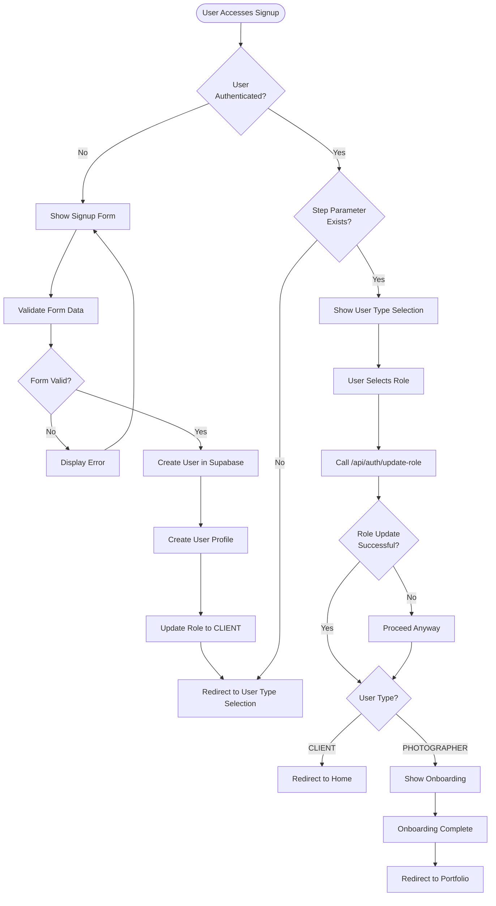
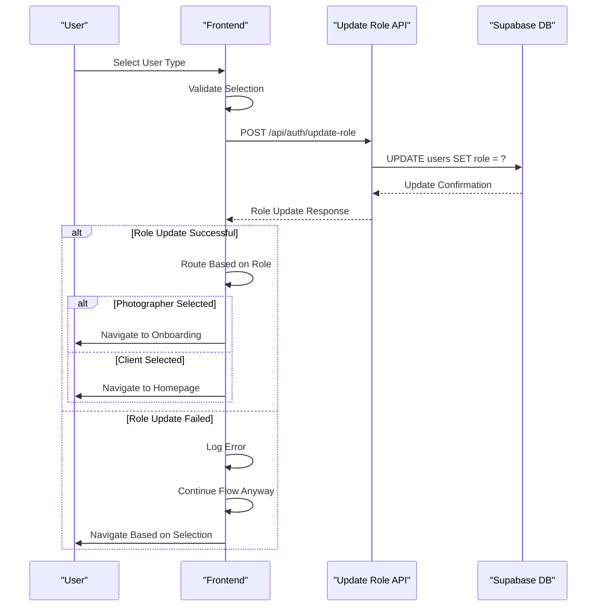
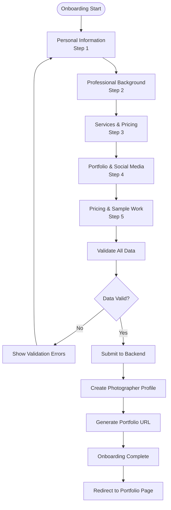
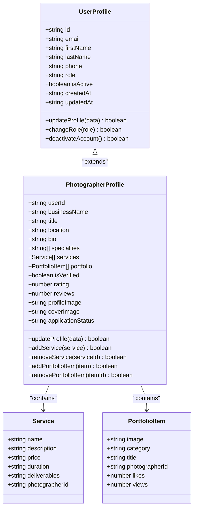
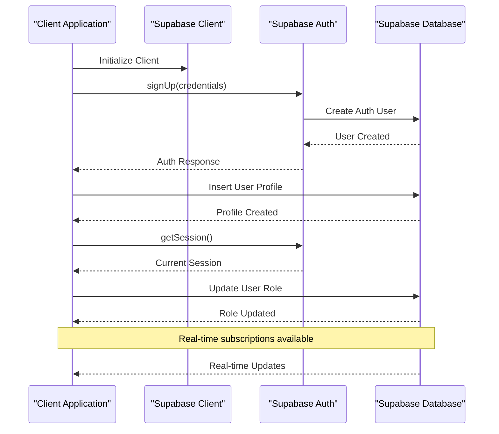
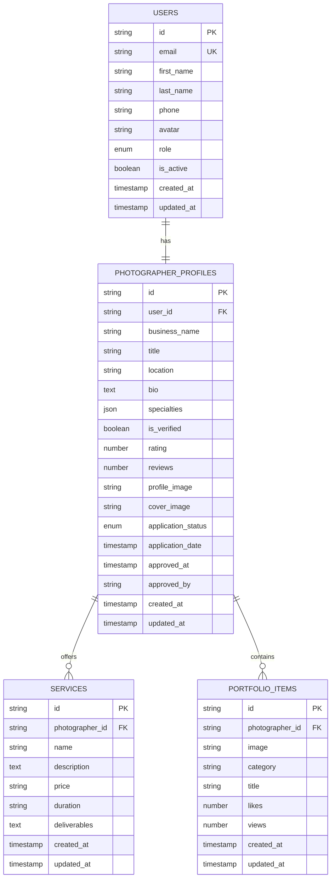
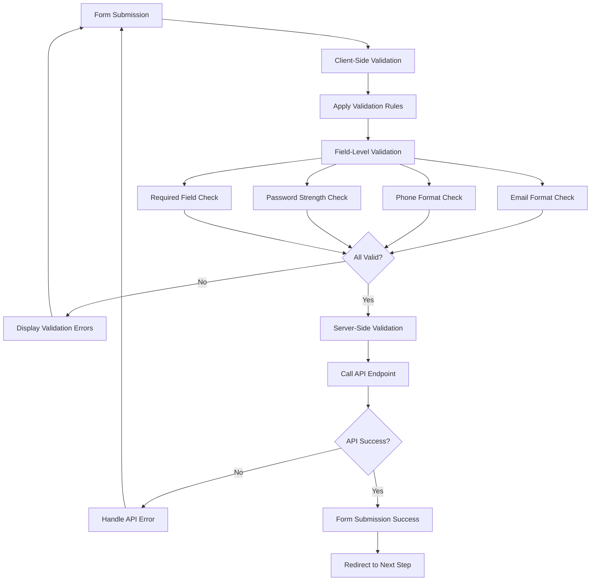
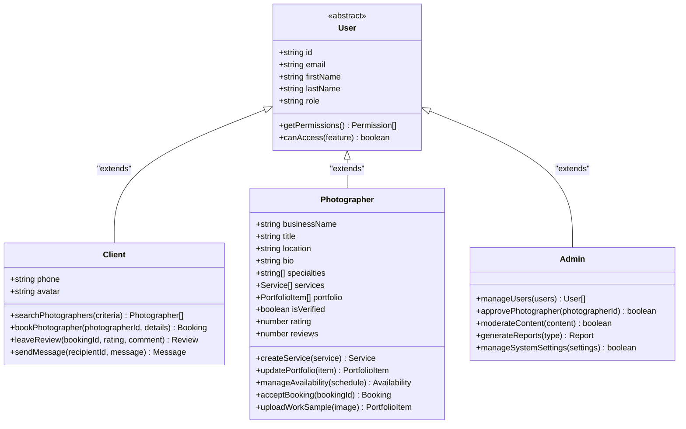

# User Management

<cite>
**Referenced Files in This Document**
- [pages/signup.tsx](file://pages/signup.tsx)
- [src/components/UserTypeSelection.tsx](file://src/components/UserTypeSelection.tsx)
- [pages/onboarding.tsx](file://pages/onboarding.tsx)
- [src/components/PortfolioPage.tsx](file://src/components/PortfolioPage.tsx)
- [src/lib/api.ts](file://src/lib/api.ts)
- [pages/api/auth/signup.ts](file://pages/api/auth/signup.ts)
- [pages/api/auth/update-role.ts](file://pages/api/auth/update-role.ts)
- [src/lib/supabase.ts](file://src/lib/supabase.ts)
- [src/components/SignupForm.tsx](file://src/components/SignupForm.tsx)
- [src/components/GeneralizedSignupFlow.tsx](file://src/components/GeneralizedSignupFlow.tsx)
- [src/components/OnboardingForm.tsx](file://src/components/OnboardingForm.tsx)
- [src/utils/portfolio.ts](file://src/utils/portfolio.ts)
- [DATABASE_DESIGN.md](file://DATABASE_DESIGN.md)
</cite>

## Table of Contents
1. [Introduction](#introduction)
2. [User Registration Flow](#user-registration-flow)
3. [Role Selection Process](#role-selection-process)
4. [Photographer Onboarding Process](#photographer-onboarding-process)
5. [Profile Management System](#profile-management-system)
6. [Supabase Integration](#supabase-integration)
7. [Data Structure and Types](#data-structure-and-types)
8. [Form Validation and Handling](#form-validation-and-handling)
9. [User Type Separation](#user-type-separation)
10. [Troubleshooting Guide](#troubleshooting-guide)
11. [Conclusion](#conclusion)

## Introduction

The SnapEvent user management system provides a comprehensive solution for managing both client and photographer accounts within the photography marketplace platform. The system supports role-based access control, enabling seamless transitions between user types while maintaining data integrity and security.

The architecture separates user registration into distinct phases: initial account creation, role selection, and specialized onboarding for photographers. This approach ensures that users receive appropriate experiences based on their intended use of the platform.

## User Registration Flow

The user registration process follows a sophisticated multi-stage workflow designed to capture essential information while providing flexibility for different user types.

**Diagram sources**
- [pages/signup.tsx](file://pages/signup.tsx#L1-L110)
- [src/components/GeneralizedSignupFlow.tsx](file://src/components/GeneralizedSignupFlow.tsx#L1-L192)

The registration flow begins with authentication checks to determine whether the user already has an active session. If not authenticated, the system presents a comprehensive signup form that captures essential personal information including name, email, phone number, and password.

**Section sources**
- [pages/signup.tsx](file://pages/signup.tsx#L1-L110)
- [src/components/GeneralizedSignupFlow.tsx](file://src/components/GeneralizedSignupFlow.tsx#L1-L192)

## Role Selection Process

The role selection process serves as a critical decision point in the user journey, determining the user's primary interaction with the platform. The system offers two distinct pathways based on user choice.

**Diagram sources**
- [src/components/UserTypeSelection.tsx](file://src/components/UserTypeSelection.tsx#L1-L188)
- [pages/api/auth/update-role.ts](file://pages/api/auth/update-role.ts#L1-L49)

The role selection interface provides an intuitive comparison between client and photographer options, highlighting key benefits and use cases for each role. The system maintains state persistence to ensure users can return to the selection process if needed.

**Section sources**
- [src/components/UserTypeSelection.tsx](file://src/components/UserTypeSelection.tsx#L1-L188)
- [pages/api/auth/update-role.ts](file://pages/api/auth/update-role.ts#L1-L49)

## Photographer Onboarding Process

The photographer onboarding process represents a comprehensive workflow designed to transform basic user accounts into fully functional photographer profiles. This process involves multiple stages of data collection and validation.

**Diagram sources**
- [src/components/OnboardingForm.tsx](file://src/components/OnboardingForm.tsx#L1-L933)

The onboarding form captures extensive information about the photographer's professional background, including experience level, specialties, equipment, and service offerings. The form includes bilingual support (English and Telugu) to accommodate diverse user bases.

**Section sources**
- [src/components/OnboardingForm.tsx](file://src/components/OnboardingForm.tsx#L1-L933)

## Profile Management System

The profile management system provides comprehensive tools for users to maintain and update their information throughout their engagement with the platform.

**Diagram sources**
- [src/lib/supabase.ts](file://src/lib/supabase.ts#L1-L242)
- [src/lib/api.ts](file://src/lib/api.ts#L1-L261)

The system maintains separate profiles for different user types while allowing for seamless transitions between roles. Photographer profiles include advanced features such as verification status, rating systems, and comprehensive service offerings.

**Section sources**
- [src/lib/supabase.ts](file://src/lib/supabase.ts#L1-L242)
- [src/lib/api.ts](file://src/lib/api.ts#L1-L261)

## Supabase Integration

The system leverages Supabase as its primary database and authentication provider, offering real-time capabilities and robust security features.

**Diagram sources**
- [src/lib/supabase.ts](file://src/lib/supabase.ts#L1-L242)
- [pages/api/auth/signup.ts](file://pages/api/auth/signup.ts#L1-L80)

Supabase provides automatic session management, real-time database subscriptions, and secure authentication. The system utilizes both client-side and server-side Supabase clients to optimize performance and security.

**Section sources**
- [src/lib/supabase.ts](file://src/lib/supabase.ts#L1-L242)
- [pages/api/auth/signup.ts](file://pages/api/auth/signup.ts#L1-L80)

## Data Structure and Types

The system employs TypeScript interfaces to define data structures, ensuring type safety and consistent data handling across the application.

**Diagram sources**
- [src/lib/supabase.ts](file://src/lib/supabase.ts#L1-L242)
- [DATABASE_DESIGN.md](file://DATABASE_DESIGN.md#L1-L201)

The database schema supports complex relationships between users, photographers, services, and portfolio items while maintaining referential integrity and efficient querying capabilities.

**Section sources**
- [src/lib/supabase.ts](file://src/lib/supabase.ts#L1-L242)
- [DATABASE_DESIGN.md](file://DATABASE_DESIGN.md#L1-L201)

## Form Validation and Handling

The system implements comprehensive form validation to ensure data quality and user experience. Validation occurs at multiple levels: client-side for immediate feedback, and server-side for security and data integrity.

**Diagram sources**
- [src/components/SignupForm.tsx](file://src/components/SignupForm.tsx#L1-L294)
- [src/components/OnboardingForm.tsx](file://src/components/OnboardingForm.tsx#L1-L933)

The validation system includes real-time feedback, comprehensive error messaging, and graceful handling of validation failures. Form data is sanitized and validated before transmission to prevent security vulnerabilities.

**Section sources**
- [src/components/SignupForm.tsx](file://src/components/SignupForm.tsx#L1-L294)
- [src/components/OnboardingForm.tsx](file://src/components/OnboardingForm.tsx#L1-L933)

## User Type Separation

The system implements clear separation between user types, ensuring that each role has appropriate permissions and access to relevant features.

**Diagram sources**
- [src/lib/supabase.ts](file://src/lib/supabase.ts#L1-L242)
- [pages/api/auth/update-role.ts](file://pages/api/auth/update-role.ts#L1-L49)

Each user type has distinct capabilities and access controls. Clients can browse and book photographers, while photographers manage their profiles and bookings. The system enforces role-based access control to prevent unauthorized actions.

**Section sources**
- [src/lib/supabase.ts](file://src/lib/supabase.ts#L1-L242)
- [pages/api/auth/update-role.ts](file://pages/api/auth/update-role.ts#L1-L49)

## Troubleshooting Guide

Common issues and their solutions in the user management system:

### Authentication Issues
- **Problem**: User cannot log in despite correct credentials
- **Solution**: Check Supabase authentication settings and verify email verification status
- **Prevention**: Implement proper error handling and user feedback

### Role Update Failures
- **Problem**: User role not updating after selection
- **Solution**: Verify API endpoint accessibility and database permissions
- **Prevention**: Implement retry mechanisms and comprehensive logging

### Onboarding Form Validation
- **Problem**: Form submissions failing validation
- **Solution**: Check validation rules and error message display
- **Prevention**: Implement client-side validation before API calls

### Portfolio URL Generation
- **Problem**: Duplicate portfolio URLs
- **Solution**: Review URL generation logic and existing URL checking
- **Prevention**: Implement comprehensive URL validation and conflict resolution

**Section sources**
- [src/components/SignupForm.tsx](file://src/components/SignupForm.tsx#L1-L294)
- [src/components/OnboardingForm.tsx](file://src/components/OnboardingForm.tsx#L1-L933)
- [src/utils/portfolio.ts](file://src/utils/portfolio.ts#L1-L92)

## Conclusion

The SnapEvent user management system provides a robust, scalable foundation for managing diverse user types within a photography marketplace platform. The system's modular architecture, comprehensive validation, and role-based access control ensure a seamless user experience while maintaining data integrity and security.

Key strengths of the system include:

- **Flexible Role Management**: Clear separation between client and photographer roles with smooth transitions
- **Comprehensive Onboarding**: Detailed photographer onboarding process with bilingual support
- **Robust Validation**: Multi-layered validation ensuring data quality and user experience
- **Supabase Integration**: Leveraging modern database and authentication technologies
- **Type Safety**: Comprehensive TypeScript implementation ensuring reliability

The system continues to evolve with new features and improvements, maintaining backward compatibility while enhancing functionality and user experience. Future enhancements may include advanced analytics, improved search capabilities, and expanded internationalization support.