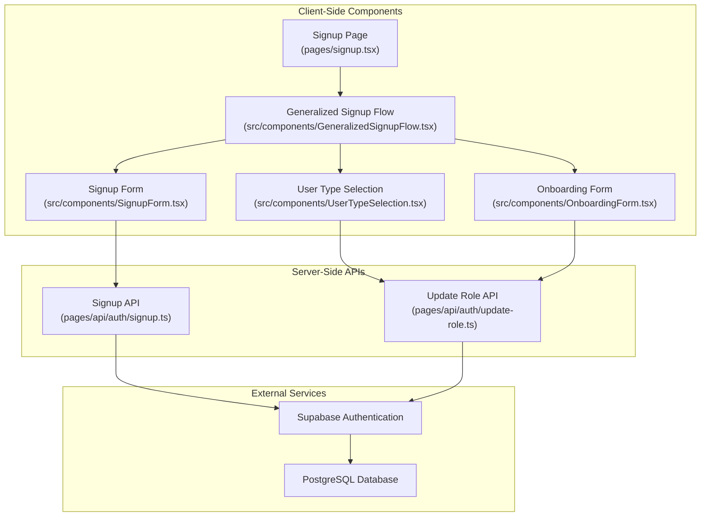
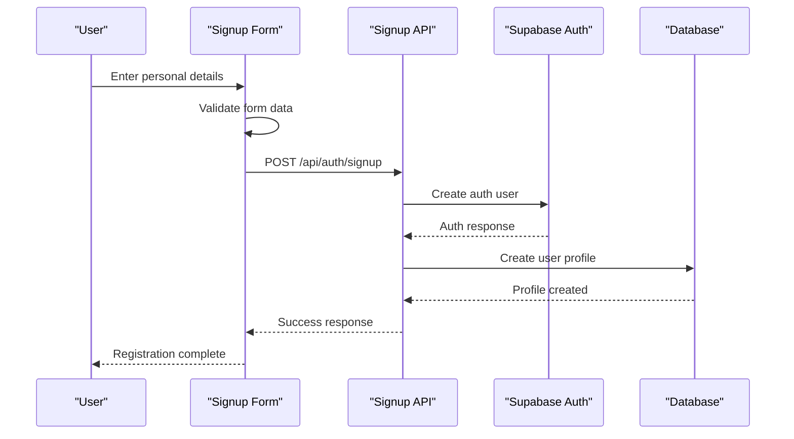
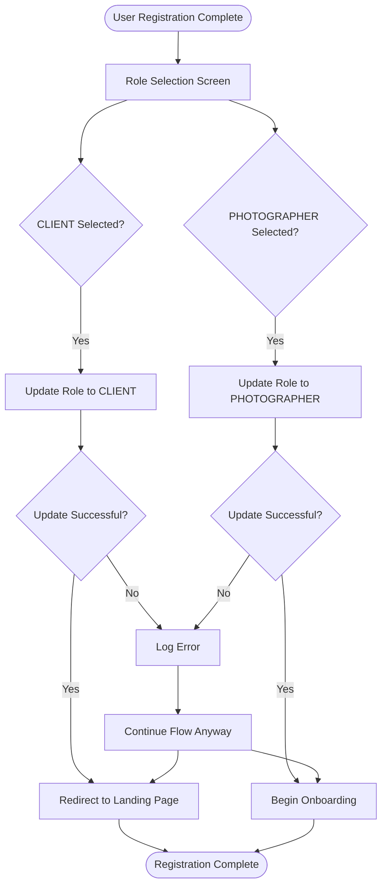
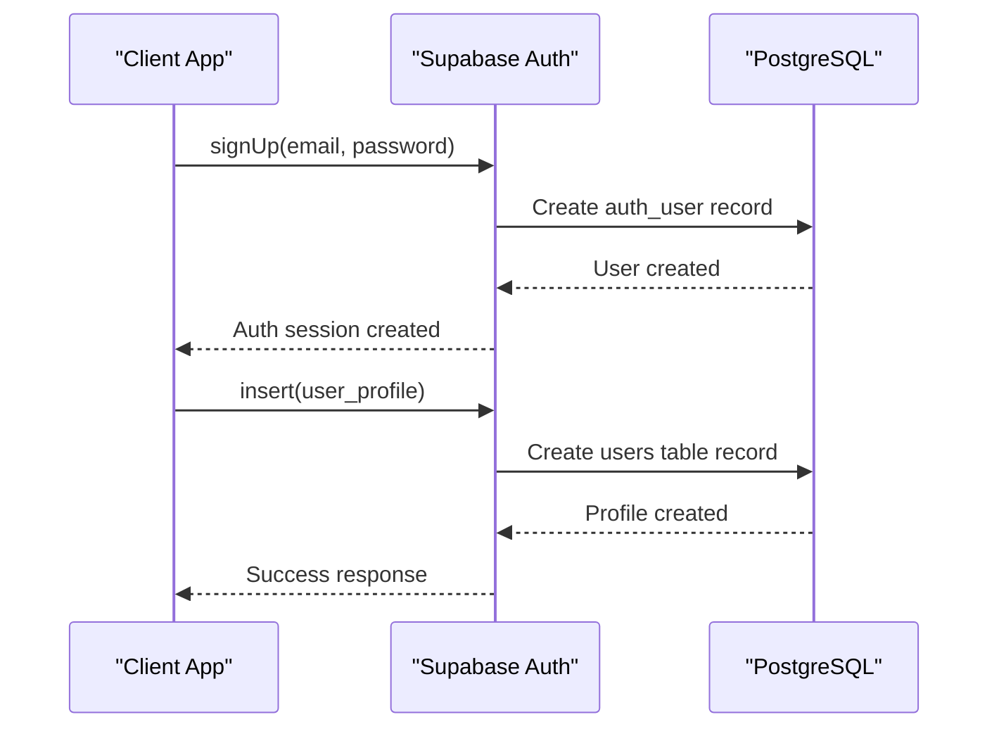

# User Registration Flow

<cite>
**Referenced Files in This Document**
- [pages/signup.tsx](file://pages/signup.tsx)
- [src/components/GeneralizedSignupFlow.tsx](file://src/components/GeneralizedSignupFlow.tsx)
- [src/components/UserTypeSelection.tsx](file://src/components/UserTypeSelection.tsx)
- [src/components/SignupForm.tsx](file://src/components/SignupForm.tsx)
- [src/components/OnboardingForm.tsx](file://src/components/OnboardingForm.tsx)
- [pages/api/auth/update-role.ts](file://pages/api/auth/update-role.ts)
- [pages/api/auth/signup.ts](file://pages/api/auth/signup.ts)
- [src/lib/supabase.ts](file://src/lib/supabase.ts)
</cite>

## Table of Contents
1. [Introduction](#introduction)
2. [Registration Flow Architecture](#registration-flow-architecture)
3. [Step-by-Step Registration Process](#step-by-step-registration-process)
4. [Role Selection Mechanism](#role-selection-mechanism)
5. [Supabase Integration](#supabase-integration)
6. [Dynamic Component Loading](#dynamic-component-loading)
7. [Error Handling and Validation](#error-handling-and-validation)
8. [Animation and User Experience](#animation-and-user-experience)
9. [Common Issues and Solutions](#common-issues-and-solutions)
10. [Best Practices](#best-practices)

## Introduction

The SnapEvent user registration flow is a sophisticated multi-step process that seamlessly guides users through account creation and role selection between CLIENT and PHOTOGRAPHER. Built with Next.js and React, this system leverages dynamic imports, Framer Motion animations, and Supabase authentication to provide a smooth, responsive user experience.

The registration process is designed to be intuitive and accessible, with clear visual feedback and progressive disclosure of information. It handles both new user signups and existing authenticated users who need to select their role, ensuring a seamless transition regardless of the user's current authentication state.

## Registration Flow Architecture

The registration system follows a modular architecture with clear separation of concerns:



**Diagram sources**
- [pages/signup.tsx](file://pages/signup.tsx#L1-L110)
- [src/components/GeneralizedSignupFlow.tsx](file://src/components/GeneralizedSignupFlow.tsx#L1-L192)
- [pages/api/auth/signup.ts](file://pages/api/auth/signup.ts#L1-L80)
- [pages/api/auth/update-role.ts](file://pages/api/auth/update-role.ts#L1-L49)

**Section sources**
- [pages/signup.tsx](file://pages/signup.tsx#L1-L110)
- [src/components/GeneralizedSignupFlow.tsx](file://src/components/GeneralizedSignupFlow.tsx#L1-L192)

## Step-by-Step Registration Process

### Initial Authentication Check

The registration flow begins with a comprehensive authentication state check:

```typescript
useEffect(() => {
  async function checkAuth() {
    const { data: { session } } = await supabase.auth.getSession()
    setIsAuthenticated(!!session)
    setIsLoading(false)
  }
  checkAuth()
}, [])
```

This ensures that:
- Existing authenticated users are redirected appropriately
- New users bypass the authentication check and proceed directly
- Loading states are managed gracefully

### Step 1: User Registration

The first step involves collecting basic user information through the SignupForm component:



**Diagram sources**
- [src/components/SignupForm.tsx](file://src/components/SignupForm.tsx#L1-L294)
- [pages/api/auth/signup.ts](file://pages/api/auth/signup.ts#L1-L80)

### Step 2: Role Selection

After successful registration, users are presented with the UserTypeSelection component:

```typescript
const handleUserTypeSelect = async (selectedUserType: 'CLIENT' | 'PHOTOGRAPHER') => {
  setUserType(selectedUserType);
  
  // Update user role in database
  try {
    const response = await fetch('/api/auth/update-role', {
      method: 'POST',
      headers: {
        'Content-Type': 'application/json',
      },
      body: JSON.stringify({
        role: selectedUserType
      }),
    });

    if (!response.ok) {
      throw new Error('Failed to update user role');
    }

    // If photographer, go to onboarding
    if (selectedUserType === 'PHOTOGRAPHER') {
      setCurrentStep('onboarding');
    } else {
      setCurrentStep('complete');
      onComplete(selectedUserType);
    }
  } catch (error) {
    console.error('Error updating user role:', error);
    // Still proceed with the flow even if role update fails
    if (selectedUserType === 'PHOTOGRAPHER') {
      setCurrentStep('onboarding');
    } else {
      setCurrentStep('complete');
      onComplete(selectedUserType);
    }
  }
};
```

**Section sources**
- [src/components/GeneralizedSignupFlow.tsx](file://src/components/GeneralizedSignupFlow.tsx#L25-L55)
- [src/components/UserTypeSelection.tsx](file://src/components/UserTypeSelection.tsx#L1-L188)

## Role Selection Mechanism

The role selection process is designed to be intuitive and visually engaging:

### Visual Design Elements

The UserTypeSelection component features:

- **Dual Card Layout**: Separate cards for CLIENT and PHOTOGRAPHER options
- **Iconography**: Distinct icons (Users for CLIENT, Camera for PHOTOGRAPHER)
- **Progressive Disclosure**: Detailed benefits revealed on selection
- **Interactive Animations**: Hover effects and transitions

### Role-Based Navigation



**Diagram sources**
- [src/components/GeneralizedSignupFlow.tsx](file://src/components/GeneralizedSignupFlow.tsx#L25-L55)
- [pages/signup.tsx](file://pages/signup.tsx#L35-L60)

**Section sources**
- [src/components/UserTypeSelection.tsx](file://src/components/UserTypeSelection.tsx#L1-L188)
- [pages/signup.tsx](file://pages/signup.tsx#L35-L60)

## Supabase Integration

The registration flow integrates deeply with Supabase for authentication and data management:

### Authentication Flow



**Diagram sources**
- [pages/api/auth/signup.ts](file://pages/api/auth/signup.ts#L10-L40)
- [src/lib/supabase.ts](file://src/lib/supabase.ts#L1-L242)

### Role Update Process

The `/api/auth/update-role` endpoint handles role modifications:

```typescript
export default async function handler(req: NextApiRequest, res: NextApiResponse) {
  if (req.method !== 'POST') {
    return res.status(405).json({ error: 'Method not allowed' })
  }

  try {
    const { role } = req.body

    if (!role || !['CLIENT', 'PHOTOGRAPHER'].includes(role)) {
      return res.status(400).json({ error: 'Invalid role. Must be CLIENT or PHOTOGRAPHER' })
    }

    // Get the current user from the session
    const { data: { session }, error: sessionError } = await supabase.auth.getSession()

    if (sessionError || !session) {
      return res.status(401).json({ error: 'Not authenticated' })
    }

    // Update user role in the database
    const { data: userData, error: userError } = await supabase
      .from('users')
      .update({ role: role })
      .eq('id', session.user.id)
      .select()
      .single()

    if (userError) {
      return res.status(400).json({ error: userError.message })
    }

    return res.status(200).json({
      message: 'User role updated successfully',
      user: {
        id: userData.id,
        email: userData.email,
        role: userData.role
      }
    })

  } catch (error) {
    console.error('Update role error:', error)
    return res.status(500).json({ error: 'Internal server error' })
  }
}
```

**Section sources**
- [pages/api/auth/update-role.ts](file://pages/api/auth/update-role.ts#L1-L49)
- [pages/api/auth/signup.ts](file://pages/api/auth/signup.ts#L1-L80)

## Dynamic Component Loading

The application uses Next.js dynamic imports to optimize performance and reduce initial bundle size:

### Implementation Strategy

```typescript
// Lazy-load the generalized signup flow
const GeneralizedSignupFlow = dynamic(() => import('../src/components/GeneralizedSignupFlow').then(mod => ({ default: mod.GeneralizedSignupFlow })), {
  ssr: false,
})

// Lazy-load the user type selection
const UserTypeSelection = dynamic(() => import('../src/components/UserTypeSelection').then(mod => ({ default: mod.UserTypeSelection })), {
  ssr: false,
})
```

### Benefits of Dynamic Loading

- **Reduced Bundle Size**: Components are loaded only when needed
- **Improved Performance**: Faster initial page load times
- **Better Resource Management**: Memory usage optimized
- **Enhanced User Experience**: Smoother navigation between steps

**Section sources**
- [pages/signup.tsx](file://pages/signup.tsx#L5-L15)

## Error Handling and Validation

The registration flow implements comprehensive error handling and validation:

### Form Validation

```typescript
const validateForm = () => {
  if (!formData.firstName.trim()) {
    setError('First name is required');
    return false;
  }
  if (!formData.lastName.trim()) {
    setError('Last name is required');
    return false;
  }
  if (!formData.email.trim()) {
    setError('Email is required');
    return false;
  }
  if (!/\S+@\S+\.\S+/.test(formData.email)) {
    setError('Please enter a valid email address');
    return false;
  }
  if (!formData.phone.trim()) {
    setError('Phone number is required');
    return false;
  }
  if (!/^\+?[\d\s\-\(\)]+$/.test(formData.phone)) {
    setError('Please enter a valid phone number');
    return false;
  }
  if (!formData.password) {
    setError('Password is required');
    return false;
  }
  if (formData.password.length < 6) {
    setError('Password must be at least 6 characters');
    return false;
  }
  if (formData.password !== formData.confirmPassword) {
    setError('Passwords do not match');
    return false;
  }
  return true;
};
```

### Error Recovery Strategies

The system implements graceful degradation:

1. **Role Update Failures**: Continues flow even if role update fails
2. **Network Issues**: Provides meaningful error messages
3. **Validation Errors**: Immediate feedback with specific error messages
4. **Server Errors**: Graceful fallback to alternative routes

**Section sources**
- [src/components/SignupForm.tsx](file://src/components/SignupForm.tsx#L40-L70)

## Animation and User Experience

The registration flow leverages Framer Motion for smooth, engaging animations:

### Transition Animations

```typescript
const pageVariants = {
  initial: { opacity: 0, x: 20 },
  in: { opacity: 1, x: 0 },
  out: { opacity: 0, x: -20 }
};

const pageTransition = {
  type: "tween" as const,
  ease: "anticipate" as const,
  duration: 0.3
};
```

### Interactive Elements

- **Hover Effects**: Cards scale slightly on hover
- **Button Animations**: Scale and shadow effects on interaction
- **Progress Indicators**: Smooth progress bar animations
- **Form Transitions**: Slide animations between form steps

### Accessibility Features

- **Focus Management**: Proper keyboard navigation
- **Screen Reader Support**: Semantic HTML structure
- **Color Contrast**: Adequate contrast ratios
- **Motion Preferences**: Respect user motion preferences

**Section sources**
- [src/components/GeneralizedSignupFlow.tsx](file://src/components/GeneralizedSignupFlow.tsx#L60-L80)
- [src/components/UserTypeSelection.tsx](file://src/components/UserTypeSelection.tsx#L25-L45)

## Common Issues and Solutions

### Issue 1: Failed Role Updates

**Symptoms**: User completes registration but role remains unchanged

**Causes**:
- Network connectivity issues
- Supabase authentication timeout
- Database constraint violations

**Solutions**:
```typescript
// Enhanced error handling with retry logic
const handleUserTypeSelect = async (selectedUserType: 'CLIENT' | 'PHOTOGRAPHER') => {
  try {
    const response = await fetch('/api/auth/update-role', {
      method: 'POST',
      headers: {
        'Content-Type': 'application/json',
      },
      body: JSON.stringify({ role: selectedUserType }),
      signal: AbortSignal.timeout(10000) // 10 second timeout
    });

    if (!response.ok) {
      throw new Error(`HTTP ${response.status}: ${await response.text()}`);
    }
    
    // Proceed with success
    handleSignupComplete(selectedUserType);
  } catch (error) {
    console.error('Role update failed:', error);
    // Fallback to continue flow
    handleSignupComplete(selectedUserType);
  }
};
```

### Issue 2: Incomplete Registrations

**Symptoms**: Users abandon registration midway

**Prevention Strategies**:
- Session persistence across browser restarts
- Auto-save form data
- Clear progress indicators
- Back navigation support

### Issue 3: Mobile Responsiveness

**Optimization Tips**:
- Touch-friendly button sizes (minimum 44px)
- Adequate spacing between interactive elements
- Responsive form layouts
- Optimized animation performance on mobile devices

## Best Practices

### Security Considerations

1. **Input Validation**: Server-side validation for all user inputs
2. **Rate Limiting**: Prevent abuse of registration endpoints
3. **CSRF Protection**: Implement CSRF tokens for form submissions
4. **HTTPS Only**: Ensure all communication is encrypted

### Performance Optimization

1. **Code Splitting**: Use dynamic imports for large components
2. **Image Optimization**: Compress and resize images automatically
3. **Lazy Loading**: Load components only when needed
4. **Caching Strategy**: Implement appropriate caching headers

### User Experience Guidelines

1. **Clear Progression**: Show users their current position in the flow
2. **Immediate Feedback**: Provide instant validation feedback
3. **Error Prevention**: Guide users to avoid common mistakes
4. **Accessibility**: Ensure compliance with WCAG guidelines

### Monitoring and Analytics

1. **User Journey Tracking**: Monitor registration completion rates
2. **Error Rate Monitoring**: Track and alert on high error rates
3. **Performance Metrics**: Monitor load times and interaction delays
4. **A/B Testing**: Test different registration flows for optimization

The SnapEvent registration flow demonstrates a well-architected system that balances user experience, performance, and reliability. By following the patterns and practices outlined in this documentation, developers can maintain and extend this system effectively while ensuring optimal user satisfaction.